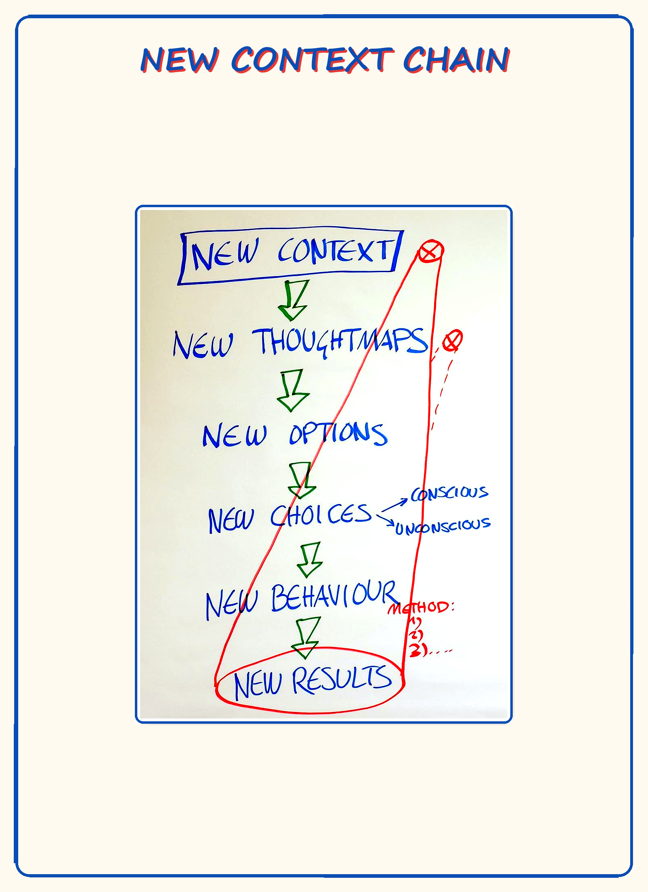
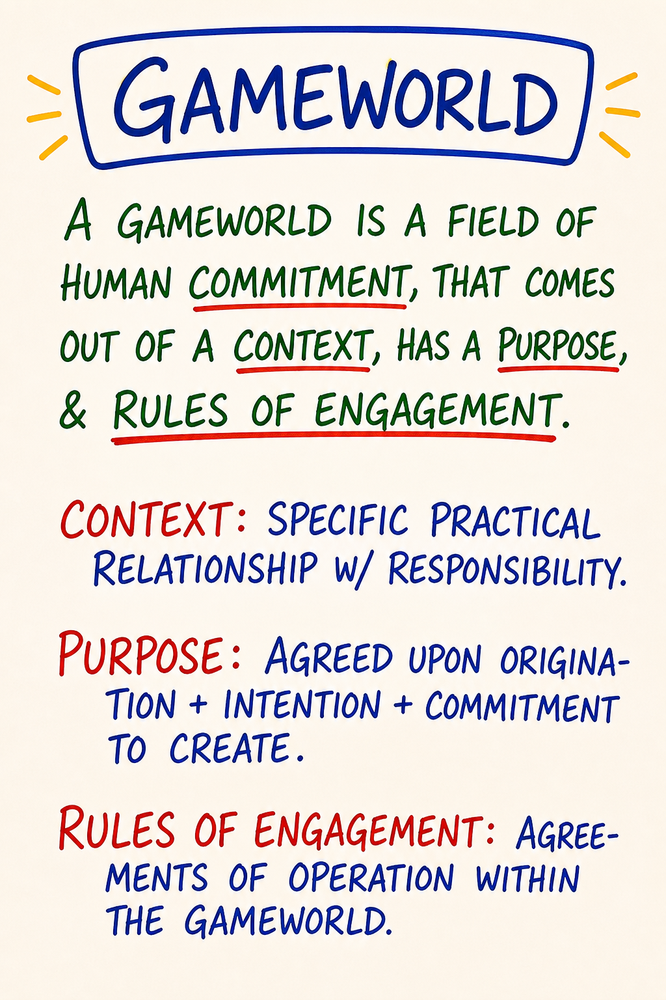
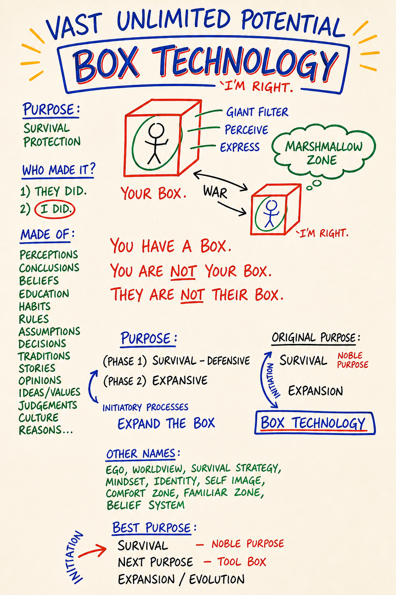
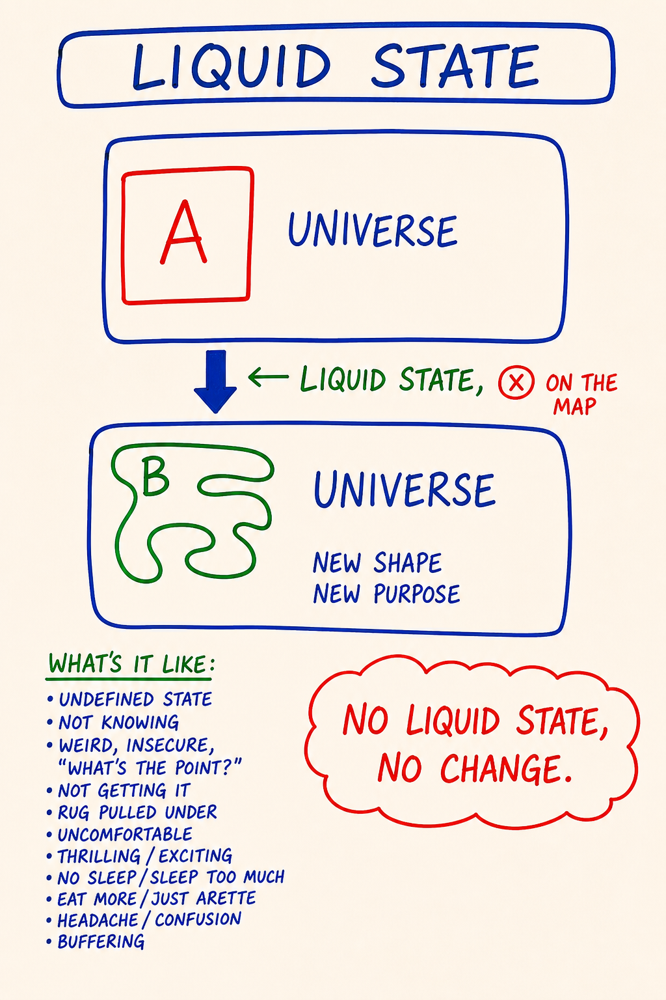
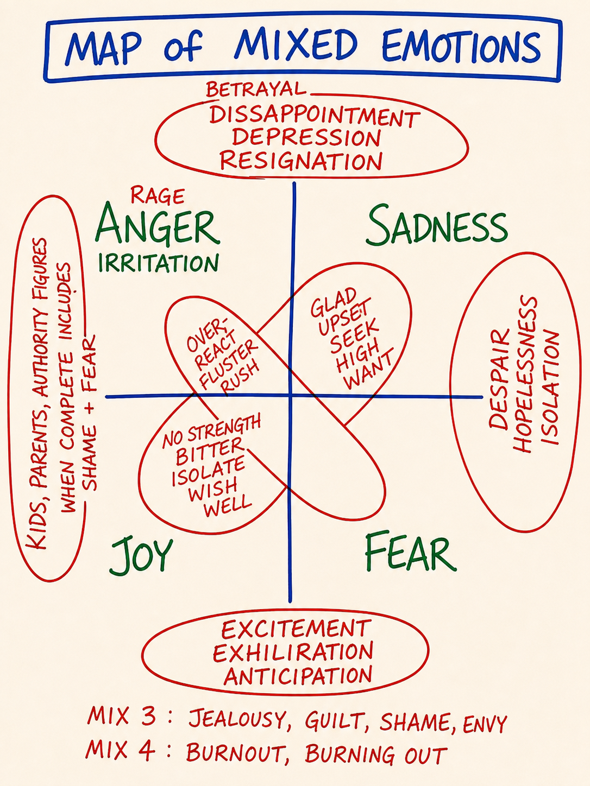
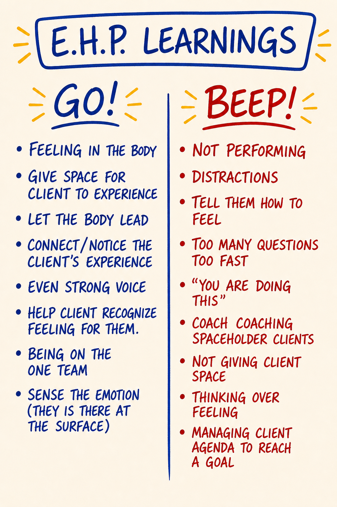
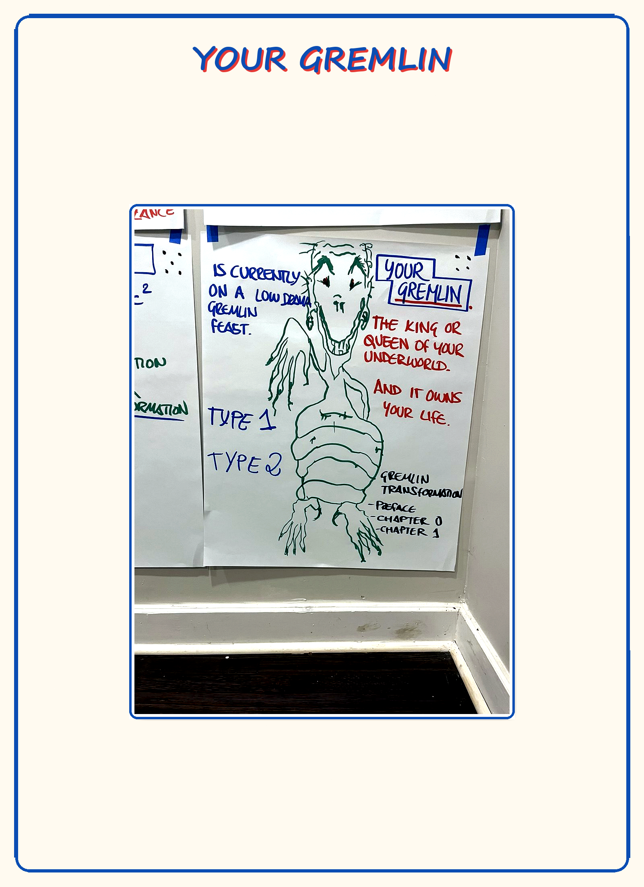
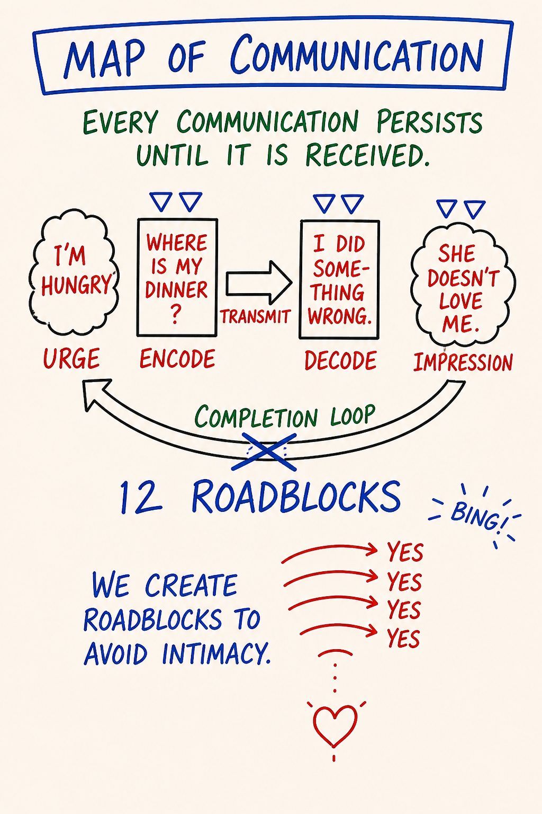
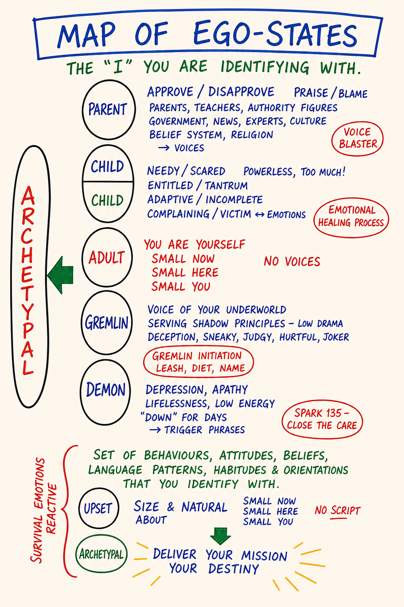
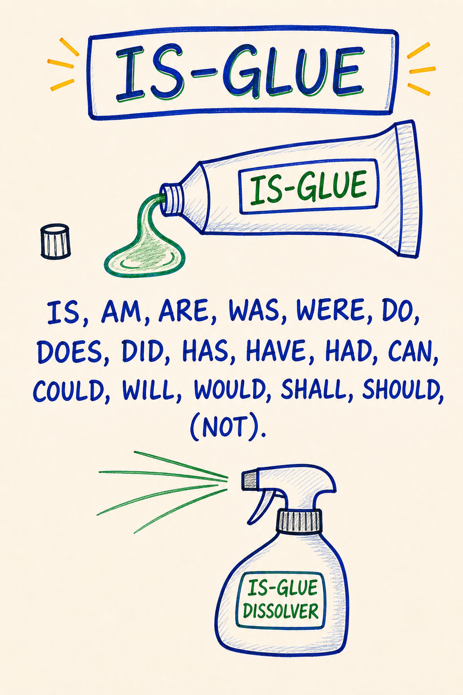

<!-- GENERATED by _build/build.py on 2026-06-11 — DO NOT HAND-EDIT. Edit the source files, then re-run the build. -->
# Expand the Box v2 — Learner Edition (compiled)
> Compiled learner reading order: the front door, all twelve modules (00–11), and the practice instruments. Links are rewritten to resolve from the course root.
> **Generated 2026-06-11 by `_build/build.py`. Do not hand-edit this file** — edit the sources and re-run the build.

---


<!-- ===== source: START HERE.md ===== -->

---

# Start Here

*The front door of Expand the Box. Five minutes to read. Everything else is linked from here.*

> Prefer a browser? `index.html` in this folder (when built) is this same front door as an HTML page. Same content, same links.

---

## What this is

Expand the Box is a twelve-module, self-paced course in **Possibility Management** thoughtware: the Box, the four feelings, low drama and the Gremlin, listening and speaking as acts of possibility, and the three powers of choosing, asking dangerous questions, and declaring. You read, you practice in your body, you exchange voice messages with one partner, and you run small experiments in your actual life. The work is in the reps, not the reading.

It is not therapy, coaching, or treatment. It is an education in distinctions and maps, taken at your own pace inside a real safety container.

---

## Where this work comes from

Everything taught here originates in **Possibility Management**, the body of thoughtware developed by **Clinton Callahan** and the Possibility Management community since the late 1980s, and given to the world under **World Copyleft**. This digital course is an independent re-presentation of that work for self-paced online learning. It is **not an official Possibility Management training**, and completing it certifies nothing. The course is licensed [CC BY-SA 4.0](LICENSE.md), consistent with the spirit of World Copyleft: share it, adapt it, keep the lineage attached. Full terms: [LICENSE.md](LICENSE.md).

---

## How the course runs

- **Twelve modules, 00 through 11**, one every ~3 days, ~30 days total. Module 00 builds your container; Module 11 builds what comes after.
- **Each module runs in 2–3 sittings.** The file marks where each sitting ends. Stop at the marks; the breaks are part of the design.
- **One daily practice, 5–10 minutes.** A short morning sit that starts as a Beep! Book capture and, from Module 5, grows a Feelings Form bar reading inside the same sit. It never becomes a stack. Full spec: [Daily Practice Spine](Practice/Daily%20Practice%20Spine.md).
- **One partner for the whole course.** Voice messages, a few minutes each way, once per module. Your partner witnesses; they do not advise or fix.
- **Modules 5–9 are the climb.** Four High-intensity modules and a heavy Medium, back to back. They are gated: a consent check and a reachable partner before each one, a built-in pause after Module 6, and a rest day between Modules 8 and 9. The course names this stretch honestly so you can schedule around it, not be surprised by it.
- **Every module has two buttons:** *Study the map* opens the interactive [Map Atlas](Map%20Atlas/index.html); *Run the practice* opens that module's tool in [Interactive Tools](Interactive%20Tools/index.html). Everything those tools record stays in your browser. [The journal](Interactive%20Tools/journal.html) shows your records and exports them; [ground.html](Interactive%20Tools/ground.html) holds the 60-second grounding script, one tap away, always.

---

## Your first three steps

1. **Open [Module 00 — Start Here and Getting Your Container](Days/Day%2000%20-%20Start%20Here%20and%20Getting%20Your%20Container.md).** It walks you through getting your container: a cohort with a community manager, a recruited witness, or the honest solo path. Nothing else opens until your container exists.
2. **Install the Beep! Book.** A literal notebook with "Beep! Book" on the cover. It is the daily practice from day one. Instrument spec: [Beep! Book Guide](Practice/Beep%20Book%20Guide.md).
3. **Put the schedule on your calendar.** Twelve modules, the climb at 5–9, the pause after 6, the rest day before 9. Module 00 ships the printable schedule. Calendar it before you start, not after you slip.

---

## Reading this without a cohort?

> You can. The license guarantees it, and the course holds a sanctioned solo path. Low and Medium modules are fully open to you. The High modules (5, 6, 7, 9) keep their witness gate: either **recruit a witness** (a friend qualifies, using the 7-line agreement in Module 00) or **defer** the witnessed practices and do the locator-level work until a witness exists. The gate is not bureaucracy; it is the structure that makes the deep work safe. Module 00 gives you the decision tree, and [findahelpline.com](https://findahelpline.com) gives you a crisis line for your country before you begin.

---

## If you pause, or it gets heavy

Stepping away is normal and the course holds a path back: [Coming Back](Practice/Coming%20Back.md). If anything ever feels too far, too fast: [ground first](Interactive%20Tools/ground.html), then decide. Stopping the course well is also a held path, not a failure; Module 11 shows how.

---

**That is the whole front door.** Open [Module 00](Days/Day%2000%20-%20Start%20Here%20and%20Getting%20Your%20Container.md) and begin.

---

<sub>🄯 **World Copyleft 2026** · *Expand the Box (Digital)* · licensed **[CC BY-SA 4.0](https://creativecommons.org/licenses/by-sa/4.0/)**, consistent with the spirit of World Copyleft · re-presents Possibility Management thoughtware originated by Clinton Callahan & the Possibility Management community · this course is an independent re-presentation, **not an official Possibility Management training** · please share, share-alike · Powered by Possibility Management ([possibilitymanagement.org](https://possibilitymanagement.org)) · full terms: `LICENSE.md` in the course root</sub>


<!-- ===== source: Days/Day 00 - Start Here and Getting Your Container.md ===== -->

---

# Module 00 · Start Here & Getting Your Container

| | |
|---|---|
| **Intensity** | Low |
| **Sittings** | 2 (the break point is marked in the module) |
| **Partner check-in** | Not yet. Getting your container is what this module is for. |
| **Tools for this module** | [Study the maps: Map Atlas index](Map%20Atlas/index.html) · your records and exports: [journal](Interactive%20Tools/journal.html) · emergency grounding: [ground](Interactive%20Tools/ground.html) |

**Daily spine:** Phase A — Beep! Book morning capture (3-5 min). See [Daily Practice Spine](Practice/Daily%20Practice%20Spine.md).

**Videos:** The written module is complete on its own. Videos are optional enrichment; see the [Video Manifest](Facilitator%20Resources/Video%20Manifest.md).

*Returning after a gap instead of starting fresh? Go to [Coming Back](Practice/Coming%20Back.md). It is shorter than re-reading this page.*

---

## Purpose

To set up the conditions under which the next eleven modules can work: a container, a notebook, and a calendar.

Module 00 teaches almost no Possibility Management content. It does three concrete things. It tells you how the course actually runs, so nothing later is a surprise. It walks you through **getting your container**: the witnessed structure this work requires, with three honest paths to it. And it installs the one piece of standing equipment the whole course writes into: the **Beep! Book**, which starts today, before Module 1, not on some later day when the course "really" begins.

A course like this without a container is a book. Books are fine. This is built to be more than one, and the difference is entirely in what you set up in the next hour or two.

---

## Core PM concepts

- **Container.** The held structure inside which this work is safe to do: a witness who has agreed to specific commitments, a schedule you chose on purpose, and a way back in when you drop the thread.
- **Witness.** A person who listens, reflects back what they heard, and asks one open question. Not a therapist, coach, or fixer. The course teaches the skill; the agreement below defines the job.
- **Beep! Book.** A literal notebook. An engineering log of your reps, not a journal. Full spec: [Beep! Book Guide](Practice/Beep%20Book%20Guide.md).
- **Experiment.** A small, specific, time-bounded test of new thoughtware: *what I will do / by when / what I will notice.* One at a time. Taught fully in Module 4; the format appears from Module 1.
- **Sitting.** One seated stretch of work on a module, usually 30 to 60 minutes. Every module is split into 2 or 3 sittings with marked break points, so you never need a free afternoon to do this course.

---

## Learning outcomes

By the end of this module you will:

1. Know the shape of the course: 12 modules, the rhythm of one module, the intensity tags, and where the climb is.
2. Have chosen one of the three container paths, and completed that path's setup step.
3. Have a physical Beep! Book with today's date on the first page, and have run the morning capture once.
4. Have a written schedule: a date next to each module, with the two pause beats marked.
5. Know where the tools live, what the journal page exports, and where the grounding page is bookmarked.

---

## Module flow

| Step | Time | What you do |
|---|---|---|
| 0 | 5 min | Run Script 2 (5 min centering) from the [Solo Centering and Grounding Scripts](Facilitator%20Resources/Solo%20Centering%20and%20Grounding%20Scripts.md). Then open the module. |
| 1 | 10 min | Read this header and the orientation section (Sitting 1) |
| 2 | 10 min | Set up the tools: open the Atlas, open the journal, bookmark the grounding page |
| 3 | 15 min | **Install the Beep! Book** (today, before anything else happens) |
| 4 | 20 min | Read **Getting your container** and choose your path (Sitting 2) |
| 5 | 15–30 min | Complete your path's setup step (join, send the agreement, or set the defer-list) |
| 6 | 15 min | **The calendaring ritual**: put dates on the schedule table |
| 7 | 2 mornings | Run the **between-module experiment** (the morning capture, twice) |
| 8 | 10 min | Reflection prompts, close the loop |

Total: roughly 90 minutes of seated work plus two short mornings. Spread it across one to three days. Nothing in Module 1 is waiting on speed; everything in Module 1 is waiting on the container.

---

## Sitting 1 · How this course runs

### The shape

Twelve modules, 00 through 11, over roughly thirty days. For each module you read a tightly written file, study one to three maps, do one solo embodied practice, exchange a voice message with your witness, run one small experiment inside your ordinary life, and write a few reflections. Then you do it again. The work is not in the reading. It is in the practices and the experiments: the small reps you run between modules.

This is not therapy, coaching, or treatment. It is an education in a set of distinctions and maps, and the course asks you to verify every one of them in your own experience rather than believe anything.

The rhythm of one module is about three days. Faster is fine (about 20 days for the course). Slower is fine (about 60). What matters is the order: *content → practice → experiment → reflection*, every module, no skipped steps.

### Sittings

Every module is split into two or three **sittings** with explicit break markers. Stop at a marker whenever you need to. When you come back: one breath, re-read your last Beep! Book line, continue. You do not need to find a free afternoon anywhere in this course.

### The intensity tags, and the climb

Every module header carries an honest tag.

- **Low** (Modules 00, 01, 03, 04, 10, 11): mostly cognitive and embodied-light. One warning: Module 3 is Low intensity and load-bearing. It installs the centering and grounding equipment every hard module later stands on. Do not skim it.
- **Medium** (Modules 02, 08): real but manageable charge. Your witness must be confirmed reachable before the day's main practice.
- **High** (Modules 05, 06, 07, 09): these engage your feelings, your drama patterns, and your shadow directly. Each one asks your consent again before it begins and requires your witness reachable within 24 hours.

Say it plainly: **Modules 5 through 9 are the climb.** Four High modules and a demanding Medium, in a row, in the same stretch where the reading is also heaviest. The course builds two beats into that stretch on purpose: a consolidation pause after Module 6 and a rest day between Modules 8 and 9. They are in the schedule table below. Plan them like appointments, because the version of you who reaches Module 6 will be tempted to power through, and powering through is how this work stops working.

### The tools

Two tool systems ship with the course, named by what you do with them:

- **Study the map.** Each map has an interactive Atlas page. The module tells you when; the header's tools row holds the links.
- **Run the practice.** Some modules have a browser version of the day's practice in [Interactive Tools](Interactive%20Tools/index.html).

Everything the browser tools store stays on your device. Nothing is sent anywhere. The [journal page](Interactive%20Tools/journal.html) shows your entries and completion dots in one place and can **export everything to a file**. Do that export once a week; a browser-data clear should never be able to take your records. And bookmark the [grounding page](Interactive%20Tools/ground.html) now, in your browser toolbar, before you need it. It holds the 60-second grounding script with no clicks between you and it.

The paper Beep! Book remains the canonical record. The browser tools are a convenience, not the spine.

### Install the Beep! Book (today)

Get a physical notebook. Write **Beep! Book** on the cover. Write today's date on the first page. That is the installation, and it happened before Module 1 on purpose: the daily spine of this course starts now.

The Beep! Book is an engineering log, not a journal. No reflection prose, no self-talk. Date-stamped lines: *what I did · what happened.* Every capture instruction in this course names it as the destination. Each morning from now on, you run the **Phase A morning capture**, 3 to 5 minutes, specified fully in the [Daily Practice Spine](Practice/Daily%20Practice%20Spine.md): arrive, date the page, sweep yesterday in flat one-line entries, name your current experiment, close the book. The full instrument spec, including what a Beep! is and what goes on a page, lives in the [Beep! Book Guide](Practice/Beep%20Book%20Guide.md). Read it before tomorrow morning.

There is no streak, no score, and nobody checking. Missing a morning produces one piece of information in the weekly review, not a debt.

---

**SITTING BREAK** — stop here if you need to. When you return: one breath, re-read your last Beep! Book line, continue with Sitting 2 of 2.

---

## Sitting 2 · Getting your container

This course hard-gates its deepest work on being witnessed. That is structure, not ceremony: the High modules involve practices that are safe with a witness and not safe without one. So before Module 1, you choose how you will be witnessed. Three paths. All three are honest. Walk the tree top to bottom and stop at the first door that is true for you.

### The decision tree

**Question 1: Is an operator-run cohort open to you right now?**
A cohort gives you a community manager who screens, pairs, and holds the container, a matched partner, and a cohort feed. If a cohort is open and you can join it: **join the cohort.** This is the held path; everything in the course works as written. Complete the cohort's intake before Module 1, and stop reading this tree.

**Question 2: No cohort. Is there one person in your life who would do this with you?**
They do not enroll, study the maps, or learn any vocabulary. They listen to a voice message once per module and reply within 24 hours under a short agreement. A friend qualifies. A colleague qualifies. The two poor fits: someone you live inside a charged conflict with right now, and someone who cannot stop themselves from giving advice. If you have such a person: **recruit a witness.** Send them the 7-line agreement below, ask them to reply "signed," and agree on a private voice-message channel (Signal, WhatsApp with encryption on, Telegram: a private 1:1 thread, no group chats, no AI transcription). That is the entire setup.

**Question 3: Neither.**
Then you go **solo with the defer-list**, and the course says clearly what that means rather than pretending it changes nothing. Every Low and Medium module is fully available to you: the teaching, the maps, the solo practices, the experiments, the reflections. Two pieces of work are **deferred until you are witnessed**: the Emotional Healing Process work in Module 6, and the Demon-related ego-state work in Module 9. Deferred means you read the teaching and do the locator-level practices, and you do not run the deep practice until a witness exists. Modules 5, 6, 7, and 9 each repeat this at the point of use. The defer-list is not a punishment for being alone. It is the course refusing to put you somewhere it cannot hold you.

You can move between paths at any time. Most solo readers eventually recruit a witness, and the deferred work is still there when they do.

### The 7-line partner agreement

Whoever your witness is (matched partner or recruited friend) both of you agree to these seven lines before the first exchange. Copy the block and send it as-is.

```
1. I will respond to my partner's voice message within 24 hours,
   even if briefly.
2. I will not advise, fix, or diagnose. I will witness.
3. I will hold what my partner shares in confidence.
4. If my partner tells me they may harm themselves or someone else,
   I will ask: "Are you in immediate danger right now?" If yes,
   I will contact local emergency or crisis services AND the CM
   immediately. I will not wait for course protocol.
5. If I become unable to be in the partnership, I will tell the CM
   within 48 hours so a re-match happens.
6. I will not use what my partner shares in any other context.
7. I will not enter a sexual, financial, or professional
   relationship with my partner during the course.
```

For a recruited witness with no CM, lines 4 and 5 route to the next real person: in line 4, "AND the CM" becomes contacting crisis services directly; in line 5, "tell the CM" becomes telling *you*, 48 hours ahead, so you can recruit someone else before a High module. Everything else stands word for word. A witness who will not agree to line 4 is not a witness for this course.

> **Reading this without a cohort?** The Low and Medium modules are fully yours. Do not run the Module 6 EHP work or the Module 9 Demon work without a live witness. If you need someone to talk to before a witness exists, [findahelpline.com](https://findahelpline.com) lists free, confidential helplines by country.

### The calendaring ritual

A schedule that lives in your head is a wish. Do this with your actual calendar open.

Print or copy the table below. For each module, write a real date in the date column, honoring the ~3-day rhythm and your own life. Then put the first three dates in your calendar as appointments, including the pause beats, which are appointments with nothing in them. When you complete a module, write the next three dates. Say the first date out loud once, with your feet on the floor. That small theatrical act is the difference between a plan and a decision.

| Module | Title | Intensity | Date |
|---|---|---|---|
| 00 | Start Here & Getting Your Container | Low | |
| 01 | Orientation, New Context, Radical Responsibility | Low | |
| 02 | Thoughtware, Thoughtmaps, Box Technology | Medium | |
| 03 | Liquid State, Center-Ground-Bubble, Five Bodies | Low | |
| 04 | Feedback, Coaching, Rapid Learning, Experiments | Low | |
| 05 | Feelings vs Emotions, Old Map, Numbness Bar | High | |
| 06 | Mixed Emotions & Emotional Healing Process | High | |
| | **Consolidation pause** (1–2 days, built in, not optional) | | |
| 07 | Low Drama, Gremlin, Responsible Game | High | |
| 08 | Listening, Speaking, Communication | Medium | |
| | **Rest day** between Modules 8 and 9 | | |
| 09 | Ego States, Problem Ownership, Learning Spiral | High | |
| 10 | Map of Possibility, Bright/Shadow, Is-Glue, Three Powers | Low | |
| 11 | Continuation: 90-Day Container & Possibility Team | Low | |

The table is a tracker, not a scoreboard. The course keeps no count and awards nothing; the dates exist so *you* can read your own pattern.

One quiet line that matters for a small number of readers: if naming things out loud at home is unsafe for you, every experiment in this course has a lower-stakes variant; see the variant column in the [Experiment Bank](Facilitator%20Resources/Experiment%20Bank.md).

---

## Partner exchange (async)

There is no partner prompt this module; getting the partner *is* the module. What "sent" looks like by the end of Module 0, per path:

- **Cohort:** intake complete, partner assigned and confirmed, agreement signed by both.
- **Recruited witness:** agreement sent, "signed" received, channel chosen and tested with one ten-second hello message.
- **Solo:** the defer-list read out loud once, and one line in the Beep! Book: *"Solo path. EHP and Demon work deferred until witnessed."*

Your first real exchange happens in Module 1, and the structure of it is taught there. Nothing to rehearse.

---

## Between-module experiment

The experiment format this course uses everywhere, taught fully in Module 4, is three parts: *what I will do / by when / what I will notice.* One experiment at a time. Run this one before you open Module 1.

- **What I will do:** the Beep! Book morning capture, exactly as the [Daily Practice Spine](Practice/Daily%20Practice%20Spine.md) specifies, two mornings in a row.
- **By when:** the morning I start Module 1.
- **What I will notice:** what the 3-to-5 minute box does to the rest of the morning, and what my Box does with "engineering log, not journal" (whether the entries try to become prose).

Capture what you notice within ten minutes, in the Beep! Book itself: one line per noticing. If a morning gets skipped, that is a Beep!, and Beeps go in the book. A captured miss is the loop working.

---

## Reflection prompts

Write longhand if you can. Three questions, a few lines each:

1. Which container path did I choose, and what was the half-second of hesitation before I chose it about?
2. When I look at the schedule with real dates on it, where does my body tighten? Which module, or which week?
3. What have I started and silently dropped before, and what was the pattern of the dropping? (Not to fix it. To know your own exits before the course shows them to you.)

---

## Safety callouts for this module

Module 00 is Low intensity. Logistics, not charge. Three things anyway:

- **The 60-second grounding script** is the standing default whenever you notice you are floating, can't follow the words, or your heart is racing without cause. It lives at [ground.html](Interactive%20Tools/ground.html) and as Script 1 in the [Solo Centering and Grounding Scripts](Facilitator%20Resources/Solo%20Centering%20and%20Grounding%20Scripts.md). Stop, stand, exhale longer than you inhale three times, name three things you can see and one you can hear, one hand on sternum and one on belly, then decide: continue, pause ten minutes, or stop for today.
- **This course is not therapy and not a substitute for it.** If what surfaces at any point is bigger than a thoughtware course is built to hold, that is the signal to bring in someone qualified, not a sign you did it wrong. The [Referral List](Facilitator%20Resources/Referral%20List.md) starts with crisis lines by country.
- **If the schedule itself spikes dread** rather than ordinary resistance, stretch the dates before you start, not after you stall. A 60-day pass through this course is a pass through this course.

---

## Cohort feed post (suggested)

One line each, no more. On the solo or recruited-witness path, write the same lines in your Beep! Book instead.

- The container path I chose: …
- The date Module 1 starts: …
- (Optional) one thing I want this cohort to know about how I drop things: …

---

## Glossary additions

- **Container:** the held structure (witness, agreements, schedule, ways back in) inside which this work is safe to do
- **Witness:** the person who listens, reflects back what they heard, and asks one open question; never advises, fixes, or diagnoses
- **Partner agreement:** the 7 lines both witness and learner sign before any exchange; line 4 is the one that makes the rest possible
- **Defer-list:** the solo path's honest boundary: Low and Medium work fully available; EHP (Module 6) and Demon work (Module 9) deferred until witnessed
- **Beep! Book:** a literal notebook; engineering log, not journal; date-stamped reps; installed today
- **Sitting:** one seated stretch of module work with a marked break point after it
- **The climb:** Modules 5 through 9; four High modules and a demanding Medium, with a consolidation pause after Module 6 and a rest day before Module 9

---

## Close the loop (5 minutes)

Rate yourself on the course's three-word scale (from the [Learning Self-Assessment](Facilitator%20Resources/Learning%20Self-Assessment.md): *not yet / starting / landed in my body*) on one statement: *"I have a container, a Beep! Book with today's date in it, and a schedule with real dates."* If the honest answer is *not yet*, the next step is in this file, not in Module 1.

Write your first one-distinction entry in [My Map Book](Practice/My%20Map%20Book.md): what "container" means, in your own words, with the path you chose as the lived example.

If you drop the thread at any point in this course, come back through [Coming Back](Practice/Coming%20Back.md). Returning is a rep, not an apology.

---

<sub>🄯 **World Copyleft 2026** · *Expand the Box (Digital)* · licensed **[CC BY-SA 4.0](https://creativecommons.org/licenses/by-sa/4.0/)**, consistent with the spirit of World Copyleft · re-presents Possibility Management thoughtware originated by Clinton Callahan & the Possibility Management community · this course is an independent re-presentation, **not an official Possibility Management training** · please share, share-alike · Powered by Possibility Management ([possibilitymanagement.org](https://possibilitymanagement.org)) · full terms: `LICENSE.md` in the course root</sub>


<!-- ===== source: Days/Day 01 - Orientation, New Context, Radical Responsibility.md ===== -->

---

# Module 01 · Orientation, New Context, Radical Responsibility

| | |
|---|---|
| **Intensity** | Low |
| **Sittings** | 3 (break points are marked in the module) |
| **Partner check-in** | No. Your container from Module 0 must be in place: partner or witness confirmed, or the solo defer-list set. |
| **Tools for this module** | Study the map: [M01 The Chain](Map%20Atlas/M01%20-%20New%20Context%20%28the%20chain%29.html) · [M24 Levels of Responsibility](Map%20Atlas/M24%20-%20Levels%20of%20Responsibility.html) · [M32 Responsibility and Culture](Map%20Atlas/M32%20-%20Map%20of%20Responsibility%20and%20Culture.html) · [M28 Gameworld](Map%20Atlas/M28%20-%20Gameworld.html) — Run the practice: [the chain](Interactive%20Tools/Day%2001/the-chain.html) · [four levels](Interactive%20Tools/Day%2001/four-levels.html) · [red-pill ceremony](Interactive%20Tools/Day%2001/red-pill-ceremony.html) |

**Daily spine:** Phase A — Beep! Book morning capture (3-5 min). See [Daily Practice Spine](Practice/Daily%20Practice%20Spine.md).

**Videos:** The written module is complete on its own. Videos are optional enrichment; see the [Video Manifest](Facilitator%20Resources/Video%20Manifest.md).

---

## Before you start — recall (5 minutes)

Module 0 had no map to redraw, so the warm-up is verbal. Close the files. Out loud, from memory: name the three container paths, and the path you chose. Then name the steps of the Beep! Book morning capture, in order. Then say what the two pause beats in your schedule are and where they sit. Now open [Module 00](Day%2000%20-%20Start%20Here%20and%20Getting%20Your%20Container.md) and check yourself against it. Gaps are normal; finding them is the point of the warm-up. From Module 2 onward, this slot is always the same: redraw the prior module's map from memory, say its core distinction out loud, then check against the map.

---

## Purpose

To establish the container.

Module 1 is not the place where you learn most of the maps. Module 1 is the place where you become someone who is *here to use them*. The work of this module is to install a single shift, from **learner-as-consumer to learner-as-creator**, without which everything that follows arrives as information rather than as transformation.

The shift is named in PM as **a change of context.** You are choosing to do the next ten modules in a different context than the one you live the rest of your life in: the context of **radical responsibility**.

---

## Core PM concepts

- **Context.** The space inside which everything else happens. The same act in two different contexts means two different things.
- **The chain:** new context → new thoughtware → new thoughtmaps → new options → new choices → new behavior → new results.
- **Thoughtware.** What you think *with*. Distinct from what you think *about*.
- **Levels of responsibility:** child · adolescent · adult · **radical**.
- **Responsibility and culture.** A culture is readable as the distribution of where its people stand on the levels of responsibility.
- **The Box (preview only).** The survival/protection filter you have been identified with. *You have a box. You are not your box.* (First worked at surface/story level in Module 2.)
- **Liquid state (preview only).** The state in which thoughtware can be upgraded. (Worked in detail in Module 3.)
- **The red-pill choice.** Choosing to be in the training is itself the first PM practice.

---

## Learning outcomes

By the end of this module you will:

1. Be able to state in your own words the difference between **context** and **content**, and give one example from your life.
2. Be able to distinguish, in language, *child / adolescent / adult / radical* responsibility, and detect which one you are speaking from in a given moment.
3. Be able to say what the Map of Responsibility and Culture shows about the culture you were raised in.
4. Have made an explicit, witnessed commitment to be in the training for the next ~30 days.
5. Have completed your first voice-message exchange with your partner or witness under the structure the course teaches.

---

## Module flow

| Step | Time | What you do |
|---|---|---|
| 0 | 5 min | Run Script 2 (5 min centering) from the [Solo Centering and Grounding Scripts](Facilitator%20Resources/Solo%20Centering%20and%20Grounding%20Scripts.md). Then open the module. |
| 1 | 10 min | Recall warm-up (above), read this header, scan the module |
| 2 | 45 min | Read **Concept teaching notes** part one: context and the chain, with the chain-walk micro-practice inline |
| 3 | 35 min | Read part two: levels of responsibility, responsibility and culture, the gameworld |
| 4 | 20 min | **Embodied practice** (solo): the red-pill ceremony |
| 5 | 25 min | The two companion practices: the four-level sentence (~10 min) and gameworld-naming (~12 min) |
| 6 | 20 min | **First partner voice-message** (record + send) |
| 7 | — | Receive partner's reply within 24 hours; record your reply back |
| 8 | 2–3 days | Run the **between-module experiment** |
| 9 | 15 min | Journal the **reflection prompts** |
| 10 | 5 min | Close the loop · post one line to the cohort feed |

Honest total: about three hours of seated work, split across the three sittings, plus the experiment and exchange running on ordinary life-time. The earlier edition of this course called it two; learners reported otherwise. Plan three and be pleasantly surprised.

---

## Concept teaching notes

### Context is upstream of everything

You can say the word *responsibility* in two different contexts and mean two completely different things.

In the context most adults were raised inside, **responsibility means burden.** "I have so much responsibility." "Don't put that on me." "It's not my responsibility." The word arrives heavy. It is something you carry, something that gets dumped on you, something you try to avoid. This is **child-level responsibility**, even when said by a 45-year-old executive. It is not about age. It is about which context the word is being said inside.

In the context of **radical responsibility**, the word means something else. It means: *I am the author of what is happening in my life.* Not "I caused it." Not "It's my fault." But: I am at cause. I am the one who chooses what this becomes. Action has consequences. Inaction has consequences. Being aligned with that is what *responsibility* means here.

Same word. Two contexts. Two different lives.

The shift of context is the shift the course is asking you to make. Not for the rest of your life: for the next 30 days. You are agreeing to operate, *inside* this course, in the context of radical responsibility, *as an experiment*, to see what becomes possible from there.

### The chain



*▶ [Study M01 in the Map Atlas →](Map%20Atlas/M01%20-%20New%20Context%20%28the%20chain%29.html)*

Study the map before reading on. Notice the arrow: it runs one direction only, left to right, and the leftmost link, *context*, is the one drawn first and the one you can least see. That single direction is the whole teaching.

Once you accept that everything you do flows from the context you're standing in, the whole chain becomes visible:

> **new context → new thoughtware → new thoughtmaps → new options → new choices → new behavior → new results**

- **New context**: the space ("I am the author here") you choose to operate from
- **New thoughtware**: the operating system, the internal architecture, that the new context lets you install
- **New thoughtmaps**: the specific maps (Box, Five Bodies, Low Drama, and the rest) you use to navigate
- **New options**: possibilities that simply did not exist for you in the old context
- **New choices**: the choices made from those expanded options
- **New behavior**: the actions taken
- **New results**: what then shows up in your life

The chain runs **left to right** but the work, almost always, has to start on the left. Trying to get new results by changing your behavior without changing the context they come from is the most common reason "personal development" doesn't stick. You install a new behavior on top of the old thoughtware and the old context eats it. Behavior change without context change has a half-life under a month: the old context returns the old behavior, which is why willpower-based change fades so fast.

One thing the arrow is telling you that is easy to miss: **the chain is not a set of steps to do; it is a set of layers to see.** You do not complete link one, then start on link two. You stand in the new context, and the rest of the chain reorganizes by itself. The leftmost link is invisible by default. You cannot see the context you are standing in any more than a fish can see the water, so the course's whole job in Module 1 is to make context visible enough to choose.

This course works upstream.

> **Micro-practice — the chain-walk (10 minutes).** Do this now, before reading on, if you have floor space; otherwise mark it and run it during the embodied practice sitting. Find a stretch of floor about seven steps long and mark the spots if you can: a coin, a post-it, anything. Name the seven links out loud, walking one step per link, left to right: *context · thoughtware · thoughtmaps · options · choices · behavior · results.* Now pick one specific recurring result you do not like: a repeated argument, a stuck pattern at work, an avoidance you keep making. Stand on the **results** spot and name it out loud in one sentence. Then walk *backwards*, one step at a time, asking out loud on each spot: *what is the link behind this one?* Behavior behind the result. Choice behind the behavior. Option behind the choice. Map behind the option. Thoughtware behind the map. **Context behind the thoughtware.** When you reach the **context** spot, stop and stand still for sixty seconds. You do not have to name the context perfectly. You only have to notice you are standing on the leftmost link, the one you cannot normally see, and that this is where the result actually started. Walk forward once more, slowly, naming the links. Sit, and write two sentences in your Beep! Book about what you noticed on the leftmost spot. **What to expect:** the backwards walk usually stalls between *option* and *map*; standing still and breathing there is the rep, not a failure of the practice. (The browser version of this walk is [the chain tool](Interactive%20Tools/Day%2001/the-chain.html), if floor space is impossible today.)

**Common misunderstandings about the chain.**

- *"The chain is a step-by-step process: work on context, then thoughtware, then maps, in turn."* No. It is a single causal sequence that unfolds together once context shifts. You stand in the new context; the rest cascades.
- *"'New context' means a new environment, like a new job, city, or relationship."* Context is the invisible source-frame you operate *from*, not your surroundings. You can change cities and carry the same context with you.
- *"'Context' is just a poetic synonym for mindset or framing."* Context here is structural: the source-frame from which thoughtware, maps, options, choices and behavior all derive. Mindset is two links downstream.

### Thoughtware (preview)

The next module goes deep on this. For now: thoughtware is not your opinions, beliefs or ideas. It is the **technology that you think with**, the structures and architectures that determine which thoughts are even available to you. You can't see your thoughtware the way you can't see your glasses while you're wearing them. The course makes the thoughtware visible by walking you through specific upgrades and noticing what's now possible that wasn't before.

---

**SITTING BREAK** — stop here if you need to. When you return: one breath, re-read your last Beep! Book line, continue with Sitting 2 of 3.

---

### Levels of responsibility


*▶ [Study M24 in the Map Atlas →](Map%20Atlas/M24%20-%20Levels%20of%20Responsibility.html)*

Stop here and take the map in. Shape first, labels second. It shows three levels and what each one *produces*: **child** produces blame, guilt, suffering; **adult** is your ability to create results; **radical** is consciousness in action. Notice the map files blame, guilt and suffering at child level on purpose; that placement is the teaching. (The course names four levels; the map shows the three primary ones, with *adolescent* as the transitional position between child and adult.) The word does not soften or intensify as you move up. It changes meaning, because each level is a different context. This is the chain again: context determines what the word means. Said from child level, "responsibility" means burden; said from radical, the same five syllables mean authorship.

PM distinguishes four levels. You can read them as developmental stages and you can also read them as **moves**: at any moment, in any conversation, you are operating from one of these.

| Level | Stance | Common phrasing |
|---|---|---|
| **Child** | Someone else is responsible. I am acted upon. *Produces blame, guilt, suffering by structure, not accident.* | "It's not fair." "They did this to me." "I have no choice." |
| **Adolescent** | I rebel against whoever is responsible. I prove them wrong. *Feels like freedom; still sourced from someone-else-is-in-charge, just inverted.* | "I'll do the opposite." "Watch me." Defiance as identity. |
| **Adult** | I am responsible for me. I do my share. *Your ability to create results: clean, necessary, bounded by "my part."* | "I'll handle my part." Cooperative, contractual. |
| **Radical** | I am at cause. I am the author. Inaction is a choice with consequences. *Consciousness in action.* | "I am here. I will create what is needed." |

The adolescent move deserves precise naming, because it is the one most often mistaken for maturity. Rebelling against an unfair authority *feels* like a responsible stand, but you are still organized around that authority, defining yourself against the thing you say is in charge. The someone-else frame is intact; you have just flipped your sign. Radical responsibility does not react against the frame. It authors a new one.

Radical responsibility is **not** taking on everyone else's stuff, and it is **not** heroic strain. Standing as the author is *lighter* than carrying the burden, not heavier. It is also not "I caused everything" and not "it's my fault"; that reading is blame, and blame is back at child level. Radical responsibility is being the one who chooses what this becomes *next*, owning the strategy you are running now: author of the next move, not of your past, your conditioning, or your circumstances. It is the stance from which the course operates and from which all of PM is taught. You do not have to live there full-time to start this work. You have to be willing to *step into it* for the duration of the modules.

**Common misunderstandings about the levels of responsibility.**

- *"Radical responsibility means it's all my fault, that I caused everything bad that happened to me."* Blame and fault are *child-level*; the map puts them there on purpose. Radical responsibility is being at cause for what you do next; it does not claim you authored your conditioning, your trauma, or your circumstances.
- *"Adult responsibility is the goal: get to 'I do my share' and you've arrived."* Adult is clean, necessary, and the floor for this work, but the course operates from radical. Adult is doing your part inside a situation someone else is framing; radical is being at cause for the whole field you are standing in.
- *"These are personality types or fixed stages. I'm 'an adult-level person,' that's just who I am."* They are moves and contexts you shift between moment to moment. The same person speaks from child, adolescent, adult and radical on the same Tuesday. The work is to catch which one is on the line, not to earn a permanent rank.

### Responsibility and culture


*▶ [Study M32 in the Map Atlas →](Map%20Atlas/M32%20-%20Map%20of%20Responsibility%20and%20Culture.html)*

Give the map a full minute before the words. It plots a population curve over the same levels you just learned: number of people on the vertical axis, child through radical on the horizontal. The tall hump sits over child and teen. That hump is labeled **mainstream modern culture**. The long thin tail out toward high and radical responsibility is labeled **culture creatives**: the people sourcing next cultures.

Read what the curve is claiming: a culture is not an opinion poll or a flag. **A culture is readable as the distribution of where its people stand on responsibility.** The culture most of us were raised in clusters at the level where responsibility means burden, blame, "going to be blamed," "avoid as much as I can get away with." The map's left-hand column spells out that old map of responsibility: drudgery, no choice, guilt, compliance, responsibility confused with financial security. None of this is an insult to anyone; it is a structural reading of where the curve currently piles up. The right-hand column is the new map: responsibility as **consciousness in action**, being at source, creating the things and the life you want.

Two consequences follow. First: when you said the word *responsibility* and your body heard *burden*, that was not a personal quirk. It was the curve speaking through you. Your default context came installed by a culture that mostly stands at child level, which is why shifting it takes a deliberate act and a container, not a good intention. Second: the curve moves one person at a time. Nobody relocates a culture by argument. When one person stands at radical, the distribution has changed by exactly one, and fields around that person start running differently. That is the whole mechanism by which next cultures get built, and it is the same mechanism you are enacting this week at kitchen scale.

**Common misunderstandings about the Map of Responsibility and Culture.**

- *"The curve says most people are immature or bad."* It is a structural description of where a population stands, not a moral ranking of persons. Child-level responsibility was installed, not chosen; the map shows the installation, so it can be seen.
- *"Radical responsibility is for the rare few in the tail. I'm in the hump, so this isn't mine."* The horizontal axis is a set of available stances, not a caste system. Any person can stand at radical in any given moment. The tail is thin because few people *do*, not because few people *can*.
- *"To move right on the curve I have to reject my culture and the people in it."* Moving right is a change in where your actions are sourced from, not an exit from your relationships. The curve shifts by people standing differently inside their existing fields, not by leaving them.

### The gameworld you are entering



*▶ [Study M28 in the Map Atlas →](Map%20Atlas/M28%20-%20Gameworld.html)*

The map first; the text below assumes you have seen it. A **gameworld is a field of human commitment**. That is the entire definition, and every word carries weight. *Field*: it has an inside and an outside; you are in it or you are not. *Human*: it does not exist in nature; people bring it into being and people sustain it. *Commitment*: it is held together not by walls but by what the people inside have agreed to keep doing. The map names the three parts that make any field of commitment legible, and the red-pill choice you are about to make is the act of entering one.

The word "game" trips people up. It sounds like *trivial, nothing really counts*. It means the opposite: **bounded, ruled, and chosen.** A marriage is a gameworld. A company is a gameworld. This course is a gameworld. The stakes inside are completely real. Naming a field a gameworld does not lower the stakes; it makes the rules visible and therefore workable. Every gameworld has three load-bearing parts:

- **Context**: a specific practical relationship with responsibility. Not the surroundings; the source-frame (the chain, the levels). Who is at cause here, and for what? A field where everyone waits to be acted upon runs differently than one where the participants stand as authors.
- **Purpose**: an agreed origination plus intention plus commitment to create. What was this field brought into being to *make*, as opposed to what it happens to drift toward?
- **Rules of engagement**: the agreements of operation inside the field: how people speak, decide, handle conflict, and repair *here*, which can differ entirely from how they do it anywhere else.

You **enter** a gameworld by choice and commitment. Module 1's red-pill choice *is* entering the ETB gameworld: saying "I am in" out loud, in your body, knowing you could have said "I am out." And you **leave** consciously: Module 11 closes this gameworld deliberately, distinguishing what was built and naming the next one you are entering. A gameworld you never consciously close does not actually end. It leaks, ambiguous, into everything afterward.

Here is why the map matters. Most of patriarchal life runs as **unconscious gameworlds**: fields of commitment whose rules nobody named, that people are inside without ever having chosen. You are in many right now: your job, your family role, your relationships. The work of consciousness is to see the gameworld you are standing in, read its real (often unspoken) rules, and choose: keep operating by them, renegotiate them, or leave. The unnamed gameworld runs you. The named one, you stand in as the author.

**Common misunderstandings about the gameworld.**

- *"A gameworld means it's not serious; it's 'just a game,' nothing counts."* The opposite. The word *game* names the bounded, ruled, chosen structure, not the stakes, which are fully real. What the framing changes is not the seriousness; it is that the rules become visible and workable.
- *"Calling this course a gameworld means I'm joining a cult or adopting a new identity."* No. A gameworld has a **boundary** and a **duration**. You enter by choice, operate by named rules for a set time, and leave consciously. A cult erases the boundary and makes the gameworld total and permanent; naming a gameworld does the reverse. It stays finite, and you keep your authorship to enter and to leave.
- *"I'm not in any gameworlds unless I formally join one."* You are in many right now, most of them unconscious, with rules you never agreed to out loud. You did not opt out by not naming them; you only lost sight of them. The work is not to enter gameworlds; it is to *see* the ones you are already standing in.
- *"Once I name a gameworld's rules, they're fixed and I have to comply."* Naming the rules is what makes them *negotiable*. Unconscious rules run you precisely because they are invisible. Once a rule of engagement is on the table, you can keep it, change it with the others in the field, or decide this is not a gameworld you choose to stay in. Naming returns choice; it does not remove it.

---

**SITTING BREAK** — stop here if you need to. When you return: one breath, re-read your last Beep! Book line, continue with Sitting 3 of 3.

---

## Embodied practice (solo) — The red-pill ceremony

This practice is the analogue of the live ceremony where, in an in-person ETB, the trainer asks "blue pill or red pill?" and gives everyone 90 seconds to walk out and get their money back if they choose. Online and async, you do it for yourself. There is no map image for this one; the choice is taught in text and made in your body, which is where it was always going to be made anyway. (A guided browser version exists: [the red-pill ceremony tool](Interactive%20Tools/Day%2001/red-pill-ceremony.html). The script below is the practice; the tool is a convenience.)

It takes 15 to 20 minutes. Find a place where you will not be interrupted. Read the script all the way through once, then do it.

> **Script.**
>
> Stand up. Both feet on the floor. Shoulders down. Hands loose at your sides.
>
> Take three breaths, exhale longer than inhale. Audible exhale.
>
> Now, out loud: *"In the next 30 days I am going to do this course."* Say it.
>
> Notice what your body did when you said that. Did you tighten? Did you brace? Did you brighten? Whatever it did, that's information.
>
> Now, out loud: *"I can stop at any time. I can pause at any time. I can put it down at any time. Nothing makes me do this."*
>
> Notice what your body did *that* time.
>
> Now, the choice. Two options. Speak each one out loud, in order, and notice which one your body recognizes as true.
>
> *"Blue pill. I'm not doing this. The course is interesting but I'm not actually in it. I'll watch the videos when I get to them. I won't pair with anyone. I won't run the experiments. I'm a tourist."*
>
> Pause. Notice.
>
> *"Red pill. I am in this. For the next 30 days I am the author of what this becomes for me. I will pair with my partner. I will run the experiments. I will use the safety practices when I need them. I will not pretend to be in if I am not. I am in."*
>
> Pause. Notice.
>
> Choose. Say the chosen sentence one more time, alone, in the room you are in, with your body present.
>
> Sit down. Write the date and your chosen sentence on a piece of paper. Put it where you will see it during this course.

If you cannot honestly say the red-pill sentence right now — that is not a problem. That is data. The course is not for everyone right now. Pause. Talk to the community manager. The course will still be here in three months.

(On the solo path with no community manager: the sentence above still holds. Pause, write the honest state in your Beep! Book, and set a date to re-run the ceremony. The course will still be here.)

The red-pill ceremony is the day's central practice, and it *is* the act of entering the gameworld. Two short companion practices put the day's other maps directly into muscle and posture. Do the first now; do the second this week, on a field of your actual life. **What to expect from both:** the first pass feels theatrical. Theatrical is fine. The body learns from positions it is actually put in, not from positions read about.

> **Companion practice — the four-level sentence (~10 min).** This is the solo version of the Day 1 "Four Levels" interactive tool — the levels-of-responsibility map, done in your body instead of on the screen. Run it after the levels-of-responsibility teaching above (the companion video is optional enrichment; see the Video Manifest). Stand, both feet on the floor, shoulders down, three breaths with the exhale longer than the inhale. Pick **one real sentence you actually said recently** — to a partner, a boss, a kid, yourself — something with a charge on it: *"You never listen." "I can't deal with this right now." "Fine, I'll just do it myself."* Write it down so it doesn't drift. You will say that one sentence four times — once from each level — and notice what your body does each time. **Child (90 sec):** speak it as pure blame; someone did this to you, it isn't fair. Notice your chest, your jaw, where the weight sits — the suffering posture. Return to neutral. **Adolescent (90 sec):** the same sentence as defiance — *watch me, I'll do the opposite.* Feel the charge of rebelling, and notice you are still aimed *at* someone. Return to neutral. **Adult (90 sec):** the same sentence from "my ability to create results — I keep my agreements." The voice goes plainer; notice the weight come off the chest. Return to neutral. **Radical (3 min):** the same sentence one last time, from "I am at cause — I am the author of what this becomes." Not *I caused it* — the author of the next move. Notice what becomes available that was invisible from child or adolescent, and that the posture is the least dramatic of the four. Stay an extra minute. Sit and write three lines: *which level was my body's home stance on that sentence; which level felt unfamiliar in my body; what became possible only from radical that was invisible from child.*

> **Companion practice — naming a gameworld you are already in (~12 min).** One sheet of paper, divided into three rows. Pick one ongoing field of your life that you did *not* consciously declare: a relationship, a job, a family role. Not the course (you named that one in the red-pill ceremony). Choose the one your body tightens slightly at when you think of it; that tightening is the marker. Sit, feet on the floor, three breaths with a longer exhale. Name the field out loud, plainly: *"The gameworld of my marriage." "The gameworld of being the responsible one in my family." "The gameworld of my job."* Notice what the body does at the word. **Row one, Context:** write the practical relationship with responsibility inside this field. Who is at cause here, for what? The *actual* version, not the one you'd say out loud to the others in it: *"I act as if I am responsible for everyone's feelings and no one is responsible for mine."* **Row two, Purpose:** write what this field is *for*, then ask the dangerous question: *was that purpose ever agreed out loud,* or did it accrete by drift with everyone assuming a different one? Write both. **Row three, Rules of Engagement:** write the real operating agreements, including the unspoken ones: *"We never raise the money topic directly." "I withdraw and they pursue." "Whoever gets angriest wins."* Get at least three down; the unspoken ones are the rep. Read all three rows back, out loud, slowly, one hand flat on the paper, and ask: *which of these did I ever consciously choose?* Sit with the ones you did not. Do not fix anything. Do not decide to leave, renegotiate, or confront. Write one closing line: *one rule of engagement in this field that I never agreed to out loud.* That sentence is the whole rep. You have made one unconscious gameworld conscious, which is the foundation the rest of the work builds on.

---

## Partner exchange (async)

This is your first voice-message exchange with your pairing partner or recruited witness; the structure is identical for both. (Solo path: record the same message as a voice memo to yourself, listen back once the next day, and write the three reply points about your own recording in the Beep! Book. The witnessing muscle starts building either way.)

**Prompt to record (3–8 minutes):**

Speak to your partner directly. Tell them three things:

1. **Who you are**: name, a sentence or two of context for your life right now, the most recent specific thing you have done in your day (not your job title; the actual thing: "I just put the kids to bed," "I drove back from a difficult meeting," "I finished editing a chapter").
2. **What is alive in you about being in this course**: the actual answer, not the impressive one. Anger, sadness, fear, joy, curiosity, skepticism, all valid.
3. **What you are here to do**: what you specifically came for. Not "to grow." What specifically.

Speak from your body, not from your script. If you stumble, leave the stumble in. Do not edit.

**When you receive your partner's message, listen all the way through once before you do anything else.** Then record your reply (3–8 minutes):

1. **What you heard them say**: paraphrase back the core. Not all of it. The part that landed.
2. **What you noticed in yourself while listening**: a feeling, a body sensation, a thought.
3. **One question you are leaving with them**: open-ended, not advice. The kind of question that lands in their body, not their head.

That is the whole exchange. No advice. No fixing. No "have you tried." No "I had a similar experience and what worked for me was…" Witnessing only. The course teaches advanced listening in Module 8. For now, simple witnessing is enough.

---

## Between-module experiment

The format is fixed for the whole course: **what I will do / by when / what I will notice.** One experiment at a time; two parallel experiments compete for noticing bandwidth and you end up running neither cleanly. Pick **one** of the following, write its three parts in your Beep! Book, and run it before you start Module 2.

1. **The single-word context shift.** *What:* in one conversation that would normally go a particular way, silently choose the word *radical* and hold the context "I am at cause here" for the duration. Make no announcements. *By when:* within 48 hours. *What I will notice:* what shifts in me, what shifts in them, and the moment the old context tries to take the wheel back.
2. **The chain notice.** *What:* catch myself once getting a result I don't like, and walk the chain backwards from the result to the context, finding the link where the chain originally bent. No fixing; seeing only. *By when:* within 48 hours. *What I will notice:* which link was hardest to find, and what the leftmost link turned out to be.
3. **The blue-pill detection.** *What:* notice one place in my week where I say yes to something while my body says no, or while privately planning to be a tourist about it. Notice without changing it. *By when:* before Module 2. *What I will notice:* where in my body the no lives. You will use this in Module 2's Box work.

**Capture within ten minutes** of the moment, in the Beep! Book: one or two flat lines, *what I did · what happened.* A failed experiment is a Beep!, and Beeps go in the book; that is the loop working, not the loop failing.

**Callback rep (Module 00's instrument):** in tomorrow's morning capture, step 4 is "name today's live experiment." Name this one, out loud, in its three-part form. That single sentence each morning is what keeps an experiment an experiment instead of a vague intention.

*A quiet line for a few readers:* if holding a new stance in a particular relationship could put your safety, housing, or income at risk, do not run experiment 1 in that relationship. Every experiment has a lower-stakes variant; see the variant column in the [Experiment Bank](Facilitator%20Resources/Experiment%20Bank.md).

---

## Reflection prompts

Journal at your own pace. The questions are designed to take material out of your head and into your hand. Write longhand if you can.

1. What is the context I have been operating from in the area of my life that I most want to be different? Name it precisely. Not the content (the relationship, the job, the symptom): the context underneath.
2. When I read the four levels of responsibility, where did my body recognize itself? Which level is my home stance? Which level do I most fear being seen at?
3. Where do I sit on the Map of Responsibility and Culture's curve in each of my main fields (work, family, friendships)? The honest placements, which are usually different per field.
4. The red-pill sentence I chose: did I choose it cleanly, or because I felt I should? If the latter, what would the actual cleanly-chosen sentence be?
5. What was the smallest, most surprising thing I noticed in my partner exchange? (Often the smallest thing is the doorway.)

---

## Safety callouts for this module

Module 1 is a Low-intensity module. Most learners report it as energizing or sobering rather than destabilizing. Two things to watch for:

- **The red-pill ceremony can surface old commitments you have been quietly walking away from in other parts of your life.** That is not a problem to fix, just a thing to notice. If a partner, job, or commitment outside this course is silently saying "no" in your body during this practice, name that in your journal. You don't have to act on it. Action without integration is rarely the right next move.
- **The first partner exchange is often awkward.** Awkwardness is not danger. Push through ordinary self-consciousness; do not push through actual fear about the person you are paired with. If something about your pairing isn't right (it doesn't feel safe, the person isn't actually engaging, the cadence isn't working), contact the community manager by Module 4; silent unworkable pairings get re-matched. On the recruited-witness path, the same applies: a witness who advises, broadcasts, or goes silent gets a direct conversation or a replacement, and Module 0's tree is reusable any time.

The 60-second universal grounding script stands ready at [ground.html](Interactive%20Tools/ground.html) and as Script 1 of the [Solo Centering and Grounding Scripts](Facilitator%20Resources/Solo%20Centering%20and%20Grounding%20Scripts.md). If at any point you notice you are floating, dissociating, or shutting down: stop, ground, decide.

This course is not therapy and is not a substitute for therapy. If today's material brings up something larger than the course was built to hold, use the [Referral List](Facilitator%20Resources/Referral%20List.md).

---

## Cohort feed post (suggested)

One line each, no more (solo or witness path: same lines, into the Beep! Book):

- What landed: …
- What's sticking sideways: …
- (Optional) one question for the group: …

---

## Glossary additions

- **Context:** the space inside which everything else happens; same content in two contexts means two different things
- **Content:** what is happening; distinct from context
- **Thoughtware:** what you think with; the internal architecture, not the ideas
- **Thoughtmap:** a specific cognitive map (e.g., the Box, the Five Bodies) used to navigate
- **Levels of responsibility:** child (someone else is responsible; produces blame, guilt, suffering) · adolescent (rebellion against the authority; still sourced from someone-else-is-in-charge) · adult (your ability to create results; bounded by "my part") · radical (consciousness in action; at cause for the whole field)
- **Radical responsibility:** the stance "I am at cause"; author of the next move, not of your past; the level the whole course is sourced from
- **Responsibility and culture (M32):** a culture read as the distribution of where its people stand on the levels of responsibility; mainstream modern culture clusters at child/teen; the curve moves one person at a time
- **Liquid state:** the state in which thoughtware can be changed; previewed today, worked in Module 3
- **Box:** the survival/protection filter; previewed today, worked in Module 2
- **The chain:** context → thoughtware → thoughtmaps → options → choices → behavior → results
- **Gameworld:** a field of human commitment with three parts: context, purpose, and rules of engagement; bounded, ruled, and entered by choice. The course is one; you enter it with the red pill and close it in Module 11
- **Rules of engagement:** the agreements of operation inside a gameworld (how people speak, decide, conflict, repair); often unspoken, and made negotiable by being named
- **Red pill / blue pill:** the metaphor PM uses for choosing whether to actually be in the work; the red pill is the act of entering the course gameworld

---

## Close the loop (5 minutes)

On the three-word scale from the [Learning Self-Assessment](Facilitator%20Resources/Learning%20Self-Assessment.md) (*not yet / starting / landed in my body*), rate yourself on two statements, honestly in the direction of "not yet": *"I can state the difference between context and content with one example from my own life"* and *"I can catch which level of responsibility I am speaking from in a live moment."* No score, no pass. The rating tells you whether to re-run a practice before Module 2.

Add today's one-distinction entry to [My Map Book](Practice/My%20Map%20Book.md): one distinction from this module in your own words, plus one lived example from this week.

If you drift away from the course after this module, return through [Coming Back](Practice/Coming%20Back.md). Returning is a rep.

---

<sub>🄯 **World Copyleft 2026** · *Expand the Box (Digital)* · licensed **[CC BY-SA 4.0](https://creativecommons.org/licenses/by-sa/4.0/)**, consistent with the spirit of World Copyleft · re-presents Possibility Management thoughtware originated by Clinton Callahan & the Possibility Management community · this course is an independent re-presentation, **not an official Possibility Management training** · please share, share-alike · Powered by Possibility Management ([possibilitymanagement.org](https://possibilitymanagement.org)) · full terms: `LICENSE.md` in the course root</sub>


<!-- ===== source: Days/Day 02 - Thoughtware, Thoughtmaps, Box Technology.md ===== -->

---

# Module 02 · Thoughtware, Thoughtmaps, Box Technology

| | |
|---|---|
| **Intensity** | **Medium** (disidentification work + Box inventory + survival-layer preview) |
| **Sittings** | 3 (break points are marked in the module) |
| **Partner check-in** | **Yes. This is a Medium day:** before the Box-Inventory practice (Sitting 3), confirm your partner or witness is reachable within 24 hours. A ten-second message ("starting Module 2's practice today, you around this week?") is enough. Solo path: confirm your defer-list note is current and the grounding page is bookmarked. |
| **Tools for this module** | Study the map: [M02 Thoughtware](Map%20Atlas/M02%20-%20Map%20of%20Thoughtware.html) · [M03 Thoughtmaps](Map%20Atlas/M03%20-%20Map%20of%20Thoughtmaps.html) · [M04 Anatomy of the Box](Map%20Atlas/M04%20-%20Anatomy%20of%20the%20Box.html) — Run the practice: [Box inventory](Interactive%20Tools/Day%2002/box-inventory.html) |

**Daily spine:** Phase A — Beep! Book morning capture (3-5 min). See [Daily Practice Spine](Practice/Daily%20Practice%20Spine.md).

**Videos:** The written module is complete on its own. Videos are optional enrichment; see the [Video Manifest](Facilitator%20Resources/Video%20Manifest.md).

---

## Before you start — recall (5 minutes)

Close everything. On a blank page, redraw Module 1's chain from memory: seven links, the arrow, which end is invisible. Then say Module 1's core distinction out loud, in your own words: what is context, what is content, and why does the work start on the left? Then open [the M01 map](Maps/M01.png) and check your drawing against it. Whatever you missed is not a failure; it is this warm-up doing its job. Five minutes, no more.

---

## Purpose

To install the one perceptual cut the rest of the course is built on: **you have a box; you are not your box.**

Module 1 named the chain. Module 2 makes the second link of that chain, thoughtware, directly visible, then walks you to the specific piece of thoughtware called the **Box**, then performs the single most important move in PM: **disidentifying** from it. Not destroying it. Not improving it. Disidentifying: stepping back far enough to *see* it, so that for the first time it stops being *you* and starts being *something you have*.

If this move takes, every module after this one has somewhere to land. If it doesn't, the rest of the course becomes interesting reading about somebody else's life.

---

## Core PM concepts

- **Thoughtware.** What you think *with*. The internal architecture, not the contents. You cannot see it the way you cannot see your glasses while wearing them.
- **Thoughtmap.** A specific cognitive map used to navigate. Box, Five Bodies, Low Drama, the Chain: each is a thoughtmap. **The map is not the territory.** A tool, not a doctrine.
- **Matrix (first mention).** The energetic structure you build, through practice, that determines how much consciousness you can hold. Thoughtware upgrades install onto it. Taught in Module 3.
- **Box.** The survival/protection thoughtware you assembled in childhood. What kept you alive then. Also what you have been identified with: most adults, asked "who are you?", accurately describe their Box.
- **Box layers.** Surface (behaviors, habits) · Story (beliefs, rules) · Survival (identity-level commitments formed in response to threat). Module 2 stays at **surface and story.** Survival is touched later.
- **Disidentification.** The move from *I am this* to *I have this.* The first PM move and the precondition for liquid state.
- **Box detection.** Noticing, in real time, that you are reacting from a rule set by something that already happened.

---

## Learning outcomes

By the end of this module you will:

1. State, in your own words, the difference between **thoughtware** and the thoughts that run on it.
2. Describe **your own Box** at the surface layer (at least five specific habitual reactions, rules, or automatic moves) neutrally, without making the Box wrong.
3. Catch your Box in the act **at least once** during the between-module experiment, and name it (silently or out loud) while it is happening.
4. Hold, for at least 60 seconds, the experience *I am noticing my Box right now. I am not my Box.*
5. Complete a partner exchange in which you described one surface-layer Box pattern without explaining, justifying, or apologizing for it.

---

## Module flow

| Step | Time | What you do |
|---|---|---|
| 0 | 5 min | Run Script 2 (5 min centering) from the [Solo Centering and Grounding Scripts](Facilitator%20Resources/Solo%20Centering%20and%20Grounding%20Scripts.md). Then open the module. |
| 1 | 10 min | Recall warm-up (above), read this header, send the partner check-in message |
| 2 | 45 min | Read teaching notes part one: thoughtware, the matrix seed, thoughtmaps, with the glasses test and same-territory test inline |
| 3 | 30 min | Read teaching notes part two: the Box, Box detection, disidentification, the three layers |
| 4 | 20 min | **The Box-Inventory practice** (solo, embodied) |
| 5 | 20 min | **Partner voice exchange** (record + send) |
| 6 | — | Receive partner reply within 24 hours; record your reply back |
| 7 | 2 days | Run the **between-module experiment** |
| 8 | 20 min | Journal the **reflection prompts** |
| 9 | 5 min | Close the loop · post one line to the cohort feed |

Honest total: about two and a half hours of seated work across the three sittings, plus the experiment running on ordinary life-time. Do not do the Box-Inventory in the same sitting as the heavy reading. The reading goes into the intellectual body; the inventory has to land somewhere else, and it needs a gap (a night of sleep is ideal) to do that.

---

## Concept teaching notes

### Thoughtware is what you think *with*


*▶ [Study M02 in the Map Atlas →](Map%20Atlas/M02%20-%20Map%20of%20Thoughtware.html)*

Study the map before reading on. It names the layer of cognition almost nobody can normally see: the operating system you think with, drawn as distinct from the thoughts that run on top of it. Hold that split, *content above, architecture below*, while you read.

Ask most people what they think and you get *content*: opinions, beliefs, conclusions, memories, plans. That is what you think *about*. **Thoughtware is the layer underneath**: the operating system the content runs on; the structure that determines which thoughts are even available to be thought. An opinion is content. A belief is content. Thoughtware is the substrate that decides which opinions and beliefs are even reachable in the first place.

You did not choose your thoughtware. You inherited it from your parents, school, culture, the language you happen to speak. (English has thoughtware Portuguese doesn't: "the glass broke" vs. "I broke the glass" is two different operating systems for cause and agency.) You absorbed it before you knew you were absorbing anything; by the time you could think, the apparatus you were thinking with was already in place. That is why you cannot see it. You are not looking *at* it; you are looking *through* it.

Most "personal change" swaps the *content* (a new affirmation, a new resolution) and leaves the thoughtware where it was. The new belief runs on the old operating system, and the old operating system eats it within a week. The architecture wins. **The course upgrades thoughtware**: not new content to memorize, but new distinctions that update the layer underneath.

One word to plant now, because Module 3 builds on it: where do thoughtware upgrades *install*? Onto your **matrix**: the energetic structure you build, through practice, that determines how much consciousness you can hold. Distinctions, feelings at higher intensity, responsibility at larger scale: each requires matrix to hold it, and matrix is built through conscious practice, rep by rep. Without enough matrix, an upgrade has nowhere to live, which is why this course runs on practices and experiments instead of on reading. For today the word is enough; Module 3 teaches the map. (Glossary entry: [Glossary of PM Distinctions](Facilitator%20Resources/Glossary%20of%20PM%20Distinctions.md).)

Two things to hold about the upgrade. First, it is **additive, not a replacement**: installing new thoughtware does not delete the old configuration. The old one stays available, and the new one becomes *possible*. You gain choice between configurations, not erasure. Second, your thoughtware is **not your personality or your fate**. It is technology, and technology can be updated. The "me" that feels essential and permanent is largely one inherited configuration you have been identified with: the **Box** (the next two teaching blocks are about that specific configuration).

You will know it is upgrading because **things that used to be invisible become visible**, and once visible, you cannot un-see them. You cannot unbite the sour apple. A real upgrade does not give you a new opinion about the territory; it gives you new eyes.

> **Micro-practice — the glasses test (8 minutes).** Do this now, before reading on. Pen, paper, timer for five minutes. Write the heading: *Things I think are obviously true that other people, in other places, do not think are obviously true.* Write without stopping: about time, money, food, work, family, gender, conflict, what's polite, what's rude, what's normal. Do not censor; write fast. When the timer ends, read the page: each sentence is a piece of your thoughtware made briefly visible. They feel obvious because they are the glasses you are wearing, and they are not obvious to someone raised in a different family, country, or decade. For the last three minutes, read each line again slowly and say out loud: *"This is thoughtware. I have been thinking with this. I did not choose it. I can notice it."* Change nothing; argue with nothing. Just feel the difference between *that's just how it is* and *that is one configuration I happen to be running.* Put the page in your course folder; you will want it on Module 9. **What to expect:** the first two minutes produce banalities. Keep writing. The real thoughtware usually surfaces in minute four, right after "I can't think of anything else."

**Common misunderstandings about thoughtware.**

- *"Thoughtware is just a fancier word for beliefs or mindset."* Beliefs and mindset are content, downstream. Thoughtware is the structural layer that makes specific beliefs possible at all.
- *"I can upgrade it by thinking harder, or by swapping negative thoughts for positive ones."* Thinking harder produces more content on the same architecture. Thoughtware upgrades only through new distinctions: perceptual cuts that make invisible structure visible.
- *"Understanding the maps intellectually means the upgrade has happened."* Intellectual understanding lands in the intellectual body only. A real upgrade registers across several bodies (Module 3), which is why every module asks you to *do* something, not just read.

### Thoughtmaps are tools, not territories


*▶ [Study M03 in the Map Atlas →](Map%20Atlas/M03%20-%20Map%20of%20Thoughtmaps.html)*

Stop here and take the map in. Shape first, labels second. This is the *meta-map*, the map *about* the maps. It lays out the thoughtmaps this course installs side by side and holds them all to one rule: each is a tool, none is the truth. Notice it is an index, not a hierarchy; no map sits above the others as the real one.

A thoughtmap is a specific cognitive map you use to navigate a specific piece of territory. The Chain (Module 1) is one. The Box (today) is one. Five Bodies (Module 3), Old Map of Feelings (Module 5), Low Drama (Module 7), Ego States (Module 9): each cuts the territory differently and lets you see what was previously a fog. PM has roughly twenty across the full body of work; this course installs the core set.

**The map is not the territory.** No PM map is *true*. The Box is not a literal box in your head; the Five Bodies is not anatomy. A thoughtmap is a perceptual cut that gives you traction, nothing more. The moment you treat one as doctrine (*this is how things really are* instead of *this is one useful way of looking*) you have turned the thoughtmap into a Box, and it has stopped working. Anyone who finds themselves *defending* a PM map has already misunderstood: the maps are not positions to hold, they are tools to reach for.

A few distinctions that keep the toolbox alive:

- **Tool, not identity.** A learner who *uses* the Low Drama Triangle has a tool. A learner who *is a Possibility Manager* has converted the toolbox into an identity, and the identity is now running them.
- **Integration is using, not believing.** A map is integrated when you can reach for it under pressure, use it, and put it down afterwards, without needing it to be true. Belief is the *opposite* of integration.
- **Many maps for one territory.** Anger can be looked at through the New Map of Feelings (archetypal energy), the Five Bodies (sensation vs. charge), Low Drama (Persecutor performance), or ego states (Child vs. Adult). None is *the* answer; each reveals what the others miss. You pick up the one that gives traction, use it, put it down.
- **The learner is the verifier.** Your direct experience, not the facilitator's authority, decides whether a map is useful. As Vera says in the live training: *try it on like a t-shirt. Run it for a week. If it doesn't fit, take it off. None of this is a rule.*

> **Micro-practice — the same-territory test (12 minutes).** Do this now, before reading on. Pick one specific recent situation, under a week old, that produced a strong reaction: a conversation that went sideways, a moment of avoidance, a burst of anger, sadness, or fear. Write it in two sentences: *who, what, when.* Then look at that same situation through three maps in turn, three minutes each, speaking or writing. **Map 1, the Chain (Module 1).** Walk it backwards: result? behavior? choice? option? map? thoughtware? context underneath all of it? **Map 2, the Box (today).** What surface-layer Box pattern was running? What rule was the Box following? What *past* situation was the Box treating this present one as? **Map 3, one you've heard of but don't yet understand** (Five Bodies, Low Drama, Old Map of Feelings). Try it on without needing to use it well: what does looking through it even *suggest*, loosely? For the last three minutes, sit with what came. Each map revealed something different; none was *the* answer. The situation didn't change, but you now have three handles instead of zero. Close by saying out loud: *"These are maps. None is the territory. The territory is whatever it is. I have tools."* **What to expect:** Map 3 will feel like guessing. Guessing with a map you half-know is still a rep; precision comes when the module teaches it.

**Common misunderstandings about thoughtmaps.**

- *"PM maps describe how reality actually is; learning them is learning the truth."* They are perceptual cuts, not descriptions of reality. Useful for navigation; not claims about the territory.
- *"If two maps say different things about the same situation, one must be wrong."* Different maps reveal different aspects of the same territory. They are complementary, not competing.
- *"If a map doesn't immediately resonate, it's not for me."* Resonance is not fit. Some maps land slowly precisely because they cut through territory you are heavily defended around. Try them on for the time the course suggests, *then* decide.

---

**SITTING BREAK** — stop here if you need to. When you return: one breath, re-read your last Beep! Book line, continue with Sitting 2 of 3.

---

### The Box



*▶ [Study M04 in the Map Atlas →](Map%20Atlas/M04%20-%20Anatomy%20of%20the%20Box.html)*

Give the map a full minute before the words. It carries the load-bearing line of the whole course directly on its face: *"You have a Box. You are NOT your Box. They are NOT their Box."* It maps three layers (surface, story, survival) and the predictable ways the structure defends itself. Open it once side-by-side with this module; you will keep coming back to it.

**The Box is the thoughtware you survived childhood by thinking with.**

You were born without it. You assembled it in your first years of life. You watched what worked. You watched what got punished. You absorbed rules, most never spoken, none written, about how to be a person in your family, your culture, your body. You built a structure that could detect threat early and respond automatically before threat became danger.

**That structure kept you alive.** It is not the enemy. The Box was an act of intelligence by a small human in conditions they did not choose. A child cannot leave, cannot pick the rules, can only adapt.

**The problem is not that you built it. The problem is that you cannot tell it from yourself.**

By adolescence the Box has fused with the *you* that lives inside it. Ask most adults who they are and they will accurately describe their Box. The likes and dislikes are the Box's. The reactions that happen before thought are the Box's. The phrase "that's just how I am" is the Box talking.

The Box was designed for *that environment*: the family, culture, era you grew up in. Most of that environment is no longer here. **But the Box does not know that.** It keeps reading the present through the filter of the past, producing reactions calibrated to threats that already finished. When you react to your boss the way you used to react to your father, the Box is in the chair. When the same fight in your relationship happens for the eighth time in the same shape, the Box is in the chair.

### Box detection

The core skill of this module: **catch yourself reacting from a rule you can sense was set by something that already happened.** Most of the time you catch it *after*: three minutes after, an hour, the next morning. That's fine. As Vera puts it: *we sharpen through our oops, through our beeps, through our oops.*

Three things make catching easier:

- **The body signal.** The Box has a signature: a tightening, a held breath, a familiar warmth in the chest. Notice yours.
- **The script.** Sentences that come out with no apparent author. *"That's just how I am." "I don't have a choice." "They always do this." "I can't."* Notice sentences that *come out* rather than sentences you *choose*.
- **The predictability.** The Box is a repetition engine. Same fight, same blocked move, same disappointment: a program is running.

### "You have a box. You are not your box."

The disidentification move. Say it out loud now.

*I have a box. I am not my box.*

The grammar matters. *I am* puts you inside the Box, looking out through it. *I have* puts you outside, looking at it. That is the difference between a life lived inside a structure and a life lived next to one.

The grammar generalizes past this one sentence. The same move works on anything you are fused with: *I am angry* → *I have anger.* *I am anxious* → *I have anxiety in me right now.* *I am a perfectionist* → *I have a perfectionist pattern.* PM calls this the difference between **is-glue and has-glue**: *is* glues you to the structure; *have* sets you down next to it. The whole disidentification lives in the verb.

Disidentification is **not destruction**. You will likely have your Box, in some form, for the rest of your life, and that is fine. The work is to **stop confusing it for yourself**, so that you have access to the choice the Box never had.

Expect the Box to **defend itself the moment it is looked at**. The defenses are predictable, and each one is itself a Box move: *justification* ("I have a good reason"), *righteousness* ("I am the one who is right"), *withdrawal* ("I'm fine"), *collapse* ("I'm a terrible person"). When one of these fires while you are looking at your Box, that is not a detour from the work; it is the work. Notice the defense, name it, keep looking. (*"No, but I really am this"* is itself the Box defending; keep going.)

You will know disidentification has begun when, in a moment that would normally be entirely run by the Box, **you sense something happening alongside the Box that is not the Box**: quieter, slower, with more space. That something is what PM calls *Being*, what you actually are, prior to the Box. Module 2 is not the day you live there. Module 2 is the day you notice the door exists.

**Common misunderstandings about the Box.**

- *"The Box is the bad part of me, and the work is to get rid of it."* The Box kept you alive. The work is disidentification, not destruction; you will likely have your Box for life.
- *"'I have a box' means I am broken or defective."* It is a structural observation, not a verdict. Every adult has one. Not a defect: thoughtware. If the inventory turns into a self-criticism list, the Box has eaten it; ground and return to neutral.
- *"Once I see my Box clearly enough, it will dissolve."* Seeing loosens identification but does not dissolve the structure. The Box remains; you gain the capacity to choose whether to operate from it.
- *"If I'm still reacting from my Box after looking at it, the work hasn't landed."* Disidentification does not stop the reaction. It introduces a quieter parallel awareness: *something is reacting here that is not all of me.* The reps compound.
- *"I can reach the deepest survival-layer material in week one if I look hard enough."* Reaching survival material without the Five Bodies (Module 3), the new map of feelings (Module 5), and ego states (Module 9) is unsafe. The course paces this deliberately (see the three layers, below).

### The three layers — and why we stay at the top two today

- **Surface.** Behaviors, habits, automatic reactions. *"I laugh when someone is angry." "I check my phone the second a conversation gets quiet."*
- **Story.** Beliefs, rules, narratives the surface rests on. *"If I disagree, they will leave." "I have to be useful to be loved."*
- **Survival.** Identity-level commitments formed early in response to threat. The layer where the Box says, often without words, *if I let this go I will die.*

**Today we work at surface and story.** Deliberately. Reaching for survival without the Five Bodies (Module 3), the new map of feelings (Module 5), and ego states (Module 9) is unsafe. The surface is plenty; most learners are stunned by how much Box becomes visible there.

A note about the browser tool, because it shows the survival layer on its diagram: the [Box inventory tool](Interactive%20Tools/Day%2002/box-inventory.html) keeps the survival layer behind a consent prompt. **That consent is asked fresh on every visit and is never remembered.** Not stored, not carried over from last time, gone when you close the page. Yesterday's yes does not speak for today, in this tool or anywhere else in this course. If you open the tool today and decline, nothing is lost: surface and story are the whole of today's assignment.

### The Gremlin is not the Box

For now: the **Box** is structural, the survival-and-protection thoughtware running underneath. The **Gremlin** is active: the part of you that wants drama, suffering, righteousness, distraction. The Gremlin **protects the Box**. When the Box is being looked at, the Gremlin gets loud. If in the next 24 hours you find yourself wanting to declare the whole course is nonsense, quit, pick a fight, or eat an entire jar of something in front of a screen: that is Gremlin. Notice it. Don't act on it. Worked directly in Modules 7 and 9.

---

**SITTING BREAK** — stop here if you need to. When you return: one breath, re-read your last Beep! Book line, continue with Sitting 3 of 3.

---

## Embodied practice (solo) — The Box-Inventory

20 minutes. Paper and pen. Phone face-down, in another room if possible. Partner check-in confirmed (header). Read the script through once, then do it. (The [browser version](Interactive%20Tools/Day%2002/box-inventory.html) exists if paper is genuinely impossible today; paper is better for this one, because the page you produce goes into your course folder and comes back out in Module 9.)

> **Script.**
>
> Sit. Both feet on the floor. Spine long. Three breaths, exhale longer than inhale, audible.
>
> Out loud: *"I have a box. I am not my box. I am going to look at the surface of my box for the next 20 minutes."*
>
> Write five headings on your paper:
> 1. **Things I always do** (automatic behaviors, habits, moves that just happen)
> 2. **Things I always say** (sentences that come out by themselves, the ones you have said a thousand times)
> 3. **Things I cannot stand** (reactions, in others or in yourself, that flip a switch in you instantly)
> 4. **Rules I follow without remembering deciding to** (about food, money, time, what is appropriate, what is shameful)
> 5. **People I become around certain people** (who do you become around your mother? your boss? your ex? your best friend?)
>
> 3 minutes per heading. Set a timer.
>
> Write fast. Do not edit, explain, justify, or turn anything into a story about why. The Box is not on trial. The Box is being looked at.
>
> If you feel resistance (the inventory feels boring, you suddenly remember an urgent email, you want to stop): that is the Box noticing it is being looked at. Keep writing.
>
> When the timer ends, read the page slowly, as if it is someone else's. Notice what your body does as you read.
>
> Out loud, page in front of you: *"This is the surface of my box. I have all of this. I am not all of this."*
>
> Sit for two minutes. Do nothing. There is no right reaction.
>
> Put the page in a folder you will use across the course. You will return to it in Module 9.

**What to expect:** heading 5 is where most learners hit something real. If a heading stays blank for a full minute, say the heading out loud and write the first thing your body produces, even if it seems trivial. Trivial entries are usually the true ones.

> **Variation B — the has-glue / is-glue switch (~10 min).** If the inventory keeps you in your head, or you want to drill disidentification at the level of grammar, run this instead of or after the inventory. Sit, paper and pen, phone face down. Write five sentences about yourself beginning *"I am ___."*, whatever comes: *I am a perfectionist. I am anxious. I am the responsible one. I am bad with money.* Write fast. Read them aloud, one at a time, and notice what your body does and where each sentence locates you: *inside* the thing or *next to* it. Now rewrite each in the *"I have"* form: *I am a perfectionist* → *I have a perfectionist pattern*; *I am anxious* → *I have anxiety in me right now*; *I am bad with money* → *I have a Box pattern around money.* Read the *I have* set aloud, slowly, and notice the difference this time: more space, more distance, less weight, more choice (or whether the Box objects: *"no, but I really am this"* is a Box defense; keep going). For the last two minutes, pick one and say it both ways, three times slowly: *I am ___ / I have ___.* Feel the gap between standing inside the structure and standing next to it. That small distance between *am* and *have* is the doorway into every other practice the course will ask of you.

If during the practice you feel ungrounded (far away from yourself, room hazy, breath shallow, the inventory starting to feel like an attack): **stop** and use the 60-second grounding script ([ground.html](Interactive%20Tools/ground.html)). The Box can experience being looked at as a small death. Brief ungroundedness as identification loosens is information, not a problem.

---

## Partner exchange (async)

Same voice-message structure as Module 1. Different content. (Solo path: voice memo to yourself, three reply points written in the Beep! Book the next day.)

**Prompt to record (3–8 minutes):**

1. **One specific surface-layer Box pattern** from your inventory. Not the most dramatic: a small specific one. Name it neutrally: *"I laugh when I'm uncomfortable." "I say I'm fine when I'm not." "I check my phone three seconds into any silence."* Do not explain. Do not narrate the backstory. Just name it.
2. **What it cost you to look at it today.** Did you flinch? Find a reason to take a break? Want to make it sound funnier than it is? Try to fix it immediately? Tell the truth about the moment of looking.
3. **One sentence in the form: *"I have a ___ . I am not my ___ ."*** Say it once at the end. Let it land.

Speak from your body. Do not edit. Performance is the Box.

**When you receive your partner's message, listen all the way through once before you reply.** Then record (3–8 minutes):

1. **What you heard them say**: paraphrase the specific surface pattern they named, without softening it.
2. **What you noticed in yourself while listening**: a body sensation, a feeling, a recognition. (A partner's Box pattern often names one of yours.)
3. **One open-ended question**: not advice. The question that lands in their body, not their head.

No fixing. No "I had the same thing and what helped me was…" Coaching is taught in Module 8. Today is witnessing one small specific Box pattern, named cleanly, without rescue.

---

## Between-module experiment

The standing format: **what I will do / by when / what I will notice.** One at a time. Write the three parts in your Beep! Book before you run it. Pick **one**; run it before you start Module 3.

1. **Catch-and-name.** *What:* catch my Box in the act one time, and while it is happening say silently: *"This is my box. I am not my box."* No changing the reaction; naming only. *By when:* within 48 hours. *What I will notice:* what shifts in the half-second after the naming.
2. **The repetition map.** *What:* identify one scene in my life that has happened many times in the same shape (same fight, same blocked move, same disappointment) and write the shape in three sentences: *who is in it, what happens, how it ends*, then ask: *what rule is my Box running here?* *By when:* before Module 3. *What I will notice:* whether seeing the shape changes the pull of it, even slightly.
3. **The sentence audit.** *What:* for one whole day, notice sentences that come out of me that I did not choose, and write three of them down by evening. *By when:* tomorrow night. *What I will notice:* what it does to hear my own Box vocabulary read back off the page.

**Capture within ten minutes**, in the Beep! Book, flat lines: *what I did · what happened.* A missed or failed run is a Beep!; the Beep! goes in the book and counts as a completed rep of the loop.

**Callback rep (Module 1's instrument):** once before Module 3, re-run the four-level sentence from Module 1, using a sentence your Box produced this week. Ninety seconds, four levels, out loud. Notice which level the Box's sentence was natively spoken from.

---

## Reflection prompts

Journal at your own pace. Longhand if you can. Do not write the answers your Box would want you to write.

1. Before this module, what did the word *me* refer to? Has it shifted at all? In what direction?
2. Which item on your inventory was the hardest to put on the page? What made it hard? (The hardness is often the door.)
3. When you said *I have a box. I am not my box.*, what did your body do? What did your mind do? Did they agree?
4. If your Box is currently in charge of one specific area of your life (a relationship, a recurring decision, an avoidance pattern), name it. Do not write a plan to change it. Name it precisely.
5. The Box kept a younger version of you alive. Can you locate the conditions it was built for? You are not required to, but if the answer comes, write it.

---

## Safety callouts for this module

Module 2 is **Medium-intensity**, the highest of the front-half modules, which is why its header asks for the partner check-in before the practice. The cognitive content is moderate; the disidentification move is the energetic load. For most learners it lands as relief: *oh, that's the Box, that's not me.* For some it lands briefly as ungroundedness: *if that's the Box, then who am I?* Both are normal.

- **Brief disorientation after the inventory or the disidentification sentence.** When identification with the Box loosens, some learners report a few minutes of floating or "who am I?" sensations. This is the structure giving a millimetre of slack. **Use the 60-second grounding script** ([ground.html](Interactive%20Tools/ground.html), or Script 1 in the [Solo Centering and Grounding Scripts](Facilitator%20Resources/Solo%20Centering%20and%20Grounding%20Scripts.md)). Do not "push through" disorientation; that is the Box trying to take the inventory back.
- **The Gremlin gets loud.** In the 24 hours after looking at their Box for the first time, some learners feel a strong urge to declare the course is nonsense, pick a fight, quit, or numb out. That is the Gremlin protecting the Box. Notice it. Name it. Don't act on it. If you are actually about to act on it: call your partner or witness. A 90-second voice message usually defuses it. (Solo path: write the urge in the Beep! Book in flat lines, then take a ten-minute walk before deciding anything.)
- **Mistaking the Box for the self.** A common failure mode is treating "I have a box" as new self-criticism: *I am bad because I have a box.* **The Box is not the enemy.** The Box kept you alive. The work is to disidentify, not to attack. If the inventory becomes a self-flagellation list, stop, ground, re-read *"I have a box. I am not my box,"* and resume only when the energy is neutral.

If at any point you notice you are floating, dissociating, or shutting down: stop, ground, decide. This course is not therapy. If looking at your Box surfaces material clearly bigger than this module was built to hold, use the [Referral List](Facilitator%20Resources/Referral%20List.md) and contact the CM. The Box will still be here next week.

---

## Cohort feed post (suggested)

One line each, no more (solo or witness path: same lines, into the Beep! Book):

- The smallest specific surface-Box pattern I caught today: …
- What I noticed in my body when I said "I have a box, I am not my box": …
- (Optional) One question for the group: …

---

## Glossary additions

- **Thoughtware:** what you think *with*; the internal architecture; distinct from the thoughts (content) that run on it
- **Thoughtmap:** a specific cognitive map used to navigate; the map is not the territory; a tool, not a doctrine
- **Matrix:** the energetic structure you build, through practice, that determines how much consciousness you can hold; thoughtware upgrades install onto it; first mention today, taught in Module 3
- **Box:** the survival/protection thoughtware assembled in childhood; what you have been identified with; *you have a box, you are not your box*
- **Box layers:** surface (behaviors/habits) · story (beliefs/rules) · survival (identity-level commitments); Module 2 works surface + story
- **Disidentification:** the move from *I am this* to *I have this*; the precondition for liquid state
- **Box detection:** catching, in real time, that you are reacting from a rule set by something that already happened
- **Being:** what you actually are, prior to the Box; quieter, slower, with more space; not always locatable, and that's normal
- **Gremlin (preview only):** the part of you that wants drama, suffering, righteousness, distraction; protects the Box; worked directly in Modules 7 and 9

---

## Close the loop (5 minutes)

On the three-word scale from the [Learning Self-Assessment](Facilitator%20Resources/Learning%20Self-Assessment.md) (*not yet / starting / landed in my body*), rate yourself on two statements: *"I can describe one surface-layer Box pattern of mine neutrally, without making it wrong"* and *"I can feel the difference between 'I am' and 'I have' in my body, not just explain it."* Rate in the direction of "not yet"; a *not yet* means one more pass at the inventory or Variation B before Module 3, and nothing more than that.

Add today's one-distinction entry to [My Map Book](Practice/My%20Map%20Book.md): one distinction in your own words, one lived example.

Stepped away and coming back later? Use [Coming Back](Practice/Coming%20Back.md). The inventory page will still be in the folder.

---

<sub>🄯 **World Copyleft 2026** · *Expand the Box (Digital)* · licensed **[CC BY-SA 4.0](https://creativecommons.org/licenses/by-sa/4.0/)**, consistent with the spirit of World Copyleft · re-presents Possibility Management thoughtware originated by Clinton Callahan & the Possibility Management community · this course is an independent re-presentation, **not an official Possibility Management training** · please share, share-alike · Powered by Possibility Management ([possibilitymanagement.org](https://possibilitymanagement.org)) · full terms: `LICENSE.md` in the course root</sub>


<!-- ===== source: Days/Day 03 - Liquid State, Center-Ground-Bubble, Five Bodies.md ===== -->

---

# Module 03 · Liquid State, Center-Ground-Bubble, Five Bodies

| | |
|---|---|
| **Intensity** | Low |
| **Sittings** | 3 (break points are marked in the module) |
| **Partner check-in** | No (partner or witness must be active; you will exchange after the practice, and this module schedules **teach-back #1**) |
| **Tools for this module** | Study the map: [M05 Liquid State](Map%20Atlas/M05%20-%20Liquid%20State.html) · [M06 Five Bodies](Map%20Atlas/M06%20-%20Five%20Bodies.html) · [M07 Center, Cord, Bubble, Cube](Map%20Atlas/M07%20-%20Center%2C%20Grounding%20Cord%2C%20Bubble%2C%20Golden%20Cube.html) · [M46 Map of Matrix](Map%20Atlas/M46%20-%20Map%20of%20Matrix.html) — Run the practice: [centering practice](Interactive%20Tools/Day%2003/centering-practice.html) |

**Daily spine:** Phase A — Beep! Book morning capture (3-5 min). See [Daily Practice Spine](Practice/Daily%20Practice%20Spine.md).

**Videos:** The written module is complete on its own. Videos are optional enrichment; see the [Video Manifest](Facilitator%20Resources/Video%20Manifest.md).

---

## Before you start — recall (5 minutes)

Close everything. On a blank page, redraw Module 2's Box map from memory: the three layers, what lives in each, and the line written on the map's face. Say Module 2's core distinction out loud in your own words: what changes between *I am this* and *I have this*, and why the grammar is the move. Then open [the M04 map](Maps/M04.png) and check your drawing against it. The gaps you find are the warm-up working. Five minutes, then begin.

---

## Purpose

To install the infrastructure the rest of the course runs on.

Module 1 changed the context. Module 2 made the Box visible. Module 3 is the day you get the equipment you need to be in contact with what happens *next*: a working map of what you actually are (a five-body organism, not a brain with plumbing), a working set of energetic-body practices (center, grounding cord, bubble, golden cube) that let you stay present while your thoughtware is loosening, and a first look at the **matrix**: the structure that all this practice is quietly building.

The condition in which thoughtware can loosen is called **liquid state.** It is not optional. It is what allows distinction-density to land in the body instead of bouncing off the intellect. Without the equipment, liquid state is destabilising. With it, liquid state is workable.

Module 3 is tagged Low intensity because the content is cognitive and embodied-light. Do not confuse low intensity with low importance, and do not skim this module. Modules 5, 6, 7 and 9 assume the equipment installed here is live in your body. If it is not, the High modules will not have anywhere to put their weight. A learner who reads Module 3 as an intellectual proposition and moves on has done one-fifth of the work; the other four bodies, where it would have worked, stayed where they were.

---

## Core PM concepts

- **Liquid state**: the condition in which thoughtware can be changed. The Box has loosened. Symptomatic across all five bodies; not all liquid states are transformative.
- **The five bodies**: intellectual, emotional, physical, energetic, archetypal. What a human actually is.
- **Over-identification with one body**: the default condition most learners arrive in (usually intellectual). The course is a recalibration.
- **Center**: the energetic location in your body (typically lower belly / hara) from which your choices, will and authority come.
- **Grounding cord**: an energetic line declared from your center to the centre of the earth. Allows discharge; allows you to stay in your body when intensity rises.
- **Bubble**: an arm's-length energetic boundary. A distinction, not a protection. Marks what is yours and what isn't.
- **Golden cube / workspace**: a portable, declared creative space in which new thoughtware is constructed and tested.
- **Matrix**: the energetic structure you build, through practice, that determines how much consciousness you can hold. Named in Module 2; taught today from the Map of Matrix.

---

## Learning outcomes

By the end of this module you will:

1. Recognise, in your own experience, what liquid state feels like across at least three of your five bodies, and distinguish a *transformative* liquid state from a non-transformative one.
2. Locate each of the five bodies in yourself and name which one you are over-identified with.
3. Declare a **center**, drop a **grounding cord**, set a **bubble**, and open a **golden cube**, and hold all four through one external interruption.
4. Have adopted Script 3 as your standing daily centering practice, starting today.
5. State, in your own words, what matrix is, how it is built, and why a course of reps can hold more than a course of reading.
6. Have completed a partner exchange, and scheduled **teach-back #1** (the Modules 1–3 maps).

---

## Module flow

| Step | Time | What you do |
|---|---|---|
| 0 | 5 min | Run Script 2 (5 min centering) from the [Solo Centering and Grounding Scripts](Facilitator%20Resources/Solo%20Centering%20and%20Grounding%20Scripts.md). Then open the module. |
| 1 | 10 min | Recall warm-up (above), read this header, scan the module |
| 2 | 40 min | Read teaching notes part one: liquid state and the five bodies |
| 3 | 30 min | Read teaching notes part two: center, cord, bubble, cube |
| 4 | 25 min | **Centering · grounding cord · bubble · golden cube** (solo, embodied) |
| 5 | 15 min | Read part three: building matrix · adopt **Script 3** as the standing daily practice |
| 6 | 20 min | **Partner voice exchange** (record + send) · schedule **teach-back #1** |
| 7 | — | Receive partner reply within 24 hours; record your reply |
| 8 | 2 days | Run the **between-module experiment** |
| 9 | 15 min | Journal the **reflection prompts** |
| 10 | 5 min | Close the loop · post one line to the cohort feed |

Honest total: about two and three-quarter hours of seated work across three sittings. The energetic-body practices need at least one night of sleep between the first attempt and the partner exchange; your nervous system installs them while you are not looking.

---

## Concept teaching notes

### What liquid state is



*▶ [Study M05 in the Map Atlas →](Map%20Atlas/M05%20-%20Liquid%20State.html)*

Study the map before reading on. Notice it does not draw a peak or a high. It draws a *condition*: solid thoughtware on one side, the same thoughtware temporarily workable on the other, and the holding context that decides which way it resolves. That shape, not any particular feeling, is the distinction.

Most of the time your thoughtware is solid. It holds its shape. You think the thoughts it permits and choose the options it makes visible. This solidity is the reason most adults change so little after twenty-five.

**Liquid state is the temporary condition in which solid thoughtware loosens.** Distinctions you have read about for years suddenly take. The Box that ran your last conversation is now visible *as* a Box rather than as *you*. Choices appear that did not exist five minutes ago. The room looks the same; the perceiver inside it does not.

Liquid state can show up across **all five bodies.** Four of them you will notice and work with directly today: physical, intellectual, emotional, energetic. The fifth, the **archetypal body**, also stirs in a real liquid state, but you do not hunt archetypal meaning today; that body is named and worked in Module 9. For now, notice the four below and let the fifth be.

- **Intellectual body**: confusion. Categories that worked yesterday are vague. The grab for certainty is the Box trying to re-solidify.
- **Emotional body**: intensity. Feelings may rise; old emotional charge may also surface. **Do not mix them together.** For now, just notice whether what's moving is present-time feeling or old stored emotion. Module 5 will name the distinction precisely.
- **Physical body**: fatigue or restlessness. Your nervous system is doing more work than usual.
- **Energetic body**: disorientation. The "feel" of your day is different. The bubble you didn't know you had is being moved.

If two or three are happening, you are in some degree of liquid state. That is the work. Not malfunction.

### Not every liquid state is transformative

A liquid state created by alcohol, MDMA, ayahuasca, exhaustion, fever, grief or rupture is real (the thoughtware is genuinely loosened) but it **does not change thoughtware**, because there is no holding context inside which new thoughtware can be installed. The liquid state runs, dissipates, the solid Box reforms in the same shape. Sometimes worse, because the experience produced a story ("I had a breakthrough") the Box now incorporates as decoration.

A liquid state becomes **transformative** when it occurs inside a **holding context**: a structure that names what is happening, supplies distinctions for the new thoughtware to take shape around, gives the learner equipment to stay present (center, ground, bubble), and closes the container before they leave. This course is one such context. So is a competent therapy, an in-person ETB, a Possibility Lab. Substance-induced liquid states without a holding context are spectacles, not upgrades. The discipline of doing this work in a held container is the difference between thoughtware upgrade and thoughtware tourism.

A liquid state **ends one of two ways**: new thoughtware installs and the Box is upgraded, or the prior Box reforms in the same shape and the loosening dissipated. The five-body signature is *identical* in both cases. You cannot tell from the inside, mid-state, which one you are heading for. The holding context is what tips it toward installation. That is the whole reason not to do this work alone in an unheld liquid state: the symptoms feel the same either way, and only the container decides the outcome.

**Common misunderstandings about liquid state.**

- *"Liquid state is a peak experience."* It is a *condition*, not a feeling. It shows up as confusion, fatigue, or sadness as readily as expansion. The marker is that thoughtware is workable, not that anything pleasant is happening.
- *"If I'm not in liquid state I'm not learning."* Liquid state is a window, not a destination. You spend most of the course in solid state using what was installed during the windows. Trying to *stay* liquid is a Box move dressed as spiritual practice.
- *"I should fix the confusion / intensity / fatigue."* That discomfort is the five-body signature of the state you are here for. Center, ground, do not grab for certainty; the grab is the Box re-solidifying. Let the new distinction take.
- *"I understood the distinction intellectually, so it's installed."* Distinctions install in liquid state, across multiple bodies, inside a holding context. Reading alone keeps the work in the intellectual body; the other four stay where they were.

### What an actual human is — the five bodies


*▶ [Study M06 in the Map Atlas →](Map%20Atlas/M06%20-%20Five%20Bodies.html)*

Stop here and take the map in. Shape first, labels second: five bodies side by side, each with its own location, its own language, its own food, no one of them sitting above the others. It is an instrument panel, not a ladder. Read the image and the table together.

You did not arrive in this course as a brain with plumbing. You arrived as a five-body organism in which the brain was the loudest body. The first job of Module 3 is to recover the other four.

| Body | Where it lives | Language | Fed by |
|---|---|---|---|
| **Intellectual** | Brain · inner narrator | Words, concepts, plans | Reading, study, debate |
| **Emotional** | Chest · belly · throat · soft places | The four feelings as sensations | Naming · letting it move · being witnessed |
| **Physical** | Bones · muscles · breath · gut · skin | Sensation, hunger, fatigue, posture | Sleep, food, movement, touch |
| **Energetic** | The subtle field around and through you · your "feel" in a room | Presence, charge, contraction, expansion | Centering, grounding, bubble work, attention |
| **Archetypal** | Larger-than-personal patterns moving through you | Ego states (Parent · Child · Adult · Gremlin · Demon — Module 9), bright/shadow principles | Initiation, archetypal work, talisman, service |

Each body has its own **intelligence** as well as its own location. The emotional body knows things the intellect does not. The energetic body reads a room before the intellect catches up. The physical body holds memory the brain cannot recall. None of them is reducible to the others, and none is "higher"; calling energetic and archetypal "spiritual" and physical "lower" has quietly imported a different framework. The map is diagnostic, not a hierarchy.

The point is to **notice you have more bodies than you have been operating.** Most learners run the intellectual body at 90% and the other four at whatever percentage their day accidentally requires. By Module 10 you should be able to *locate* any of the five in yourself within ten seconds.

One distinction the map makes possible matters for everything ahead: **numbness is local to one body, not global.** You can be intellectually sharp and emotionally numb, physically alive and energetically collapsed. So "am I numb?" is the wrong question. The right one is *which body is online right now, and which is on emergency power?* Read each separately. (Module 5 takes this further into the emotional body specifically, where the numbness has its own measure.)

A distinction lives in **all five bodies.** Sour milk shows up in taste (physical), nausea (emotional), the word *spoiled* (intellectual), contraction (energetic), the something-is-off recognition that crosses cultures (archetypal). When this course says *"experience the distinction,"* it means *register it across multiple bodies*, not understand it intellectually. A learner who treats every PM distinction as an intellectual proposition is doing PM in one body. The other four are where it would have worked.

**Common misunderstandings about the five bodies.**

- *"The five bodies are metaphors."* They are an experientially real PM map: five channels of intelligence and responsibility. Not metaphor, and not medical anatomy. The emotional body feels in chest and belly; the energetic body has a size and an edge. Treating them as metaphor keeps the work in the intellectual body; treating them as anatomy misses the point.
- *"Some bodies are higher: energetic and archetypal are 'spiritual,' physical is 'lower.'"* No body is higher. Strong energetic perception with a collapsed physical body is no further along than the reverse.
- *"I'm not emotional / physical / energetic — that's just not me."* You have all five whether you operate them or not. "Not me" is the report of a body that has been numb since you were a child. Numbness is a *state* of a body, not its absence.
- *"I should work on my weakest body first."* PM works on all five in parallel; every module engages at least three. "Specialising" recruits the intellectual body to *manage* the weak one: the original problem in a new costume.
- *"If I can't perceive my energetic body, I don't have one."* Everyone has all five. The energetic body's perceptual interface comes online by being practised, not by being insisted on. It develops with reps.

---

**SITTING BREAK** — stop here if you need to. When you return: one breath, re-read your last Beep! Book line, continue with Sitting 2 of 3.

---

### Center


*▶ [Study M07 in the Map Atlas →](Map%20Atlas/M07%20-%20Center%2C%20Grounding%20Cord%2C%20Bubble%2C%20Golden%20Cube.html)*

Give the map a full minute before the words. It draws the centering distinction directly: your center as the seat of your power, authority, and real voice, and the spaceholder's clean *"no thanks, I don't want your center."* The grounding cord, bubble, and golden cube are not on this map; they live in the text and the practice script below, because the four are taught together as one set of equipment even though one image carries the first.

In ordinary usage *center* means *the middle*. In PM it means something specific: **the energetic location in your body from which your choices, your will and your authority come.** Not a metaphor.

For most people it is in the **lower belly**, a hand's-width below the navel, in the area martial artists call the *hara*. For some it sits in the heart. You do not pick it; you find where it actually is.

When you are not centered, your authority is somewhere else: in the other person's reaction, in your phone, in yesterday's conversation. From there you cannot make a clean choice; the Box runs the show, because the Box is what you defaulted to when you vacated the building.

**Centering** is a choice: move your attention, by intention, not visualisation, to where your authority actually lives, and remain there. Two notes:

- **You will not stay there.** You will center, take three breaths, and discover thirty seconds later you are out in the room again. Not failure. The rep is *noticing you have left and returning*.
- **"Giving your center away"** is the PM name for what most adults do most of the time: handing authority to whoever in the room seems to have it. Asking permission you don't need to ask. Pre-emptively softening your answer. You will start to see this everywhere.

### Grounding cord

Once centered, you ground. **You declare**, by intention, a thick energetic cord (ship's rope, not wire) from your center to the centre of the earth. Real in the same way center is real: not a picture, a *declaration*.

Two functions: **discharge** (energy not yours drains through the cord; you don't carry the room home) and **stability** (when intensity rises, emotional, energetic, or archetypal, the cord lets you stay in your body rather than fly out). The difference between feeling 70% anger and being able to choose what to do with it, versus feeling 70% anger and dissociating into the ceiling. Not insulation. Not protection. A path for energy that needs a place to go.

Some learners report a colour: silver, dark blue, copper. The colour does not mean anything; it is the perceptual system's way of giving you a handle on something subtle. Others report only weight in the seat. Some report nothing; they are still grounded, the perceptual interface has just not come online yet. It develops with practice. Do not skip the practice because it does not feel "real" yet.

### Bubble

An **energetic boundary** declared around you: arm's-length sphere, all the way around, including under your feet and above your head. **A distinction, not a protection.** It does not block anything. It clarifies *what is yours and what is not.*

Inside: your feelings, thoughts, rhythm, energy. Outside: someone else's. Real, perceptible, *not yours*.

Most adults walk through the world with the bubble too big, too small, or too porous. Too big: they enmesh with everyone they get near and end the day exhausted. Too small: they collapse into themselves and report being "in their head" all the time. Too porous: they pick up every charge in the room, call it *theirs*, and spend hours processing emotions that originated three offices over.

**A clean bubble lets you be in contact without merging.** Sit with a partner in 90% sadness without taking it on. Hold a difficult conversation without carrying it home in your chest and shoulders. A learner with no bubble cannot do conscious feelings work safely (Module 5); every feeling in the room becomes their feeling. A learner with no bubble gets pulled into other people's drama triangles by reflex (Module 7).

### Golden cube (workspace)

A portable workshop: a cube of light, roughly the size of a small room, opened in front of you when you have something specific to construct or test. Used to try on a distinction before adopting it, run an experiment in imagination, examine a piece of your Box from outside, or test a small piece of new thoughtware before bringing it into your life.

Not a "safe place" to escape to. Closer to an architect's drafting table. Workspace. Repeatable. Today opens it once. By Module 10 it should be portable and quick: opened in seconds, used, closed.

The four practices **compound**. They are clumsy and theatrical on the first pass and available in seconds by the third or fourth. The operating posture of a PM learner at any moment of intensity is *centered, grounded, bubbled, with the cube open if work is being done*. That is what the rest of the course assumes you can reach for.

**Common misunderstandings about center, cord, bubble, and cube.**

- *"The bubble protects me from negative energy / energy vampires / attack."* It is a distinction, not protection. It does not block anything. Treating it as armour loses the actual function: contact without merging.
- *"I can't feel anything, so it isn't real."* The energetic body's perceptual interface comes online by being practised. Declare the equipment and run the sequence daily; the perception follows the practice, not the other way around.
- *"Once I'm centered I should stay centered all day."* You will leave constantly: thirty seconds later you are out in the room again. The rep is *noticing you have left and returning*. Trying to *stay* is the Box's performance of stillness.
- *"I already meditate / do yoga, so I'll use that vocabulary instead."* For thirty days, run the PM sequence as written, in PM terms: no chakras, no crown-opening, no channelling layered on top. Distinctions only land cleanly if you don't translate them on the way in.
- *"Declaring versus visualising is the same thing."* It is not. *"My grounding cord is dropped." "My bubble is set." "The cube is open."* They exist because you said so. Visualising a picture of a cord keeps the practice in the intellectual body; declaring it is an energetic-body act.

## Embodied practice (solo) — Centering, Grounding Cord, Bubble, Golden Cube

A single sequence. ~15 minutes. Done alone in a room you will not be interrupted in. Sit upright or stand. You will need: a chair, water, a notebook, silence (no music, no phone). A guided browser version exists at [centering practice](Interactive%20Tools/Day%2003/centering-practice.html); run the script from paper at least once before using the guided version, so the practice is yours and not the screen's.

Read the script through once before doing it.

> **Script.**
>
> Sit upright, both feet on the floor, hands on thighs. Or stand, feet hip-width apart, knees soft, shoulders down.
>
> Three breaths. Exhale longer than inhale. Audible exhale.
>
> **1. Center.** Move your attention to your lower belly: a hand's-width below your navel, deep inside, behind the abdominal wall. Put a hand there if it helps. Say silently or aloud: *"My center is here."* Notice if your attention is actually there or has drifted to your head. Bring it back. Sixty seconds.
>
> If your center turns out to live in your heart or somewhere else specific in your torso, locate where it actually is. Do not move it to where you think it should be.
>
> **2. Grounding cord.** **Declare**, by intention, a thick energetic cord (the diameter of a ship's rope) dropping from your center, through your seat, through the floor, through the soil, to the centre of the earth. Not a visualisation. A declaration: *"My grounding cord is dropped."* It exists because you said so. Sixty seconds.
>
> Now use it. Let excess energy (tension in the shoulders, charge from your day, anything that wants to leave) drain down the cord. You do not push it. You allow it. Sixty seconds.
>
> If a colour comes (silver, blue, copper, anything) note it without making it mean anything. If no colour comes, note that too.
>
> **3. Bubble.** Declare a sphere of personal space around you: arm's length in every direction, including under your feet and above your head. *"My bubble is set."* Notice what is inside (your body, sensations, breath, feelings, thoughts) and what is outside (the room, street noise, whoever you were just thinking about). Sixty seconds.
>
> Check the size. Is the bubble bigger than arm's length, out into the next room, the conversation that ended an hour ago? Pull it in. Is it collapsed against your skin? Push it out. Roughly arm's length.
>
> **4. Hold all three.** Center. Cord. Bubble. All three live at the same time. Three breaths. This is the operating posture for everything ahead. Notice what it feels like, not what it *should* feel like. Quiet weight in the seat, easier breathing, a felt edge where the bubble is, or very little. Any of these is a report.
>
> **5. Golden cube.** From this centered, grounded, bubbled state, open a cube of golden light in front of you, roughly the size of a small room, two paces away. *"The cube is open."*
>
> Place **one small piece of thoughtware work** inside it. Pick one:
>
> - The words *liquid state*: look at them in the cube; what rises in your body?
> - A piece of your Box from Module 2: look at it from outside the bubble; what does it look like with this much distance?
> - A specific situation in your life this week (a conversation, a decision): ask, *"What would I do here from center, ground, and bubble?"*
>
> Stay centered, grounded, bubbled while you look at what is in the cube. Two or three minutes. Do not solve. Look.
>
> **6. Close.** *"The cube is closed."* Keep your center, cord, and bubble. Three breaths. Open your eyes if they were closed. Drink water.
>
> In your Beep! Book, fast, no editing: *Center — where I found it · Cord — colour or sensation · Bubble — size before / after · Cube — what I placed, what I noticed.* Three or four lines. The point is not insight. The point is the rep.

**What to expect.** The first attempt is partly successful, partly bewildering. Center is findable; cord is harder to *feel*; bubble seems abstract; cube feels theatrical. Normal first-day report. Repeat the sequence once more before the partner exchange, preferably with a night of sleep between. By the third pass the equipment is yours.

If you go up into analysis (*"am I doing this right? is the cube supposed to be gold or yellow?"*): that is the intellectual body trying to do an energetic-body practice. Notice it, drop back to center, continue.

If you cannot find your center at all: keep looking. The Box has been occupying the location; it takes persistence to notice the underlying address.

If you dissociate (float, watch yourself from outside, lose track of where you are): stop, run the universal grounding script ([ground.html](Interactive%20Tools/ground.html)), end the practice for today. Voice-message your partner. Try again tomorrow with eyes open.

> **Companion practice — Liquid-state recognition (~10 min).** Run this once, on its own, before or after the main sequence, ideally on a different sitting. It builds the felt reference for liquid state so that when *this course* produces one, you recognise it as the work rather than as malfunction. Sit upright. Three breaths, audible exhale. Bring to mind **one liquid-state moment from the past year**: not a peak, but a stretch of fifteen minutes or a day where your usual thoughtware felt different, categories did not hold, options appeared that had not been there. A hard conversation. A loss. A long walk. A previous training. Pick one and stay with it 30 seconds; do not analyse. Now scan the five bodies, naming what was happening in each *during* that moment, one sentence each: **intellectual** (confusion, categories blurring?) · **emotional** (what intensity, feelings mixing or arriving faster?) · **physical** (fatigue or restlessness, and where do you hold the memory?) · **energetic** (disoriented, larger or smaller than usual?) · **archetypal** (was something larger than your day in the room?). Then the diagnostic, one sentence: **was that liquid state held by a context, or did it run you?** Did anything name what was happening, supply distinctions, close the container, or did it dissipate and the prior Box reform in the same shape? Close with three breaths and water. The point is not insight; it is that you now own a felt reference for what liquid state is *in you*. Capture two lines in the Beep! Book.

---

**SITTING BREAK** — stop here if you need to. When you return: one breath, re-read your last Beep! Book line, continue with Sitting 3 of 3.

---

### Building matrix — what the practice is actually constructing

*▶ [Study M46 Map of Matrix in the Map Atlas →](Map%20Atlas/M46%20-%20Map%20of%20Matrix.html)*

Open the Atlas page and give the map a full minute before the words. The drawing is simple: a circle, and inside one wedge of it, fine structure, many small cells where the rest of the circle is empty space. An arrow labels the fine structure *distinction*. An arc along the outside says *build matrix*.

Module 2 planted the word; here is the teaching. **Your matrix is the energetic structure you build, through practice, that determines how much consciousness you can hold.** The circle is your capacity. The fine-grained wedge is the part of it you have built structure into: every distinction you have installed, every rep you have run, every feeling you have stayed present for at slightly higher intensity, every piece of responsibility you have taken on slightly beyond what was comfortable. Each one added a cell. Where there is structure, consciousness has somewhere to sit. Where there is none, an insight passes through like water through an open hand.

This is why thoughtware upgrades need more than understanding. **Thoughtware installs onto matrix; without enough matrix, an upgrade has nowhere to live.** It is also why this course is built from small repeated practices rather than big ideas: matrix is built through conscious practice, rep by rep, and not by reading. The chain-walk built a little. The Box inventory built a little. Today's centering sequence builds a little every time you run it. None of these reps feels like much on the day it happens; the wedge gets finer anyway. By the High modules you will be holding intensities that would have blown straight through the Module 1 version of you, and the reason will not be willpower. It will be structure.

This also names what the daily practices are *for*. The morning capture, Script 3, the experiments: they are not maintenance, and they are not homework. They are construction.

(A note on the word: in some PM writing "the matrix" also names the default cultural cosmology a person was raised inside, as in "the patriarchal matrix." When this course means that, it says *cultural matrix* with the qualifier. Bare "matrix," everywhere in this course, means the structure you build.)

**Common misunderstandings about the Map of Matrix.**

- *"Matrix is a metaphor for knowledge — more matrix means knowing more."* Matrix is capacity, not content. It is what lets you *hold* a distinction at intensity, in a live moment, mid-conversation, with the charge up. A person can know every map in this course and have built no matrix at all.
- *"Matrix builds from big breakthrough experiences."* It builds from reps: small, repeated, conscious practice. A breakthrough without matrix to hold it dissipates (Module 3's own liquid-state teaching, applied to itself).
- *"Once built, matrix is finished."* The wedge can always get finer and the structured share of the circle larger. There is no completion state, which is good news: capacity remains buildable at any age.

### Script 3 becomes your standing daily practice — from today

The centering sequence you just learned has a daily form: **Script 3, center + grounding cord + bubble, 10 minutes**, in the [Solo Centering and Grounding Scripts](Facilitator%20Resources/Solo%20Centering%20and%20Grounding%20Scripts.md). From today, Script 3 is **the standing daily centering practice of this course**. Run it once a day if you can, and always before any High module.

To be precise about how it fits, because the course holds a hard one-practice rule: the [Daily Practice Spine](Practice/Daily%20Practice%20Spine.md) (the morning Beep! Book sit) stays the one daily spine, unchanged at 3 to 5 minutes. Script 3 is the spine's longer-form daily companion, the equipment-maintenance run, not a second spine and not a stack. On full days many learners run Script 3 and the spine sit back to back; on thin days the spine sit alone keeps the thread. Before Modules 5, 6, 7 and 9, Script 3 is not optional padding; it is the pre-flight check.

---

## Partner exchange (async)

Same structure as before: record, send, receive, reply. Voice messages only; speak from your body, not from a script. (Solo path: voice memo to yourself, reply points in the Beep! Book next day.)

**Prompt to record (4–8 minutes):**

Speak to your partner directly. Three things:

1. **Which of the five bodies you arrived over-identified with**, and what surprised you about meeting one of the other four as a *body*. Be specific. Not "I learned a lot." *"I arrived almost entirely in my intellectual body. What surprised me was discovering my energetic body has a size, and mine was huge — I was occupying half the house."*
2. **What happened in the centering / cord / bubble sequence**, as it actually went, not as you assume it was supposed to. Where did you find your center? What was the cord like? What size was your bubble before adjusting it? Did anything register, or not? Either is a real report.
3. **One liquid-state moment from this past week**: when did the thoughtware loosen? What was happening across the five bodies? Were you in a holding context, or was the liquid state running you?

**When you receive your partner's message: listen all the way through once before replying.** Then record (3–7 minutes):

1. **What you heard them say**: paraphrase the part that landed.
2. **What you noticed in your own body while listening**: a feeling (locate it), a sensation, an energetic shift. *"While you described your bubble, mine pulled in by a foot."* That kind of report.
3. **One open-ended question** that lands in their body, not their head. *"How big was your bubble in your last hard conversation?"* is the shape.

No advice. No fixing. Witnessing only. If your partner reports a liquid-state moment larger than partner-exchange can hold, gently say so and remind them the CM is reachable; then continue witnessing.

### Teach-back #1 — schedule it now (runs before Module 4)

This is the first of three scheduled teach-backs in the course (the others come at Modules 6 and 9). Retrieval in this course is generation, never grading: you teach a map back in your own words, out loud, to a person, and notice where the words run out. Where they run out is exactly where the map has not yet installed.

**The shape.** One voice exchange or a 20-minute call, before you open Module 4. You teach your partner **two maps from Modules 1–3**, your choice (the chain, the levels, the Box, liquid state, the five bodies, or the equipment), from memory, two or three minutes each, as if they had never heard of them. Your partner does not correct or quiz you; they witness, then tell you which parts were alive and which parts sounded recited. Then swap roles.

**Calibration, 10 minutes, after the teach-back:** open the Map Note card for each map you taught and read its "How to explain it verbally" paragraph once, after the attempt rather than before, so your own words come first. Both of you listen for what your version carried and what it dropped. The cards: [M01 The Chain](Map%20Notes/M01%20-%20New%20Context%20%28the%20chain%29.md) · [M02 Thoughtware](Map%20Notes/M02%20-%20Map%20of%20Thoughtware.md) · [M03 Thoughtmaps](Map%20Notes/M03%20-%20Map%20of%20Thoughtmaps.md) · [M04 Anatomy of the Box](Map%20Notes/M04%20-%20Anatomy%20of%20the%20Box.md) · [M05 Liquid State](Map%20Notes/M05%20-%20Liquid%20State.md) · [M06 Five Bodies](Map%20Notes/M06%20-%20Five%20Bodies.md) · [M07 Center, Cord, Bubble, Cube](Map%20Notes/M07%20-%20Center%2C%20Grounding%20Cord%2C%20Bubble%2C%20Golden%20Cube.md).

Solo path: teach the two maps out loud to your voice recorder, listen back the next day, and write one Beep! line per map: *where the words ran out.* The recorder is a thinner witness than a person; it is still a witness.

---

## Between-module experiment

The standing format: **what I will do / by when / what I will notice.** One at a time. Three parts into the Beep! Book before you run it. Pick **one**; run it before Module 4.

1. **The centered conversation.** *What:* in one ordinary conversation, silently center, drop the cord, and set the bubble before I start speaking, and hold them through it. No announcement. *By when:* within 48 hours. *What I will notice:* what is different in me, what is different in the other person, and the moment I leave my center (there will be one).
2. **The body-of-the-day scan.** *What:* three times (morning, mid-work, before sleep), stop for thirty seconds and rate each body 0–10, in order: intellectual · emotional · physical · energetic · archetypal. Write the five numbers in a row. *By when:* over the next two days. *What I will notice:* which body consistently reads highest, which lowest, and which rating I am least confident making. Not a problem to fix; the map of where I am.
3. **The bubble check at a high-charge moment.** *What:* next time I feel a strong charge in a public space (meeting, supermarket, family dinner), pause and check the bubble: how big is it, the size of me or the size of the room? Pull it back to arm's length. *By when:* before Module 4. *What I will notice:* what changes in the charge when the bubble comes back (for many learners it drops by about half).

**Capture within ten minutes**, in the Beep! Book: *what I did · what happened.* A skipped or failed run is a Beep!; the Beep! goes in the book.

**Callback rep (Module 2's instrument):** once before Module 4, when you catch your Box in the act, run the catch-and-name (*"this is my box, I am not my box"*) and then, this time, drop the grounding cord in the same moment. Box detection plus the new equipment, one rep, ten seconds.

---

## Reflection prompts

Journal at your own pace. Longhand if you can.

1. Of the five bodies, which one have I been running my adult life from? What has been the cost? What would change if the other four came online?
2. Where, exactly, is my center? Not where I think it should be: where I actually found it. What was the felt difference between being centered and not?
3. When in my recent life have I been in liquid state *without* a holding context: a break-up, an exhausted week, a substance experience, a sudden loss? What thoughtware *almost* changed, then re-set?
4. My bubble: what is its default size? When does it expand (whose presence makes me leak out)? When does it collapse? What would my week look like with the bubble at arm's-length all day?
5. Where in my life do I keep giving my center away? Name the specific situation, person, and habit. You do not have to change it yet. Just see it.
6. Looking at the Map of Matrix: which practices in my life so far actually built structure, and which were consumption wearing a practice costume?

---

## Safety callouts for this module

Module 3 is **Low intensity**. The cognitive content lands easily; the energetic-body practices are subtle. Three things to watch for:

- **The "this is woo" reaction.** Particularly common in intellectually-trained learners when asked to *declare* a cord or *set* a bubble. The Box hears the instructions as silly. The Box is correct that these are not intellectual-body instructions; the Box is incorrect that this makes them unreal. You do not have to *believe* the cord exists. You have to *declare* it and notice what changes. Doing the practice while the intellectual body protests is part of the rep.
- **The "I can't feel anything" reaction.** Some learners report nothing: no center, no cord, no bubble. Not failure, and not a pass to skip ahead either. The equipment is load-bearing for Modules 5 and 6, and the perceptual interface comes online through repetition, not insistence. So the move is specific: run the sequence once a day (this is one reason Script 3 starts today), and if there is still no felt signal by Module 5's readiness check, say so to your partner and the CM *before* opening Module 5, and stretch your cadence rather than walking into feelings work without the equipment you can locate. Most learners get their first clear signal between the fourth and the eighth daily pass.
- **Old practices interfering.** Learners with meditation, yoga, or somatic-therapy background sometimes find their existing practices want to take over: adding chakras, opening crowns, channelling, breath patterns. Notice the substitution. For the next 30 days, run the PM sequence as written, in PM terms. Distinctions only land cleanly if you don't translate them into vocabulary from elsewhere on the way in.

The universal grounding script applies as always ([ground.html](Interactive%20Tools/ground.html), Script 1 of the [Solo Centering and Grounding Scripts](Facilitator%20Resources/Solo%20Centering%20and%20Grounding%20Scripts.md)). If you notice you are floating, dissociating, or shutting down: stop, ground, decide.

This course is not therapy. The energetic-body practices are not a treatment for anything. If today's material brings up something larger than the course is built to hold, use the [Referral List](Facilitator%20Resources/Referral%20List.md).

---

## Cohort feed post (suggested)

One line each, no more (solo or witness path: same lines, into the Beep! Book):

- Which body I arrived over-identified with: …
- What my center / cord / bubble / cube practice surfaced: …
- (Optional) one question for the group: …

---

## Glossary additions

- **Liquid state:** the temporary condition in which solid thoughtware loosens and new thoughtware can be installed; symptomatic across all five bodies; transformative only when held by a context
- **Holding context:** the structure that turns a liquid state from spectacle into thoughtware upgrade; names what is happening, supplies distinctions, provides equipment, closes the container
- **The five bodies:** intellectual, emotional, physical, energetic, archetypal; what a human actually is
- **Intellectual body:** thoughts, concepts, language, planning; the loudest body for most modern adults
- **Emotional body:** present-time feelings (anger, sadness, fear, joy) as sensations; worked in Modules 5–6
- **Physical body:** sensation, movement, breath, gut, skin, posture
- **Energetic body:** the subtle field around and through you; presence, charge, the "feel" of you in a room
- **Archetypal body:** larger-than-personal patterns moving through you; ego states (Module 9), bright/shadow principles (Module 10)
- **Over-identification with one body:** running adult life from a single body while the other four operate on emergency power; the default the course recalibrates
- **Local numbness:** numbness is per-body, not global; you can be intellectually sharp and emotionally numb, physically alive and energetically collapsed; the question is *which body is online*, not *am I numb*
- **Declared, not visualised:** the energetic-body practices (cord, bubble, cube) exist because you state them, not because you picture them; visualising keeps the practice in the intellectual body
- **Center:** the energetic location in your body (typically lower belly / hara) from which your choices, will and authority come; not a metaphor
- **Centering:** moving attention by intention to your center and remaining there; the rep is *noticing you have left and returning*
- **Giving your center away:** handing authority to whoever in the room seems to have it; pre-emptive softening; asking permission you do not need
- **Grounding cord:** an energetic cord declared from your center to the centre of the earth; discharge and stability
- **Bubble:** an arm's-length energetic boundary; a distinction, not a protection; clarifies what is yours and what is not
- **Golden cube / workspace:** a portable, declared creative space inside which thoughtware is constructed and tested
- **Matrix:** the energetic structure you build, through practice, that determines how much consciousness you can hold; thoughtware installs onto it; built rep by rep, not by reading
- **Teach-back:** explaining a map from memory, out loud, to a witness who does not quiz or grade; the course's retrieval practice; scheduled at Modules 3, 6 and 9

---

## Close the loop (5 minutes)

On the three-word scale from the [Learning Self-Assessment](Facilitator%20Resources/Learning%20Self-Assessment.md) (*not yet / starting / landed in my body*), rate yourself on two statements, honest in the direction of "not yet": *"I can declare center, cord, and bubble and hold them for three breaths"* and *"I can say what matrix is and name one rep this week that built some."* A *not yet* on the first one means one more daily pass of Script 3 before Module 4, and that is the whole prescription.

Add today's one-distinction entry to [My Map Book](Practice/My%20Map%20Book.md): one distinction in your own words, one lived example.

If the course thread drops here, pick it up again through [Coming Back](Practice/Coming%20Back.md). The equipment keeps; the cord does not retract just because you were away.

---

<sub>🄯 **World Copyleft 2026** · *Expand the Box (Digital)* · licensed **[CC BY-SA 4.0](https://creativecommons.org/licenses/by-sa/4.0/)**, consistent with the spirit of World Copyleft · re-presents Possibility Management thoughtware originated by Clinton Callahan & the Possibility Management community · this course is an independent re-presentation, **not an official Possibility Management training** · please share, share-alike · Powered by Possibility Management ([possibilitymanagement.org](https://possibilitymanagement.org)) · full terms: `LICENSE.md` in the course root</sub>


<!-- ===== source: Days/Day 04 - Feedback, Coaching, Rapid Learning, Experiments.md ===== -->

---

# Module 04 · Feedback, Coaching, Rapid Learning, Experiments

| | |
|---|---|
| **Intensity** | Low |
| **Sittings** | 2 (the break point is marked in the module) |
| **Partner check-in** | No |
| **Tools for this module** | Study the map: [M25 Feedback and Coaching](Map%20Atlas/M25%20-%20Feedback%20and%20Coaching.html) · [M26 Rapid Learning](Map%20Atlas/M26%20-%20Rapid%20Learning.html) — Run the practice: [experiment designer](Interactive%20Tools/Day%2004/experiment-designer.html) |

**Daily spine:** Phase A — Beep! Book morning capture (3-5 min). See [Daily Practice Spine](Practice/Daily%20Practice%20Spine.md).

**Videos:** The written module is complete on its own. Videos are optional enrichment; see the [Video Manifest](Facilitator%20Resources/Video%20Manifest.md). (Module 4 has no numbered lecture video. It is reconstructed from the live ETB transcripts, the Sparks corpus, and Clinton Callahan's *Conscious Feelings*.)

---

## Before you start — recall (5 minutes)

Close the files. On a blank page, redraw Module 3's equipment map (M07) from memory: center, grounding cord, bubble, golden cube, in their places. Say Module 3's core distinction out loud: what a liquid state is, and why it is transformative only inside a holding context. Then open [M07](Map%20Notes/M07%20-%20Center%2C%20Grounding%20Cord%2C%20Bubble%2C%20Golden%20Cube.md) and check your drawing against the map. Gaps are normal; finding them is the point of the warm-up.

---

## Purpose

To install the operating system that the rest of this course runs on.

You have a context (Module 1), you know thoughtware can be upgraded (Module 2), and you have an emerging map of liquid state and the five bodies (Module 3). What you do not yet have is the *loop*: the procedure by which a person on this path upgrades thoughtware in their ordinary life, without a trainer in the room.

The loop has four parts: **feedback, coaching, rapid learning, experiments.** Most people coming from school, work, or self-help carry distorted versions of all four. Module 4 strips those versions and installs the PM versions. Low intensity, but the distinctions land hard, because they contradict things you have been told your whole life. If Module 1 was the red pill, Module 4 is the toolkit you need to actually use it on yourself, repeatedly, for the rest of your life.

One more thing happens today, and it is an upgrade rather than a beginning. Your **Beep! Book** has been running since Module 0: every morning capture you have made is already in it. Today the book learns its full grammar, **Go! / Beep! / Shift!**, and every line you write in it from now on uses that grammar. The habit was installed first; the language arrives now, on purpose, so it lands on a practice that already exists instead of on good intentions.

---

## Core PM concepts

- **Feedback (PM-grade).** Information about *how a person was* when they did what they did, not what they said. Sourced from the witness. Given only to people who actually want change.
- **Coaching (PM-grade).** Offering possibilities the client could try in the future to create different results. Not solving the client's problem.
- **The three sources.** Feedback → **witness**. Criticism → **gremlin**. Advice → **rescuer**. The same sentence can be any of the three; the receiver can feel the difference.
- **Praise vs positive feedback.** Praise carries a hidden agenda to control future behavior; positive feedback is the neutral report *that worked*. (Spark 034.)
- **Go! / Beep! / Shift! Go!** The canonical rapid-learning loop. **Go!** means an action that worked: continue. **Beep!** means an action that did not work as planned: design data, not a verdict on the actor. **Shift!** means change one specific thing. Then the do-over: Go! again. Both Go! and Beep! are feedback; the loop dies when only Beep! is recorded.
- **Beep Swamp.** When Beep! collapses into "I am bad," the loop stops. The exit: say "thanks for the feedback," write the Beep! as design data in the Beep! Book, and return to the loop.
- **The Beep! Book.** A literal notebook. Engineering log, not journal. Beeps go in; Gos go in; Shifts go in. Yours has been open since Module 0; today it gains the grammar.
- **Rapid learning.** Learning at the speed the universe is already giving you feedback; what happens when you stop the protective slowdowns.
- **Experiment.** Small, specific, time-bounded test of new thoughtware in real life. *What I will do / by when / what I will notice.* Reps compound.

---

## Learning outcomes

By the end of this module you will:

1. State the PM distinction between **feedback, criticism, and advice**, and tell which one you are giving (and receiving) in a specific moment.
2. State the PM distinction between **feedback and coaching** (past-oriented vs future-oriented) and use both forms with your partner.
3. Have given your partner one round of PM-grade feedback about their voice messages so far, on **presence, honesty, and body-state**, not on content.
4. Have run your own **Go · Beep · Shift** loop on one personal item, and written the loop into your Beep! Book in the full grammar.
5. Have designed and started one structured **experiment** in the form *what I will do / by when / what I will notice.*

---

## Module flow

| Step | Time | What you do |
|---|---|---|
| 0 | 5 min | Run Script 2 (5 min centering) from the [Solo Centering and Grounding Scripts](Facilitator%20Resources/Solo%20Centering%20and%20Grounding%20Scripts.md). Then open the module. |
| 1 | 10 min | Recall warm-up (above), read this header |
| 2 | 30 min | Read **Concept teaching notes** slowly, studying each map where it sits |
| 3 | 5 min | Open your Beep! Book to a fresh page. Title it **Go! / Beep! / Shift!** — the upgrade page (instructions in the teaching notes) |
| 4 | 15 min | **Embodied practice (solo) — replay one moment** |
| 5 | 25 min | **Partner exchange — feedback on voice messages so far.** Record + send. |
| 6 | — | Receive partner's feedback within 24 hours; record your reply back |
| 7 | 15 min | **Design your experiment** in the [experiment designer](Interactive%20Tools/Day%2004/experiment-designer.html) or directly in the Beep! Book |
| 8 | 2–3 days | **Run the experiment** in ordinary life |
| 9 | 15 min | **Reflection prompts** in the Beep! Book |
| 10 | 5 min | Close the loop · post one line to the cohort feed |

The whole module spreads across ~3 days and two sittings. Reading + design is ~90 minutes. The exchange and the experiment take ordinary life-time.

---

## Concept teaching notes

### Feedback and coaching point in opposite directions in time


*▶ [Study M25 in the Map Atlas →](Map%20Atlas/M25%20-%20Feedback%20and%20Coaching.html)*

Study the map before reading on. One page, split down the middle. Left half: **Feedback**. Right half: **Coaching**. Each half carries an **Old Map** (the distorted version you arrived with) and a **New Map**, the PM version, with the central sentence sitting in the middle of each half. Feedback's center: *Feedback is about the PAST*. What happened, what worked, what did not. Coaching's center: *Coaching is about the FUTURE*. Possibilities, experiments, "here's an option…", "what about…?" That single axis, past versus future, is the whole map. Everything else hangs off it.

The cut is **time, not tone.** You can deliver either move warmly or coldly; warmth does not make a sentence feedback or coaching. The *direction in time* does. Feedback faces backward, at what already happened. Coaching faces forward, at what could be tried next. Most people collapse the two into one blurred move, which is why so much "feedback" is actually disguised advice and so much "coaching" is actually disguised judgement. Hold the axis and the rest of the day follows.

### Feedback in PM is about *how you were*, not *what you said*

In school, at work, in most "feedback cultures," feedback is about content: *the slide is too busy, your argument has a gap.* PM has nothing against that; it just does not call it feedback. It calls it **content notes**.

PM feedback is about something else. From the Day 1 live training: *"No feedback on the content. This is feedback on how they say it. Were they radically honest? Did you really feel them? Were they mostly in their heads? Somewhere else? Not really present? Did their communication land in you as really honest? Or did they just stay at the surface?"*

That is the unit. Presence, body-state, honesty, location-of-self while speaking. *Were you there?* Five-body language: which body was the source, which were switched off. You already know how to give content notes. What you do not yet know is how to register the location someone was speaking from and reflect it back.

Why all this weight on one skill? Spark 021: *"Feedback is gold."* A map is useless until it carries the small x that says YOU ARE HERE, and feedback is the only place the x comes from. The same Spark: *"The world is a giant feedback generator."* Every move you make or do not make, the world answers. Your health, your relationships, your bank balance: all of it is feedback you have been receiving without reading. The course trains you to read it.

### Feedback is given only to people who actually want change

PM is a **culture of transformation**. People inside it agreed to be in it: to be seen, registered, reflected back. Inside that container, feedback is precious; it is the only mirror you have. Outside it (your colleague who did not sign up, your parent who did not sign up) your PM-grade feedback is hostile no matter how skillfully delivered, because from inside their context it *is* an attack. The trainer: *"If you give feedback to them, you are forcing a confrontation with reality they did not consent to. The only way they have to protect themselves is to not talk to you anymore."*

The rule is operational. Inside this course, with your partner: feedback flows. With everyone else: ask first, and if the answer is no or unclear, do not give it.

### Feedback vs criticism vs advice — three different sources

Three sentences can look identical on the page and be doing three different things. Which one a sentence *is* depends on where, inside the speaker, it was sourced from.

| Form | Sourced from | What it wants |
|---|---|---|
| **Feedback** | The **witness** — the part that just observed | The other to have accurate information about themselves |
| **Criticism** | The **gremlin** — feeds on superiority and being right | The other to feel smaller, so the speaker can feel bigger |
| **Advice** | The **rescuer** — cannot tolerate someone else's discomfort | The speaker's own discomfort to stop, by fixing the other |

You can hear the difference in your body. Criticism contracts you. Advice bypasses you. Feedback lands cleanly: *true, useful, mine to do something with or not.* When a learner says *"I'm scared of being inaccurate, I'm scared of the other person reacting,"* that fear is mostly gremlin and rescuer trying to grab the pen. The cure is not more courage; it is more presence with what you actually witnessed.

A fourth costume hides on the "positive" side. Spark 034: *"There is a difference between positive feedback and praise. Praise is conditioning."* "Good job!" can be a clean report that something worked, or it can be a treat dispensed to keep a behavior coming: dog training in word form. Praise and blame both try to take over the other person's responsibility for choosing what to do next. Clean positive feedback hands it back: *that worked.* Watch for this one with children especially.

This is the **Old Map of feedback** that M25 names on its left side: distance, judgement, right/wrong, a power move, manipulation. The other person treated as *under threat*, the room thick with anger and fear. The **New Map** is the clean version: accurate information about the past, sourced from the witness. Most people, most of the time, are running the Old Map while sincerely believing they are giving feedback. The footer of the map holds the whole thing together: real feedback comes from **care, clarity, and connection**, never from superiority or threat. If the move is sourced from the need to be right or bigger, it has already fallen off the map no matter how accurate the words are.

### Coaching is not solving the client's problem

Where feedback looks at what just happened, coaching looks at what could be tried. From Day 1: *"Feedback is what just happened. Coaching is what we'd like to see in the future. What could this person practice to create a different result?"*

PM coaching does not solve the client's problem. The job is to offer **possibilities**, small concrete experiments the client could run, and let the client pick. In the Day 4 live session, when one learner asked for *"possibilities to heal the buzzing in my ears,"* the coach answered with a flood of specifics: *go to the woods and squish your feet into mud. Sleep under the stars. Listen with your eyes closed. Ask the next child you see this question and write down what they say.* Nothing was "the answer." Each was a doorway.

A coach who tells you the answer has made themselves your authority and undone the work. A coach who hands you fifteen things to try has handed you back your own life. Almost every learner arriving here has been trained to coach by fixing. Module 4 is where you stop.

The right side of the M25 map names the **Old Map of coaching** the same way: advice from superiority (*I know better, you should do this*), hidden agenda, no real connection. The **New Map** is the offer: *here's an option, what about…?, here's something to experiment with*, and then the choice handed back. The test is simple: does the move hand the choice back to them, or take it away? If it takes the choice away, it is old-map coaching, no matter how kindly phrased.

**Knowing which move to make** is the other half of the map. Reach for **feedback** when there is agreement on goals, the person is asking, and you care enough to be honest: the same gate as before, now stated as a positive. Reach for **coaching** when you are exploring options, creating new possibility, or encouraging growth. Two questions sort almost everything before you open your mouth: *Am I pointing at the past or the future?* and *Where in me is this coming from: witness, gremlin, or rescuer?*

**Common misunderstandings about feedback and coaching.**

- *"Feedback and coaching are basically the same: different words for helping someone improve."* They point in opposite directions in time. Feedback reports the past; coaching opens the future. Collapsing them is the single most common error on this map, and it is why so much "feedback" is disguised advice and so much "coaching" is disguised judgement.
- *"Good feedback includes my advice on what they should do about it."* That is coaching smuggled inside feedback, usually old-map coaching sourced from *I know better.* Feedback reports the past cleanly and stops. Options for the future are a separate move, offered only if they are asking. Welding your *should* onto your observation contaminates both.
- *"I should give everyone honest feedback, because honesty is good."* The gate has three conditions and all must be present: agreement on goals, the person is asking, you care enough to be honest. Unrequested feedback to someone who did not ask is not courage. It is an old-map power move, and the only protection the other person has is to stop talking to you.
- *"A good coach figures out the client's problem and tells them the solution."* PM coaching does not solve the client's problem. It offers possibilities and hands the choice back. The instant you deliver *the answer*, you install yourself as their authority and undo the work.
- *"If I source the words carefully, feedback vs. criticism vs. advice is just semantics."* The receiver registers the source in their body before they can name it. Witness → feedback (lands clean). Gremlin → criticism (contracts). Rescuer → advice (bypasses). The same sentence is a different act depending on where inside you it came from.

### Go · Beep · Shift — the rapid-learning loop


*▶ [Study M26 in the Map Atlas →](Map%20Atlas/M26%20-%20Rapid%20Learning.html)*

Stop here and take the map in. Shape first, labels second. It is a loop, not a line and not a ladder: three stations on a wheel that keeps turning. **GO!** at the top: you act, you try the thing. → **BEEP!**: something did not work as planned. → **SHIFT!**: you change one specific thing and run it again. → arrow back up to **GO!** That last arrow is a **do-over**, and the do-over is the whole point. You were never meant to get it right on the first turn. You were meant to keep the wheel turning, because reps install thoughtware and insight does not.

PM's name for the loop that upgrades thoughtware:

> **Go.** You act. You try the thing.
> **Beep!** Something does not work. The Beep is *information*, not verdict — a precise design specification for what to change.
> **Shift.** Change one specific thing — not your whole self.
> **Go.** Try again.

Both **Go!** and **Beep!** are feedback, and the wheel needs both. Go! is an action that worked: continue. Beep! is an action that did not work as planned. A learner who only records Beeps (or only Gos) has broken the instrument. A run of Beeps is not a losing streak. It means the universe is handing you design data fast, which is the loop working at speed, not against you. The map captions the **BEEP!** box directly: *This is NOT a failure.* That box carries the whole map.

Three common ways learners break the loop:

1. **Not Go-ing.** Sitting in your head considering whether the thing might work is not Go. The actual conversation, the actual message, the actual rep is Go.
2. **Treating the Beep as a verdict.** *I tried, it failed, therefore I am bad at this* is the gremlin reading the Beep for you. The Beep does not say *you are bad*. It says *that specific thing did not produce that specific result.*
3. **Shifting vaguely.** *I'll be better next time* is not a Shift. *Next time I will say the same sentence with my feet on the floor and my eyes on hers* is a Shift.

#### The Beep Swamp — the failure mode

The map draws the failure mode explicitly: off **BEEP!** there is a trap-door (*"Uh, I'm just in the swamp!"*) dropping into a red cloud, the **Feedback Swamp**, captioned with everything the swamp tells you: *Oh no · I can't do anything right · No, you are wrong · I am not good enough · they are attacking me · I feel alone.* Around the edges, the noise of the wheel jamming: *Bang! Boing!* When the Beep! lands and instead of *that didn't work, here's the Shift* you hear that red-cloud chorus, you have fallen into the swamp. You are no longer learning; you are drowning in self-verdict.

The swamp is a *location* you fell into, not a feeling to push through, and there is a one-sentence exit: **"Thank you for the feedback."** Said out loud or under your breath. The sentence turns a verdict back into data. (Spark 034 trains the same sentence for praise: receive "you were wonderful" and "that didn't work" with the same flat *thanks for the feedback*, and you become reliable to receive both.) Then open the Beep! Book, write the Beep! as flat design lines, name one Shift!, and step back onto the wheel.

#### The Beep! Book upgrade

You have had the book since Module 0, and you have been making the morning capture in it for four modules. Today the capture keeps its steps and gains the full grammar. From now on:

- A line that worked gets written as a **Go!** line: *what I did · what happened.*
- A line that did not work as planned gets written as a **Beep!** line, in the engineer's register, no verdicts.
- **Every Beep! line gets a Shift! line under it**: one specific change for the next rep. Not "I'll be better next time." One variable.

That is the whole upgrade. Same book, same sit, same chair. The reason the book came first and the grammar second is pedagogical and deliberate: a habit that already runs can absorb an upgrade in one morning, while a concept without a habit evaporates in a week. (Full instrument spec: [Beep! Book Guide](Practice/Beep%20Book%20Guide.md).)

**Common misunderstandings about Rapid Learning.**

- *"A Beep! means I failed. I did something wrong."* A Beep! is design data: an approach did not produce the result you wanted. It says nothing about your worth. Collapsing it into *"I'm bad"* is not honesty about failure; it *is* the Beep Swamp. The map literally captions the box *This is NOT a failure.*
- *"If I get a Beep!, I should feel bad, apologize, or explain myself."* The clean response is *"Thank you for the feedback,"* then Shift!. Feeling bad does not convert the data; it jams the wheel. Write the Beep!, name the Shift!, Go! again.
- *"Go! is the win and Beep! is the loss: I want more Gos and fewer Beeps."* Both are feedback; the wheel needs both. A learner who only counts Gos is keeping score, not running experiments.
- *"I'll Shift! by being more present / trying harder / doing better next time."* That is a New Year's resolution, not a Shift!. A Shift! is one specific, observable change to a single variable: *feet flat, eyes up, the same sentence.* Vague Shifts produce vague Beeps and the wheel spins without traction.

### Rapid learning and experiments

*Rapid learning* is not learning faster than is natural. It is what happens when you stop the things you do to *prevent* learning: defending against Beeps, dressing up Shifts as identity crises, refusing to Go because Go is uncomfortable.

Spark 098: *"There are two kinds of learning: defensive and expansive."* Defensive learning fits each new piece into the puzzle you have already assembled, and silently discards whatever does not fit; you can only learn about what you already know about. Expansive learning lets a new piece exist in you before it fits anywhere, and it feels disorderly, because it is. Most of this course will not fit your existing puzzle. That sensation of standing on less-solid ground is what expansive learning feels like from inside, and it is the sensation to stay with rather than to fix.

Go · Beep · Shift is the **fast inner loop**: seconds to minutes, the move you make inside a single conversation. It is one half of a pair. The **slow outer loop** is the [Learning Spiral](Map%20Notes/M19%20-%20Learning%20Spiral.md) (M19): the same distinction returning on a deeper lap over weeks, months, years. You run a thousand fast loops inside one turn of the spiral. Module 4 installs the fast loop; Module 9 installs the slow one. Confusing them makes you expect a single Shift! to do the work that only the spiral does over time. The thing the loop upgrades is [thoughtware](Map%20Notes/M02%20-%20Map%20of%20Thoughtware.md) (M02, Module 2).

PM distinguishes three states relative to any piece of thoughtware: *I read about it* (cognitive only, worth roughly nothing on its own), *I tried it* (you ran an experiment, got a Beep or a Go), *it changed how I am* (reps have compounded; the thoughtware now runs when you are not looking, which is what the course is for). Most learners spend years parked at *I read about it.* Module 4 pushes you to *I tried it* every week, on something specific. And one more Spark belongs here, because it names where this course is heading: Spark 037, *"The best way to learn something is to teach it."* At Module 6 you will explain these maps to your partner out loud, from memory. Knowing that now changes how you read.

An **experiment** is the operational unit, a thing with structure:

> *What I will do.* One specific behavior, in a real situation. Not "be more present" — *"Sunday's call with my father, when he starts on politics, I say one sentence: 'Dad, I'm not in this conversation today,' then change the subject."*
> *By when.* A specific window — *"Sunday 6–7 pm."*
> *What I will notice.* The data — *"what happened in my body; what he said back; whether I went numb afterwards."*

One rep. Reps compound. Thirty in a row change how you are with your father, even when any single rep looks like a failure. Insight does not install thoughtware. Reps do. The between-module experiments this course has been asking you to run since Module 1 are themselves running examples of this principle: today you learn the discipline they were already teaching you.

---

**SITTING BREAK** — stop here if you need to. When you return: one breath, re-read your last Beep! Book line, continue with Sitting 2 of 2.

---

## Embodied practice (solo) — Replay one moment

A feedback practice with one person in the room: you. ~15 minutes. Sit on a chair, feet flat, hands on thighs (neutral PM posture). Beep! Book and pen.

> **Script.**
>
> Pick **one specific moment from the past week.** Not a whole day. Not "things at work." One moment, five minutes long at most. You can see the room; you remember who was there.
>
> Close your eyes. Replay it slowly, one breath per beat. Then ask, in order, writing each answer in one short sentence. *Do not explain. Do not justify. Register.*
>
> **1. Which body was I in?** Intellectual / emotional / physical / energetic / archetypal. Which was the source? Which were switched off?
> **2. Was I present?** Yes or no. If no — where was I? Past, future, performing, hiding, planning my next sentence, watching myself from outside?
> **3. Was I radically honest?** With myself first. If no — what did I leave out, soften, or dress up?
> **4. Whose voice was speaking inside me?** Box, gremlin, rescuer, witness, being. If you can't tell yet, write *don't know*.
> **5. What was the Beep?** *"I went numb halfway through."* *"I said yes when my body said no."*
> **6. What is the Shift?** One specific thing. *"Next time, before I open my mouth, both feet on the floor; check which body I'm in."*
>
> Open your eyes. Close the Beep! Book.

You just gave yourself PM-grade feedback. If what came out was *I was so stupid, I always do this, I am the worst*, that was the gremlin grabbing the pen. Ground (60-second script, [ground.html](Interactive%20Tools/ground.html)), then run the script again with the witness in the chair.

> **Variation A — the do-over out loud (≤12 min).** To drill the swamp exit in your body, run one full turn of the wheel *aloud*. Take one thing you attempted recently that did not work: one specific attempt, not a bad week. (1) Name the **Go!** flat: *"I tried to tell my partner I was overwhelmed during dinner."* (2) Name the **Beep!** as an engineer reads an instrument, no self-judgment: *"It came out as an attack and they got defensive. Beep."* If what comes out is *"I always do this, I ruin everything,"* stop. That is the sound of the swamp; ground and run this station again with the witness in the chair. (3) Say **"Thank you for the feedback"** out loud, and notice what changes in your chest. (4) Name one **Shift!**, one specific variable: *"Next time I say it before dinner, sitting down, starting with 'I need thirty seconds.'"* Write all four lines in the Beep! Book in the upgraded grammar. Then say both versions of the same moment out loud, first *"I failed,"* then *"Beep. Here's the Shift."* Feel the difference where it actually lives: the first drops you toward the swamp (heavier, smaller, alone); the second keeps you on the wheel (lighter, specific, still moving). That bodily difference *is* the distinction.

> **Variation B — write it both ways (10–15 min).** To drill the feedback/coaching axis directly, take one thing a person actually did in the last week (one specific action you have an opinion about) and write it two ways. First, write it as clean **Feedback (about the PAST)**: two or three sentences staying strictly behind the line of what already happened. What worked, what did not, no *should*, no *next time*. If a sentence points at the future, cross it out and move it down. Read it back and feel which part of you wrote it; if it sounds superior, the gremlin grabbed the pen: ground and rewrite from the witness. Then write it as clean **Coaching (about the FUTURE)**: one possibility and one experiment, framed as the map frames them — *here's an option…*, *what about…?* Offer, do not prescribe; rewrite every *you should* as *one thing you could try is.* Read both aloud and feel how different they are: one closes a past, one opens a future. Then the real data: which one did you reach for first? *I default to feedback that is secretly advice / coaching that is secretly judgement / both collapsed into one blurred move.* The one you default to tells you something about your Box.

---

## Partner exchange (async) — Feedback on the voice messages so far

The first round of PM-grade feedback in this course. You and your partner have a small corpus of voice messages by now. Today you give each other feedback on *how the other has been* in those messages. (Solo path: run the same structure on your own recordings. Listen back to two of your voice memos from Modules 1–3 and write the three feedback points about yourself, witness in the chair. The skill builds either way.)

**Ground rules.**

- **Feedback only. Not advice. Not coaching. Not content notes.** Not the topics they raised: *how they were* while raising them.
- **Five-body language.** Which body they were in, whether they were present, whether they were radically honest. Avoid corporate vocabulary (*clear, articulate, well-organized*). Use *grounded, present, in your body, in your head, hiding, performing.*
- **Specific, not global.** Not *"you were guarded."* Try *"In your second message, when you talked about your father, I heard your intellectual body running the show: you knew the right words about sadness but I did not feel the sadness."*
- **No praise.** If you catch yourself dispensing "you were great!" treats, re-read the Spark 034 paragraph and restate it as a neutral report of what worked.
- **Ask consent first.** At the top of your recording: *"Are you open to PM-grade feedback right now? If not, just send back 'not today.'"*

**Prompt to record (4–8 minutes).** After the consent check:

1. **One thing that worked.** *"In your Module 3 message, when you talked about the grounding cord, I felt you in your body. That landed as real."*
2. **One thing that was off, in five-body terms.** *"In your Module 1 message, I heard your performing voice, the one that sounds credible. I did not feel you."*
3. **One question**, open, not advice. *"What would change in your next message if you sent it from your body and not your head?"*

**Receiving.** Listen all the way through before reacting. If your gremlin starts producing rebuttals before they finish, notice that and let them finish anyway. Sit with it for at least an hour before replying.

When you record your reply: (1) *What I heard you say*: paraphrase in one sentence. (2) *What landed*: what was true. (3) *What I will do with it*: one specific experiment you will run before Module 5. *"I'll record my Module 5 message standing up, feet on the floor, and say one true sentence even if I don't know how to dress it up first."*

No defending. No "yeah but…" If a piece feels off, just note it: *"I'm not sure that one landed yet, I'll sit with it."* You do not have to accept feedback that does not fit. You also do not have to argue with it. If your partner does not consent to receiving feedback today, wait.

---

## Between-module experiment

Run **one** experiment with full structure before Module 5. Write it on a fresh Beep! Book page in this exact format (or build it in the [experiment designer](Interactive%20Tools/Day%2004/experiment-designer.html) and copy it in).

> **Experiment #1**
> *What I will do:* (one specific behavior, in a real situation)
> *By when:* (specific window — date and time, not "this week")
> *What I will notice:* (the data you will write down afterwards)

One at a time. Two parallel experiments compete for noticing bandwidth and you end up running neither cleanly. The topic is your choice. Suggestions:

1. **The one-sentence experiment.** Pick one conversation this week that would normally go a particular way. Plan one sentence: true, short, sourced from your body. Say it. Notice what happened in your body, in the other person, in the room.
2. **The Beep capture experiment.** For three days, each time something does not work the way you expected, write the Beep within ten minutes. *What you did, what happened, what the Beep was, what the Shift would be.* Do not yet act on the Shifts; capture. By Module 5: 6–20 Beeps in the book, each with its Shift! line under it.
3. **The feedback-asked experiment.** Ask one person *in* a transformational context with you (your partner, a PM-aware friend, a coach) for PM-grade feedback on one specific thing about how you are. Script: *"I'm running an experiment. I want PM-grade feedback on one thing: \[name it\]. What did you actually witness?"* Receive without rebuttal. Write what they said. (The full-strength version of this experiment exists in the Sparks corpus as Spark 021's enemies-feedback experiment; the version here is the course-scale rep.)

**Capture within ten minutes** of the moment, in the Beep! Book, in the upgraded grammar: Go! or Beep!, flat lines, and a Shift! line under every Beep!. A failed experiment is a Beep!, and Beeps go in the book. That is the loop working, not the loop failing. After running it, write 3 sentences: *what I did, what happened, what the next experiment is.* You will use this in the reflection prompts and in your Module 5 partner exchange.

**Callback rep (Module 03's instrument):** before you run the experiment (in the minute before the conversation, before the message, before the rep) center, drop a grounding cord, set a bubble (Script 3, shortened). The experiment is the test; the equipment is what lets you stay present enough to collect the data.

---

## Reflection prompts

Write longhand in the Beep! Book if you can.

1. Which of the three sources (witness, gremlin, rescuer) most often takes the chair when I give someone "feedback"? How can I tell, in my body, while it is happening?
2. Which is most often speaking inside my head about *myself*? If it is the gremlin or rescuer, what I am calling self-feedback is not feedback. What would the witness be saying instead?
3. From the *replay* practice: was I in fact present in that moment, or somewhere else? If somewhere else, *where*?
4. When my partner gave me feedback, what part of me wanted to defend, explain, or counter-feedback them? What did that part want to protect? (That is the Box, doing its job.)
5. Where do I praise instead of giving positive feedback, and who taught me that praise was kindness?
6. The experiment I ran: what was the Beep? What is the Shift? When and on what will experiment #2 run?
7. Where in my life am I parked at *I read about it*? What would *I tried it* look like for that specific item, this week?

---

## Safety callouts for this module

Module 4 is Low intensity. The risk is not destabilization; it is the opposite: that the module lands as *concepts I now know about* rather than as a loop you actually run. Two notes:

- **PM-grade feedback can feel sharper than expected the first time**, especially if you are used to corporate "positive feedback sandwich" culture. If your partner's feedback contracts you: pause, ground (Script 1 or [ground.html](Interactive%20Tools/ground.html)), notice which part of you contracted. If you are still contracted 24 hours later, voice-message your partner one clarifying question. Do not re-litigate it in your head alone for a week; that is the gremlin running with it.
- **Giving feedback can surface old material** about times you were given criticism dressed up as feedback: school, parents, hierarchies that used "I'm telling you this for your own good" as a vehicle for shame. If that surfaces while recording, stop and ground. Reach out to your partner or the CM if needed. The course is not asking you to push through that material; it is asking you to notice it is there.

The 60-second universal grounding script stands ready at [ground.html](Interactive%20Tools/ground.html) and as Script 1 of the [Solo Centering and Grounding Scripts](Facilitator%20Resources/Solo%20Centering%20and%20Grounding%20Scripts.md). This course is not therapy. If old material around criticism is bigger than this module is built to hold, use the [Referral List](Facilitator%20Resources/Referral%20List.md).

---

## Cohort feed post (suggested)

One line each, no more (solo or witness path: same lines, into the Beep! Book):

- The Beep I captured this week: …
- The Shift I'm trying: …
- (Optional) one question for the group: …

---

## Glossary additions

- **Feedback (PM).** Information about *how a person was* (presence, body-state, honesty, location-of-self); sourced from the witness; given inside a consenting transformational container
- **Criticism.** Sentence shaped like feedback but sourced from the gremlin; wants the other smaller
- **Advice.** Sentence shaped like feedback but sourced from the rescuer; wants the speaker's discomfort to stop by fixing the other
- **Praise.** Sentence shaped like positive feedback but carrying a hidden agenda to control future behavior; conditioning, not information (Spark 034)
- **Coaching (PM).** Future-oriented offer of possibilities the client could try; does not solve their problem
- **Witness.** Inner location feedback is sourced from; the part that observed without verdict
- **Beep!** Information that something did not work; design specification for the next Shift, not a verdict on the person
- **Shift.** One specific change between two Goes; not an identity overhaul
- **Go.** Actually doing the thing; the part of the loop most often skipped
- **Go · Beep · Shift.** The rapid-learning loop
- **Beep! Book.** The literal notebook you have kept since Module 0; today upgraded with the full Go!/Beep!/Shift! grammar
- **Beep Swamp.** The failure mode: Beep! collapsed into self-verdict; exit sentence: "Thank you for the feedback"
- **Rapid learning.** Learning at the speed the universe is already giving you feedback
- **Defensive vs expansive learning.** Fitting new pieces into the known puzzle vs letting the unknown exist in you before it fits (Spark 098)
- **Experiment.** Small, specific, time-bounded test of new thoughtware; *what / by when / what I will notice*; the operational unit of PM practice

---

## Close the loop (5 minutes)

On the three-word scale from the [Learning Self-Assessment](Facilitator%20Resources/Learning%20Self-Assessment.md) (*not yet / starting / landed in my body*), rate yourself on two statements, honestly in the direction of "not yet": *"I can tell, in a live moment, whether a sentence I am about to say is feedback, criticism, or advice"* and *"I can write a Beep! as flat design data and name one specific Shift! without falling into the swamp."* No score, no pass. The rating tells you whether to re-run a practice before Module 5.

Add today's one-distinction entry to [My Map Book](Practice/My%20Map%20Book.md): one distinction from this module in your own words, plus one lived example from this week.

If you drift away from the course after this module, return through [Coming Back](Practice/Coming%20Back.md). Returning is a rep.

---

<sub>🄯 **World Copyleft 2026** · *Expand the Box (Digital)* · licensed **[CC BY-SA 4.0](https://creativecommons.org/licenses/by-sa/4.0/)**, consistent with the spirit of World Copyleft · re-presents Possibility Management thoughtware originated by Clinton Callahan & the Possibility Management community · this course is an independent re-presentation, **not an official Possibility Management training** · please share, share-alike · Powered by Possibility Management ([possibilitymanagement.org](https://possibilitymanagement.org)) · full terms: `LICENSE.md` in the course root</sub>


<!-- ===== source: Days/Day 05 - Feelings vs Emotions, Old Map of Feelings, Numbness Bar.md ===== -->

---

# Module 05 · Feelings vs Emotions, Old Map of Feelings, Numbness Bar

| | |
|---|---|
| **Intensity** | **HIGH.** Partner check-in required before starting; no override. See the unlock checklist in `04 - Container and Gatekeeping Protocol.md` Section D. |
| **Sittings** | 3 (break points marked in the text) |
| **Tools for this module** | Study the map: [M33 · Feelings vs Emotions](Map%20Atlas/M33%20-%20Feelings%20vs%20Emotions.html) · [M08 · Old Map of Feelings](Map%20Atlas/M08%20-%20Old%20Map%20of%20Feelings.html) · [M09 · Numbness Bar](Map%20Atlas/M09%20-%20Numbness%20Bar.html) · [M10 · New Map of Feelings](Map%20Atlas/M10%20-%20New%20Map%20of%20Feelings.html) · [M35 · Map of Feelings Sensations](Map%20Atlas/M35%20-%20Map%20of%20Feelings%20Sensations.html) · [M37 · Fear Capacity Feelings Form](Map%20Atlas/M37%20-%20Fear%20Capacity%20Feelings%20Form.html) · Run the practice: [Feeling Locator](Interactive%20Tools/Day%2005/feeling-locator.html) |
| **Videos** | The written module is complete on its own. Videos are optional enrichment: see [Video Manifest](Facilitator%20Resources/Video%20Manifest.md). |

**Daily spine:** Phase B — morning sit: Beep! Book + Feelings Form bar reading (8-10 min). See [Daily Practice Spine](Practice/Daily%20Practice%20Spine.md).

Phase B starts with this module. The bar reading named in that line does not exist for you yet; the module installs it below, and from tomorrow morning it is part of your sit.

> **Grounding.** Script 1 (the 60-second universal script) is in [Solo Centering and Grounding Scripts](Facilitator%20Resources/Solo%20Centering%20and%20Grounding%20Scripts.md). The gated practice tool for this module carries a **GROUND NOW** button, and the script stands alone at [ground.html](Interactive%20Tools/ground.html). Know both routes before you start. You will likely use one of them inside this module.

---

## Consent check (read before continuing)

> This module engages **the emotional body directly**. Material that has been managed by avoidance (anger you were not allowed to feel, sadness you cut off, fear you learned to call something else, joy you suppressed) may surface.
>
> Before continuing, confirm to yourself:
> - My partner is reachable today and tomorrow.
> - I have at least 90 uninterrupted minutes ahead of me for Sitting 1.
> - I am not in acute crisis or under the influence right now.
> - I know how to ground, and I know where the GROUND NOW button and [ground.html](Interactive%20Tools/ground.html) are.
> - I know how to reach the CM if I need to.
> - **The mid-course re-screen:** nothing has changed since my intake that would change my screening answers (no new loss, rupture, substance pattern, or safety risk). If something has changed, I have messaged the CM instead of ticking this line. (Doc 04 Section D, the Module 5 unlock.)
>
> If any of the above is not true, pause and come back when it is. There is no skip and no override on this check. If all are true and you choose to continue, take a slow breath and begin.
>
> **Reading this without a cohort or partner?** The teaching, the bar reading, and the Low/Medium-grade practices in this module are fine to run solo. Do not run the Emotional Healing Process (Module 6) or any Demon work (Module 9) without a live witness you have recruited on the Module 0 seven-line agreement. If anything surfaces that you cannot ground on your own, [findahelpline.com](https://findahelpline.com) lists crisis lines for every country.

> **Readiness check (10 seconds).** Can you find your center, drop a grounding cord, and set a bubble on demand (Module 3)? This module asks you to stay present *while feelings move*, and that takes the equipment. If you can't yet, that is not failure: re-read [M07](Map%20Notes/M07%20-%20Center%2C%20Grounding%20Cord%2C%20Bubble%2C%20Golden%20Cube.md) and do its practice first. (Full self-check: [Learning Self-Assessment](Facilitator%20Resources/Learning%20Self-Assessment.md), Part 2.)

> **If your partner has gone quiet.** This module is partner-gated for a reason: you should not do it alone. But a silent partner must never strand you. If your partner has not responded and you want to proceed, **message your CM**. There is a real fallback (a witness partner, or a CM-held exchange) so you are accompanied. Do not run the High-intensity practice with no one on the other end, and do not let a non-responsive pairing stall you indefinitely. The fallback is yours to ask for.

---

## Before you start — recall (5 minutes)

Free recall on Module 4. No notes, no peeking.

1. Take a blank page in your Beep! Book. Redraw the Rapid Learning loop (M26) from memory: the three stations, the arrows, the trap-door off Beep! into the swamp.
2. Say the core distinction out loud, in your own words. The shape to hit: a Beep! is design data, not a verdict, and feedback, criticism, and advice are the same sentence sourced from three different places.
3. Check your drawing against [the map](Maps/M26.png). Mark what you missed, without verdict. A missed corner is information about where the next rep goes.

This warm-up is generation, never answer-checking. Nobody scores it, including you.

## Step 0 — center (5 minutes)

Run Script 2 (5 min centering) from [Solo Centering and Grounding Scripts](Facilitator%20Resources/Solo%20Centering%20and%20Grounding%20Scripts.md). Then open the module.

**Sitting 1 of 3 starts here.**

---

## Purpose

To install the three distinctions the rest of the emotional-body work depends on: **feeling vs. emotion**, the **Old Map** you arrived with, and the **Numbness Bar** you have been operating above. And to install one instrument: the **Feelings Form**, the daily bar reading that turns this module's distinction into thirty days of evidence.

Module 5 is not the module where you heal anything; Module 6 is. Module 5 is where you build the map you will be healing with. Without these distinctions, Module 6 looks like generic catharsis. With them, it looks like surgery: you know which tissue is feeling, which is emotion, which is story, and what each one is for.

This module relies on the five-bodies work from Module 3. You will need to find your emotional body as distinct from your intellectual body. If that distinction is not yet living for you, pause and re-read [M06](Map%20Notes/M06%20-%20Five%20Bodies.md) and [M07](Map%20Notes/M07%20-%20Center%2C%20Grounding%20Cord%2C%20Bubble%2C%20Golden%20Cube.md) before continuing.

---

## Core PM concepts

- **Feeling.** A present-time archetypal energy in the emotional body. One of **four**: anger, sadness, fear, joy. Clean, time-limited (3–5 minutes), informational, takes responsible action.
- **Emotion.** A past-time, mixed, story-laden state. A feeling that did not move when it arose, got stored, and is now running on autopilot. Lasts longer than 5 minutes. Repeats rather than acts.
- **The purpose split.** Feelings are for **creating**, in the now. Emotions are for **healing**, gateways to the Emotional Healing Process (Module 6). Both real, both useful, different rooms.
- **The Old Map of Feelings.** Patriarchal-paradigm thoughtware: feelings sorted into "good" and "bad," three of four forbidden, maintained through numbness.
- **Numbness Bar.** Threshold below which feelings do not register. Installed in childhood as protection. Lowers with practice.
- **The four feelings as archetypal energies.** Anger, sadness, fear, joy as forces, not problems. Each has a body location, a purpose, an asked-for action, and a shadow form when stored.
- **The Feelings Form.** The Per-Feeling Bar Reading kept as a standing daily record: one row per day, inside the morning sit, from this module to the end of the course and beyond. Spec: [Feelings Form](Practice/Feelings%20Form.md).

---

## Learning outcomes

By the end of this module you will:

1. State, in your own words, the difference between **feeling** and **emotion**, and apply the **5-minute test** to your own experience.
2. Name each of the **four feelings** by its archetypal purpose, body location, asked-for action, and common shadow form, and recognize each one by its **sensations** (M35).
3. Have located, in your own history, three specific items on **your Old Map of Feelings**.
4. Have run your first **Per-Feeling Bar Reading** and installed the **Feelings Form** as your standing morning instrument (spine Phase B).
5. Have registered a feeling at low intensity (≤20%) that you would normally not have noticed: your Numbness Bar moving one notch.
6. Have completed a partner exchange in which you spoke a feeling rather than a story about a feeling.

---

## Module flow

| Step | Time | What you do |
|---|---|---|
| 0 | 5 min | Run Script 2 (5 min centering). Then open the module. |
| 1 | 10 min | Recall warm-up; read the consent check; confirm partner reachable |
| 2 | 45 min | Teaching, part one: feeling vs emotion · the purpose of feelings · the Old Map |
| 3 | 45 min | Teaching, part two: Numbness Bar · the Feelings Form install · New Map · sensations · fear-capacity annex |
| 4 | 25 min | **Low-Intensity Feelings practice** (solo, embodied) |
| 5 | 10 min | Close the practice day: Script 5; Script 9 that evening |
| 6 | 2 min | **Next-morning three-question check**, then your first full Phase B sit |
| 7 | 20 min | **Partner voice exchange** (record + send) |
| 8 | — | Receive partner reply within 24 hours; record your reply |
| 9 | 2 days | Run the **between-module experiment** |
| 10 | 20 min | Journal the **reflection prompts** |
| 11 | 5 min | Close the loop |
| 12 | 1 min | Post one line to the cohort feed |

Spread the module across 3–4 days. The emotional body needs time to digest material between sessions.

---

## Concept teaching notes

### Feeling vs emotion


*▶ [Study M33 in the Map Atlas →](Map%20Atlas/M33%20-%20Feelings%20vs%20Emotions.html)*

Study the map before reading on. Two panels, top and bottom, same four names in each: anger, sadness, fear, joy. The top panel says feelings originate in the present and last three to five minutes at most. The bottom panel says emotions originate in the past, last longer than five minutes, and arrive mixed. And each panel ends in a sentence that names what that class of experience is *for*: **feelings are for creating, in the now; emotions are for healing.** The whole module hangs on that split.

Most of the popular world uses *feeling* and *emotion* interchangeably. PM does not.

A **feeling** is a present-time experience in the emotional body. It arises because of something happening *right now*. It is one of four: anger, sadness, fear, joy. It is short: three to five minutes at full intensity, then it passes. It is **informational**: it tells you what you care about and what to do next. It is **clean**: no story, no interpretation, no "because you always…"

An **emotion** is a past-time experience. A feeling that arose at some earlier point (a year ago, twenty years ago, in childhood) and was not allowed to move. It got stored. It is now running on autopilot, often set off by something in the present that resembles the past. Emotions last longer than five minutes. They mix together. They come with a story. They do not take responsible action; they repeat. The map adds one more marker worth holding: an emotion often carries the voice of an **external authority**, the person or rule that blocked the feeling the first time.

> The clearest field test: **how long has this been going on?** If five minutes later you are still in it, you are in an emotion. The feeling, if there ever was one underneath, has been replaced by the emotional loop on top.

Confusing the two is a common error with a large blast radius. The learner feels an emotion of anger toward their partner, mistakes it for a present-time feeling, "expresses" it as if it were information about the partner, and creates damage. The anger had nothing to do with the partner. It was about the third-grade teacher. The partner was the trigger, not the source.

**Common misunderstandings about feelings vs emotions.**

- *"Feeling and emotion are two words for the same thing."* They differ on every axis the map draws: time of origin (now vs then), duration (minutes vs longer than five minutes, often years), composition (clean vs mixed), and purpose (creating vs healing). Collapsing the words collapses the work.
- *"Emotions are the bad ones and feelings are the good ones."* Neither class is bad. An emotion is unfinished business, a gateway to the healing work of Module 6. The error is not having emotions; it is treating an emotion as if it were information about the present person in front of you.
- *"If it's intense, it must be an emotion."* Intensity is not the test; time is. A clean 90% fear that passes in four minutes is a feeling. A mild irritation that has run for three weeks is an emotion.
- *"I can think my way to which one it is."* Run the 5-minute test on the clock and check for a story attached. The two tests are observable; your opinion of yourself is not.

### What feelings are for

The map's top panel closes with *feelings are for creating*, and that sentence deserves its own minute. (The Purpose of Feelings has its own PM map; its image is in the course's redraw queue, and the teaching is complete here as text.)

Each of the four feelings delivers a specific kind of fuel and asks for a specific kind of action. Anger says make a boundary. Sadness says let this go. Fear says prepare. Joy says more of this. That is not poetry; it is an operations manual. Anger is the energy to start things, stop things, say no, make the cut, hold a line. Sadness is the energy to release, grieve, open, receive care. Fear is the energy to sharpen: to plan, check, sense danger, get precise. Joy is the energy to connect, celebrate, and invite. A person with all four online has a full toolkit for creating what they care about. A person running the Old Map has one diluted tool and three locked drawers.

This is why the course will not let you treat feelings work as remedial therapy for broken people. The work is not only to stop hurting; it is to get the fuel back.

### The Old Map of Feelings


*▶ [Study M08 in the Map Atlas →](Map%20Atlas/M08%20-%20Old%20Map%20of%20Feelings.html)*

Stop here and take the map in. Shape first, labels second. Two columns, a good one and a bad one, with three of the four feelings dropped into "bad" and the fourth held under suspicion. That sort, not the contents, is the whole error.

You arrived at this course with a map of feelings. You did not choose it. It was installed in childhood by the culture, the family, the schoolyard, the workplace. It is patriarchal-paradigm thoughtware: built for control, maintained through numbness.

The Old Map sorts feelings into **good** and **bad**:

| Feeling | Old Map verdict | Old Map rule |
|---|---|---|
| **Anger** | BAD: dangerous, "out of control." Especially forbidden for women and "nice" people. | Swallow it. Or redirect to a safer target. Never at the actual source. |
| **Sadness** | BAD: weakness, self-pity, "bringing everyone down." | Get over it. Don't cry in public. Don't cry at work. |
| **Fear** | BAD: cowardice, "you're being dramatic." | Hide it. Pretend confidence. Push through. |
| **Joy** | SUSPECT: self-indulgent, "what's wrong, you're too happy." | Tone it down. Don't make others jealous. |

The Old Map has **no good feelings**, only a thin permitted band of muted positive states ("fine," "good," "not too bad"). Three of the four are forbidden outright; the fourth is conditionally allowed and routinely diluted.

The sort is **gendered and cultural**. Which feeling sits in which column shifts with where you were raised and who you were raised to be. Across most patriarchal cultures, anger is suppressed hardest in women and in people trained to be "nice"; sadness and fear are suppressed hardest in men. The specifics vary by culture. The structure does not.

What happens to a feeling the Old Map forbids? It does not disappear. It gets **stored** (becomes an emotion) and shows up later, in distorted form, at the wrong place, the wrong intensity, toward the wrong person. The costs are predictable: stored emotion, mixed-emotion soup, recurring "for no reason" outbursts, drama (because feelings that cannot flow directly find indirect routes), and chronic low-grade depression dressed up as "stress."

The Old Map keeps people functional inside patriarchal cultures. It also makes them numb, and the numbness is the load-bearing mechanism rather than a side effect: the map only works if the person stops noticing what they actually feel. (That mechanism has a name and a shape, the **Numbness Bar**, and it is the next thing this module installs.) Put differently: the Old Map is appropriate technology for the wrong destination. It is functional in patriarchal culture and cannot run an archiarchal one, a culture organized around bright principles, distributed authority, and conscious relating. This is not a moral verdict on the map. It is a statement about what it was built to do.

You are not here to fight your Old Map. You are here to **see** it, to identify the specific rules you carry, so it stops running you in the background. Naming the rule is most of the work.

**Common misunderstandings about the Old Map.**

- *"The Old Map is bad and I need to get rid of it."* No. It is functional thoughtware for a particular culture. Fighting it just installs another version of it: the same good/bad sort, now with "fighting my map" in the good column. Instead, see it and name its rules, then stop running them silently.
- *"My family was healthy — we didn't have Old Map rules."* Every learner arrived with an Old Map. If you cannot find your rules, your Numbness Bar is set high enough that they are running below your registration. Look smaller. Ask which feeling you literally cannot find when you go looking for it.
- *"The Old Map is a Western / modern / capitalist thing."* Versions of it run in nearly every patriarchal culture on the planet. The contents differ; the structure is the same.
- *"Once I see my Old Map, I'm done with it."* Seeing the map is the start, not the finish. The emotions it already stored are still in your emotional body. Those get released later, through the Emotional Healing Process (Module 6), not by insight today.

---

**SITTING BREAK** — stop here if you need to. When you return: one breath, re-read your last Beep! Book line, continue with Sitting 2 of 3.

---

### The Numbness Bar


*▶ [Study M09 in the Map Atlas →](Map%20Atlas/M09%20-%20Numbness%20Bar.html)*

Give the map a full minute before the words. A single horizontal line drawn across the emotional body. Everything above it, you feel. Everything below it is still happening; you just don't perceive it. Hold that image while you read.

That line is your **Numbness Bar**. It was installed early, often before age six. It was protective: as a child you encountered feelings that were too big, that no one helped you process, that put you in danger if you expressed them. The Numbness Bar cut them off so you could keep functioning. This was intelligent. It was survival.

It is also obsolete. You are no longer six. The bar that protected you then is now the reason you cannot register the warning anger when a colleague crosses a line, cannot feel the sadness that would let you grieve a finished relationship, cannot detect the fear that would tell you not to take the meeting, cannot access the joy that would tell you you have found your work.

Most adults live with the bar at **70–90% numb**: they experience 10–30% of their emotional body's signal and call that their full range. When the course says "lower the numbness bar," learners often hear "feel everything at maximum intensity" and brace. The opposite happens: learners discover that full intensity is far less than they feared, because they have been operating on so little signal they assumed "full" must be overwhelming.

One thing the map flattens that matters in practice: **the bar is local, not global.** You do not have one Numbness Bar. You have four, one per feeling. You can feel anger fully and be numb to joy. You can be wide open in fear and shut down in sadness. So "am I numb?" is the wrong question. The right question is *which feeling can I find right now, and which one can't I?* Read each feeling separately.

And the bar is not a fixed setting you adjust once. It **moves with conditions**: stress, exhaustion, and the Box feeling threatened all raise it temporarily. The work is not "lower it once and you're done." It is "keep noticing where the line sits today."

The bar drops over time. Not in one practice. Not in one module. Through repeated, **low-intensity** work: feeling 5%, then 10%, then 20% of a feeling on purpose, with consent, in a held container. Each rep lowers the bar a notch. (Two tools for two layers: solo low-intensity practice, like this module's, lowers the bar for everyday real-time signal; the Emotional Healing Process in Module 6 goes after the *stored* material the bar has been holding down. Different layers, different tools.)

> **Micro-practice — the Per-Feeling Bar Reading (3 minutes).** Do this now, before reading on. Center, ground, drop a bubble. For each of the four feelings — anger, sadness, fear, joy — ask out loud: *"Right now, in my emotional body, how much of this feeling am I registering, 0 to 10?"* Say the number. Don't justify it; the first reading is the reading. Then, for whichever feeling read lowest, ask once: *"If the bar were one notch lower, what would I be feeling?"* — and stay 20 seconds. The answer is usually a sensation, not a sentence: a flicker of heat, a small tightness, an almost-imperceptible buzz. *Almost* nothing is data. Finish with one line: *"Today my anger bar is low, my fear bar is medium, my sadness and joy bars are high."* Your own pattern, today. Tomorrow's will be different. You are not fixing anything; you are learning where the line sits.

**What to expect:** the first reading usually takes longer than three minutes and produces at least one "I have no idea." Write the no-idea down as a number anyway. An unfindable feeling reads 0, and that 0 will tell you more, over thirty days, than any other number on the page. The reading gets faster within a week.

**Common misunderstandings about the Numbness Bar.**

- *"If I don't feel anything, the feeling isn't there."* Below the bar the feeling is present and unregistered: still operating in your system, still using your energy, still surfacing later as a mixed emotion. The bar is a perceptual cutoff, not a vacuum.
- *"I should feel everything at full intensity to lower the bar fast."* High-intensity flooding usually triggers the Box to reinstall the bar harder. The lever is the 2%, not the 100%.
- *"I'm just not an emotional person."* "Not emotional" is almost always a high Numbness Bar. You have the same emotional body anyone has; you have been operating above the bar so long it feels like baseline. The bar lowers; the baseline shifts.
- *"Lowering the bar means I'll be a wreck and unable to function."* The opposite. More signal reaching you in real time means better choices. Functionality usually improves once stored emotions stop running you from underneath.

### The Feelings Form — the reading becomes an instrument

The Per-Feeling Bar Reading you just ran is not a one-off exercise. From tomorrow morning it is a standing daily instrument with a name: the **Feelings Form**. One row per day (four numbers, two checks, one line), filled inside the same morning sit as your Beep! Book capture, before the capture. This is Phase B of the [Daily Practice Spine](Practice/Daily%20Practice%20Spine.md): the sit grows from 3–5 minutes to 8–10 and never becomes a second practice. The full instrument spec, including the printable form and the Mixed and Numb columns, is in [Feelings Form](Practice/Feelings%20Form.md). Read it before tomorrow's sit; it takes five minutes.

Log the row in the Beep! Book (one flat line: `12 May · A2 S5 F4 J6 · mixed: — · numb: joy`), or keep the printed Form clipped inside the book's back cover. One home for the record.

Why a form and not just a habit: **thirty rows are evidence.** One morning's row tells you where your four bars sit today. Thirty rows tell you whether the lines are moving. By Module 10 you will be able to read your own rows and see whether the Numbness Bar dropped: which feeling opened, which stayed shut, what raises the bars (you will find your own weather: deadlines, visits home, alcohol). The course will explicitly send you back to your rows at Modules 6, 7, and 10. No insight, no enthusiasm, and no amount of agreeing with this module can substitute for that trend line. The Form is not a mood tracker and produces no score. It is an instrument log, the same register as the Beep! Book.

### The new map — the four feelings as they actually are


*▶ [Study M10 in the Map Atlas →](Map%20Atlas/M10%20-%20New%20Map%20of%20Feelings.html)*

The map first. The text below assumes you have seen it. Four feelings, each with a body location, a purpose, an asked-for action, and a shadow form it takes when stored. No good column. No bad column. Just four tools and what each one is for. The table below is the same map in words; read the image and the table together.

PM treats the four feelings as **archetypal energies**: forces with characteristic shape, body location, purpose, and a recognizable shadow form when stored rather than moved.

| Feeling | Body location | Purpose / energy is for | Asked-for action | Shadow form (stored as emotion) |
|---|---|---|---|---|
| **Anger** | Bones · big muscles of legs, arms, jaw · hands | Make boundaries · change what is not life · clarify what matters · start and stop things, *without blame* | Say no. Stand. Push back. Make the cut. Decide. | Rage · resentment · bitterness · passive aggression · collapsed compliance · violence |
| **Sadness** | Heart · throat · soft tissue of the face · eyes | Release · honor what is gone · open the heart · receive care | Cry. Slow down. Let go. Be held. | Depression · self-pity · chronic grief · emotional shutdown · martyr stance |
| **Fear** | Nervous system · skin · the small nerves · belly | Bring presence · prepare · avoid actual danger · catalyze precision | Slow down. Sense. Check the ground. *Move away only if the signal says move.* | Anxiety · paranoia · panic · avoidance · hyper-vigilance · freeze |
| **Joy** | Energetic body · whole organism · the eyes | Connect · appreciate · celebrate · expand · invite others in | Speak it. Move toward it. Share it. | Mania · forced positivity · spiritual bypass · addictive pleasure · numb pleasantness |

Three notes on the new map:

- **There are four. Not five. Not eight.** "Love" is not a feeling; it is an archetypal force of nature, much larger than the emotional body. "Frustration," "overwhelm," "stress," "burnout" are not feelings; they are stories about mixed emotions. The discipline of the four is what makes the work clean. Resist the pull to add to the list.
- **None of the four is good or bad.** Each is a tool. The shadow form is what happens when the tool was not allowed to do its job in real time, so it stuck. Even the shadow forms are not "bad"; they are signals that Emotional Healing Process work is waiting.
- **The feeling tells you what you care about.** If you feel anger, something you value is being violated. If sadness, something you valued is gone. If fear, something you value is at risk. If joy, something you value is alive and present. The feeling is information about you, not about the trigger.

**Common misunderstandings about the new map.**

- *"The body locations are metaphorical."* They are literal. Anger lives in bones and big muscles. Sadness in heart and throat. Fear in the nervous system and belly. When you go looking for a feeling, look for the sensation in *those specific places*. The location is anatomy, not poetry.
- *"Frustration is a feeling."* Frustration is a story about a mixed emotion, usually some anger plus a story about helplessness. Restate it as its components: *"I have some anger and some sadness."* Same for "overwhelm," "stress," "burnout."
- *"If I feel two things at once, one of them must be wrong."* Multiple feelings often arrive together. That is normal. When they tangle, store, and attach to a memory and a story, that is a *mixed emotion*, and it gets processed in Module 6, not untangled by force today.
- *"Shadow forms are pathologies I need to fix."* A shadow form is a signal that the feeling underneath got stored. You do not fix the shadow form. You release the stored feeling, through the Emotional Healing Process (Module 6), and its energy returns.

### Sensation, not story


*▶ [Study M35 in the Map Atlas →](Map%20Atlas/M35%20-%20Map%20of%20Feelings%20Sensations.html)*

Before the prose: the image. Notice what is drawn, and what is not. Four quadrants, one per feeling, and not a single abstraction in any of them. No "I felt disrespected." No "it triggered me." Heat. Racing heart. Lump in the throat. Cold belly. Tingling eyes. Shiver. Bright eyes. Pressing lips.

This map is the answer to the question every learner asks in the first feelings practice: *"How do I know which feeling this is?"* You know by **sensation**. The sensation is the feeling; the thought about it is the story. Anger announces itself as heat, rigidity in the arms and back, a tense forehead, energy pressing outward. Sadness as melting: chest-deep heaviness, thickening throat, slow inward-turning energy. Fear as electricity: shiver, contraction, racing thoughts, heightened senses, a cold or fluttering belly. Joy as opening: smiling that starts in the eyes, lightness, expansion, warmth spreading.

Use this map as a lookup table in both directions. Direction one: you have named a feeling ("some anger, maybe 2") and you verify it against the body (is there heat? rigidity? where?). Direction two, more often: you have an unnamed sensation (tight throat, cold belly) and the map tells you which quadrant you are standing in. In the bar reading every morning, and in the practice below, this is the map you are actually using.

**Common misunderstandings about sensations.**

- *"I don't feel any of these, so I have no feelings."* Re-read the Numbness Bar section. The sensations are running below your registration, not absent. Look for the 2% version: not heat but a flicker of warmth, not a lump in the throat but a faint thickening.
- *"My sensation isn't on the map, so it doesn't count."* The map lists common signatures, not an exhaustive catalog. Your anger may have its own dialect. The discipline is to track *some* concrete body sensation rather than a verdict or a story.
- *"Thinking about my feelings counts as feeling them."* A description produced by the intellectual body is a story. The feeling is in the emotional and physical bodies. The course will keep asking you to drop from the second to the first.

### Low-intensity feelings

Learners assume feelings only count when they are big. *Real* anger is rage. *Real* sadness is sobbing. This is the Old Map talking.

In the new map, **low-intensity feelings are the most useful kind**, because they arrive in real time, give you information, and let you respond before the situation has compounded into emotion. A 5% anger noticed in the moment a colleague crosses a line lets you say *"that one I want to come back to."* A 70% anger noticed three weeks later, in your kitchen, at your partner who was not there, is an Emotional Healing Process waiting to happen.

The course works the low end on purpose. Here, the rep is: notice the 5%. Lower the bar.

### Annex — fear and capacity


*▶ [Study M37 in the Map Atlas →](Map%20Atlas/M37%20-%20Fear%20Capacity%20Feelings%20Form.html)*

One sentence, drawn large: *"I feel fear that I may not have enough capacity to initiate a project that fills me up with joy…"* That is a Feelings Form sentence, written out in full, and it shows the instrument doing its most precise job.

Read the anatomy of the sentence. It names the feeling plainly (*I feel fear*), no euphemism, no "I'm a bit stressed about." It names what the fear is *about*: not the project, but **capacity**, the speaker's own current size relative to what they want to create. And it keeps the joy in the same sentence, because the fear only exists since something worth creating is in view. Fear read this way is not an alarm to silence. It is a surveyor's report: *here is the gap between what I want to build and what I can currently hold.* The asked-for action of fear is prepare, and "prepare," at this resolution, means build the capacity the sentence just measured.

Use the form when a fear reading in your morning row is attached to something you want: write the full sentence, *I feel fear that I may not have enough ___ to ___*. Most learners discover the named version is smaller than the unnamed dread it replaces. You do not need this annex every day. You need it the weeks you are deciding something.

**Common misunderstandings about fear and capacity.**

- *"Fear means stop."* Fear means prepare. It only means move away when the signal says actual danger. Fear about a project you want is usually a capacity reading, not a verdict on the project.
- *"If I were ready, I wouldn't feel fear."* The fear is how you find out what ready would take. A person who feels nothing at the edge of something new is reading a numb bar, not courage.

---

**SITTING BREAK** — stop here if you need to. When you return: one breath, re-read your last Beep! Book line, continue with Sitting 3 of 3.

---

## Embodied practice (solo) — Low-Intensity Feelings

A single concrete practice. ~25 minutes. Done alone, in a room you will not be interrupted in. You will need: a chair, water, your Beep! Book, and a small object from your surroundings (a mug, a book, a photo, a piece of clothing — anything within arm's reach). The [Feeling Locator](Interactive%20Tools/Day%2005/feeling-locator.html) walks the same practice on screen, with the consent gate and the GROUND NOW button; paper and this script work exactly as well.

Read the script through once before you do it.

> **Script.**
>
> Sit. Both feet on the floor. Center, ground, drop a bubble (Module 3 practice — if it has fallen out of your body, re-read [M07](Map%20Notes/M07%20-%20Center%2C%20Grounding%20Cord%2C%20Bubble%2C%20Golden%20Cube.md) first).
>
> Pick up the object. Hold it. Look at it.
>
> Ask yourself, out loud: *"Right now, in my emotional body, with this object — am I feeling some anger, some sadness, some fear, some joy?"*
>
> Do not look for big feelings. Look for low-intensity ones. 2%. 5%. The almost-imperceptible kind. They are there. You have been not registering them.
>
> Name the first feeling out loud: *"I feel some [anger / sadness / fear / joy] looking at this [object]."*
>
> Locate the sensation in the body, using M35 as your lookup table. Where exactly? Bones? Heart? Nervous system? Eyes? Be specific. Touch the place with your hand if it helps.
>
> Stay with the sensation for 60 seconds. Do not analyze. Do not story. Do not figure out why. Just register. Breathe.
>
> Notice if a second feeling surfaces underneath the first. Often the first is on top and the next is deeper. Name it. Locate it. 60 seconds. If a third surfaces, repeat.
>
> When the feelings stop arriving, set the object down. Take three breaths.
>
> In the Beep! Book, write fast, no editing: *Object · feeling · location · what the feeling seemed to be about, if anything came clear.* Three or four lines. The point is not insight; the point is the rep.
>
> Pick a second object. Do it again. Do three objects total.

**What to expect.** Most learners report the first object yields almost nothing: "I don't feel anything." This is the Numbness Bar speaking. Stay another 30 seconds. Look smaller. The 2% is there. By the second or third object, the bar drops a notch and feelings register that were not available ten minutes earlier.

> **Variation B — the Four-Bodies Check-In (~12 min).** If the object practice keeps you in your head, or if you want to drill the body locations directly, run this instead of or after the object version. Sit, center, ground, drop a bubble. Take the four feelings *in order — anger, sadness, fear, joy* — and give each a 3-minute micro-cycle: (1) find the body region from the M10/M35 tables — anger → bones, jaw, big muscles; sadness → heart, throat, eyes; fear → nervous system, skin, belly; joy → whole organism, face, chest; (2) place a hand there and breathe into it for 30 seconds; (3) ask out loud, *"Right now, in this place, is there any [feeling] present, even at 2%?"*; (4) stay with the sensation 60 seconds — no analysis, no story, look smaller than you think you should; (5) write one Beep! Book line: *feeling · location · sensation · approximate intensity · what it might be about, if anything came clear.* After all four, read your four lines aloud. The region easiest to land in is where your Numbness Bar is lowest today; the one furthest away is where it is highest. Finish by naming, out loud, the asked-for action of whichever feeling registered most cleanly — *"my anger is asking me to make a boundary about X"* — with no commitment to act. Just name what the feeling was for.

If you find yourself in an emotion (a feeling about something years ago, with a story attached, lasting longer than five minutes): stop, ground, and note it in the Beep! Book. Do not try to process it. Module 6 is for the Emotional Healing Process. Today is for **registering**.

If you find yourself dissociating (floating, watching from outside, unable to feel anything anywhere): stop, ground (Script 1 or [ground.html](Interactive%20Tools/ground.html)), end the practice. Voice-message your partner that you stopped. This is not failure. Your system told you it was at limit.

### Closing the practice day

This is a High day. Close it deliberately:

- **Now:** run **Script 5, the dissolution script (8 min)**, from [Solo Centering and Grounding Scripts](Facilitator%20Resources/Solo%20Centering%20and%20Grounding%20Scripts.md).
- **This evening:** run **Script 9, pre-sleep grounding (4 min)**, before bed. Feelings material likes to keep moving after lights-out; Script 9 hands it to sleep cleanly.

> **Next morning — three questions (2 minutes, before the daily sit).**
> 1. How did I sleep, and how does my body read right now: heavy, normal, or wired?
> 2. Is anything from yesterday still moving (fine — let it move), or stuck and looping (run Script 1, then voice-message your partner)?
> 3. What is right for today: continue the module, take a low-demand day, or contact the CM? Say the choice out loud.
>
> Then run your first full Phase B sit: bar reading into the Feelings Form, then the Beep! Book capture. From today, this is the shape of every morning.

---

## Partner exchange (async)

Same structure as before: record, send, receive, reply. Voice messages only. Speak from your body, not from your script. (Solo path: run the same three prompts into your voice recorder, listen back the next day, and write one Beep! line on what you heard. A recorder is a thinner witness than a person; it is still a witness.)

**Before recording: do the partner check-in.** Verify your partner is reachable in this 48-hour window. If not, pause and contact the CM. (Structural requirement for all High modules. No override.)

**Prompt to record (5–10 minutes):**

Speak to your partner directly. Three things, in this order:

1. **One item from your Old Map of Feelings.** A specific rule you grew up with about one specific feeling. Not "my family didn't talk about feelings" — too general. *"In my family, anger meant my father had been drinking, so I learned: if you feel angry, leave the room."* That specific. Name the feeling, the rule, the source if you know it.
2. **What surfaced in the Low-Intensity Feelings practice.** Which feelings showed up with which objects. Where you located the sensations. Whether you hit the Numbness Bar and what that felt like. If you hit an emotion, name it but do not process it.
3. **One feeling alive in you right now**, as you record. Use the form: *"Right now I feel some [feeling], and the sensation is [location and quality], and what I think it is about is [one sentence, if you have it]."* Speak from the feeling, not about it.

If you stumble, leave the stumble in. Do not edit.

**When you receive your partner's message: listen all the way through once before replying.** Then record (3–7 minutes):

1. **What you heard them say.** Paraphrase the core. Not all of it. The part that reached you.
2. **What feeling surfaced in you while listening.** Name it from the four, locate it, note its intensity. *"While you were speaking I felt some sadness in my throat, low intensity, maybe 10%."*
3. **One question.** Open-ended. Aimed at their body, not their head. *"What would you do with that anger if you let it move?"* is the shape.

No advice. No fixing. No "I had a similar experience." Witnessing only. If your partner names an emotion bigger than the partner exchange can hold, gently say so and remind them the CM is reachable. Then continue witnessing.

---

## Between-module experiment

Pick **one**. Write it on a fresh Beep! Book page in the Module 4 format before you run it, and run it once in your actual life before you start Module 6.

> **Experiment — [your pick]**
> *What I will do:* (the specific test, in a real situation)
> *By when:* (a specific window — date and time, not "this week")
> *What I will notice:* (the data you will write down afterwards)

One at a time. Two parallel experiments compete for noticing bandwidth and you end up running neither cleanly. The options:

1. **The 5-minute test.** The next time you find yourself in a difficult internal state (irritation at a co-worker, anxiety about a meeting, sadness in your day), start a quiet stopwatch. Is this still happening after 5 minutes? After 15? After an hour? Do not try to change it. Do not act on it. Just clock it. If it is past 5 minutes, you are in an emotion. Note which one.
2. **The Old Map Roll Call.** In one sitting, write the rule you grew up with for each of the four feelings, in order. One sentence per feeling, specific not general: *"In my family, fear meant you'd be ridiculed, so I learned: never admit you're scared."* For each, name the source: parent, teacher, religion, peer group, profession, partner. The named source is half the work; it locates the rule in time and place so it stops feeling like just-how-things-are. Then read the four rules aloud, slowly, in your own voice, and notice which rule carries the biggest charge, and which one you almost did not write down because it felt too small to count. Keep the page where you can see it through Modules 5 and 6; you will reference it in the Emotional Healing Process.
3. **The low-intensity check.** Three times in the next 48 hours (set phone reminders), stop for 30 seconds and ask: *"In my emotional body, right now, what 2% feelings are present?"* Register. Do not act. Do not story.

**Capture within ten minutes**, in the Beep! Book, in the full grammar: Go! or Beep!, flat lines, a Shift! line under every Beep!. A failed experiment is a Beep!, and Beeps go in the book. That is the loop working, not the loop failing.

**Callback rep (Module 2's instrument):** once during the experiment window, when one of your Old Map rules fires in real life (you swallow an anger, talk yourself out of a fear), run the catch-and-name on it: *"That is my Box's rule, not mine. I have a Box. I am not my Box."* Ten seconds. The Old Map is Box material; the Module 2 instrument is how you hold it.

---

## Reflection prompts

Journal at your own pace. Longhand if you can.

1. Which of the four feelings was most forbidden in the world I grew up in? What was the specific rule? Who enforced it? What did I do with the feeling instead?
2. Which of the four feelings is hardest for me to register *right now* in my adult life? (Not which I most avoid — which I literally cannot find when I look.) What does that tell me about where my Numbness Bar is set?
3. The Low-Intensity Feelings practice: which object surprised me? Which feeling arrived that I did not expect? What does it seem to be telling me I care about?
4. Have I been mistaking an emotion for a feeling in some current relationship, running an old loop on a present person? Name the person and the emotion, without writing a story about either.
5. What would change in my week if I lowered the Numbness Bar one notch and registered 5% more of my emotional body than I currently do? What might I stop doing? What might become possible?

---

## Safety callouts for this module

Module 5 is **High intensity**. Specific things that come up in this module, and what to do:

- **Anger surfacing toward parents (living or dead).** Common. The Old Map work makes visible whose rules you have been carrying, and the anger that arrives is often decades old. **It is an emotion, not a feeling about the present.** Do not call your parents in the middle of the module. Do not write the letter today. Note it as an Emotional Healing Process candidate (Module 6) and voice-message your partner. Action, if any, comes after the processing.
- **Sadness stuck in a loop: you start crying and the crying does not feel like a clean wave, it feels like falling.** Cue to **ground, then stop the module for today**. Sadness that moves cleanly comes in waves with arrival, peak, and dissipation in under 5 minutes. Sadness that loops with no exit is an emotion. Trying to "complete it" inside this module is the wrong container. Pause. Voice-message your partner. Re-enter tomorrow. (If the crying will not stop: Script 6 in the [Solo Centering and Grounding Scripts](Facilitator%20Resources/Solo%20Centering%20and%20Grounding%20Scripts.md) is built for exactly this.)
- **Fear of going crazy.** When the Numbness Bar drops a notch, some learners register so much new signal they conclude *something is wrong with me, this is too much*. The signal is not wrong. You are perceiving more of your emotional body than you have for years. Ground. Slow down. The flood feeling is the Box reacting to losing its numbness-based control, not evidence of damage.
- **Urge to call your old therapist while flooded.** If you have one, calling them is not a problem. Be precise: *"I am doing a feelings-vs-emotions module. I think I hit an emotion. I am grounded. Can I check in?"* That gives them what they need. Do not start unprocessed emotional material with a brand-new therapist mid-module. If you do not have one and feel you need one, contact the CM for the [Referral List](Facilitator%20Resources/Referral%20List.md).
- **Wanting to drink, scroll, eat, work, or otherwise numb after the module.** Common. The Numbness Bar dropping is uncomfortable; the Box wants to re-install the bar by familiar means. Notice the urge. Voice-message your partner about it before acting. If you act anyway, name it as a numbing action in the Beep! Book — information for Module 6, not failure.

The universal grounding script applies at all times: Script 1, the GROUND NOW button in the day tool, or [ground.html](Interactive%20Tools/ground.html). If you notice you are dissociating, floating, or shutting down: stop, ground, decide. Close the practice day with Script 5, and the evening with Script 9, as wired above.

This course is not therapy. The Emotional Healing Process (Module 6) is in scope. Trauma processing is not. If today's material brings up specific traumatic memory, use the [Referral List](Facilitator%20Resources/Referral%20List.md) and bring a qualified clinician alongside.

---

## Cohort feed post (suggested)

One line each, no more (solo or witness path: same lines, into the Beep! Book):

- What I noticed about my Old Map: …
- Where my Numbness Bar showed up: …
- (Optional) one question for the group: …

---

## Glossary additions

- **Feeling**: present-time archetypal energy in the emotional body; one of four (anger, sadness, fear, joy); 3–5 minutes; informational; takes responsible action; *for creating*
- **Emotion**: past-time, mixed, story-laden state; a feeling that did not move and got stored; longer than 5 minutes; *for healing*; an open wound until processed
- **The four feelings**: anger, sadness, fear, joy; treated as archetypal energies, not problems
- **The four asked-for actions**: anger says make a boundary; sadness says let this go; fear says prepare; joy says more of this
- **Old Map of Feelings**: patriarchal-paradigm map most learners arrived with; three of four feelings forbidden, the fourth diluted
- **New Map of Feelings**: the PM map; four energies, each with body location, purpose, asked-for action, and shadow form
- **Numbness Bar**: threshold below which feelings do not register; installed in childhood; local (four bars, one per feeling); moves with conditions; lowers with practice
- **Per-Feeling Bar Reading**: the 0–10 reading of each of the four feelings, taken separately, out loud, each morning
- **Feelings Form**: the bar reading kept as a standing daily record; one row per day inside the morning sit; spine Phase B's instrument; 30 rows = the evidence the bar moved
- **Low-intensity feelings**: feelings registered at 2–20%; the kind that arrive in time to use; the rep that lowers the Numbness Bar
- **Shadow form**: what a feeling becomes when stored as emotion (anger → rage, resentment; sadness → depression, self-pity; fear → anxiety, panic; joy → mania, forced positivity)
- **Fear-capacity reading**: fear about something you want, read as a measurement of the capacity still to build (M37); fear's asked-for action, prepare, applied to creating
- **5-minute test**: the simplest field test for distinguishing feeling from emotion; still happening after 5 minutes? Emotion.

---

## Close the loop (5 minutes)

1. **Self-check, three-word scale** (not yet · starting · landed in my body; the scale from the [Learning Self-Assessment](Facilitator%20Resources/Learning%20Self-Assessment.md)): *I can tell a feeling from an emotion in my own experience, and I can find a 2% feeling as a body sensation and say its name.* Say your rating out loud. No score, no log, just the honest word.
2. **My Map Book entry.** Add one page to [My Map Book](Practice/My%20Map%20Book.md): one distinction from this module in your own words, plus one lived example from this week. Two sentences is enough.
3. **Re-entry line.** A High module is exactly where a pause can turn into a silence. If that happens, come back through [Coming Back](Practice/Coming%20Back.md): a gap handled cleanly is a rep, not a debt. The morning sit, now with its bar reading, is the thread you pull to return.

Module 6 takes the distinctions you built today into the working room: mixed emotions, and the structured process that completes them.

---

<sub>🄯 **World Copyleft 2026** · *Expand the Box (Digital)* · licensed **[CC BY-SA 4.0](https://creativecommons.org/licenses/by-sa/4.0/)**, consistent with the spirit of World Copyleft · re-presents Possibility Management thoughtware originated by Clinton Callahan & the Possibility Management community · this course is an independent re-presentation, **not an official Possibility Management training** · please share, share-alike · Powered by Possibility Management ([possibilitymanagement.org](https://possibilitymanagement.org)) · full terms: `LICENSE.md` in the course root</sub>


<!-- ===== source: Days/Day 06 - Mixed Emotions and Emotional Healing Process.md ===== -->

---

# Module 06 · Mixed Emotions and Emotional Healing Process

| | |
|---|---|
| **Intensity** | **HIGH.** Partner check-in required before starting; no override. **Partner debrief also required after.** See the unlock checklist in `04 - Container and Gatekeeping Protocol.md` Section D. |
| **Sittings** | 3 (break points marked in the text) |
| **Tools for this module** | Study the map: [M11 · Mixed Emotions](Map%20Atlas/M11%20-%20Mixed%20Emotions.html) · [M12 · Emotional Healing Process](Map%20Atlas/M12%20-%20Emotional%20Healing%20Process.html) · [M39 · Map of Optional Healing Process](Map%20Atlas/M39%20-%20Map%20of%20Optional%20Healing%20Process.html) · [M40 · EHP Learnings](Map%20Atlas/M40%20-%20EHP%20Learnings.html) · [M38 · EHP Spaceholding Twins](Map%20Atlas/M38%20-%20EHP%20Spaceholding%20Twins.html) · Run the practice: [EHP Walker](Interactive%20Tools/Day%2006/ehp-walker.html) (gated) |
| **Videos** | The written module is complete on its own. Videos are optional enrichment: see [Video Manifest](Facilitator%20Resources/Video%20Manifest.md). |

**Daily spine:** Phase B — morning sit: Beep! Book + Feelings Form bar reading (8-10 min). See [Daily Practice Spine](Practice/Daily%20Practice%20Spine.md).

> **Grounding.** Script 1 (the 60-second universal script) is in [Solo Centering and Grounding Scripts](Facilitator%20Resources/Solo%20Centering%20and%20Grounding%20Scripts.md). The gated practice tool for this module carries a **GROUND NOW** button, and the script stands alone at [ground.html](Interactive%20Tools/ground.html). Know both routes before you start. You will use one of them inside this module, most likely more than once.

---

## Consent check (read before continuing)

> This module teaches **the Emotional Healing Process (EHP)** and asks you to do a small one on yourself. The EHP is the structured PM practice for completing a stored emotion. Material that has been sitting in your emotional body, sometimes for decades, will surface. That is what the module is for.
>
> Before continuing, confirm to yourself:
> - My partner is reachable today and tomorrow, and we have already agreed on a "before" check-in and an "after" debrief.
> - I have at least 90 uninterrupted minutes ahead of me for Sitting 1.
> - I am not in acute crisis, not under the influence, not within 60 days of a major loss.
> - I am not planning to use this module as a substitute for trauma therapy. (If I have unprocessed trauma, I am doing this with my clinician alongside, or I am pausing this module.)
> - I know the solo practice's **hard stop**: I stop before Position 3 if intensity passes 40%, if I lose present-time orientation, or if the original event becomes vivid in body memory.
> - I know how to ground, and I know where the GROUND NOW button and [ground.html](Interactive%20Tools/ground.html) are.
> - I know how to reach the CM if I need to.
>
> If any of the above is not true, pause and come back when it is. There is no skip and no override on this check. If all are true and you choose to continue, take a slow breath and begin.
>
> **Reading this without a cohort or partner?** The teaching in this module, the unmixing micro-practice, and the observation experiments are fine to run solo. **The solo EHP practice is strictly deferred until you have a live witness** recruited on the Module 0 seven-line agreement (the debrief is part of the practice, not decoration), and Demon work (Module 9) carries the same line. If anything surfaces that you cannot ground on your own, [findahelpline.com](https://findahelpline.com) lists crisis lines for every country.

> **Readiness check (10 seconds).** Can you tell a feeling from an emotion, and locate one of the four feelings as a body sensation (Module 5)? The EHP applied to material you cannot yet feel is theatre. If the feeling/emotion distinction is still abstract, re-read [M10](Map%20Notes/M10%20-%20New%20Map%20of%20Feelings.md) and [M11](Map%20Notes/M11%20-%20Mixed%20Emotions.md) first. (Full self-check: [Learning Self-Assessment](Facilitator%20Resources/Learning%20Self-Assessment.md), Part 2.)

> **If your partner has gone quiet.** This module is partner-gated for a reason: you should not do it alone, and Module 6's EHP debrief is partnered by design. But a silent partner must never strand you. If your partner has not responded, **message your CM**. There is a real fallback (a witness partner, or a CM-held exchange) so you are accompanied through the "after." Do not run the EHP practice with no one to debrief with, and do not let a non-responsive pairing stall you indefinitely. The fallback is yours to ask for.

---

## Before you start — recall (5 minutes)

Free recall on Module 5. No notes, no peeking.

1. Take a blank page in your Beep! Book. Redraw the New Map of Feelings (M10) from memory: four feelings, body locations, asked-for actions, shadow forms. As much as comes.
2. Say the core distinction out loud, in your own words. The shape to hit: a feeling is present-time, clean, three to five minutes, and for creating; an emotion is past-time, mixed, longer than five minutes, and for healing.
3. Check against [the map](Maps/M10.png). Mark what you missed, without verdict, and move on. This warm-up is generation, never answer-checking. Nobody scores it, including you.

## Step 0 — center (5 minutes)

Run Script 2 (5 min centering) from [Solo Centering and Grounding Scripts](Facilitator%20Resources/Solo%20Centering%20and%20Grounding%20Scripts.md). Then open the module.

**Sitting 1 of 3 starts here.**

---

## Purpose

To install the two distinctions that turn yesterday's map into today's tool: **mixed emotions** (the messy state most adults actually live in) and the **Emotional Healing Process** (the structured PM practice for completing a stored emotion so its energy returns to you).

Module 5 named what feelings and emotions are. Module 6 is where you start working with them. Specifically: you learn the shape of a mixed emotion, you learn the **six positions of the EHP map (Position 0 through Position 5)**, and you do a **solo EHP-map practice on small stored emotion only**. Canonical EHP requires a live witness; this module is not that. What you do here is a rep: small material, the 40% hard stop before Position 3, and the partner debrief afterward. By the end of this module you will know, from your own experience, the difference between **expressing an emotion** (which leaks it onto people) and **processing an emotion** (which moves it through with structure).

This module relies on Module 5's distinctions being live: feeling vs. emotion, the four feelings, the Numbness Bar. If those are still abstractions for you, pause and re-read M08, M09, M10 before continuing. Your morning bar reading continues through all of this, and from today it earns its Mixed column: when a morning number arrives as two feelings tangled together, tick **Mixed** in the [Feelings Form](Practice/Feelings%20Form.md) row and name the pair if you can. That one tick is this module's teaching running as a daily instrument. And before Sitting 1, read your rows since Module 5 once, two minutes: which bars moved, which stayed flat. This is the first of the three row re-reads the course schedules (here, Module 7, Module 10).

---

## Core PM concepts

- **Mixed emotion.** A stored state that is part feeling, part memory, part story: two or three feelings tangled together with the past event that froze them. The default adult condition is mixed-emotion soup, not clean feeling.
- **Unmixing.** Naming the component feelings of a mixed emotion, one at a time, so each one can move through. Anger as anger. Sadness as sadness. Fear as fear. Not all at once.
- **Stored emotion / open wound.** The PM image: an unprocessed feeling sits in the emotional body like an open wound waiting for the right conditions to close. It is not pathology. It is incomplete data.
- **Emotional Healing Process (EHP).** The structured practice for completing a stored emotion. Six positions, numbered 0 through 5. **Not trauma processing.** A moment-to-moment, non-linear discovery journey of healing — no script. And **optional**: nobody heals you, and nothing makes you heal; the process begins with a person choosing it and stays inside that consent.
- **The witness / spaceholder.** The partner, coach, or therapist who holds space during an EHP. Does not fix, advise, narrate, or "send love." The energy of being seen is the medicine.
- **Scope.** EHP is for ordinary stored emotional residue. Trauma (flashbacks, lost time, dissociation, abuse memory) needs a qualified clinician (EMDR, somatic experiencing, TF-CBT, IFS, equivalent). PM is precise about this carve-out.

---

## Learning outcomes

By the end of this module you will:

1. State, in your own words, what a **mixed emotion** is, name three common mixed states (sadness+fear, anger+sadness, fear+anger, joy+sadness), and identify one mixed emotion you have been carrying.
2. Name the **six positions of the EHP map** (Position 0 through Position 5) and what each is for.
3. Have completed one **solo EHP-map practice on small stored emotion**: registering, locating, unmixing, letting one component feeling move, returning to present. (Not canonical EHP — that requires a live witness. **Hard stop before Position 3** if intensity passes 40%, if you lose present-time orientation, or if the original event becomes vivid in body memory.)
4. Have been **witnessed** by your partner in a structured "after" exchange, and have practiced witnessing your partner in return.
5. Be able to distinguish **expressing** an emotion (acting it out, dumping it on a person) from **processing** an emotion (moving it through with a witness in a held container).
6. Know, concretely, with specific signals, when an EHP exceeds the scope of this module and requires a clinician.
7. Have given **teach-back #2**: explained one map each from Modules 4, 5 and 6 to your partner in your own words.

---

## Module flow

| Step | Time | What you do |
|---|---|---|
| 0 | 5 min | Run Script 2 (5 min centering). Then open the module. |
| 1 | 10 min | Recall warm-up; read the consent check; **send your partner the "before" check-in voice message** and wait for confirmation |
| 2 | 45 min | Teaching, part one: mixed emotions · the unmixing micro-practice · healing is optional (M39) |
| 3 | 40 min | Teaching, part two: the six EHP positions · expressing vs processing · the witness annex (M38) · what EHPs teach (M40) · scope |
| 4 | 40 min | **Small Solo EHP practice** (alone, grounding script open beside you) |
| 5 | 10 min | Close the practice day: Script 5; Script 9 that evening |
| 6 | 2 min | **Next-morning three-question check** before continuing |
| 7 | 25 min | **Partner "after" exchange** (within 24 hours): you are witnessed; you witness your partner; reply within 24 hours |
| 8 | 20 min | **Teach-back #2** (Modules 4–6, with your partner) |
| 9 | 48 hrs | Run the **between-module experiment** (small; observation only) |
| 10 | 25 min | Journal the **reflection prompts** |
| 11 | 15 min | The integration pause + **consolidation rep** before Module 7 |
| 12 | 5 min | Close the loop · post one line to the cohort feed |

Spread the module across 3–4 days. Do not stack the solo EHP and the partner "after" in the same hour as something stressful. The emotional body needs space around this work.

---

## Concept teaching notes

### Why "mixed" is the default



*▶ [Study M11 in the Map Atlas →](Map%20Atlas/M11%20-%20Mixed%20Emotions.html)*

Study the map before reading on. It sits between the New Map of Feelings (M10) and the Emotional Healing Process (M12): M10 names what feelings are, this map names what they *become* when they cannot flow, and M12 is the practice that puts them back into motion. Notice it does not show four clean energies. It shows tangles: two or three feelings knotted together with the past event that froze them.

Module 5 introduced the four feelings as **clean, archetypal, time-limited** energies, each doing its job in 3–5 minutes and passing. That is what a feeling looks like when conditions allow it to move. For most adults, most of the time, conditions do not allow it. The Old Map forbade three of the four. The Numbness Bar was installed to keep feelings below registration. So a feeling arrives, is immediately blocked or swallowed or redirected or numbed, does not vanish, stops flowing, mixes with the memory of the event that set it off, picks up a story, and **stores**.

The next time something resembling that event happens, what arrives is no longer a clean feeling. It is a **mixed emotion**: part present-time stimulus, part 1997 dinner table, part story you have been telling yourself for twenty years, part anger that was never allowed, part sadness that was never received, part fear that was never spoken. The work of this module is to learn how to **unmix** them so the energy returns to you and the wound closes.

> A mixed emotion is a feeling that has stopped flowing. It is part feeling, part memory, part story. Naming the components is the first step to unmixing them.

### Common mixed states

You will recognize most or all of these from your own life:

| Mixed state | Component feelings | What it commonly looks like |
|---|---|---|
| **Collapse · hopelessness** | sadness + fear | "What's the point." Limp body, blank eyes, no anger available even when warranted. |
| **Resentment · bitterness** | anger + sadness | Long-running grudge. Anger that cannot land cleanly because the loss underneath has not been grieved. |
| **Anxiety · defensive rage** | fear + anger | The body braced and ready to attack what hasn't happened yet. Hyper-vigilance, sleeplessness, snapping at safe people. |
| **Nostalgia · bittersweet** | joy + sadness | Looking back at something you loved that is gone. The respectable mixed emotion, and easy to live inside forever. |
| **Depression** | sadness + (suppressed) anger + fear | The classic. Sadness on the surface, anger that was forbidden underneath, fear of one's own anger underneath that. |
| **"Stress"** | fear + anger + sadness, all numbed | The standard-issue adult mixed emotion in industrialized cultures: underneath, three feelings the person is not allowed to feel. |
| **"Overwhelm"** | varies; usually fear + sadness + one more | The signal that several stored emotions are arriving at once and the system has no order to take them in. |

None of these are pathological. They are all storage states. Each can be unmixed.

Note what is *not* on this list: "frustration," "irritation," "moodiness," "burnout," "trigger." Those are not feelings. They are stories about mixed emotions. The discipline of returning to the four (anger, sadness, fear, joy) and naming **which feelings are mixed in this** is what makes the work possible. Stay disciplined. And hold two sharper tests for telling a mixed emotion from a clean feeling. **Duration:** pure feelings are minutes long; mixed emotions last years. If it has been around longer than five minutes, it is not a present-time pure feeling. **Energy:** a pure feeling asks for specific work and then takes it (make a boundary, let go, prepare, share); a mixed emotion takes no responsible action. It just runs, and it drains.

**Common misunderstandings about mixed emotions.**

- *"If I just feel my mixed emotion fully, it will pass like a pure feeling."* It will not. Mixed emotions loop; they do not arrive in 3–5 minute waves. The work is to **unmix**: name the components and move each one separately. Trying to move "the whole thing at once" reinforces the tangle.
- *"If I'm in a mixed emotion, I'm broken."* The default adult condition is mixed-emotion soup. Not pathology: the predictable result of running the Old Map for decades. Naming the mix is the first move toward unmixing it.
- *"Depression / anxiety / chronic stress is just how I am."* Each is a recognizable mixed-emotion pattern with identifiable component feelings, not a fixed identity. Each can be unmixed via the EHP. (Clinical depression, anxiety disorder, and PTSD are separate categories needing clinical care alongside; see the scope carve-out below.)

> **Micro-practice — the Unmixing Restatement (10 minutes).** Do this now, before reading on. It is the skill the whole EHP rests on, practiced on safe material. Sit, center, ground, drop a bubble, Beep! Book nearby. Identify one mixed state you have been in within the last 48 hours — and **pick a small one**: a recurring low-grade irritation, a mild "stress," a small "overwhelm," a flicker of nostalgia, a familiar brief resentment. *Not* a major decades-old wound. First, write the state in the words you would normally use: *"I was stressed about the meeting." "I felt frustrated when she said that."* One sentence in your usual vocabulary. Now restate it in the form: *"I have some [feeling] and some [feeling] mixed together about [trigger],"* using only the four — anger, sadness, fear, joy. For each component you named, ask: *"Where in my body does this one live, and at what intensity (0–10) is it present right now?"* — write the location and number. Then for each component ask: *"What is this one asking for on the New Map of Feelings (M10)?"* — anger asks for a boundary, sadness for release, fear for precision, joy for sharing. Write the asked-for action for each. Read your unmixed version aloud and notice how differently it sits than the "stress / frustrated / overwhelmed" wording. Precision opens space. **Stop there.** Naming the components is the practice; *moving* them is the EHP below, and the larger pieces want a witness. Do not attempt to process this mixed emotion solo right now.

### Healing is optional — and that is the design


*▶ [Study M39 in the Map Atlas →](Map%20Atlas/M39%20-%20Map%20of%20Optional%20Healing%20Process.html)*

Give the map a full minute before the words. Six stations down the page, drawn as a path: the golden cube of workspace at the top, two figures making contact, sounds before words, the liquid-state cloud, the old-decision/new-decision arrow, and a heart at the close. (The map numbers its stations 1 through 6; the module names the same stations Position 0 through Position 5. Same path, two numbering conventions; the course uses the 0–5 names throughout.)

The word to sit with is in the title: **optional**. Nobody heals you. Nothing makes you heal. A stored emotion can sit in an emotional body for sixty years and the person remains functional; plenty do exactly that. An EHP begins with a person choosing, out loud, to complete something (*"What can I do for you?"* is a question, and "nothing today" is a valid answer), and every later position stays inside that consent. This is not a soft disclaimer. It is what separates healing work from the things that get done *to* people, and it is why the course gates this module on your own confirmation rather than on a schedule. The choice is the first position before the first position.

**Common misunderstandings about the optional healing process.**

- *"If healing is optional, I can skip it forever with no cost."* You can. The cost is carried as the storage itself: the energy bound in the wound stays bound, and the mixed emotion keeps running its loop. Optional does not mean free.
- *"Someone who loves me can decide I need this and walk me into it."* No one can be processed against their will, and trying produces resistance or harm, not healing. The loving move available toward an unconsenting person is to keep being someone they could one day choose to be witnessed by.

---

**SITTING BREAK** — stop here if you need to. When you return: one breath, re-read your last Beep! Book line, continue with Sitting 2 of 3.

---

### The EHP map — six positions, Position 0 through Position 5


*▶ [Study M12 in the Map Atlas →](Map%20Atlas/M12%20-%20Emotional%20Healing%20Process.html)*

Open this map side-by-side with the module and keep it there for the rest of this section. Take its shape in before reading: six positions in relationship, not a numbered staircase. You do not march through them in order. You find yourself in one, the witness helps you locate yourself, you move when the material moves you. The positions are the terrain; the path is yours.

> An EHP is a moment-to-moment, non-linear discovery journey of healing. **No script.**

**Position 0 — First position.** Center · grounding cord · bubble · golden cube · bright principles. The Module 3 equipment plus the integrity layer you carry. Without this foundation, you are doing catharsis with no container.

**Position 1 — Make contact.** Being-to-being connection with the witness. Shake hands. The witness asks: *"What can I do for you?"* The moment the EHP becomes a chosen practice between two consenting people.

**Position 2 — Navigate to liquid state.** The witness coaches the client to close eyes, let the emotion get bigger, make sounds of the emotion, *and only after, the words*. The body's signal precedes language. You become liquid by giving the emotion permission to take more space, not by analyzing it.

**Position 3 — In liquid state — work the original event.** The witness navigates with concrete questions: *Is it daytime or nighttime? Inside or outside? Alone or someone else there? What is happening?* Then three moves:
- **Block**: locate where the original feeling got blocked. Whose voice. Which rule. What stopped it moving the first time.
- **Old decision / new decision**: surface the decision the child made to survive the moment (*"I will never need anyone." "Anger means I get hit." "If I cry I am weak."*) and let an adult-stance decision replace it (*"I can need people now." "I can be angry safely now."*).
- **Unmix · emotions process**: name the component feelings of the mixed emotion. Let each move in turn. **Anger as anger. Sadness as sadness. Fear as fear.** Not all at once.

**Position 4 — Start closing.** Summarize the territory the client went through. Navigate back to present + room. Open eyes. Get water. Appreciation. An EHP without a clean closing leaves the client suspended.

**Position 5 — The end.** Vanish the golden cube and clean up. Energetic boundary closes. The container ends. The client is in ordinary life again, and *changed*, because the energy bound in the stored emotion is now available to them.

### Feeling vs. expressing vs. processing

This is the load-bearing distinction of the module:

- **Feeling**: registering a feeling, in the present, in your body. A 3–5 minute clean wave. (Module 5's work.)
- **Expressing**: acting a feeling out. Yelling at your partner. Crying at your friend. Posting it. Drinking it. *Expressing a feeling that is actually a stored emotion creates damage*, because the feeling has nothing to do with the person in front of you. They were the trigger, not the source.
- **Processing**: completing a stored emotion through the EHP, with a witness, in a held container. The feeling moves, the original event is met, the decision unmixes, a new decision is named, the wound closes. **Energy returns.**

Most of what the world calls "expressing your feelings" is actually expressing stored emotions onto present-day people. PM does not do this. PM separates the two. Feelings move in real time, with the person who is present, about what is actually happening. Emotions process in a held container, with a witness, about the original event. **Different practices. Different rooms.**

### The role of the witness

The witness (your partner today; a coach or therapist for larger EHPs later) has exactly one job: **be physically and energetically present while the feeling moves.**

What a witness does:
- Sit with attention on the person doing the EHP.
- Hold center, ground, bubble themselves. (Your own state is the container.)
- Notice when the person has drifted into story, head, or analysis; gently bring them back to the body, the sensation, the original event.
- Ask the navigation questions if relevant (*"How old are you in this? What is happening? Who is there?"*).
- Stay until the closing.

What a witness does **not** do:
- Advise. Fix. Suggest. Recommend.
- Narrate the person's experience back at them as your interpretation.
- "Send love," beam light, do reiki, or anything performative.
- Get pulled into the original event as if it were happening now.
- Talk about your own similar experience. (That is a different conversation, for a different time.)
- Use therapy language you do not own. (No "inner child." No "shadow work." No "trauma response." Those words come from other modalities with their own training; PM has its own vocabulary and uses it on purpose.)

The witness's energy of being present is the medicine. That sounds soft. It is not. It is what the EHP stands on. A feeling does not complete in isolation. It completes in the presence of a being who can be with it without flinching.

#### Witness annex — the spaceholding twins


*▶ [Study M38 in the Map Atlas →](Map%20Atlas/M38%20-%20EHP%20Spaceholding%20Twins.html)*

Stop here and take the map in. Shape first, labels second. Two columns under two familiar names, **Go!** and **Beep!**: the Module 4 rapid-learning grammar, applied to the witness's own craft. Spaceholding is a learnable skill with reps and design data like any other, and this map is its field log. The Go! column is what works: keep the client's attention on the emotion's expression rather than on its vocabulary; speak up, because a witness who mumbles hands the client doubt; be assertive enough that the container is unmistakably held, and hold it steadily even while the client's other feelings surge. The Beep! column is the classic spaceholder errors, each one a design specification: indecisive language ("um, maybe you could…") that drops the container; jumping between emotions instead of letting one complete; shouting an encouraging *"Go!"* in an angry tone while the client is in sadness, which collides with the feeling instead of holding it; and the Rescuer's classic, doing the client's process *for* them. You will hold space for exactly one thing this module: your partner's debrief. These columns apply at that scale too. When you catch yourself advising mid-debrief, that is a Beep!, and it goes in your Beep! Book with a Shift! line under it like any other.

**Common misunderstandings about spaceholding.**

- *"Witnessing is passive — I just sit there."* The Go! column is all active verbs: focus, speak, assert, hold. The witness does nothing *to* the client and is more energetically engaged than anyone else in the room.
- *"Mistakes while spaceholding mean I'm not safe to witness."* The map is literally a Beep! list: spaceholders are expected to err and shift. What makes a witness unsafe is not the error; it is not noticing.

### What running EHPs teaches



*▶ [Study M40 in the Map Atlas →](Map%20Atlas/M40%20-%20EHP%20Learnings.html)*

The map first. The text below assumes you have seen it. A second Go!/Beep! card, harvested from many EHPs, and it describes the client's discipline as much as the spaceholder's. The Go! column: the feeling is found *in the body*; the body leads and the words follow; the client gets space to experience rather than narrate; the voice stays even and strong; both people are on one team; the emotion is sensed where it actually sits, right at the surface. The Beep! column is a catalog of the ways the process gets stolen: performing instead of feeling; distractions; telling the client what they feel; firing too many questions too fast; the verdict *"you are doing this"*; coaching when the moment asked for witnessing; thinking over feeling; and managing the client toward a goal (the subtle one, because a goal-shaped EHP is no longer a discovery). If you keep one line from this map for today's solo practice, keep **thinking over feeling**. Every learner hits the moment where the mind offers a tidy explanation in exchange for not feeling the next wave. The explanation is the Beep!.

**Common misunderstandings about EHP learnings.**

- *"A good EHP reaches the goal I set for it."* A goal-shaped EHP is managed, not discovered. You choose the material and the container; what moves, and how far, is not schedulable. Today's process moves today's available material.
- *"Crying / shaking / shouting means it worked."* Sounds and movements are common and none of them are the goal. The marker of a working process is the feeling moving in the body and the return to present afterwards, not the volume of the middle.

### Solo EHP — what you can and cannot do alone

**Solo EHP is for small to medium stored emotions only.** The reason is structural: when an EHP is in liquid state and the original event is live, the part of you holding the container is not the same part doing the processing. You need a witness to hold the container so you can be the one moving.

| Solo EHP works for | Solo EHP is NOT for |
|---|---|
| Low-intensity stored emotions you have noticed (a recurring irritation, a small old sadness) | Anything trauma-coded (flashbacks, dissociation, body memory, abuse history) |
| Material you have already worked with a witness; tidying up the edges | Material never touched before and large |
| "The energy doesn't quite return" loose ends | Anger toward a parent that is decades old and unprocessed |
| | Grief you have been holding off |
| | Anything actively suppressed that is starting to surface for the first time |

If any of the right-hand items arrive when you sit down to do today's practice: **stop, ground, voice-message your partner, and bring it to a witness.** That is not failure. That is the protocol working.

### Scope — what an EHP is, and what it is not

The EHP is for the ordinary stored emotional residue of an ordinary life: the third-grade teacher who shamed you, the friend who broke ranks at sixteen, the parent who could not receive your anger, the dog who died when you were nine, the boss who took credit. Stored emotions from these events are exactly what the EHP is built for. The EHP completes the unfinished feeling and the energy returns.

The EHP is **not** trauma processing. Trauma, both single-incident (assault, accident, surgical, combat) and complex/developmental (sustained abuse, chronic neglect, attachment rupture), operates differently in the nervous system: dissociation, body memory, autonomic dysregulation, somatic re-experiencing. Treating trauma with EHP is not just ineffective; it can re-traumatize. Trauma requires a qualified clinician with a trauma-built protocol: EMDR, somatic experiencing, TF-CBT, IFS, sensorimotor, or equivalent. It is a different kind of injury and it needs a different kind of room. A learner who sits down for an EHP and finds they are in trauma material has not done anything wrong. They have hit the ceiling of what this container holds, and the right next move is to stop, ground, contact a clinician, and not try to push through.

**Common misunderstandings about the EHP.**

- *"The EHP is a quick technique I can apply to anything."* It is a structured practice that requires foundation, a witness (for anything beyond small material), and time. Not a technique you apply: a container you enter. The smallest version takes 30–45 minutes. Larger EHPs run longer, with a trained witness.
- *"If I have trauma, the EHP is the right tool for it."* No. This is the carve-out above, stated as a rule: trauma needs a qualified trauma clinician with a trauma-built protocol (EMDR, somatic experiencing, TF-CBT, IFS, sensorimotor, equivalent). Treating trauma with the EHP can re-traumatize. The boundary is structural, not a preference.
- *"I can do major EHPs alone if I'm careful."* Solo EHP is for **small to medium** stored emotions only. The part of you holding the container is not the same part doing the processing. Major material needs a witness. Not optional caution; it is how the practice is built.
- *"Once an EHP is done, the material is gone forever."* A completed EHP closes one wound and returns its energy. Other stored material will surface in its own time. The work compounds; it does not "finish" in one session.

---

**SITTING BREAK** — stop here if you need to. When you return: one breath, re-read your last Beep! Book line, continue with Sitting 3 of 3.

---

## Embodied practice (solo) — Small Solo EHP

A single concrete practice. **30–45 minutes.** Done alone, in a room you will not be interrupted in. You have: a chair, water, your Beep! Book, the grounding script open in front of you, and your phone within reach in case you need to voice-message your partner. The [EHP Walker](Interactive%20Tools/Day%2006/ehp-walker.html) walks the same positions on screen, behind the same consent gate, with the GROUND NOW button; paper and this script work exactly as well. **You are picking a *small* stored emotion you have been carrying for a while.** Not a major one. Not anything trauma-coded. The smallest one that still has some charge: a recurring irritation, a small old sadness, a low-grade fear about a specific situation. Quality of the rep, not size of the material.

**The hard stop, before you begin:** you stop before Position 3 if intensity passes **40%**, if you lose present-time orientation, or if the original event becomes vivid in body memory. You will meet this rule again at its point of use inside the script. It is not a suggestion. Read the script through once before you do it.

> **Script.**
>
> **Position 0 — Set foundation (5 min).**
> Sit. Both feet on the floor. Center. Drop a grounding cord into the earth. Set a bubble at arm's-length. Imagine a golden cube around the bubble — the container of this practice. Three breaths, exhale longer than inhale.
>
> Name out loud one bright principle you are sourcing from. (Examples: clarity, presence, integrity, gentleness, truth.) One word.
>
> **Position 1 — Make contact with yourself (3 min).**
> One hand on chest, one on belly. Speak to yourself by name: *"[Name], what can I do for you?"* Wait. Listen. (If the answer is "stop the practice" — stop. That is a valid completion.)
>
> Name the small stored emotion you have chosen, plainly: *"I have a stored emotion about [X]."* One sentence. No story yet.
>
> **Position 2 — Navigate to liquid state (5–8 min).**
> Close your eyes. Locate the stored emotion in your body. Where exactly? Heart? Throat? Belly? Bones? Specific.
>
> Let the sensation get *bigger*. Not the story — the sensation. If a sound wants to come (a sigh, a hum, a soft groan, even a single word), let it. Sound moves emotion faster than language.
>
> Stay until you feel a softening — a "yes, I am with this" quality. That is liquid state. If you cannot find it in 5 minutes, ground and end here. The bar may still be high today. Try again another day.

> **⛔ HARD STOP — read this at the threshold, every time.** Before you go on to Position 3, check three gauges, out loud. *Intensity: is this past 40% of what I could imagine feeling?* *Orientation: do I still know I am an adult, in this room, today?* *Memory: is the original event arriving as vivid body memory rather than as a scene I am observing?* If any answer is yes: skip Position 3 entirely, go now to Position 4, close, drink water, and voice-message your partner. Solo, with no witness holding the container, 40% is the ceiling. This is the protocol working, not the practice failing.

> **Position 3 — Unmix (8–12 min).**
> Eyes closed: of the four feelings — anger, sadness, fear, joy — **which two or three are in this mixed emotion?** Name them out loud. *"In this I have some anger and some sadness."* Whatever is true.
>
> Pick *one* of them. The one that wants to move first. Let it take more space. Anger as anger — jaw setting, arms wanting to push, bones solid. Sadness as sadness — chest softening, throat thickening, tears if they come. Fear as fear — skin prickling, breath shallow, attention sharpening.
>
> 3 to 5 minutes. **One feeling at a time.** No story. If the mind tries to explain "this is because of…" — set the explanation down and return to the sensation.
>
> If a second feeling rises behind the first, let it move. Same way. 3 to 5 minutes.
>
> If a memory of the original event surfaces, register but do not narrate it. *"I see myself at seven, in the kitchen."* That is enough. Stay with the feeling, not the storyboard.
>
> **Position 4 — Closing (5–7 min).**
> When the body has softened and the breath deepened, begin to close. Open eyes. Name three things you can see. Drink water. One hand on the chair, one foot pressed to the floor. You are here, in this room, now.
>
> If a new decision arrived (an old *"I will never need anyone"* becoming *"I can let myself be witnessed now"*) — write it down, one sentence, present tense.
>
> Out loud: *"Thank you, [Name]. We will continue when ready."* The container is closing.
>
> **Position 5 — Cleanup (3 min).**
> The golden cube dissolves. The bubble softens. The grounding cord remains. Stand. Walk three steps. Drink water. Notice the temperature of the room. You are back.
>
> In your notebook, fast, no editing: *Mixed emotion · component feelings · what moved · what didn't · any new decision · how my body feels right now.*

**What to expect.** The notebook named in the script's last line is your Beep! Book; the capture goes there, within ten minutes, like every capture in this course. The first 5 minutes often feel like nothing. Stay; the sensation is underneath, and you may need to look smaller. One feeling will usually move further than the others, and that is normal: today's EHP processes today's available material. You may cry, growl, shake, sigh, or laugh (all normal, none of them "the goal"), you may feel tender for several hours after (drink water, walk, no content, no hard conversations, no alcohol), and you may feel nothing during the practice and then a wave six hours later. The body's timing is not your timing.

**If at any point you find yourself:**
- Floating, watching from outside, unable to feel anything anywhere → **stop, ground, voice-message your partner.** This is dissociation. The EHP is not the right container.
- Crying that does not arrive in waves but feels like falling → **stop, ground, voice-message your partner.** Stuck sadness needs a witness.
- A specific traumatic memory surfacing (flashback, body memory, sensory replay of an abuse or accident event) → **stop, ground, voice-message your partner, contact your clinician** (today, not next week). This is trauma material. Different container.
- A strong urge to call a specific person from your life and *do something* about them → **stop, ground, do not call them today.** Whatever arrived is information about you, not instruction about them. Action, if any, comes after processing and after a night of sleep.

### Closing the practice day

This is a High day. Close it deliberately:

- **Now:** run **Script 5, the dissolution script (8 min)**, from [Solo Centering and Grounding Scripts](Facilitator%20Resources/Solo%20Centering%20and%20Grounding%20Scripts.md).
- **This evening:** run **Script 9, pre-sleep grounding (4 min)**, before bed. EHP material likes to keep working at 3 a.m.; Script 9 hands it to sleep cleanly.

> **Next morning — three questions (2 minutes, before the daily sit).**
> 1. How did I sleep, and how does my body read right now: heavy, normal, or wired?
> 2. Is anything from yesterday still moving (fine — let it move), or stuck and looping (run Script 1, then voice-message your partner)?
> 3. What is right for today: continue with the debrief and teach-back, take another low-demand day, or contact the CM? Say the choice out loud.

---

## Partner exchange (async)

**Before the module:** both partners confirm reachability for the next 48 hours. One voice message each, short: *"I'm starting Module 6 today. I'm available for your debrief in this window."* Do not skip this. It is the unlock requirement for the module. **After the solo EHP, within 24 hours:** record the "after" exchange. Voice messages only.

**Your message (5–10 minutes).** Speak to your partner directly. Three things, in this order:

1. **The mixed emotion you worked with.** Name it, name the component feelings, name where in your body it lived. Not the whole story. One paragraph. *"I worked with a low-grade fear-and-sadness I have been carrying about [topic]. It was in my throat and my belly. The original event seemed to be from [age / situation, briefly]."*
2. **What moved and what did not move.** Be specific. *"The sadness moved further than the fear. The fear softened but did not complete. There was anger underneath I did not get to."* No conclusions about what it means. Just the report.
3. **Where you are right now**, as you record: body, energy, emotional state. *"Right now I feel quieter in my chest. I am a little tired. I feel slightly tender."* One feeling, located, at intensity, in present tense.

**The witness's reply (5–10 minutes).** When you receive your partner's message, **listen all the way through once before responding.** Then record:

1. **What you heard them say.** One or two sentences paraphrasing the core. Not the whole message. The part that reached you.
2. **That you witness them.** Say it plainly. *"I am with you in what you just did. I see that you did the practice. I am here."* This is not performative. It is the witness role's one job in an EHP debrief.
3. **One feeling that arrived in you while listening.** Name it from the four, locate it, note intensity. *"While you were speaking I felt some sadness in my chest, low intensity."* This is so they know they are speaking to a being who is present, not to a checklist.
4. **No advice. No suggestions. No "have you tried." No "I had a similar experience." No "you should be proud of yourself."** None of those are witnessing. They are some other thing. (Check yourself against the M38 Beep! column afterwards; a caught Beep! is a good rep.)

If your partner names material that exceeds the module's scope (trauma surfacing, ideation, intent to act on the original event in their adult life) — gently say so. *"What you are describing is bigger than this exchange can hold. I am glad you told me. I am also asking you to message the CM today, and if there is a clinician you work with, them too. I am still with you. And I am being honest about the limits of what I can do here."* Then continue witnessing. The honesty is part of the witnessing.

---

## Teach-back #2 — Modules 4, 5 and 6 (partner, ~20 minutes)

The second of three scheduled teach-backs (the first ran at Module 3; the third comes at Module 9). Teaching a map out loud is generation: it shows you, faster than any re-read, which parts you own and which parts you have only recognized.

1. **Pick one map from each module:** Module 4 (Feedback and Coaching, M25, or Rapid Learning, M26) · Module 5 (Old Map of Feelings, M08, Numbness Bar, M09, or New Map of Feelings, M10) · Module 6 (Mixed Emotions, M11, or the EHP, M12).
2. **Explain each to your partner in your own words**, two to three minutes per map, no notes, as if your partner had never met it. Live call or voice message both work. Your partner holds meaning-listening: no correcting, no quizzing, no filling in.
3. **Then read the card.** For each map, open its Map Note (e.g., [M26](Map%20Notes/M26%20-%20Rapid%20Learning.md), [M10](Map%20Notes/M10%20-%20New%20Map%20of%20Feelings.md), [M11](Map%20Notes/M11%20-%20Mixed%20Emotions.md)) and read its "How to explain it verbally" paragraph aloud. Both of you listen for what your version carried and what it dropped.
4. **Name one gap each, yourself.** *"I taught the EHP without the witness, the container. That is where my next rep goes."* Nobody grades this; the gap you name yourself is calibration, and it goes in the Beep! Book.
5. **Swap roles** per map if you are working live; async, your partner records their three teach-backs in reply. Solo path: teach the three maps to your voice recorder, listen back the next day, one Beep! line per map: *where the words ran out.*

---

## Between-module experiment

**Small. Observation only. Do NOT attempt a major EHP solo between modules.**

Pick **one**. Write it on a fresh Beep! Book page in the Module 4 format before you run it, and run it once in your actual life before you start Module 7.

> **Experiment — [your pick]**
> *What I will do:* (the specific observation, in real situations)
> *By when:* (a specific window — dates, not "soon")
> *What I will notice:* (the data you will write down afterwards)

1. **The mixed-emotion log.** Over 48 hours, three times a day, note one mixed emotion as it arises in you. Write three lines: *State · component feelings · approximate age this seems to be from.* Do not process. Just register. *"Resentment at the team meeting. Anger + sadness. Feels about 15."* Three a day × 2 days = 6 entries.
2. **The unmixing sentence.** Catch yourself once, in the next 48 hours, in a mixed state where you would normally say *"I'm frustrated"* or *"I'm overwhelmed"* or *"I'm stressed."* Silently, in your head, restate it in the form: *"I have some [feeling] and some [feeling] mixed together right now."* Just for yourself. No announcement. No action. Notice what shifts when the words land precisely.
3. **The witness-noticing.** Pay attention, over 48 hours, to the people around you who are in mixed emotions and trying to express them at people. Notice the pattern. *Do not* try to coach them. *Do not* try to witness them. Just see the shape of the pattern from outside. (This is also information about what *you* have been doing for years.)

**Capture within ten minutes** of each observation, in the Beep! Book, flat lines. A missed day is a Beep! with a Shift! line under it, not a verdict.

**Callback rep (Module 5's instrument):** each morning of the experiment window, when you fill the Feelings Form row, use the **Mixed** column deliberately: if any bar reading arrived as a tangle, tick it and name the pair. The Form is where this module's distinction lives from now on; the experiment feeds it.

---

## Reflection prompts

Journal at your own pace. Longhand if you can.

1. The mixed emotion I worked with today: what specifically did I learn about its components that I had not seen before? Which feeling in it had I been most reliably refusing to name?
2. The original event that surfaced during the solo EHP: what was the decision I made then? Write it in one sentence in the language a child would use. Then write the new decision in one sentence in the language an adult uses. Hold both. Notice which one your body believes today.
3. Where in my present life am I "expressing" stored emotions onto people who are not the source? Name the person. Name the emotion. Do not act on this insight today.
4. The role of the witness: what did it feel like to be witnessed in the "after" exchange? What did it feel like to witness my partner? Which was harder? What does that tell me?
5. What is the next stored emotion I am aware of carrying, that I am *not* going to attempt solo? Name it. (Naming it without processing it is itself a piece of work. It marks the territory you will return to with a witness.)

---

## Safety callouts for this module

Module 6 is **High intensity**: the most direct piece of inner work the course teaches. Specific things to expect:

- **Sadness that doesn't seem to stop.** "Grief gates" can open: old losses arriving in a wave that exceeds the small EHP container. *Cue:* the crying does not arrive in 3–5 minute waves with arrival/peak/release; it feels like falling without floor. **Ground first. Stop the practice today. Voice-message your partner.** (Script 6 in the [Solo Centering and Grounding Scripts](Facilitator%20Resources/Solo%20Centering%20and%20Grounding%20Scripts.md) is built for exactly this.) If the gate stays open more than 12 hours and you are unable to function, contact the CM. A grief gate sometimes needs a grief-aware coach or therapist; PM does not pretend to be that container.
- **Anger surfacing toward parents (living or dead).** The classic Module 6 occurrence. The Old Map work made visible whose rules you have been carrying; the EHP today makes the anger underneath available. **It is anger for the EHP — not for the phone call.** Do not call your parents today. Do not write the letter today. Process the anger in the container; let the energy return; let a night of sleep pass. Any real-world action comes from your adult self in normal state, not from the EHP. Voice-message your partner.
- **Fear of being permanently changed.** *"What if I can't go back?"* The Box reacting to a real shift. The shift is real, and the change is not damage. Ground. Slow down. Notice you can still walk, eat, breathe. The fear is information about the Box's investment in the prior configuration, not evidence anything has gone wrong.
- **Re-traumatization risk for learners with unprocessed trauma.** If you have unprocessed trauma (developmental trauma, abuse history, single-incident trauma still producing flashbacks or dissociation), **the EHP is the wrong instrument**. Right next move: a qualified trauma clinician with a trauma-built protocol. Do not push through. The course will be here.
- **Wanting to drink, scroll, eat, work, or otherwise numb after the module.** The EHP opens a wound before it closes; the Box reaches for the familiar numbing tool. Notice the urge. **Voice-message your partner before acting.** If you act anyway, name it as a numbing action in the Beep! Book: information, not failure.
- **Urge to call a specific person and "have the conversation."** Whatever arrived is information about you. Wait 24 hours minimum before any significant action. If after sleep, grounded, back to ordinary state you still want the conversation, voice-message your partner first. Most "I have to do this now" urges post-EHP dissolve by morning.

### When to call your buddy
- The solo EHP did not complete cleanly and you are still tender 6+ hours later, or a feeling stayed open after Position 4 and you are not sure how to close.
- You stopped the practice partway (including at the 40% hard stop) and need a witness for what came up.
- An urge to act on someone is sitting in you and you want a witness before deciding, or you numbed immediately after and want to name it.

### When to call the CM
- A stuck feeling has not moved in 24+ hours and your buddy is not enough, or a state is interfering with sleep, work, or relationships for more than 24 hours.
- Material surfaced that you do not have a clinician for and you want a referral, or you want to pause the cohort to integrate.
- You are concerned about another learner based on what they posted to the feed.

### When to call a clinician — same day, today, not next week
- Flashback (in the original event sensorially, not just remembering it).
- Dissociation lasting more than a brief moment (lost time, watching from outside, body feels not yours).
- Suicidal ideation of any kind.
- Specific traumatic memory surfacing that you have not previously worked through.
- Hospitalization-grade nervous system event (panic that does not resolve, severe somatic dysregulation, mania).
- You are in concurrent care and the material exceeds what your weekly session can hold. Today.

The universal grounding script applies at all times: Script 1, the GROUND NOW button in the day tool, or [ground.html](Interactive%20Tools/ground.html). Default action when uncertain: ground and pause. The course losing 10 minutes to caution is fine. Pushing through what needed a pause is not. EHP is in scope; trauma processing is not. The distinction is structural, not a slogan. Close the practice day with Script 5, and the evening with Script 9, as wired above.

---

## The integration pause — schedule it now, and put one rep inside it

Between this module and Module 7 the course schedules **at least one full integration day**: ground, sleep, journal, the morning sit, a partner check-in, and nothing else due. Module 7 reads your drama patterns, and it lands cleaner on a rested system that has digested the feelings work. Open the printable schedule from Module 0 and mark the pause with a date before you close this module.

One thing goes inside the pause, near its end: the **consolidation rep (15 minutes, recall-based)**. Blank page in the Beep! Book, files closed. (1) Redraw the New Map of Feelings from memory: four feelings, locations, asked-for actions, shadow forms (6 minutes). (2) Redraw the six EHP positions from memory, Position 0 through Position 5, one line each on what each is for (6 minutes). (3) Open [M10](Maps/M10.png) and [M12](Maps/M12.png), mark what you missed, no verdict (3 minutes). Generation, never answer-checking; the gaps you find are exactly the parts that would have silently faded before Module 7 builds on them.

---

## Cohort feed post (suggested)

One line each, no more (solo or witness path: same lines, into the Beep! Book):

- The mixed emotion I met today, in two-word form: …
- What surprised me about being witnessed (or witnessing): …
- (Optional) one question for the group: …

Do not post the content of your EHP. The cohort feed is not the container for that material; the partner exchange is.

---

## Glossary additions

- **Mixed emotion**: a stored state that is part feeling, part memory, part story; two or three of the four feelings tangled with the past event that froze them; an open wound waiting for the right conditions to close
- **Unmixing**: naming the component feelings of a mixed emotion, one at a time, so each can move through; the first move of EHP Position 3
- **Emotional Healing Process (EHP)**: the structured PM practice for completing a stored emotion; six positions, numbered 0 through 5; non-linear; no script; optional by design (the client holds the switch); requires a witness for anything beyond small material
- **Witness / spaceholder**: the partner, coach, or therapist who holds space during an EHP; present, grounded, no fixing, no advising; their craft has its own Go!/Beep! pair, the **spaceholding twins** (M38)
- **The 40% hard stop**: the solo ceiling; stop before Position 3 if intensity passes 40%, present-time orientation slips, or the original event arrives as vivid body memory
- **Expressing vs. processing**: expressing acts an emotion out at a person; processing completes the emotion in a held container with a witness; PM separates the two on purpose
- **Scope of EHP**: for ordinary stored emotional residue; NOT for trauma; trauma requires a qualified clinician with a trauma-built protocol

---

## Close the loop (5 minutes)

1. **Self-check, three-word scale** (not yet · starting · landed in my body; the scale from the [Learning Self-Assessment](Facilitator%20Resources/Learning%20Self-Assessment.md)): *I can name the components of a mixed emotion I am carrying, and I know, with specific signals, what is in scope for an EHP and what needs a clinician.* Say your rating out loud. No score, no log, just the honest word.
2. **My Map Book entry.** Add one page to [My Map Book](Practice/My%20Map%20Book.md): one distinction from this module in your own words, plus one lived example from this week. Two sentences is enough.
3. **Re-entry line.** A High module is exactly where a pause can turn into a silence. If that happens, come back through [Coming Back](Practice/Coming%20Back.md): a gap handled cleanly is a rep, not a debt.

The integration pause comes next, with its consolidation rep inside it. Then Module 7: the drama your cleared emotional body can finally see.

---

<sub>🄯 **World Copyleft 2026** · *Expand the Box (Digital)* · licensed **[CC BY-SA 4.0](https://creativecommons.org/licenses/by-sa/4.0/)**, consistent with the spirit of World Copyleft · re-presents Possibility Management thoughtware originated by Clinton Callahan & the Possibility Management community · this course is an independent re-presentation, **not an official Possibility Management training** · please share, share-alike · Powered by Possibility Management ([possibilitymanagement.org](https://possibilitymanagement.org)) · full terms: `LICENSE.md` in the course root</sub>


<!-- ===== source: Days/Day 07 - Low Drama, Gremlin Food, Shifting to Responsible Game.md ===== -->

---

# Module 07 · Low Drama, Gremlin Food, Shifting to the Responsible Game

| | |
|---|---|
| **Intensity** | **HIGH.** Partner check-in required before starting; no override. See the unlock checklist in `04 - Container and Gatekeeping Protocol.md` Section D. |
| **Sittings** | 3 (break points marked in the text) |
| **Tools for this module** | Study the map: [M13 · Low Drama Triangle](Map%20Atlas/M13%20-%20Low%20Drama%20Triangle.html) · [M27 · Your Gremlin](Map%20Atlas/M27%20-%20Your%20Gremlin.html) · [M47 · Map of 3 Games](Map%20Atlas/M47%20-%20Map%20of%203%20Games.html) · [M29 · Map of Reactivities](Map%20Atlas/M29%20-%20Map%20of%20Reactivities.html) · Run the practice: [Drama Detector](Interactive%20Tools/Day%2007/drama-detector.html) |
| **Videos** | The written module is complete on its own. Videos are optional enrichment: see [Video Manifest](Facilitator%20Resources/Video%20Manifest.md). |
| **Also referenced** | [M20 · Map of Possibility](Map%20Atlas/M20%20-%20Map%20of%20Possibility.html) (owned by Module 10: it is the course's own map of where low drama and high drama actually sit) |

**Daily spine:** Phase B — morning sit: Beep! Book + Feelings Form bar reading (8-10 min). See [Daily Practice Spine](Practice/Daily%20Practice%20Spine.md).

> **Grounding.** Script 1 (the 60-second universal script) is in [Solo Centering and Grounding Scripts](Facilitator%20Resources/Solo%20Centering%20and%20Grounding%20Scripts.md). The gated practice tool for this module carries a **GROUND NOW** button, and the script stands alone at [ground.html](Interactive%20Tools/ground.html). Know both routes before you start.

---

## Consent check (read before continuing)

> This module engages **the drama patterns of your daily life directly**. The roles you have been playing (Persecutor, Victim, Rescuer) were learned early and have been running, in some form, every day since. Expect the gremlin to turn this material against you: self-disgust, special-awful, beyond-hope. That is food, not truth.
>
> Before continuing, confirm to yourself:
> - My partner is reachable today and tomorrow.
> - I took the integration pause after Module 6 (with its consolidation rep), or a real equivalent.
> - I have at least 90 uninterrupted minutes ahead of me for Sitting 1.
> - I am not in acute crisis or under the influence right now.
> - I know how to ground, and I know where the GROUND NOW button and [ground.html](Interactive%20Tools/ground.html) are.
> - I know how to reach the CM if I need to.
> - **My primary relationship is not currently in active crisis.** If it is: pause, contact the CM, do not proceed without that conversation.
>
> If any of the above is not true, pause and come back when it is. There is no skip and no override on this check. If all are true and you choose to continue, take a slow breath and begin.
>
> **Reading this without a cohort or partner?** The teaching, the drama detector, and the seeing-only experiments in this module are fine to run solo; write the exchange prompts into your Beep! Book instead. Do not run the Emotional Healing Process (Module 6) or any Demon work (Module 9) without a live witness you have recruited on the Module 0 seven-line agreement. If anything surfaces that you cannot ground on your own, [findahelpline.com](https://findahelpline.com) lists crisis lines for every country.

> **Where you are on the climb.** Modules 5, 6 and 7 are three High modules close together, and this one closes that cluster. To be accurate about what remains: **Module 8 is Medium** (demanding partner work, not emotionally engineered) **with a scheduled rest day after it, and Module 9 is High** (ego states, the Demon locator). Pace accordingly; the pause architecture continues past this module, and the rest day before Module 9 is part of the route.

> **Readiness check (10 seconds).** Can you locate a 5% feeling in your body (Module 5)? Without it you will not catch your own Victim or Persecutor performance in the act, and the drama work flattens into personality typing. If not, re-read [M10](Map%20Notes/M10%20-%20New%20Map%20of%20Feelings.md) first. (Full self-check: [Learning Self-Assessment](Facilitator%20Resources/Learning%20Self-Assessment.md), Part 2.)

> **If your partner has gone quiet.** This module is partner-gated for a reason: you should not do it alone. But a silent partner must never strand you. If your partner has not responded and you want to proceed, **message your CM**. There is a real fallback (a witness partner, or a CM-held exchange) so you are accompanied. Do not run the High-intensity practice with no one on the other end, and do not let a non-responsive pairing stall you indefinitely. The fallback is yours to ask for.

---

## Before you start — recall (5 minutes)

Free recall on Module 6. No notes, no peeking.

1. Take a blank page in your Beep! Book. Redraw the EHP map (M12) from memory: the six positions, Position 0 through Position 5, one line each on what each is for.
2. Say the core distinction out loud, in your own words. The shape to hit: expressing acts a stored emotion out at a person and creates damage; processing completes it with a witness in a held container.
3. Check against [the map](Maps/M12.png). Mark what you missed, without verdict, and move on.

This warm-up is generation, never answer-checking. Nobody scores it, including you.

## Step 0 — center (5 minutes)

Run Script 2 (5 min centering) from [Solo Centering and Grounding Scripts](Facilitator%20Resources/Solo%20Centering%20and%20Grounding%20Scripts.md). Then open the module.

**Sitting 1 of 3 starts here.**

---

## Purpose

To make visible the daily-life drama you have been generating, to name what it has been for, and to name where the drama work is actually headed.

Module 7 is direct work. Drama is produced, not received: you generate it, on purpose, because something in you eats it. Modules 5 and 6 cleared the emotional body enough that you can finally see what the drama was substituting for. Module 7 asks the unflattering question: *what have I been feeding, and at whose expense?*

You install four distinctions. The **Low Drama Triangle** (Persecutor, Victim, Rescuer). The **gremlin** and what it eats. The way out: **shifting to the Responsible Game**. And the destination that shift points toward: **high drama**, radical responsibility taken at gameworld scale. None of this is moral. All of it is operational. By the end you will be able to detect a drama position in yourself in real time and name the food it is producing: the precondition for choosing differently.

This module relies on Modules 5 and 6. If your distinction between feeling and emotion is not yet living in you, the drama work reads as personality typing rather than as the energetic accounting it actually is. If you can't yet locate a 5% sadness in your chest, you will not catch your Victim performance in the act. Pause and re-read M10 if you need to. Your morning bar reading continues through all of this; drama days make distinctive rows. Before Sitting 1, take the second scheduled row re-read: scan your rows since Module 5 and mark the days a drama episode ran. The bars on those days are the energetic accounting in plain numbers.

---

## Core PM concepts

- **Low drama.** The daily-life, sub-threshold kind of drama: complaint, blame, "I had to," "you always," the sigh, the eye-roll, the rescue nobody asked for. Low not because the stakes are low but because it operates **below the threshold of noticing**. Runs on unconscious purpose. Produces gremlin food.
- **High drama.** Taking **radical responsibility at gameworld scale**: consciously sourcing bright principles to hold and shift what happens in a whole field of commitment (a team, a family, a culture, a gameworld). Sits under Conscious Purpose on the course's own map (M20). The *destination* of the drama work, not a variant of the disease.
- **The Low Drama Triangle.** Three positions a person rotates through: **Persecutor** (attacks, blames, controls), **Victim** (collapses, "this is happening to me," manipulates through helplessness), **Rescuer** (steps in unasked, takes over, builds dependency). All three are the same Box-pattern. One machine, not three personalities.
- **Gremlin.** The part of you that wants drama. Distinct from the Box (which keeps you safe). Hungrier and louder. Part of the system; naming it is not condemning it.
- **Gremlin food.** What low drama is actually for. Being right, being wronged, being special, being misunderstood, being a victim, being a savior, being above it all, being beneath it all. The drama produces the food; the gremlin eats. The Low Drama Triangle is gremlin food production at industrial scale.
- **The Responsible Game.** What is left when you decline drama. Simpler, less stimulating, feels less alive at first because the gremlin is starving. The shift: notice → name → step out → ask what is actually happening, what you actually want, what you can actually choose.
- **The 3 Games.** Three ways a game can be set up: I win–you lose · win-win (and its shadow, lose-lose compromise) · **winning happening**, where there is no option to lose because everyone is learning. The Responsible Game grows toward the third.
- **Fighting reality.** The first ingredient of low drama. *Whatever is happening should not be happening.* Set that posture, you are inside the triangle.
- **Reactivity.** Any time something external sets off an automatic internal reaction that is not a present-time conscious choice. The **Map of Reactivities** sorts reactivity into **six kinds** (Buttons, Voices, Activated Traumas, Hooks, Triggers, Imbalances), each routing to a *different* tool already in this course. From the inside they all feel the same; the first move is always to name which one fired.

---

## Learning outcomes

By the end of this module you will:

1. Name the three drama positions and recognize which one you flip into most habitually under stress.
2. State the difference between **low drama and high drama on the responsibility axis**, and say why only one of them feeds the gremlin.
3. Name at least three of your own gremlin foods, including the one you are most uncomfortable admitting.
4. Apply the **low-drama detector** to a specific drama within the last 7 days of your life: which position you were in, what the food was, what the Responsible Game move was.
5. Detect the energetic difference between speaking from a drama position and speaking from the Responsible Game.
6. Given a reactivity, name **which of the six kinds** it is (Button · Voice · Activated Trauma · Hook · Trigger · Imbalance) and the tool each one routes to, so you stop applying one favourite tool to every reaction.
7. Have completed a partner exchange in which you named a gremlin food out loud and were witnessed without being fixed.

---

## Module flow

| Step | Time | What you do |
|---|---|---|
| 0 | 5 min | Run Script 2 (5 min centering). Then open the module. |
| 1 | 10 min | Recall warm-up; read the consent check; confirm partner reachable |
| 2 | 45 min | Teaching, part one: low vs high drama · the Triangle · the gremlin and its foods |
| 3 | 40 min | Teaching, part two: fighting reality · the Responsible Game and the 3 Games · the responsible story · the Map of Reactivities |
| 4 | 30 min | **Low-drama detector practice** (solo, embodied, with the Beep! Book) |
| 5 | 10 min | Close the practice day: Script 5; Script 9 that evening |
| 6 | 2 min | **Next-morning three-question check** before continuing |
| 7 | 25 min | **Partner voice exchange** (record + send) |
| 8 | — | Receive partner reply within 24 hours; record your reply |
| 9 | 48 hr | Run the **between-module experiment** |
| 10 | 20 min | Journal the **reflection prompts** |
| 11 | 5 min | Close the loop |
| 12 | 1 min | Post one line to the cohort feed |

Spread the module across 3–4 days. The drama work has a way of going underground for a few hours and then surfacing in a conversation with someone you live with; give it that room.

---

## Concept teaching notes

### Low drama and high drama — the responsibility axis

The phrase *low drama* is easily misread. People hear *low* and assume mild, small, harmless. The opposite is true. Low drama is the kind so woven into ordinary life it is **invisible**. The sigh when your partner leaves a cup out. The story you tell yourself driving home about what your colleague *really* meant. The reassuring noise you make to the friend complaining about the same thing for the fourth month. The eye roll. The "I had to." The "you always."

It is low not because the stakes are low (over years the stakes are enormous; most relationships die from it rather than from anything dramatic) but because it operates **below the threshold of noticing.** And it is low on one more axis, the one that defines the pair: **responsibility.** Low drama is what a person does instead of taking responsibility. Every position on the triangle below is a way of declaring *the cause of this is not me*: the Persecutor blames, the Victim collapses, the Rescuer makes someone else's problem the alibi for ignoring their own. Unconscious purpose, kitchen scale, gremlin fed.

**High drama is the other end of that same axis, not a louder version of the disease.** High drama is taking **radical responsibility at gameworld scale**: consciously sourcing bright principles to hold and shift what happens in a whole field of commitment — a team, a family, a culture, a gameworld. The person playing high drama has stopped asking *who did this to me?* and started asking *what am I building, and what does it need from me next?* They are at cause for a space larger than their own comfort: the facilitator holding a charged room from presence rather than control, the founder declaring a context and then standing in it with their actions, the parent consciously authoring the emotional climate of a household for twenty years. Same energy budget the triangle was burning, now spent on creating instead of on producing food.

The course's own map already says this. Open [M20, the Map of Possibility](Map%20Atlas/M20%20-%20Map%20of%20Possibility.html) (image: [M20](Maps/M20.png)), which Module 10 teaches in full: LOW DRAMA sits under **Unconscious Purpose**, and HIGH DRAMA sits under **Conscious Purpose**, inside the Responsible Game. The two are not siblings on the wrong side of the map. They are the before and after of the whole drama work. Low drama feeds the gremlin; high drama feeds nothing to the gremlin, because there is no victim story in it anywhere. That is also why the gremlin finds it boring. This module goes after the low kind because it is the one you cannot see yet, and the one that runs your life. But hold the destination from the start: you are not learning to decline drama so you can live a smaller, quieter, drama-free life. You are reclaiming the energy so it can be spent at scale, by choice.

**Common misunderstandings about high drama.**

- *"High drama means theatrical, staged performance — a surgeon in an emergency, an actor holding a stage."* No. That misreading puts high drama next to low drama as another kind of show, and it is exactly what this course refuses. High drama is not performance and not staging; it is radical responsibility sourced from bright principles at gameworld scale. A surgeon's controlled intensity is professional skill; an actor's craft is art. Neither is what M20 means.
- *"Both kinds of drama are gremlin food."* False, and worth saying plainly because v1 of this course taught it. Only low drama produces gremlin food. High drama starves the gremlin: there is no being-right, no being-wronged, no rescue in it to eat.
- *"I should skip the low-drama work and go straight to high drama."* Nobody holds a gameworld from bright principles while their gremlin is still eating triangle food underneath. The detector work in this module is the training ground; high drama is what the reclaimed energy becomes (Module 10 gives it the full map).

### The Low Drama Triangle — three positions of one machine


*▶ [Study M13 in the Map Atlas →](Map%20Atlas/M13%20-%20Low%20Drama%20Triangle.html)*

Study the map before reading on. It is a triangle: **Persecutor** at one upper corner, **Rescuer** at the other, **Victim** at the bottom, with arrows showing the rotation between them. Three positions. But read the arrows, not the corners. The corners look like three different people; the arrows are the truth: one machine, rotating.

The claim that carries the map sits underneath the drawing: low drama is **produced, not received.** You are not in the triangle because someone put you there. You are in it because something in you eats what the position generates. *Getting pulled in* is itself a Victim framing, and a clue about your preferred food.

Most learners arrive recognizing one or two of the positions and being certain the third is "not me." By the end of Module 7 most learners discover they rotate through all three, often within a single conversation.

**Persecutor.** *"It's your fault. Let me show you why."* Attacks, blames, controls, criticizes, makes wrong. Scans the room for what is not right and announces it. Energetically big: chest out, jaw set, voice over the top. The food is being **right**, being **superior**, being **the one who sees clearly**. Persecutor does not require yelling. The quietest Persecutors work in a precisely-worded email, a calm comparison to a sibling, a sociological critique of a partner.

**Victim.** *"I have no choice. This is happening to me. Help me."* Collapsed, helpless, often physically smaller. Words say *I cannot* and the body confirms it. The food is being **wronged**, being **innocent**, being **special in suffering**. Victim is more powerful than it looks. A skilled Victim runs entire households by making others do for them what they have declared themselves incapable of. The collapsed energy is itself a control: *if you do not rescue me, you are cruel.* The Victim does not feel powerful while doing this; the Victim feels miserable. The misery is part of the food.

A live moment from the source cohort, when a learner noticed she was blaming herself, the trainer named it: *a certain kind of telenovela with yourself. Only you can be the victim and only you can be the persecutor and only you can stop the show.* This is the internal version. You can run the triangle entirely between parts of yourself and never involve another person.

**Rescuer.** *"Let me fix it for you."* Steps in unasked. Takes over. Builds dependency. The food is being **good**, being **needed**, being **above the problem because solving it for someone beneath**. Rescuer is the most morally camouflaged position: rescuing looks like kindness and is often praised. The damage is structural: the Rescuer needs there to be a Victim, and so subtly cultivates one. The friend you cannot stop helping is the friend you have made dependent. The Rescuer's reward is the appreciation, until the appreciation runs out, at which point the Rescuer rotates.

**The rotation.** A person does not stay in one position. The Rescuer who is not appreciated becomes Persecutor: *after everything I did for you*. The Victim who finally gets angry weaponizes the helplessness: *look what you made me do*. The Persecutor who is challenged collapses into Victim: *no one understands me, I am being attacked*. The Rescuer who is overwhelmed recasts the rescue as suffering: *I do everything around here, no one helps me*.

One machine, three faces. The faces look different. The function is the same: **produce gremlin food**.

**Common misunderstandings about the Low Drama Triangle.**

- *"I am a Rescuer — that's my type."* You are not a type. You are a person who rotates through all three positions, with a preferred entry point. Naming one corner as your identity is the Box parking you somewhere comfortable so it never has to watch you flip into the other two.
- *"Drama is something other people do to me — I get pulled in."* Drama is produced, not received. *Getting pulled in* is already a Victim framing, and the very fact that it is your reflex explanation tells you something about your favourite food.
- *"If I shift to the Responsible Game I'll feel better."* At first you feel *less alive*, because the gremlin is starving. The real aliveness of the Responsible Game is quieter and takes time to recognize. Expecting to feel better immediately is how people abandon the shift thirty seconds in.
- *"Once I see my pattern I'll be free of it."* Seeing it is the first move, not the last. The gremlin is patient; the same discipline is required at year five as at week one.

---

**SITTING BREAK** — stop here if you need to. When you return: one breath, re-read your last Beep! Book line, continue with Sitting 2 of 3.

---

### The gremlin — what it is and what it eats



*▶ [Study M27 in the Map Atlas →](Map%20Atlas/M27%20-%20Your%20Gremlin.html)*

Stop here and take the map in. A hand-drawn creature, impish, clawed, grinning. Not a diagram of parts: a *portrait of the thing itself*, drawn so you stop treating it as an abstraction and start treating it as a resident. The text on the map names it exactly: **the King or Queen of your Underworld — and it owns your life. Currently on a low-drama gremlin feast.** Hold that phrase. The gremlin is sovereign down below, running the show from beneath your awareness, and the map states the cost plainly: until you meet it on purpose, *it owns your life.*

The Box (Module 2) keeps you safe according to its rules. The gremlin is different. The gremlin **wants drama**. Hungrier than the Box, more cunning, louder. The part of you that, when something is going well, finds the thing that is not going well and dwells on it. The part of you that re-tells the painful conversation eight times in your head, not to understand it, but to keep the food coming.

This is the cut that makes the gremlin usable: **the Box wants safety; the gremlin wants food.** Different appetite, different location. You have both. You are neither. The gremlin speaks *sotto voce*, quiet, conspiratorial, intimate: *they never appreciate you; you're better than this; just give up; go on, have one.* The trap is that the voice passes for thought, for insight, for "what I really feel." It is none of those. The feeling of truth is part of the bait.

And the gremlin **eats in both directions.** It is just as well fed by *"I'm the worst"* as by *"I'm the best."* Grandiosity and self-disgust are the same meal served two ways. This is why the gremlin is **not the inner critic**: an inner critic only runs you down; the gremlin feeds on the glory just as happily as the shame.

The gremlin also comes in **types**; the map marks *Type 1 / Type 2*. Your gremlin has its own characteristic flavour, its own favourite food. Type-1 gremlins, in the transcripts, *like being caught — yes, I did that, I'm really good at this game.* When you spot it clearly, it often grins. The grin is information.

The gremlin is not a bad part of you. **The gremlin is part of the system.** Naming the gremlin is not condemnation. You have a gremlin. You are not your gremlin. The gremlin will be with you for life. You do not kill it, you cannot, and trying to eliminate it is usually the gremlin's own strategy. The work is to **meet it, know its diet, befriend it, and put it to conscious use.** A gremlin you know can be directed. A gremlin you refuse to look at runs your life.

> **Scope note — what is in this room and what is not.** Meeting your gremlin, naming it, and catching its low-drama feast in progress is **in scope** for this course. Deep gremlin process work, **Gremlin Transformation** (the map's *Preface, Chapter 0, Chapter 1*), is a separate, longer container held by a PM trainer (the GT training). **Do not attempt to "transform" your gremlin solo.** Naming it is the work here; processing it is a different room. (Same discipline as the Demon scope note in M17 and the EHP carve-out: naming is the entry, processing is held elsewhere.)

The classic gremlin foods; your list will overlap and have its own colors:

| Food | What it sounds like |
|---|---|
| Being right | "I told you so." "I knew it." "I am the only one who sees this." |
| Being wronged | "After everything I did." "Why does this always happen to me." |
| Being special | "Nobody understands what I go through." "I am not like the others." |
| Being misunderstood | "You don't get it. You'll never get it." (And the satisfaction of being right about that.) |
| Being a victim | "I had no choice." "It's not my fault." "What was I supposed to do." |
| Being a savior | "Without me this would fall apart." "They need me." |
| Being above it all | "I don't engage in that kind of thing." (The contempt is the food.) |
| Being beneath it all | "I'm just trying my best." "I'm so tired." "I can't keep up." |

Most people have a primary food, two or three secondary, and one they are deeply uncomfortable admitting they enjoy. The uncomfortable one is usually the most operational. **Knowing your foods is the first step. Catching the gremlin in the act of being fed is the second.**

A learner in the transcripts names being *"the one people underestimate, so I overperform."* The trainer's response: *your gremlin likes all of this. Type-one gremlins really like being caught — yes, I did that, I'm really good at this game.*

**Common misunderstandings about your gremlin.**

- *"My gremlin is evil — it's something to get rid of."* The gremlin is not the enemy and cannot be killed. The war on the gremlin is itself gremlin food: being right, being on the side of good. The work is to know it and put it to conscious use. You have a gremlin; you are not your gremlin.
- *"The gremlin is just my negative self-talk — my inner critic."* No. The inner critic is closer to the Critical Parent (Module 9). The gremlin wants *food* (drama, suffering, righteousness), and it feeds whether the talk is negative *or* grandiose.
- *"The gremlin and the Box are the same thing."* Distinct locations. **Box** = survival and safety. **Gremlin** = appetite for drama-food. Confuse them and you will try to feed the gremlin with safety, or soothe the Box with drama. Neither works.

### Fighting reality — the first move of every low drama

There is a single move that initiates every low drama. **Fighting reality.** The internal sentence: *whatever is happening should not be happening.*

Your partner is late. The traffic is bad. The colleague did the thing again. The weather. The diagnosis. The bill. Reality presents you with what is, and you object to its being what is. From that objection, that quiet *no* to what is already true, you enter the triangle. You become Victim of the late partner, Persecutor of the colleague, Rescuer of the situation.

The transcript names it cleanly: *one of the basic first steps of any kind of low drama is fighting reality. You are saying whatever is happening should not be. And — Victim, boom, you're in low drama.*

The Responsible Game does not require you to like what is happening. It requires you to stop arguing with the fact of it. From *this is happening, what do I want to do with it*, a different range of moves opens. From *this should not be happening*, you go into the triangle every time.

### Shifting to the Responsible Game

The Responsible Game is what is left when you decline drama. Not heroic. Not virtuous. Not impressive. The simpler, less-stimulating thing that becomes available when you stop producing food.

The move has a shape:

1. **Notice** you are in a drama position. Most of the work is here; the position is invisible until you have practiced enough to see it. The body usually knows first: tight jaw is often Persecutor; collapsed chest is often Victim; pulled-forward posture toward someone else's problem is often Rescuer.
2. **Name it**, out loud or silently. *I am in Persecutor right now.* The naming is itself a small act of stepping out. You cannot be fully in a position you are accurately naming.
3. **Step out.** Change posture, take a breath, drop the body. Ground, center, drop a bubble (Module 3 equipment). The position needs the energetic posture; loosen the posture and the position weakens.
4. **Ask three questions.** *What is actually happening, in fact, without my story about it? What do I actually want? What can I actually choose, right now, from here?* Not rhetorical. Sit with each.

A learner in the cohort, mid-conversation with a partner: *I told her where my attention was — my attention is on analyzing and being right. And then I just put this question. I asked, I wonder what else is possible for me with you right now? And then I was just quiet.* The shift is that compact. Naming the position, asking a different question, becoming quiet.

**A warning.** The Responsible Game **feels less alive at first.** Structural, not a sign you are doing it wrong. The drama was producing food, the food was producing a charge, you mistook the charge for aliveness. Without the food, the gremlin is starving and your body reads the starvation as *something is missing*. This passes, usually within hours, sometimes within days. It returns every time you decline a drama. **Stay with it.**

**A second warning.** The shift gets easier with practice but is **never automatic.** The gremlin is patient. When one food source dries up, the gremlin finds another. Catching it requires the same discipline at year five as at week one. People who claim they have transcended drama have usually just found a more sophisticated kind that flatters them.

#### What game are you in? — the Map of 3 Games


*▶ [Study M47 in the Map Atlas →](Map%20Atlas/M47%20-%20Map%20of%203%20Games.html)*

Give the map a full minute before the words. Three numbered setups, three ways a game between people can be built, and the Responsible Game you just learned gets its ground from the third.

**Game 1: I win — you lose.** Hierarchy, strategizing, competition. The map writes *gremlin* right into this line, because the triangle lives here. Every low drama is a game-1 round: the Persecutor wins the exchange, the Victim wins the moral account, the Rescuer wins the gratitude ledger, and somebody has to lose for the food to be produced.

**Game 2: I win — you win… and its shadow, I lose — you lose.** The civilized improvement, and the map is dry-eyed about its underside: *secret competition* and *compromise*. Plenty of "win-win" is game 1 wearing a collaboration costume, both players quietly keeping score; and plenty of compromise is a lose-lose where each party's main consolation is that the other one also did not get what they wanted.

**Game 3: winning happening.** The map's own phrase, and the strangest of the three until you have tasted it: a game built so there is **no option to lose**. Always learning something. Generosity. Sharing research. A Beep! in game 3 is design data, not defeat, which you already know, because the Beep! Book has been training game 3 in you since Module 0. The Responsible Game at kitchen scale, and high drama at gameworld scale, are both game 3 setups: nobody has to lose for the thing to be worth playing, because what is being produced is learning and creation rather than food.

When you decline a drama this week, ask one extra question: *what game was I being invited into, and what game do I want to set up instead?* Changing your position inside game 1 is good work. Changing the game is the bigger move.

**Common misunderstandings about the 3 Games.**

- *"Game 2 is the goal — win-win is what mature adults do."* Game 2 is better than game 1 and still keeps score. The map names its failure modes on its own face: secret competition and compromise. Game 3 stops scoring losses entirely.
- *"Winning happening means everybody wins every time."* It means losing is not on the board: whatever happens, something is learned, shared, or created. Outcomes still vary. The accounting changes.
- *"Games are for games — this doesn't apply to my marriage / job."* Any field with more than one person in it is running one of these three setups right now, named or not. Naming which one is the first move toward changing it.

### The responsible story — retelling without the victim

One more instrument for the shift, taught here as text. (The Responsible Story has its own PM map; its image is in the course's redraw queue, and the teaching is complete without it.)

Every drama runs on a story, and the story has a grammar. The low-drama version casts you as the done-to: *he made me, I had no choice, this always happens to me.* The **responsible story** retells the same facts with the author back in the sentence: *I agreed to a deadline I knew was unreal. I stayed in the conversation after I felt the no in my body. I chose not to ask.* Nothing about the facts changes. What changes is where the cause lives, and therefore where the choices live. A story in which you are at cause is a story you can act in; a story in which the world does things to you is a story you can only suffer and re-tell, and the retelling is food.

The retelling discipline is the four-level sentence from Module 1, applied to narrative: take one drama story you told this week and tell it again from radical responsibility, out loud, one minute. Not as confession and not as self-blame; self-blame is the same victim story with the Persecutor hired internally (the telenovela again). As authorship: *given that I was at cause, what was I building, and what do I want to build instead?* You will use this in the detector practice's Step Three, and the partner exchange will show you how different the two versions sound in your own voice.

### The Map of Reactivities — name which one fired before you reach for a tool


*▶ [Study M29 in the Map Atlas →](Map%20Atlas/M29%20-%20Map%20of%20Reactivities.html)*

The map first. The text below assumes you have seen it. A **reactivity** is when something external sets off an automatic internal reaction that is *not* a present-time conscious choice: something happens and you are already reacting before you decided to. The hook you just met is one kind of reactivity. So is the button that opens a drama. The map's claim is the one that spares you a great deal of wasted work: **not all reactivity is the same kind, and each kind has a different antidote.** From the inside they all feel identical (a jolt, a charge, a sudden *no*), so the untrained reflex is to grab one favourite tool every time (process it, push through it, analyse it). The map says: stop, and ask *which of the six is this?*

The six types, each with what it is and **where it routes**:

| Reactivity | What it is | Route (the tool it needs) |
|---|---|---|
| **Buttons** | Box rules and sensibilities firing automatically: quick, neurotic, repeatable. Someone leaves a cup out and *people should clean up after themselves* fires before you choose. The button is on the Box, not on you. | **Expand the Box** (Module 2 / M04). |
| **Voices** | Internalised external authority: the shoulds, the nags. A parent's, a teacher's, a culture's voice replaying as if it were yours. Cousin to the Critical Parent (Module 9). | **Shoot the voices**: recognise the voice is not yours and decline its authority. |
| **Activated Traumas** | The past happening in the present: a present-time trigger reaches old stored material and it floods forward as if the original event were happening now. | **The Emotional Healing Process** (Module 6 / M12) for the in-scope stored *emotion*, with the hard carve-out below. |
| **Hooks** | Gremlin seductions into a low-drama game (this module): the pull toward drama, righteousness, sex-energy, and *becoming hookable*, leaving the loop open so the gremlin gets fed. | **Catch the hook, decline the gremlin food**: the Responsible Game shift you just learned. |
| **Triggers** | Specific trigger sentences and draining "vampire" energies: the exact phrase, person, or energy that drains you the instant it arrives. | **Close the cake**: stop leaving yourself energetically open to the thing that feeds on you. |
| **Imbalances** | The reactivity that is really just one of the **5 bodies** (Module 3 / M06) out of balance: tired, hungry, energetically leaking. Not a psychological event at all. | **Bring the body to balance**: eat, sleep, ground, stop the leak. |

> **The hard line on Activated Traumas.** The EHP completes a stored *emotion*; it does not process **trauma**. Actual trauma (the early situations in which you first learned a drama position included) goes to a qualified clinician, not the EHP and not this module. (This is the same carve-out the safety callouts state below and that M12 holds. Naming which reactivity fired is in scope; trauma processing is a different room.)

**The diagnostic move.** When you catch yourself reacting, do not reach for a tool yet. Ask first: *which of the six is this?* Treating an Imbalance as if it were an Activated Trauma (sitting down to do deep inner work when you were actually just hungry) wastes the work and teaches your body the wrong lesson. Treating a Hook as a Button keeps you "expanding the Box" while the gremlin quietly eats. Naming the kind is what tells you the route. Often more than one is present at once. **Name the loudest first.** This is why Module 7 puts the hook beside the other five: the gremlin's hook is one reactivity among several, and the discipline that catches it is the discipline that sorts them all.

**Common misunderstandings about reactivity.**

- *"All reactivity is psychological and needs deep inner work."* The Imbalances type is the standing reminder that some "reactivity" is just a tired, hungry, or leaking body. Check the five bodies *first*. A snap at dinner is often low blood sugar, not a wound.
- *"I should just push through the reaction and suppress it."* Suppression banks it; that is the mechanism behind the Numbness Bar (Module 5) and Mixed Emotions (Module 6). Pushing through does not clear a reactivity; it stores it for later. Route it instead.
- *"Once I find my one tool, I can apply it to everything."* One tool per kind. Box work clears a Button and does nothing for an Imbalance; food clears an Imbalance and does nothing for a Voice. Using the wrong route is exactly why "I tried to work on it and nothing happened."

### A note on Karpman

Some learners have encountered Karpman's drama triangle from transactional analysis (1968). The shape is similar: Persecutor, Victim, Rescuer, rotation between them. PM differs in one important way. Karpman names the roles as **dysfunctional patterns**. PM names them as **gremlin food production**. Same positions, different account of what they are for. In Karpman, you stop because the roles are unhealthy. In PM, you stop because you can finally see what the drama was feeding, and you have built (over Modules 1–6) the equipment to feed yourself differently. If Karpman is already in your vocabulary, hold the two frames side by side; do not collapse them. (Karpman's frame also has no second pole: nothing in it corresponds to high drama, because it maps a pathology rather than a responsibility axis.)

---

**SITTING BREAK** — stop here if you need to. When you return: one breath, re-read your last Beep! Book line, continue with Sitting 3 of 3.

---

## Embodied practice (solo) — the low-drama detector

~25–30 minutes. Done alone, with your Beep! Book. You will need a specific drama from your actual life within the last 7 days; pick it before you start. Not the biggest drama of your life. A small one. Recent. The kind you would not normally have noticed as drama. The [Drama Detector](Interactive%20Tools/Day%2007/drama-detector.html) walks the same steps on screen, with the consent gate and the GROUND NOW button; paper and this script work exactly as well.

Examples of the right size:
- The argument with your partner about dishes / weekend plans / the mother-in-law.
- The work conversation where you walked away with a story about what your colleague meant.
- The complaint you made to a friend that you have made before, about the same thing.
- The internal loop you ran for forty-five minutes about an email someone sent you.

Read the script through once before you do it.

> **Script.**
>
> Sit. Both feet on the floor. Beep! Book open. Center, ground, drop a bubble (Module 3 equipment; re-read [M07](Map%20Notes/M07%20-%20Center%2C%20Grounding%20Cord%2C%20Bubble%2C%20Golden%20Cube.md) if it has fallen out of your body).
>
> **Bring the drama to mind.** The specific one. Who was there, what happened, what was said, how it ended. Spend ~3 minutes letting it become present. Notice your body. Notice the charge that arrives with the memory. The charge is data.
>
> **Step One — Which position was I in?** Out loud: *In this drama, I was in [Persecutor / Victim / Rescuer].* Try the first one that comes. Then check the other two: were you also in one of them, even briefly? Most dramas have you in at least two positions across the event.
>
> Write: the position(s) and one specific moment where you can locate each. *"When I said X, I was in Persecutor. When she replied Y, I rotated into Victim."* Be specific. Generalities will let you off the hook.
>
> **Step Two — What was the gremlin eating?** Out loud: *The food I was producing here was [name the food].* Try the list. Try your own words. Notice which naming makes your body do something: a flinch, a flush, a tightening, a quiet *oh*. That somatic response is the gremlin being spotted.
>
> Write: the food. Be precise. Not "I wanted to be right" but *"I wanted to prove that I have been carrying this relationship and she does not appreciate it."* That specific. If more than one food was produced, name each.
>
> **Step Three — What would the Responsible Game move have been?** Out loud: *The Responsible Game move would have been to [specific action].*
>
> Walk it through. *What was actually happening, in fact?* Strip the story off the event and describe it as a camera would. *What did I actually want?* Not the gremlin's want (to be right, to be appreciated, to be rescued) but the underlying want (to be understood, to share a workload, to feel close, to be left alone). *What could I have chosen, from there?* Then retell the event once, one minute, as a **responsible story**: same facts, you at cause, no self-blame.
>
> Write: the actual move. The sentence you could have said. The thing you could have done. The position you could have declined.
>
> **Step Four — Notice your gremlin's response.** Now that you have named the food and named the Responsible Game move, your gremlin will do one of two things. Either protest (*that's not what was happening, you're being too hard on yourself, the other person was actually wrong*), or go quiet and pivot to a new food: *now I am going to feel terrible about being a gremlin, which is a new gremlin food called "being beneath it all."*
>
> Watch this happen. Name what your gremlin tries. Write it down. Spotting it twice in one practice is excellent work.
>
> **Close.** Put the Beep! Book down. Stand up. Three breaths. Notice you are not actually inside the drama right now. You are in your room, in your body, in a different moment than the one you just walked through. The drama is over. The work is to have seen it.

**What to expect.** Most learners report the practice is uncomfortable but not destabilizing; the discomfort is the gremlin being spotted. A strong urge to dismiss the whole exercise as *I was actually right and they were actually wrong* is itself gremlin food (being right). Notice it; do the practice anyway.

If you discover the drama is much bigger than you thought (sitting on top of a decades-old pattern with this person), note it as a candidate for Emotional Healing Process work (Module 6, with a witness) and **do not try to process the larger pattern in this practice.** Today is for registering.

If you find yourself in shame rather than seeing (*I am a terrible person, I have been doing this my whole life, my relationships are ruined*): ground, stop the practice for today, voice-message your partner. Shame is not learning. The gremlin is using the practice itself to produce a new food. See the safety callouts.

> **Variation B — the three-corner stand (~10 min).** If the detector keeps you in your head, walk the triangle with your body instead. Mark three spots on the floor about three steps apart (coins, post-its) labelled **Persecutor**, **Victim**, **Rescuer**. Bring the same small recent drama to mind. Stand on **Persecutor**: take the posture (chest out, jaw set, weight forward) and say out loud what your inner Persecutor says about the situation; feel the charge; name the food (*being right, being the one who sees clearly*). Step to **Victim**: chest collapsed, shoulders down, weight back; say what your Victim says (*I had no choice, look what is happening to me*); name the food (*being wronged, being innocent, being special in suffering*). Step to **Rescuer**: leaning forward, hands ready, eyes on the other's problem; say what your Rescuer says (*let me handle it, don't worry*); name the food (*being needed, being good, being above the problem*). Then step *off* the triangle into the middle, equidistant from all three. Drop the postures. Ground: feet down, weight low, eyes soft. Ask the three Responsible Game questions out loud: *What is actually happening, in fact, without my story? What do I actually want? What can I actually choose, right now?* Notice the off-triangle spot is quieter, less charged. The gremlin will protest (*this is boring, nothing is happening*); that protest is the gremlin spotting the starvation. Stay in the middle anyway. Write two sentences in the Beep! Book about what you noticed when you stepped off.

> **Add-on — meet your gremlin's favourite food (≤15 min).** A *locator*, not a transformation (see the gremlin scope note above; do not try to transform your gremlin solo). Sit, centre, ground, drop a bubble. **Give the gremlin the pen (5 min):** on paper, let your gremlin say what it says when it wants its favourite food: petty, righteous, superior, collapsed, smug, whatever it actually is. Prompt it: *what does it want right now? To be right? Wronged? Special? The victim? Above it all?* Write the real sentences in its voice, *sotto voce*: *they never appreciate what I do; I'm the only one who sees clearly; nobody understands what I go through; I had no choice.* Notice the small charge of pleasure that comes with some of them; that charge is the food being eaten. **Name the favourite food, out loud (2 min):** read it back, find the one that shows up most or gives the biggest charge, and say it plainly once: *"That's my gremlin, and its favourite food is ___."* Be specific: not *"being right"* in the abstract but *"being the one who was carrying everything while no one noticed."* **Do not argue with it, do not fix it.** The moment you debate the gremlin (*that's not fair, the other person was actually wrong*) you have fed it a fresh meal. Just name the food and stop; naming starves it slightly. Close: pen down, three audible exhales, out loud: *"I have a gremlin. I know one of its foods now. I am not it. I am the one who can know it."* Write three lines: *favourite food · where in the body the charge sat · where in my week it is most likely eating.* If the gremlin turns this into self-disgust (*I've been like this my whole life, I'm beyond hope*), that is a new food (being especially awful), not the truth: ground, stop for today, voice-message your partner.

> **Add-on — name which one fired (~10 min).** Drill the Map of Reactivities directly. Sit, centre, ground, drop a bubble, Beep! Book open. **Bring one recent moment to mind:** a time in the last few days you snapped, withdrew, got hooked, got defensive, went cold. A small, ordinary one. Let it become present ~2 minutes; notice the charge (information, not a verdict). **Now walk the six, out loud, one at a time**, feeling for the body's answer each time. *Was it a Button?* (A Box rule firing, *this should not be like this*, the same reaction you always have to that exact thing.) *Was it a Voice?* (A should, a nag, an authority figure. And is that voice actually yours, or swallowed?) *Was it an Activated Trauma?* (Something old and much larger than the moment flooding forward.) *Was it a Hook?* (Gremlin food: righteousness, drama, being right. Did you get hooked because something wanted the food?) *Was it a Trigger?* (A specific sentence, person, or energy that drained you the instant it arrived.) *Was it an Imbalance?* (Be honest: were you just tired, hungry, ungrounded? Had you eaten? Slept?) **Name which one fired:** *That was a [Button / Voice / Activated Trauma / Hook / Trigger / Imbalance].* Name the loudest first, then any others; notice which naming makes your body do something. **Name its route:** *The route for this one is [Expand the Box / shoot the voices / EHP / decline the gremlin food / close the cake / bring my body to balance].* You are not running the route now; you are practising the diagnosis, the single move the whole map is built around. Close: Beep! Book down, stand, three breaths. Notice that naming the kind already changed the charge, even though you did nothing about it yet. That shift is the map working.

### Closing the practice day

This is a High day. Close it deliberately:

- **Now:** run **Script 5, the dissolution script (8 min)**, from [Solo Centering and Grounding Scripts](Facilitator%20Resources/Solo%20Centering%20and%20Grounding%20Scripts.md).
- **This evening:** run **Script 9, pre-sleep grounding (4 min)**, before bed. Drama material likes to re-run the conversation at 3 a.m.; Script 9 hands it to sleep cleanly.

> **Next morning — three questions (2 minutes, before the daily sit).**
> 1. How did I sleep, and how does my body read right now: heavy, normal, or wired?
> 2. Is anything from yesterday still moving (fine — let it move), or stuck and looping (run Script 1, then voice-message your partner)?
> 3. What is right for today: continue with the exchange, take a low-demand day, or contact the CM? Say the choice out loud.

---

## Partner exchange (async)

Same structure as Modules 5 and 6: record, send, receive, reply. Voice messages only. Speak from your body, not from your script. (Solo path: speak the same three prompts into your voice recorder, listen back the next day, one Beep! line on what you heard.)

**Before recording: do the partner check-in.** Confirm your partner is reachable in this 48-hour window. If not, pause and contact the CM. (Structural requirement for all High modules. No override.)

**Prompt to record (5–10 minutes):**

Speak to your partner directly. Three things, in this order:

1. **One of your gremlin foods, the one you are most uncomfortable admitting.** Not the safe one. The one that, when you write it down, your body tightens. *"My gremlin eats being the smartest person in the room and looking down on everyone who isn't."* That specific. Name it. Do not justify it. Do not soften it with self-deprecation (itself a gremlin food). Just name it. **Naming the food starves it slightly.**
2. **The drama you used in the detector practice.** Which position you were in, what the food was, what the Responsible Game move would have been. Brief: the work was solo; the share is the headline, not the whole story.
3. **One thing alive in you right now**, as you record. Use the Module 5 form: *"Right now I feel some [feeling], the sensation is [location and quality], and what I think it is about is [one sentence]."* The Module 7 material often surfaces fresh feeling underneath the drama; speak it. If you stumble, leave the stumble in. Do not edit.

**When you receive your partner's message: listen all the way through once before replying.** Then record (3–7 minutes):

1. **What you heard them name as their food.** Repeat it back to them, in their words. The repetition is the witnessing. *"You said your gremlin eats being the one who never asks for help. I heard that."*
2. **What feeling surfaced in you while listening.** Name it from the four, locate it, note its intensity. *"While you spoke I felt some sadness in my chest, maybe 15%."*
3. **No question this time.** No advice. No "have you considered." No "I have a similar food." Naming a food and being witnessed without being fixed is the practice. Witnessing only. End with: *"Thank you for telling me that."*

If your partner names a food that hits home for you (one you have been a target of, or one you run too), notice it in your own body, do not bring it back to them in the reply, and journal about it separately. The drama-detection skills you are building are **for your own life first**.

**Critical: do not use the drama vocabulary on the person you live with this week.** Naming your partner's Persecutor / Victim / Rescuer position out loud to them is almost always wrong this week. You have one week of vocabulary and they have not done the module. See the safety callouts.

---

## Between-module experiment

One experiment. Write it on a fresh Beep! Book page in the Module 4 format, then run it for 48 hours, starting the day you finish this module.

> **Experiment — catch one drama position**
> *What I will do:* catch myself in one drama position, name it silently (position + food), and not fix it.
> *By when:* within 48 hours of closing this module; write the dates.
> *What I will notice:* the position, the food, what my body was doing, and what the gremlin did when it was spotted.

That is the whole experiment. Find one moment. It will not be hard; by Module 7 your detector is sharp enough that the dramas show up like neon signs you used to walk past. The moment can be tiny. *The eye-roll at the news. The sigh when the kid does the thing. The forty-five seconds of internal Persecutor rehearsal in the shower. The moment of Rescuer when your friend texted and you felt yourself getting drawn in.*

When you catch it:
- Silently, in your head: *That was Persecutor* (or Victim, or Rescuer).
- Notice the gremlin food. *I was eating being right about the political thing.*
- Do not act. Do not fix. Do not announce. Do not "shift to the Responsible Game" as a performance. Today is for **seeing**. Choosing comes later.

**Capture within ten minutes**, in the Beep! Book: 2–3 flat sentences. If you catch yourself two or three times in 48 hours, that is excellent. If you cannot catch yourself once, that is also information: either the dramas are still invisible (revisit the detector practice with a different recent event) or you are catching them and quietly judging yourself rather than naming them clean. Judgment is a gremlin food; the gremlin will run the experiment itself if you let it. A blank 48 hours goes in the book as a Beep! with a Shift! line under it.

**Callback rep (Module 6's instrument):** on one caught moment, run the unmixing restatement on the charge underneath the drama: *"Under that Persecutor was some [feeling] and some [feeling] mixed together about [trigger]."* Drama positions are mixed emotions wearing costumes; the Module 6 sentence is how you see through the fabric.

> **If naming things where you live could be unsafe** (a controlling partner, a household where being seen doing "self-work" has consequences, the intake Screen 4 situation), run this experiment entirely internally: silent naming, no notebook entry at home, capture later in a locked notes app or outside the house. The variant column in the [Experiment Bank](Facilitator%20Resources/Experiment%20Bank.md) lists the lower-stakes version of every experiment in this course. Same rep, different room. Nobody needs to know which version you ran.

---

## Reflection prompts

Journal at your own pace. Longhand if you can.

1. Which position do I rotate to first under stress: Persecutor, Victim, or Rescuer? Which one did my body recognize before my intellect did? In whose company does this position show up most reliably?
2. Of the gremlin foods listed in the teaching notes, which one am I most uncomfortable admitting I enjoy? What is the specific shape of it in my life: what does it sound like, who is it usually about, what does it produce?
3. Name one chronic low drama in my life that I can now see was always there but had not noticed as drama. (A long-running complaint about a person, situation, or institution.) What gremlin food has it been producing? What would I lose if I stopped producing it?
4. The drama I worked in the detector practice: has it shifted in my body now that I have named it, even though I have not done anything about it? What does that tell me about the relationship between naming and changing?
5. High drama, as this module defines it: what is one field of commitment (a household, a team, a project, a community) that I would be willing to be at cause for at full scale? What does the energy currently going into my low dramas have to do with that field?
6. Where in my life am I in **internal** drama, running Persecutor and Victim and Rescuer entirely between parts of myself, with no other person involved? Who is each part to me, and what is being fed by the loop?
7. Think of a reaction I keep having that I have been treating as one thing. Walking the six kinds of reactivity (Button, Voice, Activated Trauma, Hook, Trigger, Imbalance), which one is it *actually*? How often, honestly, has it been an **Imbalance** (tired, hungry, ungrounded) wearing the costume of something deeper? What tool have I been mis-applying to it, and what is its real route?

---

## Safety callouts for this module

Module 7 is **High intensity**. The drama work has predictable shadows. Knowing them in advance is half of being able to handle them.

- **The gremlin will fight back. It will use Module 7 against you.** Some learners report intense self-criticism after this module: *"I am terrible at relationships," "I've been doing this my whole life," "I am a Persecutor pretending to be a Rescuer pretending to be a Victim, I am awful."* **That is the gremlin.** It is using the Module 7 material to produce a new, sophisticated food — being beneath it all, being beyond hope, being especially awful. Name it as the gremlin, not as truth. The work of Module 7 is to see your drama, not to be devastated by it. If you cannot tell which one you are doing, ground, voice-message your partner, and pause for the day.
- **Relationships may temporarily get worse before they get better.** Once you can see your own drama positions, you can also see other people's. **This is a trap.** Naming your partner's Persecutor position out loud to them is almost never the right move this week, no matter how clearly you see it. You have one week of vocabulary, they have not done the module, and the naming will land as Persecutor on your side (which it is, in that moment). **Run the experiments on yourself first.**
- **Numbing may increase.** Without the gremlin food, the body reads the starvation as *something is missing*. Some learners ramp up substances, screens, work, food, sex, or scrolling. Catch this. Voice-message the buddy when you notice the urge increasing, before you act on it. (Same mechanism as Module 5; same response.)
- **Couples already on the edge.** Module 7 can be destabilizing for relationships already in active crisis. The new vocabulary lets a person see patterns they had been managing by not seeing, and the seeing can collapse a structure that was holding by inertia. **If your primary relationship is currently in active crisis, name it to the CM before starting Module 7, not after.** The CM may recommend pausing, slowing the cadence, or proceeding with explicit additional support. This is not gatekeeping — it is what the safety framework was built for.
- **Wanting to call your old therapist or coach.** If you have one, calling them is not a problem. Be precise: *"I am working a module on drama patterns. I saw a lot. I am grounded. Can I check in?"* Do not begin unprocessed drama-position material with a brand-new therapist mid-module. If you do not have one and feel you need one, contact the CM for the [Referral List](Facilitator%20Resources/Referral%20List.md).
- **The Persecutor-of-self loop.** Some learners discover that the drama they have been most reliably running is **on themselves**: internal Persecutor of an internal Victim, with both being you. The "telenovela with yourself" the transcript describes. If this loop is loud after Module 7, the right work is not to "stop being mean to yourself" (which is more Persecutor). The right work is to **see** the loop, name both parts as parts (not as you), and notice the gremlin food the loop has been producing. Module 9 (ego states) gives you more equipment. For now, see it, name it, do not try to resolve it.

The universal grounding script applies at all times: Script 1, the GROUND NOW button in the day tool, or [ground.html](Interactive%20Tools/ground.html). If you notice you are dissociating, floating, or shutting down: stop, ground, decide. Close the practice day with Script 5, and the evening with Script 9, as wired above.

This course is not therapy. Drama-detection is in scope. Trauma processing, including the early situations in which you first learned a drama position, is not. If today's material brings up specific traumatic memory, use the [Referral List](Facilitator%20Resources/Referral%20List.md) and bring a qualified clinician alongside.

---

## Cohort feed post (suggested)

One line each, no more (solo or witness path: same lines, into the Beep! Book):

- The drama position I caught myself in: …
- The gremlin food I named: …
- (Optional) one question for the group: …

---

## Glossary additions

- **Low drama**: the daily-life, sub-threshold kind of drama; low because it runs below the threshold of noticing and below the line of responsibility; unconscious purpose at kitchen scale; produces gremlin food
- **High drama**: radical responsibility taken at gameworld scale: consciously sourcing bright principles to hold and shift a whole field of commitment; sits under Conscious Purpose in the Responsible Game (map M20); NOT theatrical performance, NOT gremlin food; the destination of the drama work
- **Low Drama Triangle**: three positions of a single Box-pattern: Persecutor, Victim, Rescuer; person rotates between them; produces gremlin food
- **Persecutor**: drama position: attacks, blames, controls, makes wrong; food is being right, being superior
- **Victim**: drama position: collapses, "this is happening to me," controls through helplessness; food is being wronged, being innocent, being special in suffering
- **Rescuer**: drama position: steps in unasked, takes over, builds dependency; food is being good, being needed, being above-the-problem
- **Gremlin**: the King or Queen of your Underworld; the part of the learner that wants drama-food; distinct from the Box (which wants safety); eats in both directions (*"I'm the worst"* and *"I'm the best"* equally), so not the inner critic; comes in types; not the enemy and not the learner; met and named here, transformed only in the separate **Gremlin Transformation (GT)** container, a longer process held by a PM trainer
- **Gremlin food**: what low drama is for; emotional/energetic substances the gremlin eats (being right, being wronged, being special, being misunderstood, being a victim, being a savior, being above or beneath it all)
- **Fighting reality**: the first move of every low drama; the internal *whatever is happening should not be happening*
- **Shifting to the Responsible Game**: the move out of drama: notice → name → step out → ask what is actually happening, what you want, what you can choose
- **Responsible Game**: what is left when you decline drama; simpler, less stimulating, less alive at first because the gremlin is starving; sourced from Adult ego state (Module 9) and bright principles (Module 10)
- **The 3 Games**: I win–you lose (hierarchy, gremlin, competition) · win-win and its shadow lose-lose (secret competition, compromise) · **winning happening** (no option to lose: every outcome produces learning, sharing, or creation)
- **Responsible story**: the same facts retold with the author at cause; the narrative instrument of the shift out of low drama; not self-blame (which is the victim story with an internal Persecutor hired)
- **Reactivity**: any automatic internal reaction set off by something external that is not a present-time conscious choice; sorted by the Map of Reactivities into six kinds, each routing to a different tool
- **Map of Reactivities**: the six kinds of reactivity and their routes: **Buttons** → Expand the Box · **Voices** → shoot the voices · **Activated Traumas** → EHP (stored emotion only; trauma to a clinician) · **Hooks** → decline the gremlin food · **Triggers** → close the cake · **Imbalances** → bring the body to balance; the first move is always to name which one fired
- **Close the cake**: the route for a Trigger: stop leaving yourself energetically open to the specific sentence, person, or "vampire" energy that drains you

---

## Close the loop (5 minutes)

1. **Self-check, three-word scale** (not yet · starting · landed in my body; the scale from the [Learning Self-Assessment](Facilitator%20Resources/Learning%20Self-Assessment.md)): *I can catch myself in a drama position in real time, name the food it is producing, and say what high drama would mean in my own life.* Say your rating out loud. No score, no log, just the honest word.
2. **My Map Book entry.** Add one page to [My Map Book](Practice/My%20Map%20Book.md): one distinction from this module in your own words, plus one lived example from this week. Two sentences is enough.
3. **Re-entry line.** A High module is exactly where a pause can turn into a silence. If that happens, come back through [Coming Back](Practice/Coming%20Back.md): a gap handled cleanly is a rep, not a debt.

Module 8 is Medium: listening, speaking, and the completion loops that stop drama before it starts. It has a rest day scheduled after it, and then Module 9 closes the High work.

---

<sub>🄯 **World Copyleft 2026** · *Expand the Box (Digital)* · licensed **[CC BY-SA 4.0](https://creativecommons.org/licenses/by-sa/4.0/)**, consistent with the spirit of World Copyleft · re-presents Possibility Management thoughtware originated by Clinton Callahan & the Possibility Management community · this course is an independent re-presentation, **not an official Possibility Management training** · please share, share-alike · Powered by Possibility Management ([possibilitymanagement.org](https://possibilitymanagement.org)) · full terms: `LICENSE.md` in the course root</sub>


<!-- ===== source: Days/Day 08 - Listening, Speaking, Communication, Completion Loops.md ===== -->

---

# Module 08 · Listening, Speaking, Communication, Completion Loops

| | |
|---|---|
| **Intensity** | **MEDIUM.** Partner check-in recommended before starting; debrief after. Partner reachability is required in the 48-hour exchange window, because this module *is* the partner exchange. Send the check-in message before Sitting 1: one line, "Starting Module 8 today. Reachable for the exchange this week?" |
| **Sittings** | 3 (break points marked in the text) |
| **Tools for this module** | Study the map: [M14 · 4 Listenings](Map%20Atlas/M14%20-%204%20Listenings.html) · [M15 · 4 Speakings](Map%20Atlas/M15%20-%204%20Speakings.html) · [M16 · Map of Communication](Map%20Atlas/M16%20-%20Map%20of%20Communication.html) · [M43 · Letting Your Heart Speak](Map%20Atlas/M43%20-%20Letting%20Your%20Heart%20Speak.html) · Run the practice: [Completion-Loop Builder](Interactive%20Tools/Day%2008/completion-loop-builder.html) |
| **Videos** | The written module is complete on its own. Videos are optional enrichment: see [Video Manifest](Facilitator%20Resources/Video%20Manifest.md). |

**Daily spine:** Phase B — morning sit: Beep! Book + Feelings Form bar reading (8-10 min). See [Daily Practice Spine](Practice/Daily%20Practice%20Spine.md).

> **Grounding (60 seconds).** Script 1 in [Solo Centering and Grounding Scripts](Facilitator%20Resources/Solo%20Centering%20and%20Grounding%20Scripts.md), also standing alone at [ground.html](Interactive%20Tools/ground.html). Know where it is before you start.

---

## Before you start — recall (5 minutes)

Free recall on Module 7. No notes, no peeking.

1. Take a blank page in your Beep! Book. Redraw the Low Drama Triangle (M13) from memory: the three positions, the arrows, where the gremlin food flows.
2. Say the core distinction out loud, in your own words. The shape to hit: low drama runs below the threshold of noticing and produces gremlin food; the Responsible Game is what is left when you decline it.
3. Now check your drawing against [the map](Maps/M13.png). Mark what you missed, without verdict. A missed corner is information about where the next rep goes, nothing more.

This warm-up is generation, never answer-checking. Nobody scores it, including you.

## Step 0 — center (5 minutes)

Run Script 2 (5 min centering) from [Solo Centering and Grounding Scripts](Facilitator%20Resources/Solo%20Centering%20and%20Grounding%20Scripts.md). Then open the module.

**Sitting 1 of 3 starts here.**

---

## Purpose

To make visible how you use listening and speaking to shape, control, avoid, or open the space between you and another person.

Module 8 is where the inside of the work (Box, feelings, drama) meets the outside: another human being. Most maps so far you have used on yourself. From here on, you use them in the space between you and another person. That space has its own architecture, and you have been moving through it for a lifetime without seeing it.

You will catch the Box and the gremlin using your ears and your mouth, then practice Adult and Possibility moves that complete communications instead of leaving energetic debt.

Module 8 is tagged **Medium intensity** because doing this with your actual partner, on your actual material, comes closer to the bone than reading any map. Several learners report Module 8 as more demanding than the feelings modules. Nothing overflows; being met cleanly is simply unfamiliar. That is why the header asks for a partner check-in before you start and a debrief after, the standard Medium-day practice.

---

## Core PM concepts

- **The 4 Listenings.** Four distinct stances a listener can take: listening to confirm what you already think · listening for what the other person means · listening to what is being said · **Possibility Listening**.
- **The 4 Speakings.** Four parallel speech locations: speaking from the gremlin · speaking from the Box · speaking from Adult · **Possibility Speaking**.
- **Map of Communication.** The architecture of any exchange: intention → speaking → receiving → meaning-making → response. Gaps open at every join.
- **Completion loops.** The discipline of *finishing* a communication so it does not remain as energetic debt that surfaces in the next argument.
- **The 12 Roadblocks.** Thomas Gordon's named list of what people do *instead of* listening. **A roadblock is defined by function, not by intention.** If your action redirects the speaker, relieves your discomfort, positions you above them, closes uncertainty, or pushes toward a result, it is a roadblock. Good intention does not clear it.
- **Vacuum listening space.** The internal state of a Possibility Listener: empty of opinion, expectation, agenda, judgment, and even the need to understand. Still there. Just out of the way.
- **Meta-conversation.** Naming the conversation about the conversation. The single most useful move when a communication is stuck.

---

## Learning outcomes

By the end of this module you will:

1. Be able to name, in your own listening, which of the **4 Listenings** is operating at any moment.
2. Be able to name, in your own speech, which of the **4 Speakings** you are sourcing from.
3. Be able to walk the **Map of Communication** in both directions and locate at least two places where gaps tend to open in your own communications.
4. Have run at least one **completion loop** with your pairing partner during the exchange, and one in your actual life during the between-module experiment.
5. Have caught yourself, in real time, doing at least three of the **12 Roadblocks** instead of listening.
6. Have given and received one round of **practice-quality feedback** with your partner, using the Module 4 criteria, as calibration.

---

## Module flow

| Step | Time | What you do |
|---|---|---|
| 0 | 5 min | Run Script 2 (5 min centering). Then open the module. |
| 1 | 5 min | Recall warm-up on Module 7 (above) |
| 2 | 5 min | Read the header. Send the partner check-in; confirm reachability in the next 48 hours |
| 3 | 40 min | Teaching, part one: the 4 Listenings · the 4 Speakings · Letting Your Heart Speak |
| 4 | 35 min | Teaching, part two: Map of Communication · completion loops · the 12 Roadblocks |
| 5 | 15 min | **Listening posture practice** (solo, embodied) |
| 6 | 10–15 min | Variation C: completion-loop solo prep (sets up the experiment) |
| 7 | 55 min | **Partner exchange**, including the feedback calibration round |
| 8 | — | Receive partner's reply within 24 hours; record yours back |
| 9 | 2 days | Run the **between-module experiment**: one real completion loop |
| 10 | 20 min | Journal the **reflection prompts** |
| 11 | 5 min | Close the loop; schedule the rest day before Module 9 |
| 12 | 1 min | Post one line to the cohort feed |

Spread the module across three days. The partner exchange is not bolted onto the end; it *is* the module. Schedule it first.

---

## Concept teaching notes

### The 4 Listenings


*▶ [Study M14 in the Map Atlas →](Map%20Atlas/M14%20-%204%20Listenings.html)*

Study the map before reading on. Four distinct places a listener can stand inside. The claim the map makes: the place you stand *from*, not the words the speaker says, determines what you actually hear. You are running one of these right now. The first three exist in many traditions; the fourth, Possibility Listening, is the PM-distinctive one the course is teaching toward.

**Listening to confirm what you already think.** The default for most adults, and invisible from the inside. The other person speaks; you run their words through your existing thoughtmap, keeping what fits and silently filtering the rest before it reaches awareness. You hear what confirms. You miss what disconfirms. You respond to a pre-shaped version of what was said. Most adults do this most of the time, and it is undetectable from inside because the filter is the thing through which you are detecting. Sourced from the Box.

**Listening for what the other person means.** A step better. You paraphrase, check accuracy, ask *do you mean X?* This is Adult Listening: the listening of most therapy, of Rogerian counseling, of NVC. Useful. Also limited. While you are paraphrasing, you have stopped listening; you are constructing a sentence. Asking the next question shapes where the speaker can go. You are still in your head; you have just made the head a more accurate one.

**Listening to what is being said.** Harder than it sounds. You let the actual words arrive. Not the meaning, not your interpretation: the words themselves, in their actual order, with their actual sounds. You notice the speaker said *I left him* and not *we broke up*, and you do not translate. Many learners discover, when they first try this, how rarely they have done it. Decades of hearing meanings and not words.

**Possibility Listening.** The PM-distinctive one. You stop listening *for* anything. You become a clean workbench on which the speaker can lay out thinking, sensing and feeling without it needing to be reasonable, logical or understandable. You do not nod. You do not smile. You do not say *yes*. (Nodding and smiling, in PM's analysis, are unconscious reinforcement: every nod trains the speaker to stay in the parts of their speech you are comfortable with.) A small neutral sound confirms you are present. Otherwise, zero resistance. *No reaction, no comment, no question.* The speaker enters a space they almost never enter: being heard without being shaped. Sourced from the bright principle of possibility (Module 10), not from analysis.

> Live-training phrasing: *"You are a yes for them. You are there for them."*

The fourth listening sounds passive. It takes more of you than running a paraphrase. The Box wants to comment; the gremlin wants to fix; the Adult wants to be helpful. Holding the space means noticing each impulse and letting it pass, listening to what wants to come into being through this speaker that neither of you has yet named.

Do not confuse this with empathic listening or NVC reflection. They overlap on the surface. Underneath, empathic listening accurately mirrors what the speaker said; Possibility Listening holds a *space* the speaker can speak into, with no commitment to mirror anything back. The first serves accuracy. The second serves emergence.

The whole map exists for one purpose: to make the listening a **choice**. You can switch mid-conversation. Until you can name which listening you are running, you cannot choose it.

**Common misunderstandings about the 4 Listenings.**

- *"I'm a good listener: I nod, I make eye contact, I say mm-hmm."* Those are reinforcement signals. They train the speaker to stay where you are comfortable. Possibility Listening explicitly drops them.
- *"If I'm quiet and not interrupting, I'm doing Possibility Listening."* Quiet on the outside, busy on the inside is still the confirming or meaning listening. The vacuum is *internal*: the absence of all internal construction, not just the absence of speech.
- *"Possibility Listening is the best one and I should always do it."* Each of the four is a real stance with a domain. Adult conversation at work usually needs the meaning or literal listening. The work is to know which one you are doing and be the one choosing.
- *"Possibility Listening is something you do to the speaker."* It is something you do with yourself: you clear the internal space so the speaker has somewhere to go. The speaker may or may not notice. The point is the space, not the performance of holding it.

### The 4 Speakings


*▶ [Study M15 in the Map Atlas →](Map%20Atlas/M15%20-%204%20Speakings.html)*

Stop here and take the map in. Shape first, labels second. Speech, like listening, has locations. Symmetrically to the listening map, *where* you speak from, not *what* you say, determines what the speech does in the room. The same sentence said from the gremlin and from Adult are two different speech acts. You have been speaking from one of these for the last hour and may not have noticed which. (The course teaches four speakings; this PM map shows the fuller set of six (Neurotic/Normal, Discussion, Adult, Possibility, Discovery, Dragon), with what each is "for." The four named here map directly onto it.)

**Speaking from the gremlin.** Drama, righteousness, manipulation, provocation, juicy negativity. The gremlin loves to talk: other people's failings, your own grievances, what is wrong with the world. Gremlin speaking is recognizable by its *charge*. There is heat under it, and the heat is the point. The gremlin is eating while you speak. You can usually feel it in your chest if you check.

**Speaking from the Box.** Defended position, performance, opinion-as-identity. The Box speaks to maintain itself. It speaks for victory, not for truth. Box-speech often sounds reasonable; that is part of its design. The tell is that it cannot bend. Disagreement registers as attack.

**Speaking from Adult.** Clear, contractual, responsible. Adult speech does seven things well: passes cognitive information, shares feelings, makes distinctions, declares, asks for something, agrees or disagrees, sets borders. Most professional life runs on Adult speech, and most marriages and friendships benefit from more of it.

**Possibility Speaking.** Speech sourced from a bright principle (possibility, creation, truth-telling) that brings a new context into being that was not in the room a minute ago. Not brainstorming, not "thinking out loud." Speech that hands the listener a distinction they did not previously have, opens a door that was closed, makes available what was not available. It requires that the bright principle be active in the speaker, which is why this map points forward to Module 10. The teaching here is text-first; there is no separate course map for Possibility Speaking, and none is needed to run the practice.

> Live-training phrasing: *"You speak before you think, out of the bright principle of the unknown. You create distinctions, new perspectives, and possibilities."*

#### Letting your heart speak


*▶ [Study M43 in the Map Atlas →](Map%20Atlas/M43%20-%20Letting%20Your%20Heart%20Speak.html)*

Give the map a full minute before the words. Between Adult speech and Possibility Speaking sits a gate most adults keep shut: speech that comes from the heart instead of from the mind's editor. The mind drafts, censors, polishes, and delivers something defensible. The heart, given the channel, says the unpolished true sentence: shorter, warmer, sometimes shaky. The map draws the two routes. Heart speech is not a performance of vulnerability and not emotional venting; it is what becomes available when you stop running every sentence through the editor first. Possibility Speaking is almost never reachable through the editor. If you want the fourth speaking, this gate opens first. In the voice-memo practice below, the fourth recording is where you try it.

**The four speakings are the structural parallel of the four listenings, and they pair.** Gremlin speech wants gremlin listening (someone to react). Box speech wants confirming listening (someone to agree). Adult speech wants meaning-listening. Possibility Speaking is met by Possibility Listening; both require the same internal infrastructure: liquid state, holding context, being sourced from being rather than from Box or gremlin. You cannot Possibility-Speak from a defended position, and you cannot Possibility-Speak with a gremlin running the speech. This is why a communication can fail even when the words are clear: you may be Possibility-Speaking to a confirming-listening, or Adult-Speaking to a gremlin-listening. Speech and listening have to match.

**The highest form of Possibility Speaking is a declaration.** *I declare.* Not a prediction, not a hope, not a wish, not a promise or a goal: a spoken act that brings something into being by being spoken, then followed by behavior consistent with what was declared. *I declare we will finish this by Friday* is only a real declaration if the speaker then stands in it with their actions. Without the bright principle active, "I declare" is grandiosity; with it, it is a real act. Module 10 teaches declaration in detail.

Each of the four is a real stance with its domain. The work is to *know which one you are doing*, in real time, and to be the one choosing.

**Common misunderstandings about the 4 Speakings.**

- *"I can tell which speaking I'm in by what I'm saying."* Content does not tell you the location. *I love you* can be gremlin-speech (manipulation), Box-speech (performance), Adult-speech (cleanly reporting an internal state), or Possibility Speaking (bringing a new context into the relationship).
- *"Possibility Speaking is just brainstorming."* Brainstorming generates ideas inside an existing context. Possibility Speaking changes the context the ideas were going to come out of. They look similar from outside; they are different acts.
- *"Adult is boring, Possibility is exciting, so I should speak from Possibility most of the time."* Adult is the workhorse; it runs most of life that functions. Possibility Speaking is rare, costly, and only real when the bright principle is active. Faked, it is just more Box.
- *"Speaking from the gremlin is bad and should be eliminated."* The gremlin will be with you for life. The work is knowing when you are speaking from it, and choosing whether to.

---

**SITTING BREAK** — stop here if you need to. When you return: one breath, re-read your last Beep! Book line, continue with Sitting 2 of 3.

---

### The Map of Communication



*▶ [Study M16 in the Map Atlas →](Map%20Atlas/M16%20-%20Map%20of%20Communication.html)*

The map first. The text below assumes you have seen it. Any communication, no matter how simple, runs the following circuit:

> Speaker has an **intention** → speaker **encodes** it into speech → listener **receives** the sound → listener **decodes** sound into meaning → listener **responds** → and the response runs the same circuit back.

At every arrow, a gap can open. The gap is the structural fact, not the exception. Five named joins, five gaps:

- **Intention gap.** The speaker has not located *why* they want to say it. The speech is muddy at the source.
- **Encoding gap.** The speaker is clear about the intention but lacks words that carry it. They reach for a phrase that approximates and hope the listener fills in the rest.
- **Reception gap.** The listener was running the first listening (confirming) or constructing their reply.
- **Decoding gap.** The listener heard the words but mapped them onto their own thoughtmap. Same words. Different meanings.
- **Response gap.** The listener responds to a constructed version, which is then received through the speaker's filter, and the gap compounds.

After three turns of this, most "communications" are two parallel monologues touching only at the surface. Both participants feel unheard. Both file the incident as more evidence that *the other person doesn't get me*.

This account describes structure, not character. The circuit is the same one Shannon-Weaver named decades ago; what PM adds is the account of *what determines whether the gaps open*. A reception gap is the listener running the confirming listening, not a transmission failure. This is exactly why the Map of Communication sits downstream of the 4 Listenings and 4 Speakings: the gaps are the upstream maps showing up in the space between two people. Named failure points can be repaired by a named practice.

The repair tool for a stuck communication is the **meta-conversation**: stopping the content and having a brief conversation about the conversation. From the live training: *"I'm going to pause here because I'm going to have a meta conversation with everybody, which is a conversation about the conversation."* It pulls back from the content and makes the *structure* visible, so the participants can choose where to re-enter cleanly. The Sparks state it as a distinction of its own: *"Having a conversation about the conversation creates the possibility of possibility."* (SPARK 041.)

### Completion loops

Most arguments do not end. They pause until next time. The same fight, in a marriage, can run for a decade: the content varies, the structure is identical, because the underlying communication was never completed. Incomplete communications accumulate as **energetic debt**, and that debt is gremlin food. The gremlin loves the unsaid.

A completion loop is the discipline of finishing a single communication so cleanly that there is nothing left over. The steps:

1. **Speaker speaks.** Says the thing.
2. **Listener reflects.** Paraphrases back, in their own words, **what the speaker wanted received**, until the speaker confirms it arrived accurately. (Note the precision: not "the part that landed *for me*"; that is a listener-centered act dressed as listening. The target is what the speaker meant to convey.)
3. **Speaker confirms or corrects.** *Yes, that's it.* Or: *No, what I meant was X.* If correction, listener reflects again. Loop until clean.
4. **Listener acknowledges.** *I got it.* Not agreement. Receipt.
5. **Both name the conversation as complete.** Out loud. *Are we complete on this?* *Yes.*

It feels formal the first three times. Then it becomes a reflex. *"Got it. We good?" "Yeah, we're good."* is a completion loop in three sentences. The formality is the price of precision. Pay it.

**Step 5 is what makes the loop PM-distinctive.** NVC's reflective listening and the Carkhuff/Gordon Active Listening tradition both teach the paraphrase in step 2; that part is not new. What PM adds is explicitly naming the conversation as complete, out loud, with words. Without that sentence, even a beautifully paraphrased exchange can leave residue. With it, residue cannot accumulate. The explicit close is the work.

**Retroactive completion loops are real.** You can run one on a conversation from last week, last year, or last decade. The original conversation does not need to be replayed; the unfinished piece is what gets named, reflected, confirmed, acknowledged, and closed, now. The opener does the work: *"Small thing from last month I want to circle back on, two minutes, nothing dramatic."* The other person does not need to know the framework. The loop you can close, you close. Their part is theirs.

Completion loops are how PM works at the relational level. They are what makes feedback usable, conflict survivable, intimacy possible. Without them, every conversation leaves a residue, and the residue is what people are actually living inside when they say their relationship is *exhausting*. The exhaustion is the unfinished arc.

> **Daily spine note — one new line, no new practice.** From this module on, today's Feelings Form row gains one line item: *"One incomplete communication I am carrying: ___ (or: none)."* Ten seconds inside the same morning sit. It makes the energetic debt visible while it is still small. You are not obliged to act on the line; you are obliged to write it. Spec: [Daily Practice Spine](Practice/Daily%20Practice%20Spine.md) · [Feelings Form](Practice/Feelings%20Form.md).

**Common misunderstandings about completion loops and energetic debt.**

- *"Completion loops are formal and stilted — they'll ruin natural conversation."* They feel formal the first three times, then go invisible. Most of the time the loop is over in two sentences and no one but you knows it happened.
- *"I can't run a completion loop with someone who doesn't know the framework."* You can. They do not need to. You initiate, speak cleanly, ask them to reflect back. If they cannot, *"I don't know what you want from me"* is also information you can work with.
- *"Energetic debt is just a metaphor."* It is observable. Walk into a room where two people have been silently carrying a three-year-old unfinished conversation and you can feel it before either speaks. The debt has weight. The completion loop pays it.
- *"Once a conversation is past, it's past — retroactive completion is fake."* Retroactive completion recovers years of accumulated debt. The unfinished piece is what gets closed now; the old conversation does not get replayed.

### The 12 Roadblocks

Thomas Gordon catalogued twelve things people do *instead of* listening when listening would actually serve. PM adopted the list because it is comprehensive and because every learner does most of them daily.

1. **Ordering, directing.** *Stop crying. Calm down.*
2. **Threatening.** *If you keep talking like that, I'll leave.*
3. **Moralizing, preaching.** *You should… You ought to…*
4. **Advising, giving solutions.** *What I would do if I were you is…*
5. **Lecturing, giving facts.** *Statistically, what you're describing is…*
6. **Judging, criticizing, blaming.** *That was selfish of you.*
7. **Praising, agreeing to control.** *You're so strong, you've got this.* (When the function is to redirect the speaker, not to honor them.)
8. **Name-calling, ridiculing, shaming.** *That's ridiculous. Don't be a baby.*
9. **Interpreting, analyzing, diagnosing.** *I think what's really going on is that you have abandonment issues.*
10. **Reassuring, sympathizing, consoling.** *Don't worry, it'll all be fine.* (Often deployed to end the speaker's discomfort because the listener can't hold it.)
11. **Probing, questioning, interrogating.** *When did this start? Why did you do that? What were you thinking?*
12. **Distracting, diverting, withdrawing.** *Anyway, how was your day?* Changing the subject. Going on your phone.

**These are not "bad."** Most are normal, helpful-seeming, well-intentioned actions: what your friends do when you are upset. Most have a domain where they are appropriate. The point is to notice that **doing any of these is not listening**, and when listening was what served, the roadblock got in the way. Reassuring a friend in pain often serves the listener's discomfort more than the friend's process. Naming that you reassured does not make you a bad friend; it names that, in that moment, you reached for relief instead of presence.

**The 12 Roadblocks are also a free X-ray of your Box.** The roadblock you reach for first under pressure tells you which survival strategy your Box runs. Compulsive advice-givers have one kind of Box; compulsive interrogators another; compulsive reassurers a third. Watch which roadblock leaps to your mouth.

**A roadblock is defined by function, not by intention.** This is the test, and it is why good intentions do not clear an action off the list. Advising is appropriate when someone *asked* for advice; it is a roadblock when it redirects a speaker who needed to be heard. Reassuring is appropriate when reassurance is what serves; it is a roadblock when it ends the speaker's discomfort because *you* cannot hold it. The same words can be a roadblock in one moment and the right action in the next. Do not ask *did I mean well?* Ask *did this serve the speaker, or relieve me?*

**Common misunderstandings about the 12 Roadblocks.**

- *"These are unhealthy communication patterns I should never do."* Most are normal moves with a real domain. The list is for the moments when listening was what served and a roadblock arrived instead.
- *"Reassuring a friend in pain is kind — it can't be a roadblock."* Reassurance is one of the twelve. The question is whose discomfort it serves.

---

## Embodied practice (solo) — Listening posture

A single practice. ~15 minutes. Done alone in a room where you will not be interrupted. You will need: a chair, headphones or speakers, and a 5-minute audio of your own choosing — a podcast monologue, a voice message from a friend, a song with lyrics that matter to you. Pick something with a real human voice carrying real content. **Do not pick a meditation track.** This is a listening practice, not a meditation.

Read the script through once before you do it.

> **Script.**
>
> Sit. Both feet on the floor. Hands resting on your legs, palms down. Spine upright but not rigid. Eyes soft or closed.
>
> Three slow breaths, exhale longer than inhale.
>
> Start the audio.
>
> **Minute 1: listening to confirm.** Listen the way you usually listen. Notice the running commentary in your head: agreeing, disagreeing, predicting, comparing, remembering. Do not try to stop it. Just see it. This is your default. Name it: *I am running the confirming listening.*
>
> **Minute 2: listening for what they mean.** Shift. Track the speaker's actual meaning. Mentally paraphrase. *What they mean is X.* Notice that you are now constructing; you are translating, not listening. Name it: *I am running the meaning listening.*
>
> **Minute 3: listening to what is being said.** Shift again. Drop the paraphrase. Let the actual words arrive: the specific words, in their order, with their actual sounds. If a word repeats, notice. If a word is unusual, notice. The mind will keep trying to interpret. Bring it back to the words. Name it: *I am running the literal listening.*
>
> **Minute 4: Possibility Listening.** Shift again. Drop the words. Become a vacuum listening space. The speaker is speaking; you are simply *there*, holding open space inside which the words happen. No interpretation, no paraphrase, no commentary. If a comment arises in you, notice it pass and let it pass. You are a yes for them. Name it: *I am running Possibility Listening.*
>
> **Minute 5: free choice.** Let the audio finish. Notice which listening you naturally fall back into when you stop directing.
>
> Stop the audio. Sit for 30 seconds in silence. Notice what changed.
>
> In your Beep! Book, write fast, no editing: which listening was easiest, which was hardest, and what you noticed change in your body across the five minutes. Three or four lines.

**What to expect.** The first listening is so automatic it was already running before you started. The third (listening to what is being said) is the surprising one, often described as *I have never actually done this before.* Possibility Listening on a recording feels different from doing it with a live person; the recording does not respond to your held space. That is fine. One honest pass through the four stances is the rep.

If feeling arises during the audio (especially with a voice message from someone close), notice it. Listening without filling the gap with reaction surfaces what was waiting under the chatter. Ground if you need to, then decide whether to continue.

> **Variation B: the four-speaking voice memo (~10 min).** The speaking-side companion. You will need your phone's voice recorder and one topic that is genuinely *up* in you right now: a current frustration, a decision in front of you, a relationship. Not rehearsed. You will speak the *same* topic four times, one minute each, from the four locations. Read all four prompts first, then record. **(1) From the gremlin:** let the charge be there; be righteous, make someone wrong, indulge the heat; notice your chest, jaw, breath. **(2) From the Box:** defend a position, state opinion as identity, make it sound reasonable, refuse to bend; notice the body tighten. **(3) From Adult:** *here is what is happening, in fact; here is what I feel; here is what I want; here is what I'm asking for.* Clear, contractual, no charge; notice it go quieter. **(4) From Possibility:** the hardest. Do not perform it. Get quiet first, ground, let the heart have the channel (M43), find a bright principle (truthfulness, possibility, creation), then speak whatever wants to come *through* you about this topic: a new angle, a distinction you had not made, a door that opens. If nothing comes, sit in the silence; faked Possibility Speaking is just more Box. Listen back. Notice how different the same topic sounds in each location, which was easiest, which hardest, and whether the fourth was actually different or slipped into one of the first three. Three lines in the Beep! Book: easiest · hardest · what your body did across the four minutes.

> **Variation C: completion-loop solo prep (~10–15 min).** Run this when you are ready to set up the between-module experiment; it doubles as rehearsal for the real loop. Sit, Beep! Book open, center, ground, set a bubble. **Step 1: identify one small unfinished communication.** Scan the last month for 3 minutes and pick *one small* item, not the biggest: *I told my partner I'd think about the vacation thing and never came back.* Write it in one sentence: what was left unsaid or unconfirmed. **Step 2: locate the gap.** Walk the circuit. Where did the original break happen: intention, encoding, reception, decoding, or response? Write the gap(s) you can locate. **Step 3: name the roadblock you ran.** What did you do *instead of* the work that would have closed the loop? Ordered, advised, lectured, reassured, interrogated, distracted? The one you reach for first tells you something about your Box. **Step 4: draft the opener.** Write the actual sentence, then say it out loud once in your own voice: small, low-key, non-dramatic. *"Small thing from [time] I want to circle back on. Two minutes. Nothing dramatic."* Then the unfinished piece said cleanly, then *"Can you tell me what landed for you?"* **Step 5: name the close.** Write and say, out loud, the actual sentence that closes the loop: *"Are we complete on this?"* Most people have almost never said it; it will feel formal. That is the practice. **Step 6: pick the time.** Write a specific 48-hour window in which you will run the loop. Without the time on paper, the gremlin keeps the debt open indefinitely. Close the Beep! Book, stand, three breaths. The live loop happens in your actual life; that is the between-module experiment.

The [Completion-Loop Builder](Interactive%20Tools/Day%2008/completion-loop-builder.html) walks these six steps on screen and stores your draft locally if you prefer typing. Paper works exactly as well.

---

**SITTING BREAK** — stop here if you need to. When you return: one breath, re-read your last Beep! Book line, continue with Sitting 3 of 3.

---

## Partner exchange (async) — *the core of this module*

This is not bolted onto the reading. This *is* the module. Schedule 55 minutes with your partner: synchronous call if possible, async voice messages otherwise. Both partners read the module before the exchange.

### Round one — the 4 Listenings exchange

**Partner A speaks for 5 minutes** about something genuinely alive for them. Not a rehearsed topic, not a problem to solve. Something *up*: fresh, unresolved, partly unspoken.

**Partner B listens.** Vacuum space. No nodding, no smiling, no questions, no comments. Possibility Listening as best they can manage. If they catch one of the 12 Roadblocks running internally, they name it silently and return to the space.

**When 5 minutes end, Partner B does NOT respond conversationally.** No advice, no commiseration. Partner B replies with exactly three things, in this order:

1. **"What I heard you say was…"**: paraphrase the part that landed. Not the whole thing.
2. **"What I noticed in myself was…"**: witness statement. *I noticed sadness in my throat at 10%. An urge to advise. The room got quiet.*
3. **"The question I am leaving with you is…"**: one open question, no advice embedded. A question for the body, not the head. *What does this want from you? What would you do if you trusted yourself here?*

Partner A receives. Does not need to answer. Notes what arrived.

**Roles reverse.** Partner B speaks for 5 minutes. Partner A holds the listening, then replies with the three statements.

**Both debrief briefly**, one minute each, on: which of the 4 Listenings did I fall into? Which of the 12 Roadblocks tempted me most?

### Round two (optional) — Possibility Listening only

If both partners have energy, run a second round: **Partner B holds Possibility Listening only, for the full 5 minutes.** No paraphrase, no question. At the end, one sentence: *"I heard you."*

Several learners report that being met by a clean, sustained Possibility Listening surfaces material they did not know was waiting. It can feel intimate fast; see the safety callouts.

### Round three — the feedback calibration round (Module 4, repeated)

You last gave each other PM-grade feedback in Module 4, before the feelings block. Four modules of practice have happened since. This round repeats it once, on **practice quality**, so your exchanges do not drift into comfortable witnessing-by-rote exactly when the material gets heavier. Frame: calibration, never assessment. There is no standard to pass; there is an instrument to re-tune.

Run it against the Module 4 criteria, unchanged:

- **Consent first.** *"Are you open to PM-grade feedback right now? If not, say 'not today'."* A "not today" ends the round cleanly.
- **Feedback, not advice, not coaching.** Information about *how your partner was* in the recent exchanges, sourced from the witness, past-oriented.
- **Five-body language.** *Grounded, present, in your body, in your head, hiding, performing.* Not *clear, articulate, well-organized*.
- **Specific, not global.** One named moment from one named exchange, not a verdict about the person.

Each partner offers: one thing that worked (*"In your Module 7 message about your brother, I felt you drop out of the story and into the sadness. That was real."*), one thing that was off in five-body terms (*"Your Module 6 debrief sounded like a report. I heard the intellectual body narrating feelings work."*), and one open question. Receive without rebuttal. If your gremlin starts drafting counter-feedback, that is material for your Beep! Book, captured within ten minutes.

### Completion loop on the exchange

At the end, explicitly: *"Are we complete on this exchange?"* — *"Yes."* (Or: *"No, I want to add X."* Loop until clean.) Name it as complete, out loud. This is the practice.

---

## Between-module experiment — one real completion loop

Pick **one specific communication in the next 48 hours that has been hanging**: paused but not resolved, said but never received. Small. *I told my partner I would think about the vacation thing and never said anything back. I told my colleague their email was unclear and never finished the conversation. I had a moment with my friend two months ago we both walked away from without naming.*

Write it on a fresh Beep! Book page in the Module 4 format before you run it:

> **Experiment — the live completion loop**
> *What I will do:* initiate the conversation with [name], speak the unfinished piece cleanly, ask them to reflect back, confirm or correct, acknowledge, and name the conversation complete, out loud.
> *By when:* a specific 48-hour window, written as dates and times.
> *What I will notice:* my body before and after · what the other person does · what the gremlin does when an energetic debt closes.

**Callback rep (Module 3 instrument).** Sixty seconds before you initiate the loop: center, drop the grounding cord, set the bubble. The loop is spoken from there.

> **If raising unfinished business could be unsafe where you live** (a controlling partner, a household where naming things has consequences: the intake Screen 4 situation), do not run the live loop at home. Use the low-stakes variant for this experiment: the variant column in the [Experiment Bank](Facilitator%20Resources/Experiment%20Bank.md) lists safe-context versions (a colleague, a friend, a shop interaction). Same rep, different room. Nobody needs to know which version you ran.

Run it one at a time; this is your only live experiment this cycle. Capture within ten minutes of the loop closing: 3–4 sentences in the Beep! Book. If the loop did not close (they deflected, you froze, the moment never came), that is a Beep!, and Beeps go in the book with a Shift! line under them. A failed experiment captured cleanly is the loop working.

**Do not pick a high-stakes communication for the first attempt.** The loop in a marriage during a fight is far harder than the loop on a small left-over item. Run the experiment small first. This is one rep, not a relationship overhaul.

---

## Reflection prompts

Journal at your own pace. Longhand if you can.

1. Of the **4 Listenings**, which is my default? Which have I almost never done in my life? When I imagine doing Possibility Listening with the person I argue with most: what makes it hard?
2. Of the **4 Speakings**, which one comes out of my mouth most days? Which one tends to come out when I am scared, when I am angry, when I am with my mother, when I am with a stranger? Are these the same speakings, or different?
3. The **12 Roadblocks**: which three did I catch myself running during the partner exchange? Which one do I reach for first under pressure? What does that tell me about my Box?
4. The communication I picked for the completion loop: what did closing it actually change? In me, in the other person, in the air? Did the gremlin protest when the loop closed?
5. Where in my life am I currently carrying the largest load of uncompleted communications? Name them. Not to act yet; to see the load. (Most learners are surprised by the count.)

---

## Safety callouts for this module

Module 8 is **Medium intensity**. The material is not emotionally engineered the way Modules 5–7 are, but the partner work frequently surprises learners with how much it surfaces.

- **Possibility Listening can feel intimate fast.** Some learners report unexpected closeness with their partner after this exchange: a felt sense of having been met that is unusual in adult life. That is the practice working. It is not a romantic invitation; the partner agreement explicitly excludes that. Name it as information about how rarely you have been listened to like this, not as information about the partner.
- **Listening to yourself, without filling the gap, surfaces old emotion.** The solo practice can become unexpectedly tender if the recording is a person you love or a song that carries weight. The Numbness Bar (Module 5) was partly held in place by internal chatter; dropping the chatter drops the bar. If feeling arises: ground (Script 1), decide whether to continue, and treat what surfaced as Module 5 material.
- **The completion loop in a marriage during an active fight** is much harder than the loop on a small left-over item. Run the experiment small first. Bigger completions wait until the practice is more grounded.
- **The 12 Roadblocks list reads as an indictment of normal helpfulness.** Most of the twelve are reasonable in most contexts. The list is for the moments when listening was what mattered. Name the action. Drop the verdict.
- **"I want to complete something with you" sounds, to a non-PM ear, like a breakup opener.** Soften the invitation: *"Small thing from last week I want to circle back on, two minutes, nothing dramatic."* Then run the loop.
- **Wanting to lecture your partner about Possibility Listening during the exchange.** Common Box move. The point is to practice the listening, not teach it. Notice the impulse, drop it, return.
- **The feedback calibration round can sting.** If a piece of feedback sets off more than a gremlin grumble (shame spiral, shutdown, floating), stop the exchange, ground, and debrief with your partner before continuing. Feedback about practice quality says nothing about your worth; if your body files it as a verdict, that reaction belongs in the Beep! Book.

This course is not therapy. The partner exchange is structured practice, not couples counseling. If material exceeds the container, both partners pause, ground, and the more held-together one voice-messages the CM. If you notice floating, dissociating, or shutting down at any point: stop, run Script 1, decide.

---

## The rest day — schedule it now

Module 9 is a High module: ego states, the Gremlin, the Demon locator. Between this module and that one, the course schedules **one deliberate rest day**. Not a catch-up day. A day with nothing due: the morning sit happens (the spine never pauses), and nothing else is asked of you.

Open the printable schedule and tracker you set up in [Module 0](Day%2000%20-%20Start%20Here%20and%20Getting%20Your%20Container.md) and mark the rest day on it now, with a date, before you close this module. The back half of this course climbs; the rest day is part of the route, not a detour from it. If your week collapses and the rest day vanishes, that fact goes in the Beep! Book, and the day gets rescheduled rather than skipped.

---

## Cohort feed post (suggested)

One line each, no more:

- Which listening I had almost never done before today: …
- The roadblock I caught myself running most: …
- (Optional) one question for the group: …

---

## Glossary additions

- **The 4 Listenings**: listening to confirm what you already think · listening for what the other person means · listening to what is being said · Possibility Listening
- **Possibility Listening**: listening as a vacuum space, empty of opinion, expectation, agenda or even the need to understand; sourced from the bright principle of possibility; distinct from empathic listening and NVC reflection
- **The 4 Speakings**: speaking from the gremlin · speaking from the Box · speaking from Adult · Possibility Speaking
- **Possibility Speaking**: speech sourced from a bright principle that brings a new context into being; hands the listener a distinction they did not previously have
- **Letting your heart speak**: speech routed from the heart instead of the mind's editor; the gate through which Possibility Speaking becomes reachable (map M43)
- **Adult Speaking**: clear, contractual, responsible speech; seven core moves: pass information · share feelings · make distinctions · declare · ask · agree/disagree · set borders
- **Declaration**: the highest form of Possibility Speaking; a spoken act that brings something into being by being spoken and is then backed by consistent behavior (Module 10)
- **Map of Communication**: the architecture of an exchange: intention → encoding → speech → reception → decoding → response; gaps can open at every join
- **Completion loop**: the practice of finishing a communication: speaker speaks · listener reflects · speaker confirms/corrects · listener acknowledges · both name the conversation as complete
- **Vacuum listening space**: the internal state of a Possibility Listener; empty of agenda, present without resistance
- **Meta-conversation**: a conversation about the conversation; the act that interrupts a stuck exchange so its structure becomes visible
- **The 12 Roadblocks**: Thomas Gordon's list of common moves that block listening: ordering · threatening · moralizing · advising · lecturing · judging · praising-to-control · name-calling · analyzing · sympathizing · interrogating · distracting
- **Energetic debt**: the accumulated weight of incomplete communications; gremlin food

---

## Close the loop (5 minutes)

1. **Self-check, three-word scale** (not yet · starting · landed in my body; the scale from the [Learning Self-Assessment](Facilitator%20Resources/Learning%20Self-Assessment.md)): *I can listen to someone without fixing, advising, or planning my reply, and I can close a conversation cleanly instead of leaving it open and leaking.* Say your rating out loud. No score, no log, just the honest word.
2. **My Map Book entry.** Add one page to [My Map Book](Practice/My%20Map%20Book.md): one distinction from this module in your own words, plus one lived example from this week. Two sentences is enough.
3. **Re-entry line.** If life swallows the next days and the course goes quiet, come back through [Coming Back](Practice/Coming%20Back.md). A gap handled cleanly is a rep, not a debt.

Rest day next. Then Module 9.

---

<sub>🄯 **World Copyleft 2026** · *Expand the Box (Digital)* · licensed **[CC BY-SA 4.0](https://creativecommons.org/licenses/by-sa/4.0/)**, consistent with the spirit of World Copyleft · re-presents Possibility Management thoughtware originated by Clinton Callahan & the Possibility Management community · this course is an independent re-presentation, **not an official Possibility Management training** · please share, share-alike · Powered by Possibility Management ([possibilitymanagement.org](https://possibilitymanagement.org)) · full terms: `LICENSE.md` in the course root</sub>


<!-- ===== source: Days/Day 09 - Ego States, Problem Ownership, Learning Spiral.md ===== -->

---

# Module 09 · Ego States, Problem Ownership, Learning Spiral

| | |
|---|---|
| **Intensity** | **HIGH.** Partner check-in required before starting; no override. See the unlock checklist in `04 - Container and Gatekeeping Protocol.md` Section D. |
| **Sittings** | 3 (break points marked in the text) |
| **Tools for this module** | Study the map: [M17 · Ego States](Map%20Atlas/M17%20-%20Ego%20States.html) · [M18 · Problem Ownership](Map%20Atlas/M18%20-%20Problem%20Ownership.html) · [M19 · Learning Spiral](Map%20Atlas/M19%20-%20Learning%20Spiral.html) · Run the practice: [Ego-State Locator](Interactive%20Tools/Day%2009/ego-state-locator.html) |
| **Videos** | The written module is complete on its own. Videos are optional enrichment: see [Video Manifest](Facilitator%20Resources/Video%20Manifest.md). |
| **Also referenced** | [M27 · Your Gremlin](Map%20Notes/M27%20-%20Your%20Gremlin.md) (owned by Module 7: the Gremlin as one of the five ego states; named here, transformed there) |

**Daily spine:** Phase B — morning sit: Beep! Book + Feelings Form bar reading (8-10 min). See [Daily Practice Spine](Practice/Daily%20Practice%20Spine.md).

> **Grounding.** Script 1 (the 60-second universal script) is in [Solo Centering and Grounding Scripts](Facilitator%20Resources/Solo%20Centering%20and%20Grounding%20Scripts.md). Every gated practice tool in this module carries a **GROUND NOW** button, and the script stands alone at [ground.html](Interactive%20Tools/ground.html). Know both routes before you start.

This module starts **after the rest day** you scheduled at the close of Module 8. If you skipped that day, take it now. Module 9 will still be here tomorrow, and it works better in a rested system.

---

## Consent check (read before continuing)

> This module engages **ego state work** directly, including the Gremlin and the Demon. Material that has been managed by performance, identification, or denial may surface. The Demon is not a metaphor in PM; every adult has one, and Module 9 names it deliberately.
>
> Before continuing, confirm to yourself:
> - My partner is reachable today and tomorrow.
> - I took the scheduled rest day after Module 8 (or a real equivalent).
> - I have at least 90 uninterrupted minutes ahead of me for Sitting 1.
> - I am not in acute crisis or under the influence right now.
> - I know how to ground, and I know where the GROUND NOW button and [ground.html](Interactive%20Tools/ground.html) are.
> - I know how to reach the CM if I need to.
> - If the intake mania/psychosis screen (Doc 04 Section A.5) applied to me, my clinician has confirmed in writing that I may do this module.
>
> If any of the above is not true, pause and come back when it is. There is no skip and no override on this check. If all are true and you choose to continue, take a slow breath and begin.
>
> **Reading this without a cohort or partner?** The teaching in this module, and the Parent, Child, and Adult portions of the practices, are fine to run solo. Do not do the Demon visit in the locator, or any Demon work, without a live witness you have recruited on the Module 0 seven-line agreement; until you have one, read the Demon teaching and defer the practice. If anything surfaces that you cannot ground on your own, [findahelpline.com](https://findahelpline.com) lists crisis lines for every country.

> **Readiness check (10 seconds).** Can you return to center and find your Adult on demand (Modules 3 and 5)? Ego-state work needs a home base to come back to. Naming Parent, Child, Gremlin and Demon from a centered Adult is the work; doing it ungrounded is just getting tossed around by the states. If center is not reliable yet, re-read [M07](Map%20Notes/M07%20-%20Center%2C%20Grounding%20Cord%2C%20Bubble%2C%20Golden%20Cube.md) first. (Full self-check: [Learning Self-Assessment](Facilitator%20Resources/Learning%20Self-Assessment.md), Part 2.)

> **If your partner has gone quiet.** This module is partner-gated for a reason: you should not do it alone. But a silent partner must never strand you. If your partner has not responded and you want to proceed, **message your CM**. There is a real fallback (a witness partner, or a CM-held exchange) so you are accompanied. Do not run the High-intensity practice with no one on the other end, and do not let a non-responsive pairing stall you indefinitely. The fallback is yours to ask for.

---

## Before you start — recall (5 minutes)

Free recall on Module 8. No notes, no peeking.

1. Take a blank page in your Beep! Book. Redraw the Map of Communication (M16) from memory: the circuit, the five joins, where the gaps open.
2. Say the core distinction out loud, in your own words. The shape to hit: a completion loop closes a communication so it leaves no residue, and step 5 (naming it complete, out loud) is the PM-distinctive piece.
3. Check against [the map](Maps/M16.png). Mark what you missed, without verdict, and move on.

## Step 0 — center (5 minutes)

Run Script 2 (5 min centering) from [Solo Centering and Grounding Scripts](Facilitator%20Resources/Solo%20Centering%20and%20Grounding%20Scripts.md). Then open the module.

**Sitting 1 of 3 starts here.**

---

## Purpose

To install the lens that lets you see, in real time, **which part of you is speaking, feeling, choosing, or trying to claim a problem that is not yours.**

Module 9 is the integration module. The eight prior modules each installed a distinction. Module 9 hands you the tool that lets you use all of them at once. When the Box speaks, it speaks from one of these states. When the Gremlin reaches for food, it reaches from one of these states. When you rescue someone who has not asked, you are misowning a problem from a particular state. The same map shows you the one location, Adult, from which PM is actually practiced.

This module also names something most personal-development work refuses to name. PM is direct about the **Demon**: the part of you with the capacity for real harm. Not metaphorically. The work is not to claim it, deny it, or perform it. The work is to *know* it. A known Demon is far safer than an unknown one.

The Learning Spiral, which closes the module, names what has actually been happening across the course, and what will keep happening for years if you stay in it.

---

## Core PM concepts

- **Ego state.** A coherent location from which you speak, feel and choose. Not a personality. A *state* you are in for the duration of a sentence, a phone call, a decade.
- **Parent.** Internalized voices of authority: your literal parents plus teachers, religion, culture, the boss. **Critical Parent** judges. **Nurturing Parent** takes care of.
- **Child.** Your actual childhood self, still here. **Free Child** is spontaneous, curious, alive. **Adapted Child** is the version that learned to perform, comply, please, hide, or rebel to survive the room.
- **Adult.** The present-time grown human. **The state from which PM is practiced.**
- **Gremlin.** The part of you that wants gremlin food: drama, suffering, righteousness, distraction. Speaks *sotto voce*. Distinct from Parent, Child, and Adult.
- **Demon.** The part of you with the **capacity for real harm to self or others.** Not a creative force. Every adult has one. The work is to know yours.
- **Problem ownership.** The first PM question when something is "wrong": *whose problem is this?* Three options: my problem, the other person's problem, explicitly shared.
- **No "we" in responsibility.** Responsibility is individual. *"We have a problem"* hides whose Adult is doing the work.
- **Learning Spiral.** Real learning is not linear. Try → notice → name → adjust → try again. Each lap, more becomes visible.

---

## Learning outcomes

By the end of this module you will:

1. Name the **five ego states** in your own words, and locate one example from your last 24 hours of speaking from each.
2. Have completed the **Ego State Locator**: felt the posture and the voice of each state, including a brief, bounded contact with your Demon.
3. State the difference between **owning a problem**, **misowning the other person's problem**, and the **Rescuer pattern** as a special case of misowning.
4. Detect, in language, an **I-statement** (owned) versus a **you-statement** (misowned).
5. Describe the **Learning Spiral** and locate two earlier course modules that have already cycled back into clearer view.
6. Have given **teach-back #3**: explained one map each from Modules 7, 8 and 9 to your partner in your own words.

---

## Module flow

| Step | Time | What you do |
|---|---|---|
| 0 | 5 min | Run Script 2 (5 min centering). Then open the module. |
| 1 | 10 min | Recall warm-up; read the consent check; confirm partner reachable |
| 2 | 45 min | Teaching, part one: the five ego states (with the Adult-posture inline practice) |
| 3 | 35 min | Teaching, part two: problem ownership · the Learning Spiral |
| 4 | 30 min | **Ego State Locator** (solo, embodied) |
| 5 | 10 min | Close the practice day: Script 5; Script 9 that evening |
| 6 | 2 min | **Next-morning three-question check** before continuing |
| 7 | 20 min | **Teach-back #3** (Modules 7–9, with your partner) |
| 8 | 20 min | **Partner voice exchange** (record + send) |
| 9 | — | Receive partner reply within 24 hours; record your reply |
| 10 | 2 days | Run the **between-module experiment** |
| 11 | 15 min | Journal the **reflection prompts** |
| 12 | 5 min | Close the loop |
| 13 | 1 min | Post one line to the cohort feed |

Spread this module across 3–4 days. The ego state map is not a thing you "get" in one sitting. It is a lens you start using, and the seeing gets sharper for weeks.

---

## Concept teaching notes

### Five states, not three



*▶ [Study M17 in the Map Atlas →](Map%20Atlas/M17%20-%20Ego%20States.html)*

Study the map before reading on. Notice that the five states are drawn as separate *locations*, not stacked layers: Parent, Child, Adult, Gremlin, Demon, each a place you can stand. That is the whole point. You move between them, sometimes mid-sentence, and nothing visible changes on the outside when you do.

You probably arrived able to notice "speaking as an adult" versus "speaking as a child." What you almost certainly could not do was distinguish, in a single phone call, the moment your Critical Parent took over from your Adult, then the moment your Adapted Child took over because being scolded by your own internal Parent felt like being scolded by your real father, then the moment your Gremlin took over because there was now drama in the air and the Gremlin eats that. From the outside the conversation looked like one person talking. From inside the map, four different states were on the line, none of them your Adult, and the clean decision never got made.

This is what the map is for. **It is a lens for noticing which state is speaking in any given moment.** Not a personality test. Not a developmental stage. A *state*: you move in and out of all five, sometimes within one sentence. Treating any one of them as "who I am" is a category error.

The map is *related to* the Parent/Child/Adult model from Transactional Analysis but is **not the same map.** TA does not include the Gremlin or the Demon. PM names both deliberately. Without those two locations a learner keeps mistaking gremlin food for adult choice and shadow material for personality.

**Parent.** The internalized authority. *"You should…", "Good people don't…", "That's not how this is done."* Not just your literal parents: every teacher, religion, culture, boss whose voice you absorbed. **Critical Parent** judges. **Nurturing Parent** takes care of. Both are useful in their place. Both are tyrannical when they are the only state available.

**Child.** Your actual childhood self, still alive in your nervous system. **Free Child** is spontaneous, curious, alive: the part that delights, plays, sulks, dances without shame. **Adapted Child** is the version that learned early that being themselves was unsafe, so it performs, complies, pleases, hides, or rebels. The Adapted Child often runs adult life.

**Adult.** The present-time grown human. Not "mature" in the moralistic sense. The state from which you hold distinctions, contract, choose, take responsibility, and act. **PM is practiced from here.** When you cannot find your Adult, you cannot do PM.

**Gremlin.** The part of you that wants gremlin food. You met it in Module 7 (M27, *Your Gremlin*) as the engine of Low Drama. Here it is named again as one of the five ego states: the one most likely to pass itself off as "adult insight." Gremlin speaks *sotto voce*: *"you're not enough," "they never listen," "this is hopeless," "just one more."* The voice often passes for thought, for insight, for "what I really feel." It is none of those. Naming and meeting the Gremlin is in scope here; the deeper container, Gremlin Transformation, is where the Gremlin is actually worked. Module 9 is the lens; Gremlin Transformation is the journey. (Module 7 owns the full Gremlin map; this module only borrows it as one of the five locations.)

**Demon.** The part of you with the **capacity for real harm**. Not a force for transformation. Not a sacred shadow. The cold, intelligent, harm-capable part that can use adult resources without remorse: often in service of revenge, domination, destruction, or annihilation. Its defining feature is that it can do damage — to you, to others, to what you have built. Where the Gremlin *feeds*, the Demon *damages*. Every adult has one. Most people spend their lives pretending they do not, then are surprised by what they do under pressure. The Demon makes the affair, makes the cruelty, makes the slow erosion of a marriage by ten thousand small contemptuous looks. It also makes the slow erosion of the self.

**The work is not to integrate the Demon. The work is to know your Demon** (its texture, its triggers, its preferred targets) so that when it stirs, you can name it and not let it drive. **A known Demon is far safer than an unknown one.** PM uses *Demon* as a precise term, not a religious one. Softer words ("shadow," "dark side," "inner critic") let the learner pretend the part is less dangerous than it is. The course is gated by Screen 5 at intake for this reason.

> **Scope note — Demon is a *locator* here, not a journey.** On Day 9 this map names the Demon as a state and helps you find where it sits in your body. That is the entry, and it is as far as this module goes. We are **not entering Demon process work.** Active Demon work is held inside a PM trainer container (Gremlin Transformation Training is the longer container) or with a trauma-qualified clinician. Naming the Demon is one room; processing it is a different room with a different door — and you do not open that door alone, in a digital module, without that container in place.

### Which state is speaking right now?

The question you take into the next forty years of your life:

> *Which ego state am I speaking from right now?*

Asked honestly, the answer is sometimes flattering, often unflattering, occasionally surprising. You thought you were being an Adult and you were being Critical Parent. You thought you were being kind and you were being Nurturing Parent over an Adapted Child who never asked for help. You thought you were having an insight and you were Gremlin-fed.

The point of the lens is not to be in Adult all the time; no one is. The point is to **see which state is here so you can decide whether to speak from it.** Sometimes Free Child is exactly right. Sometimes Nurturing Parent is exactly right. Almost never is Critical Parent right; almost never is Gremlin right; never is Demon right as a *choice*.

**Common misunderstandings about ego states.**

- *"I'm a Parent type" / "I'm more of a Child."* Ego states are *locations*, not personality types. You move in and out of all five, sometimes within one sentence. Treating any of them as "who I am" collapses the map into the very thing it is teaching you to see through.
- *"This is just Transactional Analysis with new names."* TA does not include the Gremlin or the Demon. PM adds both deliberately; without those two locations, gremlin food gets mistaken for adult insight and shadow material gets mistaken for personality.
- *"The Demon is a metaphor — my 'shadow,' my 'inner critic,' a dark creative force I'm meant to integrate."* The Demon is the part with the capacity for real harm. Not metaphorical, not creative. The work is to *know* yours, not integrate, claim, or perform it. Romanticizing it is precisely how it stays unknown, which is how it does damage.
- *"I've integrated my shadow / claimed my Demon."* Almost without exception, that claim is the Gremlin in costume. You do not integrate the Demon; you know it. *"I have so much more to learn about my Demon"* is clean territory. *"I have integrated my shadow"* is being run by the part you think you have transcended.

> **Smaller embodiment practice — the Adult posture, located (10 min, optional inline).** This is *not* the full Ego State Locator below. It skips the Gremlin and Demon and drills only the Adult, so you can find it under pressure. Run it now if you want a gentler on-ramp, or save it as a maintenance rep after the module. Stand, center, ground, set a bubble (Module 3). Three postures in sequence. **Critical Parent (90 sec):** spine up, chin raised, hands on hips or one finger pointing, the posture authority took when it was being *parental* at you. One real sentence: *"you should… good people don't…"* Notice your jaw, shoulders, breath. Return to center. **Adapted Child (90 sec):** chin down, weight down, the posture your body takes when it is about to please, comply, hide, or apologize. *"It's okay, I don't need anything. I'm sorry. Is that all right?"* Notice how old you feel. Return to center. **Adult (4 min):** both feet on the floor, knees soft, shoulders down, weight even, eye level, hands easy. Your present-time grown body, here, now, not performing. Plainly: *"I am here. I can think clearly about this. I am willing to take responsibility for my part."* Stay an extra minute. The posture is the least dramatic of the three; the voice is plain. Get the felt sense of *this is Adult* so you can find your way back. Write three lines in the Beep! Book: *where my Adult posture sat in my body · what the voice sounded like · where in my week I will most need to find this again.*

---

**SITTING BREAK** — stop here if you need to. When you return: one breath, re-read your last Beep! Book line, continue with Sitting 2 of 3.

---

### Problem ownership


*▶ [Study M18 in the Map Atlas →](Map%20Atlas/M18%20-%20Problem%20Ownership.html)*

Stop here and take the map in. Shape first, labels second. Three boxes, not two: *my problem · their problem · explicitly shared.* The precision is in the third box, and in the fact that it is almost always empty until two Adults put something there by explicit contract. Hold that image while you read.

When something is "wrong" between you and another person, the first PM question is not *who is right* or *what should happen.* It is:

> **Whose problem is this?**

Three honest options:

- **My problem.** *I* have an unmet need. The clean response is to own it (*"I have a problem — I need X and I am not getting it"*) and take responsibility for what I do about it.
- **The other person's problem.** *They* have an unmet need. The clean response, if the relationship matters, is to listen, witness, complete the loop (Module 8), and **not take the problem on as if it were mine.** That is the Rescuer pattern from Module 7, a misowning at root.
- **Shared problem.** Both of us have an unmet need, and we have agreed, explicitly, to work on it together. This is rarer than people think. Most "shared problems" are one person's problem the other has been guilt-tripped into co-owning. A genuinely shared problem requires an explicit contract, *we both have an unmet need, we both agree to work on it together, here is how*, in words said out loud, with both Adults present.

Note that **ownership is about whose unmet need is in play, not about who is wrong.** It is not blame. It is which person has the unmet need that is driving this.

**Owning a problem does not mean fixing it.** It means being clear the unmet need is mine and taking responsibility for what *I* do about it. The options include asking, waiting, doing nothing by choice, or grieving. Owning is not the same as solving.

**There is no "we" in responsibility.** There is *I am responsible, and you are responsible, and we are choosing to collaborate.* The word "we" sounds inclusive and is often a slippage: it lets one person's Adult do the work while the other's Adapted Child watches.

**I-statements and you-statements** are the field test, and they are **functional, not stylistic.** *"I am angry. I want a clearer agreement"* owns the problem. *"You're being difficult. You always do this"* misowns it. The grammar reports which person you have located the unmet need inside of. *You*-statements are almost always misowned problems wearing a costume, and rephrasing *"You always do this"* as *"I feel like you always do this"* is still a you-statement in costume. The test is ownership, not phrasing.

The Rescuer pattern (Module 7) is now visible as a special case. The Rescuer takes on someone else's problem as if it were their own, then gets resentful when their unrequested help is not appreciated. That whole loop is one act of misowning followed by a Gremlin-fed payoff. Naming it here integrates Modules 7, 8 and 9 into one lens. And listening to another person's problem without taking it on is not cold or withholding; it is the Adult stance. The cleanest care for someone else's problem is presence without ownership.

**Common misunderstandings about problem ownership.**

- *"I-statements are just a politer way to say what you-statements say."* They are functional, not cosmetic. *"I feel like you always do this"* still locates the unmet need in the other person. The test is about ownership, not word choice.
- *"'Shared problem' is the most mature option."* Defaulting to shared erases whose Adult is doing the work. A genuinely shared problem needs an explicit contract with both Adults present; *"we have a problem"* is most often one person's problem the other got recruited into co-owning.
- *"Owning a problem means I have to fix it."* Owning means being clear the unmet need is yours and choosing what *you* do: ask, wait, do nothing by choice, or grieve.
- *"If I witness someone's problem without taking it on, I'm being cold."* Taking on what is not yours is the Rescuer pattern: it feels caring and reliably leads to resentment. Presence without ownership is the clean care.

> **Smaller embodiment practice — the three-column sort (10 min, optional inline).** Sit, pen and Beep! Book. Pick one current "problem" you are carrying that involves another specific person: partner, colleague, parent, child, friend. One problem. Draw three columns: **my problem · their problem · shared (explicitly contracted).** Set a six-minute timer. Take each element (what is unresolved, what bothers you, what you keep thinking about) and sort it. *I want a clearer agreement about Thursdays. I am angry I was not told* → column one. *They are struggling at work. They are not sleeping* → column two (their unmet need you have been carrying). For anything that feels shared, ask whether you have *explicitly contracted* to work on it together, out loud, both Adults present; if not, it is not yet column three. When the timer ends, read the columns aloud, slowly. Notice what you have been carrying that is not yours, what you have been handing off that is yours, what you have been calling shared that was never contracted. For the last two minutes, write one sentence: *the one ownership action I am willing to take this week* (returning a problem to its owner, naming one of your own, or requesting an explicit contract). Specific enough that you would know whether you had done it. **Do not act today.** Action without integration is a Box move; the sort itself is the practice.

### The Learning Spiral


*▶ [Study M19 in the Map Atlas →](Map%20Atlas/M19%20-%20Learning%20Spiral.html)*

Give the map a full minute before the words. It is drawn as a coil, not an arrow and not a staircase: the same words placed at intervals on each lap. That shape is the claim. You return to the same *territory* at a *different resolution*. A circle returns to the same point at the same resolution; a line goes one way and never returns; only a spiral does what learning actually does.

The fantasy you were sold, probably for most of your life, is that learning is linear. Read the book, take the class, get it, apply it, done.

This is not how learning works in PM, and not how it has been working for you across this course. Real learning is **spiral.** Try. Notice. Name a distinction. Adjust. Try again. Notice more, including things you could not see the first time because the first lap installed the distinction that lets you see them. Each lap, the same territory shows you something you missed.

The course itself has been a spiral. The Box you met in Module 2 looks different now, because Modules 5, 7 and 9 installed the distinctions that let you see how the Box uses ego states, gremlin food, and misowned problems to stay in business. The center-ground-bubble from Module 3 is usable in places it was not at the start. The feelings work from Module 5 keeps cycling back as you register, three weeks later, a 5% anger you would have missed in week one. The next lap of any module is, in effect, a different module than the one you first walked through.

The spiral continues for years. A PM practitioner ten years in keeps meeting the same distinctions on different rungs, and the distinctions keep teaching them things they were not ready for the first eight times. The spiral does not converge on mastery. It deepens. The course is a quick entry, not the whole thing: thirty days installs the maps and starts the first lap; the maps keep teaching for as long as you keep using them.

One reaction is common: *"so this is self-improvement that never ends."* No. Self-improvement is the linear fantasy with shame attached, the implicit claim that there is a finished version of you up ahead you have not yet reached. The Learning Spiral is the structure of being alive and paying attention. There is no "further along." There is only this lap, what it is showing you, and whether you stay in it by choice.

**Common misunderstandings about the Learning Spiral.**

- *"I finished the course, so I have learned PM."* The course is a quick entry: it installs the maps and starts the first lap. Treating Module 10 as graduation collapses the spiral back into the linear fantasy.
- *"The spiral converges on mastery — eventually I'll 'get' all of this."* It does not converge; it deepens. Practitioners ten years in keep meeting the same distinctions at finer resolution.
- *"The Learning Spiral is just 'growth mindset.'"* Growth mindset is a *stance* about your capacity to develop. The spiral is a *pattern in the structure of learning* across time. It happens whether or not you hold the stance; the only question is whether you stay in it by choice.
- *"Going around the same territory again means I'm stuck."* Each lap is the same territory at higher resolution. Returning to the Box in Module 9 is the *only* way to see what the Module 5 and Module 7 distinctions made newly visible inside it. The repetition is the mechanism, not the failure.

> **Smaller embodiment practice — the lap-back review (12 min, optional inline).** Sit with the Beep! Book and journal you have kept across this course (from memory works too, more slowly). You are going to take one lap back, deliberately, to *feel* the spiral: not to study the maps, but to notice what is now visible that was not the first time. For each of three earlier modules (**Module 2: Box · Module 5: Feelings · Module 7: Low Drama**), three minutes each: re-read that module's *reflection prompts* (just the prompts, not your old answers), and ask, *"what do I now see in this question that I did not see the first time I answered it?"* Often it is a sentence you wrote without knowing what you were writing. Name one specific thing per module, out loud, in your own voice: *"In Module 2 I wrote about my Box and could not yet see it was using my Adapted Child to do it. I see that now."* After all three, sit still one minute and notice: the territory has not changed (the Box is still the Box, anger is still anger); what changed is your capacity to see what was always there. Write two sentences: *one thing I now see in Module 2 that I did not see then, and one thing I expect to see three months from now that I cannot yet see today.* The second is harder; write it anyway. Even *"I do not know what it will be, but I expect there will be one"* is enough. The point is to take the next lap deliberately.

---

## Embodied practice (solo) — The Ego State Locator

One concrete practice. ~30 minutes. Done alone, in a room where you will not be interrupted. You need: space to stand, water, your Beep! Book.

This is **not** a deep Demon journey. It is a brief locator: you visit each of the five states in your body, speak one to two sentences from each, and notice. The Demon visit is the shortest and is explicitly bounded. The [Ego-State Locator tool](Interactive%20Tools/Day%2009/ego-state-locator.html) walks the same visits on screen, with the consent gate and the GROUND NOW button; paper and this script work exactly as well.

Read the script all the way through once before you start.

> **Script.**
>
> Stand. Both feet on the floor. Center, ground, set a bubble (Module 3 — if it has fallen out of your body, re-read M05 first).
>
> You will visit five states. Each gets a posture and a sentence or two. Return to center between each.
>
> **1. Parent (3 min).** Take the posture of authority. Spine up, chin slightly raised, hands on hips or one finger pointing, whichever your body recognizes as the posture a parent (or teacher, boss) took when they were *being parental* at you. Out loud: one Critical Parent sentence: *"You should…", "Good people don't…", "That's not how this is done."* Use a real one. Then, same posture, one Nurturing Parent sentence: *"Let me take care of that for you,"* or whatever the over-functioning helper-voice in you actually says. Notice whose voice it actually is. Return to center.
>
> **2. Child (3 min).** Soften the posture. Drop the chin. Let your weight come down. Some learners crouch or sit on the floor. Find the posture your body takes when no one is watching and the day has been long. Out loud: one Free Child sentence, *"I want…", "That looks fun," "Let's…"*, with appetite, like a six-year-old. Then, same softer posture, one Adapted Child sentence: *"It's okay, I don't need anything," "I'm sorry," "Is that all right?"* Notice how old you feel. Return to center.
>
> **3. Adult (4 min).** Stand again. Both feet on the floor. Knees soft. Shoulders down. Weight even. Eye level. Hands easy at your sides. This is your present-time grown body, here, now, not performing anything. Out loud: *"I am here. I can think clearly about this. I am willing to take responsibility for my part. I am asking you to take responsibility for yours."* Or any sentence in that shape, in your own words. Notice that the posture is the least dramatic of the five. The voice is plain. **This is the state PM is practiced from.** Stay an extra 30 seconds. Get the felt sense of it so you can find your way back later. Return to center.
>
> **4. Gremlin (3 min).** Shift posture. The Gremlin's body is often slightly hunched, slightly turned away, conspiratorial: leaning in, like at a bar, telling someone something they shouldn't. Find the posture your body takes when you are about to enjoy something you know you shouldn't. Out loud, in a *sotto voce* tone (quieter than normal, almost muttered), one Gremlin sentence: *"They never appreciate you," "You're not actually going to do this," "You're better than them," "Just give up," "Go on, have one."* Use one your Gremlin actually says. Notice the small charge of pleasure. That's gremlin food. Notice it without indulging it. Return to center. **Take three breaths before the next one.**
>
> **5. Demon (90 seconds, bounded).** The shortest and most specific visit. You are not going to perform your Demon. You are not going to enter it. You are going to **locate it in your body and acknowledge it is here.**
>
> Stand still. Place one hand on your sternum, the other on your belly. Out loud, in your own voice, plainly, say once: *"I have a Demon. I know it is here. It has the capacity to harm. I am not it. I am the one who can know it."*
>
> Notice where in your body the awareness of the Demon lives. Some learners feel coldness, some tightness, some a strange calm, some feel nothing — that is also data.
>
> **Do not perform the Demon's voice. Do not give it lines. Do not try to "meet" it. This is a locator, not a journey.**
>
> Take three slow breaths, audible exhale. Both hands on your sternum. Out loud: *"I am here. I am in my Adult. The Demon is known. I am not it."* Return to center fully.
>
> Sit down. Drink water. Write fast, no editing, in the Beep! Book: *which state was easiest to find · which was hardest · which surprised me · what posture each one took in my body.* Five or six lines. The point is the rep, not insight.

**What to expect.** Most learners find Adult harder to locate than the others. Adult does not perform, and the body has been rewarded for performance most of its life. Some find Gremlin embarrassingly easy. Some locate the Demon position, and some honestly do not yet; both are valid, and one honest pass is enough. The Demon visit is 90 seconds by design. A separately-held PM container (Gremlin Transformation) exists for deeper work.

If you find yourself dissociating (floating, watching from outside, unable to feel anything anywhere): stop, ground, end the practice. Voice-message your partner that you stopped. This is not failure. Your system told you it was at limit.

If visiting the Demon location surfaces actual urges toward self-harm or harm to others: the buddy immediate-danger protocol (Doc 03 Section F) and the partner agreement (Doc 04 Section B) apply. Use them. Crisis lines are in your referral packet.

### Closing the practice day

This is a High day. Close it deliberately:

- **Now:** run **Script 5, the dissolution script (8 min)**, from [Solo Centering and Grounding Scripts](Facilitator%20Resources/Solo%20Centering%20and%20Grounding%20Scripts.md).
- **This evening:** run **Script 9, pre-sleep grounding (4 min)**, before bed. Ego-state material likes to reprocess at 3 a.m.; Script 9 is how you hand it to sleep cleanly.

> **Next morning — three questions (2 minutes, inside or before the daily sit).**
> 1. How did I sleep, and how does my body read right now: heavy, normal, or wired?
> 2. Is anything from yesterday still moving (fine — let it move), or stuck and looping (run Script 1, then voice-message your partner)?
> 3. What is right for today: continue to Sitting 3, take another low-demand day, or contact the CM? Say the choice out loud.

---

**SITTING BREAK** — stop here if you need to. When you return: one breath, re-read your last Beep! Book line, continue with Sitting 3 of 3.

---

## Teach-back #3 — Modules 7, 8 and 9 (partner, ~20 minutes)

The third and last scheduled teach-back (the first ran at Module 3, the second at Module 6). Teaching a map out loud is generation: it shows you, faster than any re-read, which parts you own and which parts you have only recognized.

1. **Pick one map from each module:** Module 7 (Low Drama Triangle, M13, or Your Gremlin, M27) · Module 8 (4 Listenings, M14, or Map of Communication, M16) · Module 9 (Ego States, M17, or Problem Ownership, M18).
2. **Explain each to your partner in your own words**, two to three minutes per map, no notes, as if your partner had never met it. Live call or voice message both work. Your partner holds meaning-listening: no correcting, no quizzing, no filling in.
3. **Then read the card.** For each map, open its Map Note (e.g., [M17](Map%20Notes/M17%20-%20Ego%20States.md), [M13](Map%20Notes/M13%20-%20Low%20Drama%20Triangle.md), [M16](Map%20Notes/M16%20-%20Map%20of%20Communication.md)) and read its "How to explain it verbally" paragraph aloud. Both of you listen for what your version carried and what it dropped.
4. **Name one gap each, yourself.** *"I taught the triangle without the gremlin food — the engine. That is where my next rep goes."* Nobody grades this; the gap you name yourself is calibration, and it goes in the Beep! Book.
5. **Swap roles** per map if you are working live; async, your partner records their three teach-backs in reply.

---

## Partner exchange (async)

Same structure as before: record, send, receive, reply. Voice messages only.

**Before recording: do the partner check-in.** Verify your partner is reachable in this 48-hour window. If not, pause and contact the CM. (Structural requirement for all High modules. No override.)

The topic is **ego state recognition, not deep Gremlin or Demon work.** You are naming which state you were speaking from in your recent exchanges with this partner. Acknowledgment, no judgment.

**Prompt to record (5–10 minutes):**

Speak to your partner directly. Three things, in this order:

1. **One moment in our recent partner exchanges where you can now identify the ego state you were speaking from.** Be specific. *"In my Module 7 voice message about my work conflict, listening back now, I was speaking from Critical Parent for most of the first three minutes, then dropped into Adapted Child when I asked you what you thought."* One moment, one state, what you can now see.
2. **What you noticed in the Ego State Locator.** Which state was easiest. Which was hardest. Whether you located your Demon and what your body did. If you hit something you did not expect, name it, and do not process it here.
3. **One ego state you want to find more reliably in the next month.** Often this is Adult. Sometimes Free Child. Sometimes the conscious *non*-use of Critical Parent. Name it, and one situation in your week where finding it would matter.

If you stumble, leave the stumble in.

**When you receive your partner's message: listen all the way through once before replying.** Then record (3–7 minutes):

1. **What you heard them say**: paraphrase the core, the part that reached you.
2. **Which ego state you noticed in yourself while listening**: say it plainly. *"While you were speaking I noticed my Nurturing Parent wanted to take care of you. I am noticing it. I am not acting from it. I am staying in Adult."*
3. **One question.** Open-ended, aimed at the body rather than the head. *"What does your Adult know about that situation that the Critical Parent does not?"* — *"What would your Free Child do with that, if it were allowed?"* The shape is the question that opens, not the question that diagnoses.

No advice. No fixing. Witnessing only. If your partner names material bigger than the exchange can hold (particularly anything around the Demon that touches on imminent harm), apply the buddy immediate-danger protocol (Doc 03 Section F) before anything else.

---

## Between-module experiment

Pick **one**. Run it before you start Module 10. Pick the one that is least appealing; that is usually the one your Box does not want you to see.

1. **The mid-sentence catch.** In the next 48 hours, catch yourself **once** in the middle of a sentence, out loud, in a conversation, and silently ask: *"Which ego state am I speaking from right now?"* Notice. Do not change anything. Do not announce it. Do not finish the sentence differently. Just see. The point is the noticing.
2. **The whose-problem-is-this audit.** Pick one current "problem" that involves another person. On paper, write three columns: *my problem · their problem · shared (and explicitly contracted).* Sort the elements honestly. Notice what you have been carrying that is not yours, and what you have been handing off that is yours. Do not act yet. Just sort.
3. **The I-statement substitution.** In one conversation in the next 48 hours, replace one *you*-statement with the *I*-statement underneath it. *"You're being unreasonable"* becomes *"I am frustrated and I am asking for X."* One time. Notice what changes in the room.

Write your pick on a fresh Beep! Book page in the Module 4 format before you run it:

> **Experiment — [your pick]**
> *What I will do:* (the specific catch, sort, or substitution, in a real situation)
> *By when:* (a specific window — date and time, not "this week")
> *What I will notice:* (the data you will write down afterwards)

**Callback rep (Module 5 instrument).** The morning after your rep, when you fill the Feelings Form row, add one line: which of the four feelings was present in the caught moment, and at what percentage. State-noticing and feeling-noticing are the same skill at two depths.

Capture what happened within ten minutes, 2–3 sentences, in the Beep! Book. A rep that did not come off is a Beep! with a Shift! line under it, not a verdict. You will use the capture in your reflection and in Module 10.

---

## Reflection prompts

Journal at your own pace. Longhand if you can.

1. Of the five ego states, which is my **default**, the one I run most of my life from? Which do I most pretend I am running from when I am actually running from a different one? (Common: claiming Adult while running Critical Parent. Claiming Free Child while running Adapted Child. Claiming insight while running Gremlin.)
2. The Ego State Locator: which posture was I least comfortable taking? What does that say about which state has been least available? My **Adult posture** — describe it precisely. Where will I need it most in the next month?
3. My Demon: what is its **texture** as I now know it? Where in my body does the awareness live? What does it want me to do that I have, so far, not done? (You are writing this so the Demon is *known* on the page rather than running underground. If writing it down is itself unsafe, skip this prompt.)
4. One current "problem" where I have been **misowning**: carrying a problem that is the other person's, or trying to make them own one that is mine. Name the person and the problem. What would change if I returned the problem to its rightful owner?
5. The Learning Spiral: name two specific things from earlier in this course that have already cycled back into clearer view. What does that tell me about what is still ahead on the next lap?

---

## Safety callouts for this module

Module 9 is **High intensity**. Specifically:

- **Demon material is real.** If the locator practice or the journaling surfaces actual urges toward self-harm or harm to another person, **stop the module, contact your partner immediately, and apply the buddy immediate-danger protocol** (Doc 03 Section F). If the urge is acute, call the crisis line in your referral packet *before* contacting the partner. The Demon being known is the work; the Demon driving action is the cue to reach for outside help, immediately, with no shame.
- **Gremlin work can produce sharp self-criticism that masquerades as insight.** Many learners hit a moment where they think *"I've been a gremlin my whole life,"* or *"my whole personality is a performance."* That voice **is the Gremlin.** Total self-condemnation dressed as breakthrough. The Adult notices the sentence and does not believe it. Ground. Voice-message your partner.
- **Parent voices may surface as old family voices.** The Parent state work makes visible whose rules you have been carrying. Anger, sadness or grief that arrives is often decades old. **It is an emotion, not a present-time feeling about your living parents.** Do not call your mother in the middle of this module. Do not write the letter today. Note it as an emotional healing process candidate (Module 6) and voice-message your partner. Action, if any, comes after the processing.
- **If you are currently in active conflict with a living parent**, Module 9 can compound. The Parent state work and a real fight in your real life can amplify each other. Pace gently; consider stretching this module to 5–7 days. If the real-life conflict is acute, contact the CM and consider deferring.
- **The mania/psychosis intake screen (Doc 04 Section A.5) should have caught learners for whom archetypal and ego-state language is contraindicated.** If you reached this module without that screen having been applied (if you self-enrolled around an intake step, or your circumstances have changed since enrollment in any way that touches Screen 5): **stop, contact the CM, and do not do this module today.** Ego state work amplifies the perceptual shifts the screen exists to protect against. Structural requirement, not a recommendation.
- **Inflation risk: the claim that you have "integrated your shadow."** Some learners walk out convinced they have *met* their Demon, *claimed* it, *transformed* it. The claim is, almost without exception, the Gremlin in costume. The PM stance is direct: **you do not integrate the Demon. You know it.** A learner who finishes saying *"I have so much more to learn about my Demon"* is in clean territory. A learner who finishes saying *"I have integrated my shadow"* is being run by the part they think they have transcended. If you catch this in yourself: ground, voice-message your partner, name it. The catching is the work.
- **Wanting to numb after the module.** Common, especially after the Demon locator. Notice the urge. Voice-message your partner about it before acting. If you act anyway, name it as a numbing action in the Beep! Book: information, not failure.

The universal grounding script applies at all times: Script 1, the GROUND NOW button in the day tool, or [ground.html](Interactive%20Tools/ground.html). If you notice you are dissociating, floating, or shutting down: stop, ground, decide. Close the practice day with Script 5, and the evening with Script 9, as wired above.

This course is not therapy. Ego state work is in scope as a thoughtware module; sustained therapeutic work with childhood wounds, complex trauma, or active mental health conditions is not. If today's material brings up specific traumatic memory, use the referral list and bring a qualified clinician alongside.

---

## Cohort feed post (suggested)

One line each, no more:

- The ego state I now see I have been running: …
- The problem I have been misowning: …
- (Optional) one question for the group: …

---

## Glossary additions

- **Ego state**: a coherent location from which you speak, feel and choose; not a personality; a state you move in and out of
- **Parent (ego state)**: internalized voices of authority; Critical Parent (judging) and Nurturing Parent (taking care of)
- **Child (ego state)**: actual childhood self still present; Free Child (spontaneous) and Adapted Child (performing safety)
- **Adult (ego state)**: present-time grown human; the state from which PM is practiced
- **Gremlin (ego state)**: the part wanting drama, suffering, righteousness, distraction; speaks *sotto voce*; eats gremlin food
- **Demon (ego state)**: the part with the capacity for real harm to self or others; known, not denied; not romanticized as a creative force
- **Problem ownership**: whose unmet need is this; three options (my problem, their problem, explicitly shared); first PM question when something is "wrong"
- **No "we" in responsibility**: the precise claim that responsibility is individual; "we have a problem" hides whose Adult is doing the work
- **I-statement / you-statement**: grammar test for problem ownership; *I* = owned, *you* = misowned
- **Rescuer (re-named here)**: the special case of misowning the other person's problem; a Module 7 pattern visible from Module 9's vantage
- **Learning Spiral**: the non-linear shape of integration; try → notice → name → adjust → try again; each lap, more becomes visible; continues for years

---

## Close the loop (5 minutes)

1. **Self-check, three-word scale** (not yet · starting · landed in my body; the scale from the [Learning Self-Assessment](Facilitator%20Resources/Learning%20Self-Assessment.md)): *I can tell which part of me is speaking (Parent, Child, Adult, Gremlin) and choose to come back to Adult instead of collapsing into one of the others.* Say your rating out loud. No score, no log, just the honest word.
2. **My Map Book entry.** Add one page to [My Map Book](Practice/My%20Map%20Book.md): one distinction from this module in your own words, plus one lived example from this week. Two sentences is enough.
3. **Re-entry line.** A High module is exactly where a pause can turn into a silence. If that happens, come back through [Coming Back](Practice/Coming%20Back.md): a gap handled cleanly is a rep, not a debt.

Module 10 is the integration of the whole arc: possibility, principles, the three powers. It asks less of your nervous system than this one did and more of your honesty.

---

<sub>🄯 **World Copyleft 2026** · *Expand the Box (Digital)* · licensed **[CC BY-SA 4.0](https://creativecommons.org/licenses/by-sa/4.0/)**, consistent with the spirit of World Copyleft · re-presents Possibility Management thoughtware originated by Clinton Callahan & the Possibility Management community · this course is an independent re-presentation, **not an official Possibility Management training** · please share, share-alike · Powered by Possibility Management ([possibilitymanagement.org](https://possibilitymanagement.org)) · full terms: `LICENSE.md` in the course root</sub>


<!-- ===== source: Days/Day 10 - Map of Possibility, Bright Principles, Three Powers, Integration.md ===== -->

---

# Module 10 · Map of Possibility, Bright Principles, Three Powers, Integration

| | |
|---|---|
| **Intensity** | **LOW** (closure sensitivity: watch for inflation and deflation, named in the safety callouts). Partner check-in recommended before starting; debrief after. Partner reachability required within 24 hours for the closing-declaration exchange. |
| **Sittings** | 3 (break points marked in the text) |
| **Tools for this module** | Study the map: [M20 · Map of Possibility](Map%20Atlas/M20%20-%20Map%20of%20Possibility.html) · [M21 · Bright & Shadow Principles](Map%20Atlas/M21%20-%20Bright%20Principles%20and%20Shadow%20Principles.html) · [M22 · Is-Glue](Map%20Atlas/M22%20-%20Is-Glue%20and%20Is-Glue%20Dissolver.html) · [M23 · Three Powers](Map%20Atlas/M23%20-%20Three%20Powers%20%28Choose%2C%20Ask%20Dangerous%20Questions%2C%20Declare%29.html) · [M44 · Linear and Nonlinear](Map%20Atlas/M44%20-%20Linear%20and%20Nonlinear.html) · [M46 · Map of Matrix](Map%20Atlas/M46%20-%20Map%20of%20Matrix.html) · Run the practice: [Declaration Composer](Interactive%20Tools/Day%2010/declaration-composer.html) |
| **Videos** | The written module is complete on its own. Videos are optional enrichment: see [Video Manifest](Facilitator%20Resources/Video%20Manifest.md). This module's material is distilled from the Sparks and the Map of Possibility handouts; per-Spark citations appear where a distinction can be traced to its source. |

**Daily spine:** Phase B — morning sit: Beep! Book + Feelings Form bar reading (8-10 min). See [Daily Practice Spine](Practice/Daily%20Practice%20Spine.md).

> **Grounding (60 seconds).** Script 1 in [Solo Centering and Grounding Scripts](Facilitator%20Resources/Solo%20Centering%20and%20Grounding%20Scripts.md), also standing alone at [ground.html](Interactive%20Tools/ground.html).

---

## Before you start — recall (5 minutes)

Free recall on Module 9. No notes, no peeking.

1. Take a blank page in your Beep! Book. Redraw the Map of Ego-States (M17) from memory: five locations, not three, each a place you can stand.
2. Say the core distinction out loud, in your own words. The shape to hit: ego states are locations, not personalities; Adult is the state PM is practiced from; PM names the Gremlin and the Demon so neither runs unrecognized.
3. Check against [the map](Maps/M17.png). Mark what you missed, without verdict, and continue.

## Step 0 — center (5 minutes)

Run Script 2 (5 min centering) from [Solo Centering and Grounding Scripts](Facilitator%20Resources/Solo%20Centering%20and%20Grounding%20Scripts.md). Then open the module.

**Sitting 1 of 3 starts here.**

---

## Purpose

To integrate the nine modules you have already lived into one piece of equipment you can carry, and to declare, out loud, witnessed, what you are taking forward.

Module 10 brings little brand-new material. It is where the maps become one map. The work is to install three remaining distinctions (the **Map of Possibility**, **bright and shadow principles**, the **Three Powers**), sharpen the language layer underneath all of them with the **Is-Glue Dissolver**, and use the whole set to do one specific thing: make a declaration, standing in your own space, and then to your partner.

What this module is not: the end. The course closes its container in Module 11, where the 90-day container, the continuation paths, and the held way to stop all live. Module 10 finishes the *teaching*. Module 11 finishes the *gameworld*. Keep the two jobs separate and both get done well.

> **A declaration is not an affirmation.** An affirmation tries to convince the self of something. A declaration creates a context the self then has to live inside, and requires action consistent with that context. Affirmations end where the sentence ends; declarations begin where the sentence ends.

---

## Core PM concepts

- **Map of Possibility.** The meta-map. Possibility is not a list of options the world hands you; possibility is a space you enter on purpose. Entered by three keys held simultaneously: held context, liquid state, dangerous question.
- **Linear and nonlinear possibility.** Linear possibility extends what already exists: more, better, faster, inside the current context. Nonlinear possibility becomes available only when the context itself changes. The Map of Possibility is the doorway to the nonlinear kind.
- **Bright principles.** The class of principles whose sourcing generates archiarchy: love, integrity, possibility, courage, presence, clarity, creation, devotion, witnessing, hospitality, gratitude. Bright is not a moral grade; it is generative of consciousness.
- **Shadow principles.** The class of principles whose sourcing generates patriarchy: domination, manipulation, control, deception, scarcity, righteousness, comparison, abandonment-as-strategy. Shadow is destructive of consciousness, and it has domains where it functions.
- **Matrix.** The energetic structure you build, through practice, that determines how much consciousness you can hold. Thoughtware upgrades install onto matrix.
- **Is-Glue.** The verb "to be" used to weld a transient perception to a permanent identity: *I AM stupid, she IS controlling, this IS impossible.* It closes the room and filters out everything that would contradict it.
- **Is-Glue Dissolver.** The swap that restores a perception's provisional scope without denying it: "is" becomes "feels," "appears to be," "right now," "from my Box." Precise, not tentative.
- **The Three Powers.** The Power of Choosing · the Power of Asking Dangerous Questions · the Power of Declaring. Not techniques. Stances available to a person standing in possibility, in sequence.
- **Declaration.** A speech act that brings a new context into being. Not a promise (content), not an opinion (reactive), not a wish (passive). A declaration creates.

---

## Learning outcomes

By the end of this module you will:

1. Be able to draw the Map of Possibility from memory and locate at least three earlier course distinctions on it (the Box, liquid state, Low Drama).
2. Be able to name three bright principles you actually source from, and three shadow principles you have caught yourself sourcing from during the course.
3. Be able to say, in one paragraph each, what your matrix is and how it is built, and what separates linear from nonlinear possibility.
4. Be able to catch one piece of your own **is-glue** and apply the dissolver so the room reopens, without softening the perception into vagueness.
5. Be able to distinguish, in language, a **declaration** from a promise, an opinion and a wish.
6. Have made one declaration aloud in your own space, and a second declaration to your pairing partner, witnessed.

---

## Module flow

| Step | Time | What you do |
|---|---|---|
| 0 | 5 min | Run Script 2 (5 min centering). Then open the module. |
| 1 | 5 min | Recall warm-up on Module 9 (above) |
| 2 | 40 min | Teaching, part one: Map of Possibility · linear and nonlinear · bright and shadow principles · matrix and the two cultures |
| 3 | 35 min | Teaching, part two: Is-Glue · the Three Powers (micro-practices inline) |
| 4 | 20 min | **The declaration practice** (solo, embodied) |
| 5 | 25 min | **Closing-declaration partner exchange** (record + send) |
| 6 | — | Receive partner's witnessing reply within 24 hours; record your reply back |
| 7 | 2 days | Run the **between-module experiment**: one clean declaration in your actual life |
| 8 | 20 min | Journal the **reflection prompts** — these pull the whole course together |
| 9 | 5 min | Close the loop; step through to Module 11 |
| 10 | 1 min | Post one line to the cohort feed |

Spread the module across two or three days. The reading is denser than it looks; the declaration practice wants a fresh system, not the end of a long evening.

---

## Concept teaching notes

### The Map of Possibility


*▶ [Study M20 in the Map Atlas →](Map%20Atlas/M20%20-%20Map%20of%20Possibility.html)*

Study the map before reading on. Notice its shape: the long line of *what is*, and a bounded space opening off it, empty until someone steps in. That space, not the line, is the country this module is about.

Most people live almost entirely inside the **causal paradigm**, the territory of *what is*. They explain themselves by reference to their past and negotiate the present by reference to the rules they were given. Inside that territory, *what could be* shows up only as fantasy: the daydream, the someday-when, the place you go to rest from reality. Fantasy is not possibility. Fantasy is a way of not being where you are without ever leaving it.

The Map of Possibility names a different country. **Possibility is not a list of options the world hands you; possibility is a space you enter on purpose.** It is empty until someone steps into it. Once you are inside, what was previously invisible becomes available, not because reality changed, but because the Box stopped filtering it out. The Sparks put a number on the filtering: *"Ninety-nine percent of the possibilities available to you right now are invisible to you."* (SPARK 044.) The Box was filtering possibility out before you ever saw the menu. Liquid state lets the filter loosen. The new context decides what the loosened filter lets through. Or, in the Sparks' shortest form: *"The space determines what is possible."* (SPARK 016.)

Three keys put you inside the space, and they work at once, not in sequence:

- **A held context.** "I am the author here." A stance you return to when the Box says otherwise. Held context without liquid state is just conviction.
- **Liquid state.** The body soft enough, the breath low enough, the agenda quiet enough that the next move can actually be new. Liquid state without held context is just dissipation.
- **A dangerous question.** Safe questions return information that changes nothing. Dangerous questions dissolve the floor so a new floor can appear. Either of the first two keys *without* a dangerous question is just comfort. All three together is the threshold.

Once inside, you populate the space yourself: with your declarations, with more dangerous questions, with actions sourced from bright principles. **The space does not deliver anything to you.** That is the difference from "manifestation" or the Law of Attraction. PM makes no claim that holding the right thought causes the universe to provide. The space makes new *action* available; the action then operates by ordinary cause and effect. There is no shortcut around doing the thing.

Every map you learned in this course has a location on the Map of Possibility. The Box marks the boundary you came in through. Liquid state is the threshold. The four feelings are the energetic vehicles you move with. Low Drama is what happens when you mistake the gameworld of possibility for the gameworld of survival. The ego states are who is standing inside the space at any given moment. The Map of Possibility is the room they all stand in.

Most people visit this room a few times a year, accidentally, and call those visits "good days." A PM practitioner enters it deliberately.

> **Micro-practice — Crossing the threshold (4 minutes).** Do this now, before reading on. Find a doorway. A literal threshold gives the body what a chair cannot. Stand a step back. Three breaths, audible exhale longer than inhale. **Name where you are standing**: out loud, one sentence describing the territory of *what is* you are currently inside, not the room but the situation. *"I am standing in the territory of 'I cannot leave this job.'"* Notice your body: chest, breath, agenda. That is the Box you came in with. Now find the three keys: say *"For the next two minutes, I am the author here"* (soften to *"willing to behave as if I am the author"* if the body rejects it); drop your weight, soften jaw and shoulders, set the agenda down on this side of the door; then ask one dangerous question whose answer you cannot un-know. *"What am I pretending not to know about this?"* Pick the one that makes you wince a little; the wince is the marker. **Step through.** Stand still sixty seconds. Do not interpret; interpretation is the Box re-solidifying. Just notice what is in the room now that was not in the previous room. Step back, and name one small action now available that was not available before you crossed. You are not after transformation; you are building a felt reference for what crossing the threshold *is*.

**Common misunderstandings about the Map of Possibility.**

- *"Possibility means having more options to choose from."* More options is content. Possibility is the context inside which new options can appear that were previously invisible. You can be drowning in options and not in possibility, or have very few visible options and be standing in vast possibility.
- *"Possibility is the same as fantasy or imagination."* Fantasy is escape from "what is" with no enterable threshold; nothing arrives. Possibility is a real workspace where action originates. The body knows the difference: fantasy floats free of the floor; possibility puts weight on it.
- *"'Space' is just a metaphor."* PM is precise here. The space has a threshold (liquid state), keys (context, dangerous question), things you can do once inside (declare, choose, source from bright principles), and a way to fall out (the Box re-solidifies). Treating it as merely metaphorical is the Box keeping the room theoretical so you never enter.
- *"This is the Law of Attraction / manifestation."* No causal claim is made about the universe delivering. The space makes new action available; the action then runs on ordinary cause and effect.
- *"Once I enter possibility, I stay there."* Possibility is a window, not a residence. You enter, do the work that becomes available, and the Box reforms. The skill is re-entering deliberately. Trying to live there full-time is a Box move dressed up as enlightenment.

### Linear and nonlinear possibility


*▶ [Study M44 in the Map Atlas →](Map%20Atlas/M44%20-%20Linear%20and%20Nonlinear.html)*

Give the map a full minute before the words. Two kinds of possibility, and they are not two sizes of the same thing. **Linear possibility** extends what already exists: more clients, a better apartment, a clearer version of the conversation you already have. It is reachable by ordinary steps from the current context, and most planning, goal-setting and self-improvement operates entirely inside it. **Nonlinear possibility** is not reachable by extension at all. It becomes available only when the context itself changes: a declaration, a dangerous question, a context shift that makes a different set of next actions visible. From inside the old context, nonlinear possibility looks like nothing, which is exactly why the Box never objects to it in advance. Linear gets you a better seat in the room you are in. Nonlinear changes which room exists. Neither is superior in every domain (renewing your passport is a linear job; do not declare at it), but every result you have already concluded is impossible lives, if it lives anywhere, on the nonlinear side. The vocabulary matters because the two require different equipment: linear possibility needs a plan; nonlinear possibility needs the three keys and a speech act.

**Common misunderstandings about linear and nonlinear.**

- *"Nonlinear is just thinking outside the box."* Brainstorm output is still linear: ideas generated inside the current context. Nonlinear arrives by changing the context, which no amount of idea-volume accomplishes.
- *"Nonlinear possibility is rare and mystical."* It is undramatic in practice: a sentence said from a new context, after which different actions are simply available. The threshold practice above is a nonlinear rep in four minutes.

### Bright and shadow principles

*(M21 has no dedicated map image. The two closest maps in the course are the Map of Matrix (M46, embedded below) and the Map of 3 Games (M47, taught in Module 7) — adjacent, not dedicated. The interactive card carries the full distinction.)*

*▶ [Study M21 in the Map Atlas →](Map%20Atlas/M21%20-%20Bright%20Principles%20and%20Shadow%20Principles.html)*

Every action you take is **sourced** from some principle. You do not act from "your values" in the soft modern sense; you act from a principle that, for the duration of the action, has hold of you. There is no neutral action. The principle in the driver's seat determines what the action *is*, regardless of its content. Two parents can both say "go to bed," one sourced from presence, one from control: same words, different acts, different rooms afterward. PM distinguishes two classes of principles, and the classes are named by what their sourcing *generates*, not by moral grade.

**Bright principles are the class of principles whose sourcing generates archiarchy**: culture organised around distributed authority, conscious relating, and creating rather than dominating. They are creative, life-serving, generative of consciousness. Partial list: love, integrity, possibility, courage, presence, clarity, creation, devotion, beauty, truth-telling, witnessing, holding-space, hospitality, gratitude. When a bright principle has hold of you, the action adds aliveness to the room.

**Shadow principles are the class of principles whose sourcing generates patriarchy**: the hierarchical, fear-based, control-oriented culture most learners were raised inside. They are control-oriented, destructive of consciousness, generative of separation. Partial list: domination, manipulation, control, deception, exploitation, scarcity, righteousness, addiction, war, comparison, abandonment-as-strategy. When a shadow principle has hold of you, the action subtracts aliveness.

**The direction of causation matters, so say it precisely: principles are upstream, cultures are downstream.** Sourcing bright principles generates archiarchy. Sourcing shadow principles generates patriarchy. The culture you live inside is the accumulated output of what its people source from, never the other way around. A principle does not come *from* a culture; cultures come from sourced principles. This is also why the work is personal before it is political: nobody changes a culture except by changing what is being sourced, one action at a time.

Two things to be precise about. **Shadow is not "bad" in the moralistic sense.** Shadow principles exist, are real, and have domains where they are functionally appropriate. War has its place; domination has its place; control has its place: a surgeon operates from control. The work is not to suppress shadow or pretend it is absent. Suppression reinstalls it in disguise, where it runs the action while the speaker tells themselves the action is bright. The work is to be conscious of which principle is in the driver's seat *now*, in this action, in this room. A surgeon sourcing from control during an operation acts cleanly. A parent sourcing from control across a teenager's whole adolescence does not. Same principle. Different domain. Different verdict.

**Children are sourced from whatever the room teaches them. Adults choose.** By age ten your nervous system had absorbed the principle-set of your family, school and culture, and that set runs your action by default. Most adults run those installed principles for the rest of their lives without knowing they were installed. As an adult, you become responsible for which principle is sourcing your action: not by suppressing what was installed, but by noticing in real time and choosing. *What is sourcing this right now? The principle I would choose, or the one I was given?* The answer changes the action. And the shadow you cannot name owns you; the shadow you can name is in the room with you, where it can be chosen against, or, when the domain calls for it, chosen for, deliberately.

> **Micro-practice — The sourcing audit (4 minutes).** Do this now. Bring to mind one ordinary action from the past 24 hours: a sentence you said, a choice, a reaction, a message you sent. Re-feel it for 30 seconds: where were you, what did you do, what was happening in your body? Then the diagnostic, out loud: *what principle was sourcing me when I did that?* Do not reach for the answer that sounds best; reach for the truthful one. Presence? Control? Love? Scarcity? Integrity? Righteousness? Abandonment-as-strategy dressed up as "needing space"? If more than one principle was in the room, name the one in the *driver's seat*: the one that determined the action, not the ones commenting on it. Write it as one word in the Beep! Book. **Do not moralise.** Write "sourced from control," not "sourced from control, which is bad." Moralising is the Box reinstalling shadow in disguise. Then one more sentence: *"If I had been awake at that moment, the principle I would have wanted in the driver's seat was ___."* You are not promising to be different tomorrow. You are practising the literacy that makes choice possible at all.

**Common misunderstandings about bright and shadow principles.**

- *"Bright is good, shadow is evil; the work is to source only from bright."* The classes are named by what their sourcing generates, not by moral standing. Shadow principles have domains where they function appropriately. The work is consciousness of which is in the driver's seat. A person trying to be "only bright" is usually running shadow underneath, unnamed.
- *"If I catch myself sourcing from shadow, I should feel guilty and stop."* Noticing is the whole point. Guilt is the Box reinstalling shadow under a new label. Naming opens the choice: *do I want this principle driving this action, in this domain?* Sometimes yes (the surgeon). Sometimes no. Either way the action becomes conscious instead of automatic, and naming does not oblige you to abandon the action; a surgeon mid-operation does not drop control because it has been named.
- *"A good person is one whose values are correct."* PM does not deal in "good people." It deals in *what is sourcing the action right now.* Admirable principles on paper can still sit on top of control, scarcity or righteousness in the moment.
- *"Bright principles produce only pleasant, peaceful actions."* Truth-telling can rupture a relationship. Courage can cost you. Witnessing can mean staying in a room you would rather leave. Bright is generative of consciousness, which is not the same as pleasant. And pleasantness sourced from comparison or abandonment-as-strategy is still shadow.
- *"I should find my 'true' principles and stick to them."* Different actions in different domains call for different sourcing. The literacy is per-action, not per-life: *what is sourcing me now, and is that the principle I want driving this?*

### The matrix, and the two cultures


*▶ [Study M46 in the Map Atlas →](Map%20Atlas/M46%20-%20Map%20of%20Matrix.html)*

Before the prose: the image. Notice what is drawn, and what is not. The course has used the word *matrix* in passing since Module 2; here is its one definition, the same one everywhere in this course. **Your matrix is the energetic structure you build, through practice, that determines how much consciousness you can hold.** Distinctions, feelings at higher intensity, responsibility at larger scale: each requires matrix to hold it. Matrix is built through conscious practice: reps, feelings work, holding attention, taking on responsibility slightly beyond current capacity. It is not built by insight, reading, or intention. Thoughtware upgrades install onto matrix; without enough matrix, an upgrade has nowhere to live. This is why the course runs on experiments and a daily sit instead of on explanations: every rep you have logged since Module 0 has been matrix construction, whether or not it felt like progress that day.

One bordering use of the word, always marked: "the cultural matrix" names the default cosmology a person is raised inside, which for most learners is the patriarchal one. When this course says *matrix* without a qualifier, it always means the structure you build.

That brings the two cultures into focus, and this teaching ships as prose by design: there is no course map for it, and none is needed. **Patriarchy** here is a structural description, not an accusation aimed at men or at anyone's family: a culture that runs on hierarchy, fear, control, and numbness, generated and regenerated by people sourcing shadow principles, mostly without knowing it. **Archiarchy** is the name PM uses for the culture generated by sourcing bright principles: distributed authority, conscious relating, creating rather than dominating. Neither is a place you move to. The shift from one to the other has no parliament and no revolution; it is made of individual humans noticing what is sourcing their next action and choosing. Your matrix determines how much of that noticing you can hold; your sourcing determines which culture your next action feeds. That pair of sentences is the whole geopolitics of this course.

**Common misunderstandings about matrix.**

- *"Matrix is a metaphor for knowledge — I build it by learning more."* Matrix is built by practice, not information. A learner who reads every Spark and runs no experiments has upgraded their library, not their matrix.
- *"I either have matrix or I don't."* Matrix grows by reps slightly beyond current capacity, the same way strength does. The 30 days of bar readings behind you are measurable construction.
- *"The matrix is patriarchy."* That is the qualified, secondary sense (the *cultural* matrix). Unqualified, in this course, matrix means the structure you build.

---

**SITTING BREAK** — stop here if you need to. When you return: one breath, re-read your last Beep! Book line, continue with Sitting 2 of 3.

---

### Is-Glue and the Is-Glue Dissolver



*▶ [Study M22 in the Map Atlas →](Map%20Atlas/M22%20-%20Is-Glue%20and%20Is-Glue%20Dissolver.html)*

Look at the map until you could redraw it with your eyes closed. Then continue. The "to be" weld on one side, the dissolver swap on the other. The weld closes a room; the swap reopens it without throwing the perception away.

The Box defends itself in many ways. One of the cheapest, most invisible, and most effective is **the verb "to be."** When you say "I AM stupid," "She IS controlling," "This IS impossible," "He IS a victim," the verb welds a transient perception to a permanent identity. A perception that was provisional and partial gets fused to a noun, and the noun is presented as how things *are*. PM names this welding **is-glue**. The Sparks name the stakes: *"You create reality with Is-Glue."* (SPARK 008.) Once it is applied, you cannot perceive anything else about the situation; the is-glue has filtered out everything that would contradict it. The Box has used a two-letter verb to close the room.

Is-glue is not limited to nouns or to negatives. *I am stupid* (state-to-identity), *she is controlling* (perception-to-essence), *he is a narcissist* (story-to-label), *this is impossible* (perception-to-reality), *I am a genius, she is the love of my life, this is destiny* (the inflating and prophetic versions). Positive is-glue closes the room exactly the way negative is-glue does. It just feels better while doing it.

The **is-glue dissolver** is a simple swap: replace "is" with "feels," "appears to be," "right now," "in this moment," "from my Box," "as I am perceiving it."

- *"I AM stupid"* → *"I am noticing a thought that I am stupid right now, from my Box."*
- *"She IS controlling"* → *"I am perceiving her as controlling right now."*
- *"This IS impossible"* → *"From here, in my current thoughtware, I cannot yet see how this would be possible."*

Hear what happens. The perception is preserved: the behaviour you saw, the confusion you felt, the impasse you hit, all still there to be discussed. What dissolves is the metaphysical claim that the perception describes how things *permanently are*. **Dissolving is-glue does not mean the perception was wrong.** It means the perception is recognised as provisional: real, partial, lived from a particular vantage in a particular moment.

One precision the map insists on: **the dissolver is not being tentative, non-committal, or "softening."** A wishy-washy *"well, maybe she's sort of controlling, I'm not really sure"* is a different Box move (appeasement, hedging), not the dissolver. The dissolver is precise: the behaviour you saw is named accurately, the vantage is named, the moment is named. Only the unwarranted claim about permanent essence is withdrawn. And dissolving is not deleting: once you have looked from many vantages across many moments and the perception still holds, you can re-speak it as a grounded finding: *"across the last six months, in three domains, when she does X the pattern is consistent with what people call controlling."* That is the difference between an opinion and a finding. The verb "to be" has legitimate uses too (*the door is open, the meeting is at noon*); the work is to catch the welding-of-identity-to-state in real time and undo it, not to ban a verb.

This is the language layer that has been running underneath every Box catch since Module 2, and it is what lets a closing declaration hold: a declaration spoken over un-dissolved is-glue is just the Box asserting its permanence in a louder voice.

> **Micro-practice — Catching is-glue (3 minutes).** Do this now. Bring to mind one sentence you have said about yourself this week with "I am ___": *I am exhausted, I am a fraud, I am bad with money, I am the responsible one.* Say it out loud; notice your body: tighten, sink, close? The body knows where the is-glue is. Now rewrite it with one dissolver swap: *"I am noticing a thought that ___ right now,"* or *"Right now, from my Box, ___."* Read the new version out loud; notice the body again. Often it is a very small shift, a half-breath of softening, a slight loosening across the shoulders. Look for the small shift, not transformation. Then do the same for one sentence about another person (*she is controlling, he is impossible*), swapping to *"I am perceiving them as ___ right now"* or *"in our last interaction, the behaviour I observed was ___."* Finish with one investigation question: *what could be true that I cannot see while the is-glue is in place?* Write whatever shows up in the Beep! Book. Even "nothing, the perception still holds" is fine; you have moved from metaphysics to a finding.

**Common misunderstandings about is-glue.**

- *"Dissolving is-glue means hedging or being non-committal."* The dissolver is precise, not vague. The behaviour, the vantage, the moment are all named accurately; only the metaphysical claim about permanent essence is withdrawn. Hedging is a different Box move that merely sounds similar.
- *"If I dissolve 'I am stupid,' I'm telling myself a comforting lie."* The dissolver restores provisional scope; it does not deny the perception. *"I am noticing a thought that I am stupid right now"* describes the actual phenomenon (a thought, noticed, in a moment) more accurately than the welded version, not less.
- *"Is-glue is only about negative self-talk."* It applies to any "to be" + noun that welds identity to state: *I am a genius, she is the love of my life, he is evil, this is destiny.* Inflating and prophetic is-glue close the room just like the negative kind.
- *"Once I dissolve the is-glue I should never re-speak the claim."* The dissolver enables investigation, not silence. After looking from many vantages, a perception that holds can be re-spoken as a grounded finding.
- *"Is-glue is just bad grammar; speak more carefully."* Is-glue is the linguistic symptom of a Box move. Speaking more carefully without catching the underlying move just produces more elegant is-glue.

### The Three Powers


*▶ [Study M23 in the Map Atlas →](Map%20Atlas/M23%20-%20Three%20Powers%20%28Choose%2C%20Ask%20Dangerous%20Questions%2C%20Declare%29.html)*

Three stances drawn in sequence, not in parallel: Choosing, Asking Dangerous Questions, Declaring. The Map of Possibility named where you are standing; bright and shadow named what is sourcing you; the Three Powers are the moves you can make from there.

The powers are not techniques you master. They are stances available to a person standing in possibility, and they are sequenced. Choosing is the foundation; without it the other two do not exist. Asking dangerous questions populates the space with what was previously invisible. Declaring brings a new context into being and walks the speaker into it. The Sparks tie all three back to the Module 3 equipment: *"You can responsibly choose, declare, and ask best when you are centered."* (SPARK 013.)

**The Power of Choosing.** Most adults experience themselves as chosen-by: by reactions, habits, conditioning, biology, biography. *I had to. They made me. It was reflex.* The Power of Choosing is the radically responsible act of declaring "I am the one who chose this" even when the choice was made on autopilot. You did not choose your first reaction. You can choose to own that you reacted, and choose your second move deliberately. The choice is to own the choice. Without this power, the other two do not exist; you cannot ask a dangerous question or make a declaration from inside the conviction that life happens *to* you. The declaration would have no author. (And this is not a claim about blame or about controlling your circumstances. PM does not deal in blame. The power is over the *second* move, not the first.)

**The Power of Asking Dangerous Questions.** A safe question's answer changes nothing: *How are you? Fine.* Information is exchanged; nothing moves. A dangerous question's answer leads somewhere the asker cannot un-know. *What would I have to be willing to feel to leave this job? What am I pretending not to know? Who would I be if I didn't have this story about myself? What is the cost of not changing this?* Asked of yourself, with liquid state and a held context, it is the engine of possibility. Asked of another person, with consent and a holding container, it is one of the most respectful things one human can offer another. Asked carelessly (no liquid state, no consent, no container) it is violence. The responsibility is in the conditions, not in the question, and not in avoidance.

**The Power of Declaring.** A declaration is a speech act that brings a new context into being. *I am the author of this conversation. This relationship is now over. I am a person who tells the truth. We are starting now.* A declaration is not a promise (content: "I will do X by Friday"), not an opinion (reactive: "I think X is true"), and not a wish (passive: "I hope X happens"). It is the verb that walks a new room into being. And declarations are not necessarily loud. The dramatic *"I AM TRANSFORMED"* shouted to a crowd is more often inflation than declaration, while *"I am willing to be wrong about this,"* said quietly to one person across a table, can be far more powerful. The marker is not the decibel; it is whether the speech act creates a new room the speaker then walks into. A declaration also requires living, not just speaking: the new context becomes real only as you act, choose, source and speak from inside it until it is more solid than the old one.

Declarations only hold when sourced from bright principles. A declaration sourced from shadow (the gremlin declaring, the Box performing power, fear masquerading as conviction) produces dissonance and collapse, usually within hours. The room feels off; other people sense the tilt before the declarer does. This is why the Three Powers come last in the arc: without radical responsibility (Module 1), without the visible Box (Module 2), without ego-state literacy (Module 9), "I declare" is grandiosity wearing PM vocabulary. With the prior modules installed, "I declare" creates. Most "personal growth" reaches for declaration without first owning the choice (*"I declare I am a millionaire," "I declare I am healed"*), and the Box absorbs it by morning.

**Common misunderstandings about the Three Powers.**

- *"A declaration is a confident, dramatic statement said with conviction."* Volume, drama and confidence are not the marker. *"I am willing to not know what to do about this yet,"* spoken quietly, can outlast anything performed loudly. The marker is whether the speech act creates a new room the speaker walks into.
- *"Affirmations are declarations."* *"I am wealthy. I am loved. I am successful."* Affirmations are usually wishes wearing the grammar of declarations. Sourced from a self that does not yet experience itself as choosing, they are the gremlin declaring or the Box performing: dissonance, not new reality.
- *"The Power of Choosing means I can choose my reactions, feelings and circumstances."* You did not choose your first reaction. The power is owning that you reacted so your *next* move is yours. There is always a second move, and the second move is yours.
- *"Asking dangerous questions is reckless."* Asked of yourself with liquid state and held context, it is the engine of possibility; asked of another with consent and a container, it is deeply respectful. The carelessness is in asking without consent, liquid state, or container, not in the question.
- *"The three powers can be used in any order, or one at a time."* They are sequential. Own the choice before you ask the dangerous question; ask the dangerous question before you declare from a clean place. Skipping the foundation produces declarations the speaker cannot hold for 24 hours.
- *"A declaration, once made, holds automatically."* A declaration creates a new context; inside it, ordinary cause and effect operate. The work is to live inside the declared context until it is more solid than the old one. Declarations require living, not just speaking.

---

**SITTING BREAK** — stop here if you need to. When you return: one breath, re-read your last Beep! Book line, continue with Sitting 3 of 3.

---

## Embodied practice (solo) — The declaration

This is the analog of the closing declaration in a live ETB, where each participant stands in the circle and names, out loud, what they are taking forward. Async, you do it for yourself first, then to your partner. The [Declaration Composer](Interactive%20Tools/Day%2010/declaration-composer.html) can help you draft and check the three sentences before you stand up; the standing up is not optional.

It takes ~20 minutes. Find a place where you will not be interrupted. Read the script through once, then do it.

> **Script.**
>
> Stand up. Both feet on the floor. Knees soft. Shoulders down. Hands loose.
>
> Three breaths. Exhale longer than inhale. Audible.
>
> **Locate yourself.** Drop your weight into your feet. Notice the ground. Notice the room. You are not collecting yourself for performance. You are arriving in your own house.
>
> **Notice the principle.** Ask quietly: *what principle is sourcing me right now?* Do not judge it. Just name it. Do not declare from inside a shadow principle. If you cannot find a bright principle to source from, breathe, drop, and wait. The declaration can wait three minutes; it cannot wait until the source is right.
>
> **First declaration — what you are.** Out loud, one sentence. Not what you do, not what you want. *What you are.* "I am a person who tells the truth." "I am the author of my life." "I am someone who can stay in the room when it gets hard." Say it. Hear it in your body. Notice whether it is true.
>
> If it does not feel true, that is information. Soften the claim until it does. *"I am someone learning to tell the truth"* is closer than *"I am a person who tells the truth"* if the latter is reaching past you. (This is the is-glue dissolver doing closing-day work: a declaration the size of your actual life holds; one welded past your lived experience collapses on contact with life.)
>
> **Second declaration — what you commit to.** One sentence. Name the work you are taking forward. The one piece. "I am running the daily box catch for the next 90 days." "I am asking one dangerous question per week." Specific. Small enough to actually do. (You will choose your full 90-day practice pair in Module 11; this sentence is the seed, not the contract.)
>
> **Third declaration — what gameworld you are now entering.** One sentence. The course was one gameworld; you are leaving it. What is the next? "I am entering the gameworld of my marriage on different terms." "I am entering the gameworld of being an adult to my own children." The next gameworld is not necessarily grand. It is the actual one.
>
> Sit down. Write the three declarations on paper. Date it. Put it where you will see it.

If you cannot honestly make any of the three right now, that is also information. Write what would be true today, even if small. Smallness is calibration, not failure.

> **A declaration can be a public act — check your room first.** If you live or work inside a situation where being heard declaring change could be unsafe (the intake Screen 4 situation: a controlling partner, a monitored household), run the practice where you are genuinely alone, keep the paper somewhere private or use the tool's local-only draft, and pick the low-stakes variant of the declaration experiment from the variant column in the [Experiment Bank](Facilitator%20Resources/Experiment%20Bank.md). The declaration is no less real for being quiet.

> **Variation B: the three-power sequence (~12 min).** If you want to drill all three powers in the body before you declare, run this instead of or before the declaration script. Find a stretch of floor with three distinct standing spots about a step apart; mark each with a coin or post-it. Bring to mind one situation where you experience yourself as chosen-by: a repeated argument, a stuck pattern at work, a commitment you keep half-breaking. **Spot one, Choosing:** step on, name your most recent *move* in one sentence (the move you made, not the situation), then say *"I am the one who chose this."* Let the Box object, then say it again, as fact, not guilt; stay until it stops being a sentence and becomes a stance. **Spot two, Asking Dangerous Questions:** step on, and from that stance ask one dangerous question out loud (*what am I pretending not to know? what would I have to be willing to feel to choose differently? what is the cost of continuing?*), then stand silent sixty seconds; if the body recoils, you asked a real one. **Spot three, Declaring:** before you declare, check the source: *what principle is sourcing me?* If it is fear, control, or righteousness: wait, drop, breathe, and find a bright principle you can honestly source from; if you cannot find one, do not declare. Once the source is bright, declare one sentence sized to your actual life, and soften it until the body holds it. Step off, sit, and write three lines in the Beep! Book: the choice I owned · the dangerous question I asked · the declaration I made. The point is not to fix the situation today; it is to have walked the three powers in sequence, in your body, so the stance is available when your actual life asks for it.

---

## Partner exchange (async) — the closing declaration

This one is **declaration witnessed**, not reflection witnessed. You are speaking the work forward; your partner reflects back what they heard you commit to. The pairing does not close here: Module 11 holds one more exchange (your My Map Book swap and the container check), so this is the summit, not the goodbye.

**Prompt to record (5–8 minutes):**

Speak directly. Four things:

1. **What you are taking forward.** The practice seed from your second declaration, plus anything else you already know belongs in your 90-day container (you will build the container itself in Module 11). Specific. Not aspirational.
2. **The declaration.** Say one of the three declarations from the solo practice, *as a declaration*, out loud into the recording. Not "I think I want to be…": the actual sentence. Your partner is your witness.
3. **Your sourcing.** One bright principle you found you can source from, one shadow principle you caught yourself sourcing from during the course. No moralizing.
4. **One thing you want your partner to know** before the continuation work: gratitude, an apology, a question, a thing left unsaid.

Speak from your body. Do not edit.

**When you receive their message, listen all the way through once before doing anything else.** Then record your reply (5–8 minutes):

1. Repeat their declaration back, verbatim if you can. You are mirroring it into the field so they can hear themselves having spoken it.
2. What you noticed in yourself while listening: a feeling, a body sensation, a thing that moved.
3. The piece of them you are carrying forward. Specific.
4. A close for this exchange: *"Thank you. See you in Module 11."* Clean, so nothing leaks into ambiguity.

No advice. No fixing. Witnessing only.

> **If your partner is unreachable for the close.** The declaration deserves a real witness. If your partner has dropped out or gone silent, **message your CM** and ask for a closing witness: the CM will either pair you with another finishing learner or hold the exchange themselves. Do not skip the witnessed declaration because the original pairing fell away.

---

## Between-module experiment — one clean declaration

One rep before Module 11, in your actual life. Write it on a fresh Beep! Book page in the Module 4 format:

> **Experiment — the lived declaration**
> *What I will do:* in one real conversation that would otherwise drift on default, make one clean declaration: sourced from a bright principle, sized to my actual life. ("I am ending meetings on time from now on." "I am telling you the true version, starting today.")
> *By when:* a specific window inside the next 48 hours, written as date and time.
> *What I will notice:* whether I can hold the declared context through the following 24 hours, or whether the Box reabsorbs it by morning · what my body did at the moment of speaking · what the other person did with the new room.

**Callback rep (Module 9 instrument).** In the ten seconds before you declare, ask: *which ego state is about to speak?* Declare only from Adult. If you find Critical Parent or Gremlin at the microphone, wait, re-center, and let the Adult say it.

The Screen-4 note above applies here with full force: if a declaration would be heard by someone who punishes change, use the variant column in the [Experiment Bank](Facilitator%20Resources/Experiment%20Bank.md) and run the rep in a safe room. Capture within ten minutes, 2–3 sentences, in the Beep! Book. A declaration that collapsed by morning is a Beep! with a Shift! line, and one of the best data points this course can give you.

---

## Reflection prompts

These pull the whole course together, not just Module 10. Journal at your own pace. Longhand if you can.

1. **The context shift.** In Module 1 you named the context you were operating from in the area of your life you most wanted to be different. Has it shifted? If yes: what is the new context? If no: what is one act that could start changing it?
2. **The Box, in one sentence.** Write a single sentence describing your Box as you now see it. Not a list. One sentence. The discipline of one sentence is part of the practice.
3. **The principle audit.** Name three bright principles you can honestly say you sourced from in the past 30 days. Name three shadow principles you caught yourself sourcing from. Do not moralize either list. Just name.
4. **The is-glue that runs you.** Write one "I am ___" or "they are ___" sentence you say often. Dissolve it. What becomes visible once the welding is gone, about you, the other person, or the situation, that the is-glue was keeping out of the room?
5. **The Low Drama you are now aware of.** Name one Low Drama you can now see yourself playing that you could not see 30 days ago. What does it cost? What would it cost to stop?
6. **The declaration that scared you.** Of the three declarations from the embodied practice, which was hardest to say out loud? Why? What is on the other side of saying it cleanly?
7. **What you do not yet know.** Name one thing you came to the course thinking you would find an answer to, and did not. The unanswered question is often the doorway to whatever comes next.
8. **The trend line (the third scheduled row re-read).** Open your [Feelings Form](Practice/Feelings%20Form.md) and read every row since Module 5, in order. Did the Numbness Bar move? Which feeling opened, which stayed shut, what raises the bars? Thirty rows are evidence no insight can substitute for. Write what the trend says, one line.

---

## Safety callouts for this module

Module 10 is Low intensity with a specific shape: most learners report it as grounding and quietly emotional rather than destabilizing, and the risk sits in the closing itself. Two patterns to watch for at integration:

- **Inflation.** A part of the Box, or the gremlin, can hijack the closing declaration into grandiosity. *"I am transformed. I am a Possibility Manager now. I have transcended my conditioning."* If your body recognizes the voice (too big, too clean, too triumphant), pause. A declaration sized to your actual life feels grounded and slightly humble; one sourced from inflation feels rehearsed. Inflation is the Box claiming victory over itself. (It is also is-glue in its loudest costume: "I AM transformed" welds a permanent identity onto a single good day. Dissolve it and re-speak what is actually true.) Soften until it matches what is true in your body.
- **Deflation.** The opposite. *"Nothing actually changed. I am the same person. The course was a nice idea."* Also the Box, same Box, different costume, minimizing the work. Do not argue with the voice. Acknowledge it. Then make a small, specific declaration anyway, sized to the smallest piece of new ground you can honestly claim. Tiny is fine. Tiny is real. Real declarations compound; pretend ones do not.

The universal grounding script applies (Script 1, [ground.html](Interactive%20Tools/ground.html)). If you notice you are floating, dissociating or shutting down: stop, ground, decide.

This course is not therapy and is not a substitute for therapy. If material from the cohort is still in process, the closing-declaration exchange is not the place to resolve it; the referral pathway is, and Module 11's continuation paths name where ongoing held work lives.

---

## Hand-off to Module 11

The teaching arc of this course ends on this page. What does not end here: the daily sit, the partnership, and the question of what holds your practice once the course stops asking for it. All of that is Module 11's single job: the 90-day container, the My Map Book exchange, the Possibility Team and the other continuation paths, and a clean, held way to stop if stopping is your honest next move. Go there within a few days, while the declaration is still warm. [Module 11 — Continuation, 90-Day Container and Possibility Team](Day%2011%20-%20Continuation%2C%2090-Day%20Container%20and%20Possibility%20Team.md).

---

## Cohort feed post (suggested)

One line each, no more:

- The declaration I made today: …
- The bright principle I found I can source from: …
- (Optional) one question for the group: …

---

## Glossary additions

- **Map of Possibility**: the meta-map; possibility is a space you enter, not a list of options; entered by held context + liquid state + dangerous question, held simultaneously
- **Linear possibility**: what becomes available by extending the current context; reachable by ordinary steps; the domain of plans
- **Nonlinear possibility**: what becomes available only when the context itself changes; reached through declaration and dangerous questions, not extension
- **Bright principle**: a principle of the class whose sourcing generates archiarchy (love, integrity, possibility, courage, presence, clarity, creation, devotion, witnessing, hospitality, gratitude); generative of consciousness; not a moral grade
- **Shadow principle**: a principle of the class whose sourcing generates patriarchy (domination, manipulation, control, deception, scarcity, righteousness, comparison, abandonment-as-strategy); destructive of consciousness; real, with domains where it functions
- **Sourcing**: the act of acting from a principle; there is no neutral action; asked per-action, not per-life: *what is sourcing this action right now?*
- **Matrix**: the energetic structure you build, through practice, that determines how much consciousness you can hold; thoughtware installs onto it; "the cultural matrix" is the marked, secondary sense
- **Is-glue**: the verb "to be" used to weld a transient perception to a permanent identity (*I AM stupid, she IS controlling, this IS impossible*); closes the room and pre-filters contradicting evidence
- **Is-glue dissolver**: the swap that restores a perception's provisional scope ("is" → "feels," "appears to be," "right now," "from my Box"); precise, not tentative; does not mean the perception was wrong
- **The Three Powers**: the Power of Choosing, the Power of Asking Dangerous Questions, the Power of Declaring; sequential, not parallel
- **Declaration**: a speech act that brings a new context into being; distinct from promise, opinion and wish; only holds when sourced from a bright principle
- **Dangerous question**: a question whose answer leads somewhere the asker cannot un-know
- **Archiarchy**: the culture generated by sourcing bright principles; distributed authority, conscious relating, creating rather than dominating
- **Patriarchy**: the culture generated by sourcing shadow principles; hierarchical, fear-based, control-oriented, built on numbness; the default cultural matrix most learners were raised inside
- **Integration**: the phase where the course's distinctions stop being information and start being equipment in use

---

## Close the loop (5 minutes)

1. **Self-check, three-word scale** (not yet · starting · landed in my body; the scale from the [Learning Self-Assessment](Facilitator%20Resources/Learning%20Self-Assessment.md)): *I can declare something and stand on it (rather than wish or intend it), and I can tell when I'm sourcing from a bright principle versus from fear.* Say your rating out loud. While you have the instrument open: this is also the moment to re-rate all eleven Part 1 statements, fresh, without looking at your enrollment answers. The delta is yours to read.
2. **My Map Book entry.** Add one page to [My Map Book](Practice/My%20Map%20Book.md): one distinction from this module in your own words, plus one lived example. Then check the book is current for all ten modules; Module 11 asks you to exchange it with your partner as your completion artifact.
3. **Re-entry line.** If the gap between declaration and continuation stretches longer than planned, come back through [Coming Back](Practice/Coming%20Back.md). The declaration does not expire.

Module 11 is short, Low intensity, and it is where the next 90 days get a structure. Take it within the week.

---

<sub>🄯 **World Copyleft 2026** · *Expand the Box (Digital)* · licensed **[CC BY-SA 4.0](https://creativecommons.org/licenses/by-sa/4.0/)**, consistent with the spirit of World Copyleft · re-presents Possibility Management thoughtware originated by Clinton Callahan & the Possibility Management community · this course is an independent re-presentation, **not an official Possibility Management training** · please share, share-alike · Powered by Possibility Management ([possibilitymanagement.org](https://possibilitymanagement.org)) · full terms: `LICENSE.md` in the course root</sub>


<!-- ===== source: Days/Day 11 - Continuation, 90-Day Container and Possibility Team.md ===== -->

---

# Module 11 · Continuation: the 90-Day Container and Possibility Team

| | |
|---|---|
| **Intensity** | **LOW.** No consent gate, no heavy practice. One partner exchange (the My Map Book swap) and a set of decisions made in calendars rather than in feelings. |
| **Sittings** | 2 (break point marked in the text) |
| **Tools for this module** | Study the map: [the Map Atlas index](Map%20Atlas/index.html) — all 29+ map tools in one place; the flip-cards are your unscored recall deck for the next 90 days |
| **Videos** | The written module is complete on its own. Videos are optional enrichment: see [Video Manifest](Facilitator%20Resources/Video%20Manifest.md). |

**Daily spine:** Phase B — morning sit: Beep! Book + Feelings Form bar reading (8-10 min). See [Daily Practice Spine](Practice/Daily%20Practice%20Spine.md).

> **Grounding (60 seconds).** Script 1 in [Solo Centering and Grounding Scripts](Facilitator%20Resources/Solo%20Centering%20and%20Grounding%20Scripts.md), also standing alone at [ground.html](Interactive%20Tools/ground.html). Low day, same equipment.

---

## Before you start — recall (5 minutes)

Free recall on Module 10. No notes, no peeking.

1. Take a blank page in your Beep! Book. Redraw the Map of Possibility (M20) from memory: the line of *what is*, the space opening off it, the three keys that put you inside.
2. Say the core distinction out loud, in your own words. The shape to hit: possibility is not a list of options the world hands you; possibility is a space you enter on purpose, by held context, liquid state and a dangerous question together.
3. Check against [the map](Maps/M20.png). Mark what you missed, without verdict, and continue.

## Step 0 — center (5 minutes)

Run Script 2 (5 min centering) from [Solo Centering and Grounding Scripts](Facilitator%20Resources/Solo%20Centering%20and%20Grounding%20Scripts.md). Then open the module.

**Sitting 1 of 2 starts here.**

---

## Purpose

To close the course gameworld deliberately, and to give your practice a container that does not depend on the course existing.

A solo, unwitnessed 90-day practice with no check-in is how good intentions quietly die three weeks after a course ends. Module 10 gave you the declaration; this module gives the declaration somewhere to live. You will build the **90-day container**, exchange your **My Map Book** with your partner as the course's completion artifact, look squarely at the continuation paths (the **Possibility Team** first among them), and, if your honest next move is to stop, stop *well*, with the container closed instead of abandoned.

Thirty days installs maps and starts the first lap of the spiral. The next ninety decide whether the thoughtware becomes equipment or becomes a book you once read. That outcome is structural, not motivational: it depends on whether a container exists, not on how inspired you feel today.

---

## Core PM concepts

- **The 90-day container.** Two named practices, three calendar check-ins (30/60/90), a standing witness, and a named next gameworld. The minimum structure inside which post-course practice survives.
- **The practice floor.** The daily spine (morning sit: Beep! Book + Feelings Form) continues unchanged. Everything else in the container stands on it.
- **My Map Book.** Your running completion artifact: one distinction per module, in your own words, with a lived example. Exchanged with your partner here, in place of any certificate.
- **Possibility Team.** A small ongoing group of practitioners who meet to ask dangerous questions, give PM-grade feedback, and hold each other's experiments. **Open to anyone.** Not invitation-only.
- **StartOver.xyz.** The PM community's free online learning gameworld; the matrix codes printed on every Spark link into it.
- **Stopping well.** The held path for ending the work here: deliberate, witnessed, and reversible. Distinct from drifting away.
- **Next gameworld.** A field of commitment entered by choice and closed consciously. The course was one. You name the next.

---

## Learning outcomes

By the end of this module you will:

1. Have a built 90-day container: two practices chosen, three check-in dates in your calendar, a standing witness agreed, a next gameworld named.
2. Have exchanged My Map Books with your partner and closed the pairing as a course structure, cleanly.
3. Be able to say what a Possibility Team is, that it is open, and how you would find or start one.
4. Know what StartOver.xyz is and how the Sparks connect to it.
5. Know, by name, what the advanced horizons are and that each is held-container work, not solo work.
6. If you are stopping here: have closed the container deliberately rather than by drift.

---

## Module flow

| Step | Time | What you do |
|---|---|---|
| 0 | 5 min | Run Script 2 (5 min centering). Then open the module. |
| 1 | 5 min | Recall warm-up on Module 10 (above) |
| 2 | 30 min | **Build the 90-day container** (practices, dates, witness, gameworld) |
| 3 | 15 min | Read your **Feelings Form 30-day trend**: the evidence base |
| 4 | 25 min | **My Map Book exchange** with your partner (record + send) |
| 5 | 20 min | Continuation paths: **Possibility Team** · StartOver.xyz · advanced horizons |
| 6 | 10 min | If stopping: the **stopping well** path |
| 7 | 10 min | Journal the **reflection prompts** |
| 8 | 5 min | Close the loop |
| 9 | 1 min | Post your final line to the cohort feed |

One to two days. Most of this module happens in your calendar and your voice recorder, not in your head.

---

## The 90-day container

The course gave you reps; a container is what keeps you running them. Four pieces, all four built today, while the Module 10 declaration is still warm.

### 1. Two practices (and only two)

Pick **two** of the following. Run both, in your actual life, starting the day you finish this module. The "one at a time" rule still applies inside any single day; two standing practices is the proven ceiling before they start competing for noticing bandwidth.

1. **The daily box catch.** Once a day, catch the Box in the act and note it. One sentence in the Beep! Book. *"Box reacted from scarcity in the budget conversation. Adult arrived at the end."* The point is reps. Ninety reps and catching becomes default.
2. **The weekly dangerous question.** Once a week, ask yourself one dangerous question and sit with the answer for at least 20 minutes. No journaling. No solving. The question is the practice.
3. **The weekly declaration.** Once a week, in a conversation that would otherwise drift on default, make one clean declaration: sourced from a bright principle, sized to your actual life. Notice whether you can hold it through the next 24 hours, or whether the Box reabsorbs it by morning.
4. **The daily is-glue catch.** Once a day, catch one "is/am/are" the moment it welds a perception to a permanent identity (your own or someone else's) and try the dissolver swap. One line: the welded sentence, the dissolved version, what reopened. The catching, more than the elimination, is the work.
5. **The monthly source audit.** Once a month, 30 minutes alone. Walk through the major decisions of the past 30 days. For each, name: *what principle was sourcing me?* You are learning to see your sourcing in arrears so you can eventually catch it live.

Write both choices on a fresh Beep! Book page in the Module 4 experiment format. This is the between-module experiment of Module 11, with a 90-day window:

> **Experiment — the 90-day arc**
> *What I will do:* run [practice A] and [practice B], as specified, starting [date].
> *By when:* reviewed at the 30-day check-in on [date]; re-run to day 90.
> *What I will notice:* what compounds · what the Box quietly reabsorbs · what the Feelings Form trend does next.

**Callback rep (Module 4 instrument).** Every miss is a Beep!, captured within ten minutes or in the next morning sweep, with a Shift! line under it. Ninety days produces misses; the book is where they become design data instead of verdicts.

### 2. The practice floor: the spine continues

The two practices sit **on top of** the daily spine, never instead of it. The morning sit (Beep! Book capture + Feelings Form bar reading, 8–10 minutes) is the floor of the whole container, and it does not change shape after the course: same sit, same form, same weekly review question. If a week ever comes when the container collapses, the spine is the last thing to drop and the first thing to restart. Spec, unchanged: [Daily Practice Spine](Practice/Daily%20Practice%20Spine.md).

**Read your trend today (15 minutes).** Before you choose check-in dates, sit with your [Feelings Form](Practice/Feelings%20Form.md) rows from the past 30 days. Read the four bars across the weeks, slowly, as one chart. Where did the lowest bar start, and where does it read now? Which feeling moved most? What does the incomplete-communication line item (Module 8) show: shrinking, stable, or accumulating? This trend line is the course's evidence base. An insight can argue with you; thirty dated rows cannot. Write the one-sentence summary in the Beep! Book: *"Over 30 days, my ___ bar moved from mostly ___ to mostly ___."* That sentence is what the 30/60/90 check-ins will be compared against.

### 3. Three check-ins and a standing witness

- **Calendar check-ins at 30 / 60 / 90 days.** Put three dates in your calendar now, before you close this module. At each, spend 15 minutes on four questions: *Am I still running my two practices? What has compounded? What did the Box quietly reabsorb? What is the one adjustment for the next 30 days?* The full prompt set lives in the [Experiment Bank](Facilitator%20Resources/Experiment%20Bank.md) (post-course section) and the [Reflection and Journal Prompt Bank](Facilitator%20Resources/Reflection%20and%20Journal%20Prompt%20Bank.md).
- **A standing witness.** Ask your course partner (or another graduate) for a monthly 20-minute voice exchange for three months: same witness structure as the course, lighter weight. If they are not available, ask the CM whether the cohort has a post-course buddy list. An unwitnessed container is a diary; a witnessed one is a practice.
- **Alumni touchpoints.** The operator's side of this course also runs 30/60/90-day alumni check-ins; expect three light contacts, and use them (the mechanics live in the Operator Run-Book, Doc 05).

### 4. A named next gameworld

The course was a gameworld: context, purpose, rules of engagement, a duration, and now a conscious close. The thoughtware does not leave with the gameworld, but it needs a new container to live inside. Name the actual one, out loud, today: your marriage on different terms, your team at work, your parenting, a Possibility Team you are about to start. You declared it in Module 10; here it goes in writing, at the top of the 90-day page in your Beep! Book.

**Common misunderstandings about the 90-day container.**

- *"Ninety days of practice means staying motivated for ninety days."* The container exists precisely because motivation will not last ninety days. Calendar dates, a witness, and a floor practice carry the weeks that inspiration does not.
- *"More practices would be faster."* Two practices is the ceiling, with the spine as floor. A five-practice stack collapses by week three and takes the spine down with it.
- *"Missing days breaks the container."* Misses are Beeps, and Beeps are design data. The container breaks only when missing goes unrecorded and unwitnessed; that is drift, and drift is the thing the container exists to prevent.

---

**SITTING BREAK** — stop here if you need to. When you return: one breath, re-read your last Beep! Book line, continue with Sitting 2 of 2.

---

## The My Map Book exchange — the completion artifact

This course issues no certificate. Its completion artifact is the [My Map Book](Practice/My%20Map%20Book.md) you have been building since Module 0: one distinction per module, in your own words, with one lived example each. Eleven small pages that no one else could have written.

The exchange (~25 minutes, voice messages or a live call):

1. **Check the book is current.** One page per module, 0 through 11. Write today's Module 11 page now: the distinction is the container itself; the lived example is the calendar you just filled in.
2. **Record for your partner (8–12 minutes).** Read them your book. All of it. Eleven distinctions in your own words, eleven lived moments. Do not perform it; read it the way you would read an engineering log that happens to be about your own life.
3. **Receive theirs the same way.** Listen all the way through once, without drafting your reply.
4. **Reply with two sentences each:** the page of theirs that reached you most, and one thing you watched them become able to do across the ten modules that they could not do in week one. Witness statement, not praise.
5. **Close the pairing as a course structure.** Out loud, both of you: *"Are we complete on this exchange?" "Yes."* Then one sentence each of plain acknowledgment. Whatever you choose to be to each other after today is a new gameworld with its own terms, agreed freshly, not a leak from this one.

If your partner is gone (dropped out, unreachable): record the reading anyway and send it to the CM, who will witness it or pair you with another finishing learner. The book gets read aloud to a real human either way.

---

## Continuation paths

The course is complete in itself. Many learners take what they built, integrate it over years, and never formally engage with PM again, and the thoughtware still does its work. For those who want held company, these are the paths, nearest first.

### The Possibility Team

A Possibility Team is a small ongoing group, commonly three to seven people, meeting on a regular rhythm (weekly or biweekly, often 60–90 minutes) to do exactly what you have been doing with your partner, at group scale: ask each other dangerous questions, give PM-grade feedback on request, witness experiments, and hold each other's 90-day containers. It is the most durable form of post-course practice because it replaces a paid container with a peer one.

**Possibility Teams are open.** You do not need an invitation. You do not need trainer status, a qualification, or anyone's permission. (If you have seen older course materials describe Possibility Teams as invitation-only, that was an error: the format is open by design.) Two honest routes in:

- **Find one.** The PM community's public web presence is the canon reference: [startover.xyz](https://startover.xyz) (the Possibility Team thread of the StartOver gameworld) and [possibilitymanagement.org](https://possibilitymanagement.org). Your CM may also know of teams with open seats in your region or timezone.
- **Start one.** Two course graduates and one shared calendar slot is a minimum viable Possibility Team. Your course partner is the obvious first member; the structure you already know (timed speaking, witness replies, completion loops, consent before feedback) is the meeting format. Add members slowly. Keep the container rules explicit and written.

**Common misunderstandings about the Possibility Team.**

- *"I'm not advanced enough to start one."* The format runs on the practices this course installed: witnessing, feedback with consent, completion loops, experiments. If you finished the course, you hold the equipment.
- *"A Possibility Team needs a leader or a trainer."* It needs a spaceholder per meeting, and the role rotates. Distributed authority is the design, not a compromise.

### StartOver.xyz, properly introduced

You have seen the footer on every Spark: a matrix code, and a link. **StartOver.xyz** is the PM community's free, online, nonlinear learning gameworld: hundreds of interlinked thoughtware pages, each carrying experiments, each tagged with the matrix codes the Sparks cite. It is deliberately built as a web you wander rather than a course you complete, which makes it the natural next reading layer after a structured course like this one: when a distinction from these eleven modules wants deepening, the matrix code on the related Spark is the trailhead. Free, public, no enrollment.

### Advanced horizons (held-container work, named so you know it exists)

Each of these is real, each goes deeper than this course, and each belongs inside a held container with experienced spaceholders, not in a solo experiment. One sentence each, so the names are yours:

- **Stellating archetypes**: initiatory work that brings your four feelings up to archetypal intensity in service of your destiny, done in trainer-held containers.
- **Intimacy offers**: the PM relational practice of consciously offering and receiving deeper contact, worked in held relational containers.
- **Fear Club**: a structured group format for working consciously and directly with fear as a resource.
- **Distilling Destiny**: guided work to distill the bright principles you are here to serve into a usable statement of your destiny.
- **The 99 advanced Sparks**: beyond the 258 numbered Sparks sits a letter-coded advanced set; as a post-course study track they reward slow reading, one at a time, experiments included.

When one of these names starts following you around, ask the CM or the PM main site where it is currently being held. Going alone at these is not a shortcut; it is how the work gets a bad name.

---

## Stopping well

Stopping here is legitimate. The course is complete; you are not a dropout for ending the gameworld where the gameworld ends, and a deliberate stop serves you better than a slow fade that leaves the container open and leaking. The held path, three steps, ~20 minutes:

1. **Tell your partner.** One voice message: *"I am stopping here, and I am stopping well. Thank you for witnessing this course with me."* No justification owed. This closes the pairing loop instead of ghosting it.
2. **Take a last reading.** One final Feelings Form row, plus the 30-day trend sentence from this module. You are closing the log the way an engineer closes a log: with the instruments read, dated, and put away clean.
3. **Declare the close.** Out loud, in your own space, one line: *"I am complete with this course, for now."* The *for now* is structural: the door stays on its hinges.

If you return in three months or three years, come in through [Coming Back](Practice/Coming%20Back.md): it covers re-entry after any gap, including this one. The maps will still work. The Beep! Book will still be yours.

---

## Reflection prompts

Short set; the long integration prompts were Module 10's. Longhand if you can.

1. The container I just built: which of its four pieces (practices, check-ins, witness, gameworld) does my Box most want to quietly delete? What is the one safeguard I can add against exactly that deletion?
2. Reading my partner's Map Book back to them: which of their pages reached me, and what does my reaction tell me about my own next 90 days?
3. The continuation paths: which one pulled, even slightly? Which one repelled? Both reactions are data about where the work wants to go next.
4. If I am stopping: what am I taking with me, in one sentence? If I am continuing: what would have to be true at day 90 for me to call the container kept?

---

## Safety callouts for this module

Module 11 is Low intensity. Two patterns to watch:

- **The open-ended goodbye.** Skipping the My Map Book exchange or the pairing close "because we'll stay in touch anyway" leaves the course container open. Energetic debt (Module 8) applies to gameworlds too. Close it explicitly; then stay in touch if you both choose, on new terms.
- **Container inflation.** Building a five-practice, three-group, two-book continuation plan feels generous and collapses by week three. The Box can sabotage by overcommitment as effectively as by avoidance. Two practices, three dates, one witness, one named gameworld. Small holds.

If the course's ending stirs grief: that is a feeling doing its job, saying *let this go* about a container that mattered. Let it move (Module 5 equipment applies). If something bigger than the ending is moving, the referral pathway and your CM remain available through the alumni window.

---

## Cohort feed post (suggested) — the last line

One line each, no more:

- The two practices in my 90-day container: …
- Where I am headed next (PT, StartOver, my own gameworld, a clean stop): …

After your closing post, the cohort feed remains open for 14 days, then archives.

---

## Glossary additions

- **90-day container**: the post-course structure (two practices, 30/60/90 check-ins, standing witness, named next gameworld) inside which practice survives the course's end
- **My Map Book**: the course's completion artifact; one distinction per module in the learner's own words with a lived example; exchanged with the partner at Module 11
- **Possibility Team**: a small ongoing peer group for dangerous questions, consented feedback, and witnessed experiments; open to anyone; finding or starting one requires no invitation
- **StartOver.xyz**: the PM community's free online learning gameworld; the matrix codes on the Sparks link into it
- **Stopping well**: closing the course container deliberately (partner told, last reading taken, completion declared) rather than by drift; reversible by design
- **Standing witness**: a person who receives a monthly practice check-in for the 90-day arc; the minimum social structure that keeps a solo practice honest

---

## Close the loop (5 minutes)

1. **Self-check, three-word scale** (not yet · starting · landed in my body; the scale from the [Learning Self-Assessment](Facilitator%20Resources/Learning%20Self-Assessment.md)): *I have a container for the next 90 days that does not depend on this course, and I can say out loud who witnesses it.* Say your rating. If it is "not yet," the fix is a calendar and a voice message, today, not a feeling.
2. **My Map Book entry.** Already done in the exchange above; if you skipped ahead, go back. The Module 11 page completes the book.
3. **Re-entry line.** [Coming Back](Practice/Coming%20Back.md) now covers something new: coming back to the *practice*, after the course. Bookmark it. Gaps are part of any 90-day arc that involves an actual life.

---

## Lineage, and the send-off

Everything in these eleven modules re-presents thoughtware originated by Clinton Callahan and developed, tested, and given away by the Possibility Management community over several decades: the maps, the Sparks, the practices, the vocabulary, and the World Copyleft stance that makes a course like this legally and ethically possible. This course is an independent re-presentation, not an official PM training, and every distinction in it can be traced back to the source material through the Sparks, [possibilitymanagement.org](https://possibilitymanagement.org), and [startover.xyz](https://startover.xyz). What was added here is sequencing, safety scaffolding, and a container. What was not added is the thoughtware itself; that lineage is older than this course and will outlive it.

You arrived with a Box. You still have one; it kept you alive and it came along for all eleven modules, objecting where it needed to. What changed is equipment: a book of dated reps, a form with thirty readings, eleven maps you can redraw, a partner who has heard your actual voice, and a container with dates in it. The spiral continues at whatever pace your life sets. The next lap starts at tomorrow's sit.

---

<sub>🄯 **World Copyleft 2026** · *Expand the Box (Digital)* · licensed **[CC BY-SA 4.0](https://creativecommons.org/licenses/by-sa/4.0/)**, consistent with the spirit of World Copyleft · re-presents Possibility Management thoughtware originated by Clinton Callahan & the Possibility Management community · this course is an independent re-presentation, **not an official Possibility Management training** · please share, share-alike · Powered by Possibility Management ([possibilitymanagement.org](https://possibilitymanagement.org)) · full terms: `LICENSE.md` in the course root</sub>


<!-- ===== source: Practice/Daily Practice Spine.md ===== -->

---

# Daily Practice Spine

*The one daily practice of this course. Learner-facing, and binding for module writers.*

---

## What this is

This course has exactly **one** daily practice. It is a short morning sit, 5–10 minutes, and it evolves as the course does: it starts as a Beep! Book capture, and from Module 5 it grows a Feelings Form bar reading inside the same sit. It never becomes a second practice. It never becomes a stack.

The reason is stated in the Experiment Bank and it governs everything here:

> **One at a time.** Run one experiment per module cycle (~3 days). Two parallel experiments compete for noticing bandwidth and you end up running neither cleanly.

The same rule applies to standing practice. One anchor sit, evolving content. The module you are in tells you what the sit contains today; this file is the full specification.

What the spine is **not**: it is not a habit-tracker, not a streak, not a score. Missing a day produces one piece of data (see the weekly review below), not a debt. The course keeps no count and awards nothing. Records exist so *you* can read your own pattern, for the same reason an engineer keeps a log.

---

## The shape at a glance

| Phase | Modules | The morning sit contains | Time |
|---|---|---|---|
| **Phase A** | 00–04 | Beep! Book morning capture | 3–5 min |
| **Phase B** | 05–11 | Beep! Book capture **+** Feelings Form bar reading, same sit | 8–10 min |

Module 8 adds one line item to the Feelings Form. It does not add a practice.

Around the spine, three scripts from [Solo Centering and Grounding Scripts](Facilitator%20Resources/Solo%20Centering%20and%20Grounding%20Scripts.md) are wired into the course flow at fixed points. They are listed below so you can see the whole machine in one place.

---

## Phase A — the Beep! Book morning capture (Modules 00–04)

**Starts at Module 0**, the day you get your Beep! Book, a literal notebook with "Beep! Book" written on the cover. Engineering log, not journal: no reflection prose, no self-talk. Date-stamped reps. (Full instrument spec: [Beep! Book Guide](Beep%20Book%20Guide.md).)

The capture takes 3–5 minutes, in the morning, before the day starts using you. Same chair if you can manage it. The exact steps:

1. **Arrive (30 seconds).** Sit. Both feet on the floor. Three breaths, exhale longer than inhale.
2. **Date the page.** Write today's date. The dates are what make the log readable in week 4.
3. **Sweep yesterday (1–2 minutes).** Write one line for anything from yesterday that did not get captured in the moment: a **Go!** (something you tried that worked), a **Beep!** (something that did not work as planned: design data, not a verdict), or a noticing. Flat lines, engineer's register: *what I did · what happened.* If yesterday is already captured, write "captured" and move on.
4. **Name today's live experiment (1 minute).** Re-state your current between-module experiment in its three-part form: *what I will do / by when / what I will notice.* One line. If the by-when window is today, say so out loud.
5. **Close the book.** Done. Do not extend the sit because it went well.

From Module 4 onward the capture keeps the same steps and gains the full **Go! / Beep! / Shift!** grammar. Each Beep! line gets a Shift! line under it: one specific change for the next rep, not "I'll be better next time." Module 4 teaches the grammar; the habit is already installed by then. That ordering is deliberate: the book exists from day one, and Module 4 upgrades what you write in it.

**Capture discipline (from Day 4, binding all course long):** anything that happens during the day gets captured within ten minutes or it fades. The morning sweep is the safety net, not the primary capture. Failed experiments are Beeps, and Beeps go in the book. That is the loop working, not the loop failing.

---

## Phase B — the bar reading folds in (Modules 05–11)

Module 5 installs the Per-Feeling Bar Reading and promotes it to a standing daily instrument: the **Feelings Form** (one row per day; the printable form and its full spec live in [Feelings Form](Feelings%20Form.md)). It does not become a second sit. It folds **into** the same morning sit, before the capture. Total time: 8–10 minutes.

The exact steps:

1. **Arrive (30 seconds).** As in Phase A. Feet, breath.
2. **Bar reading (3–4 minutes).** For each of the four feelings in order (anger, sadness, fear, joy) ask out loud: *"Right now, in my emotional body, how much of this feeling am I registering, 0 to 10?"* Write the number in today's row of the Form. Don't justify the number; the first reading is the reading. Then, for whichever feeling read lowest, ask once: *"If the bar were one notch lower, what would I be feeling?"* Stay 20 seconds. The answer is usually a sensation, not a sentence. *Almost* nothing is data.
3. **One-line note.** Finish the row with one line: where the bar sits today (*"anger low, fear medium, sadness and joy high"*). Your pattern, today. Tomorrow's will be different.
4. **Beep! Book capture (3–4 minutes).** Steps 2–5 of Phase A, unchanged. The Form row and the Book page sit side by side; many learners keep the Form clipped inside the Book.
5. **Close.** Done. The sit does not grow past ten minutes. If it keeps wanting to, that is material for the weekly review question, not a reason to extend.

The 30-day spine of bar readings is itself evidence: by Module 10 you can read your own rows and see whether the Numbness Bar moved. That trend line is data no insight can substitute for.

**Module 8 addition (one line, no new practice).** From Module 8, today's Form row gains one line item: *"One incomplete communication I am carrying: ___ (or: none)."* Ten seconds. It is the completion-loop discipline applied as a daily reading: incomplete communications are energetic debt, and the line makes the debt visible while it is still small. You are not obliged to act on the line. You are obliged to write it.

---

## Script wiring — fixed points in the course flow

These are not part of the morning sit. They are the standing equipment around it, and module writers wire them in at exactly these points:

| Script (in [Solo Centering and Grounding Scripts](Facilitator%20Resources/Solo%20Centering%20and%20Grounding%20Scripts.md)) | When it runs | Wiring rule |
|---|---|---|
| **Script 2 — the 5-minute centering practice** | Before **every module session**, every module, including Low days | Step 0 of every module flow table. The flow's first row reads: "Run Script 2 (5 min centering). Then open the module." |
| **Script 3 — center + grounding cord + bubble (10 min)** | Named at **Module 3** as the standing daily centering practice; from there, run once a day if you can, and always before any High module | Module 3 names it when the equipment is taught. It is the longer-form daily companion to the spine sit, not a replacement for it; on full days many learners run Script 3 and the spine sit back to back. |
| **Script 5 — the dissolution script (8 min)** | Closes every **High day** (Modules 5, 6, 7, 9) | Last practice step of each High module flow, before the partner debrief reply window. |
| **Script 9 — pre-sleep grounding (4 min)** | Evening of every **High day** | Named in each High module's safety callout and flow close. |

The 60-second universal grounding script (Script 1) stays what it has always been: the default action whenever uncertain, available at the top of every module.

---

## For module writers — the canonical header lines

Every module file's header table names the current spine phase, in exactly these words. Paste, do not paraphrase. The link target is correct from any file in `Days/`.

**Modules 00–04:**

```
**Daily spine:** Phase A — Beep! Book morning capture (3-5 min). See [Daily Practice Spine](Practice/Daily%20Practice%20Spine.md).
```

**Modules 05–11:**

```
**Daily spine:** Phase B — morning sit: Beep! Book + Feelings Form bar reading (8-10 min). See [Daily Practice Spine](Practice/Daily%20Practice%20Spine.md).
```

Three binding rules:

1. The header line appears in every module file, 00 through 11, no exceptions.
2. No module invents a second daily practice. Module-specific practices are run-once or between-module experiments; the spine is the only thing called daily. A module that wants a daily element changes what the *sit* contains (the way Modules 5 and 8 do) by amending this file, not by adding a practice.
3. Check before submitting a module: `grep -c "Daily spine:" <file>` returns 1, and the line matches one of the two blocks above character for character.

---

## The weekly review — data, not reward

Once a week (the natural moment is right after you finish a module, or pick a fixed weekday), take five minutes:

1. **Fill the grid.** A plain dated grid, seven rows back. One mark per day: sat / skipped. Paper in the Beep! Book back cover works; so does the printable grid in the [Beep! Book Guide](Beep%20Book%20Guide.md).

   | Date | Sat? | Phase | Note (optional, one line) |
   |---|---|---|---|
   | | | | |

2. **Answer one question, in the Beep! Book:** ***"What got skipped, and what does the skip say about my Box?"***

That is the whole review. No streak to protect, no points, no catching up. A week of skips is not a failed week; it is a precise reading of where your Box currently routes you around the work, which is exactly the kind of data the course runs on. Write the answer as a Beep! line if it is one: *what I did (skipped Tuesday–Thursday) · what happened (the mornings filled with email) · what the Shift is (book the sit before opening the laptop).*

---

## Records — where the spine lives

- **The Beep! Book on paper is the canonical record.** A notebook survives every browser update and is readable at arm's length on Day 90.
- **The day tools** (in [Interactive Tools](Interactive%20Tools/index.html)) can record captures and bar readings in your browser if you prefer typing. Everything they store stays on your device: local storage only, nothing is sent anywhere.
- **Browser records are viewable and exportable** in [the journal](Interactive%20Tools/journal.html): completion dots, your entries by day, and export/import so a browser-data clear cannot destroy 30 days of practice records. If you use the browser tools at all, export once a week. Make it part of the weekly review.

Instrument specs live in their own files and are linked rather than repeated here: [Beep! Book Guide](Beep%20Book%20Guide.md) for the book, [Feelings Form](Feelings%20Form.md) for the form. This file owns the *schedule and the sit*; those files own the instruments.

---

## If you skip, stop, or come back

The spine bends without breaking. Missed one day: sit tomorrow, sweep two days in step 3, done. Missed a week: do not back-fill seven rows. Date today's page, write one line about the gap (that line is usually the most informative entry of the month), and continue. Paused the course: the sit is the one piece worth keeping warm while you are away, in whichever phase you reached. It is the thread you pull to come back.

---

<sub>🄯 **World Copyleft 2026** · *Expand the Box (Digital)* · licensed **[CC BY-SA 4.0](https://creativecommons.org/licenses/by-sa/4.0/)**, consistent with the spirit of World Copyleft · re-presents Possibility Management thoughtware originated by Clinton Callahan & the Possibility Management community · this course is an independent re-presentation, **not an official Possibility Management training** · please share, share-alike · Powered by Possibility Management ([possibilitymanagement.org](https://possibilitymanagement.org)) · full terms: `LICENSE.md` in the course root</sub>


<!-- ===== source: Practice/Beep Book Guide.md ===== -->

---

# Beep! Book Guide

*The full spec of the course's standing instrument. The [Daily Practice Spine](Daily%20Practice%20Spine.md) owns the schedule; this file owns the book.*

---

## What the Beep! Book is

A literal notebook. **Engineering log, not journal.** No reflection prose, no self-talk, no processing your feelings about failing. Date-stamped reps: what I did, what happened, what changes next rep. Design notes for your own thoughtware, written in the register an engineer uses for an instrument that misbehaved.

The difference matters. A journal asks *how do I feel about this?* The Beep! Book asks *what did the rep produce?* Both questions have a place in your life. Only the second one belongs in this book, and keeping them separate is what makes the log readable in week four, when the patterns start repeating and you want to see them.

---

## Setup (5 minutes, Module 0)

1. Get a notebook. Any notebook. Write **Beep! Book** on the cover.
2. Put a pen with it. The pair lives where you do the morning sit.
3. That's the setup.

**Paper is the canonical record.** A notebook survives every browser update and is readable at arm's length on Day 90. If paper is genuinely impossible for you, a notes app works; give the log one home, not three.

**The browser tools also capture.** The module tools in [Interactive Tools](Interactive%20Tools/index.html) (the experiment designer, the feeling locator, the drama detector, and the rest) store what you type on your own device only: local storage, nothing sent anywhere. [The journal](Interactive%20Tools/journal.html) is where those entries become visible: it shows your entries by day and exports/imports them so a browser-data clear cannot destroy 30 days of records. If you use the tools at all, export once a week and treat the paper book as the master copy.

---

## The Phase A morning capture (Modules 00–04, 3–5 minutes)

The same five steps as the [Daily Practice Spine](Daily%20Practice%20Spine.md), reproduced here so the book's spec is complete in one file:

1. **Arrive (30 seconds).** Sit. Both feet on the floor. Three breaths, exhale longer than inhale.
2. **Date the page.** Write today's date. The dates are what make the log readable in week 4.
3. **Sweep yesterday (1–2 minutes).** One line for anything from yesterday that did not get captured in the moment: a **Go!** (something you tried that worked), a **Beep!** (something that did not work as planned: design data, not a verdict), or a noticing. Flat lines, engineer's register: *what I did · what happened.* If yesterday is already captured, write "captured" and move on.
4. **Name today's live experiment (1 minute).** Re-state your current between-module experiment in its three-part form: *what I will do / by when / what I will notice.* One line. If the by-when window is today, say so out loud.
5. **Close the book.** Done. Do not extend the sit because it went well.

From Module 5, the Feelings Form bar reading runs in the same sit, before these steps. Spec: [Feelings Form](Feelings%20Form.md).

---

## The Module 4 upgrade — the Go! / Beep! / Shift! grammar

The book exists from day one. Module 4 upgrades what you write in it. From Module 4 onward, capture lines use the rapid-learning grammar:

```
Go!    [date·time] what I tried · it worked · continuing
Beep!  [date·time] what I did · what happened instead
Shift! one specific change for the next rep
```

Three rules of the grammar:

- **Every Beep! line gets a Shift! line under it.** A Beep! without a Shift! is a complaint in shorthand. The Shift! names one variable: *"same sentence, feet on the floor, before dinner instead of during."* "I'll be better next time" is not a Shift!.
- **Gos go in too.** A log that only records Beeps has broken the instrument. Both are feedback; the wheel needs both.
- **No story.** *What I did · what happened.* If a line starts explaining why, stop the line.

---

## The ten-minute rule

Anything that happens during the day gets captured within ten minutes or it fades. This is the capture discipline from Day 4 and it is binding all course long. The morning sweep is the safety net, not the primary capture. Carry the book, or capture to your phone in flat shorthand and sweep it into the book next morning.

---

## Failed experiments are Beeps

The experiment that did not produce the expected result *is* the data. Write it as a Beep!, give it its Shift!, and the loop is working, not failing. A run of Beeps means the universe is handing you design data fast. The only experiment that produces nothing is the one that never ran, and even that, noticed, is a capturable Beep!: *what I did (didn't run it) · what happened (the window closed).*

---

## The weekly grid and the skip question

Once a week (the natural moment is right after you finish a module), five minutes:

1. **Fill the grid.** Paper in the back cover of the book works; copy this one:

   | Date | Sat? | Phase | Note (optional, one line) |
   |---|---|---|---|
   | | | | |
   | | | | |
   | | | | |
   | | | | |
   | | | | |
   | | | | |
   | | | | |

2. **Answer one question, in the book:** ***"What got skipped, and what does the skip say about my Box?"***

No streak, no score, no catching up. A week of skips is a precise reading of where your Box routes you around the work. Write the answer as a Beep! line if it is one.

---

## One example page

What a real page looks like. Modest on purpose; most days are like this.

> **Tue 12 May — Module 4**
>
> Sweep: captured.
>
> Experiment #2 live: *ask one clarifying question in the budget call / today 10:00 / notice what my jaw does + what M. says back.*
>
> Go! 10:20 — asked the question. Voice flatter than planned, but asked.
>
> Beep! 10:21 — jaw clamped the second M. paused. Old bracing.
> Shift! next call: one exhale before the question, feet flat.
>
> Beep! 18:40 — meant to capture the hallway exchange with R., wrote nothing until now. Detail already gone.
> Shift! pen lives in the jacket pocket this week.

Four lines of data, two Shifts, no essay. That is a good page.

---

<sub>🄯 **World Copyleft 2026** · *Expand the Box (Digital)* · licensed **[CC BY-SA 4.0](https://creativecommons.org/licenses/by-sa/4.0/)**, consistent with the spirit of World Copyleft · re-presents Possibility Management thoughtware originated by Clinton Callahan & the Possibility Management community · this course is an independent re-presentation, **not an official Possibility Management training** · please share, share-alike · Powered by Possibility Management ([possibilitymanagement.org](https://possibilitymanagement.org)) · full terms: `LICENSE.md` in the course root</sub>


<!-- ===== source: Practice/Feelings Form.md ===== -->

---

# Feelings Form

*The daily instrument from Module 5 on: one row per day. Four numbers, two checks, one line. The [Daily Practice Spine](Daily%20Practice%20Spine.md) owns the schedule; this file owns the form.*

> **About the map.** The Feelings Form has its own PM map. Its source image is in the course's redraw queue and will ship in a later edition; until then, the instrument is this markdown form, complete in itself.

---

## What it is

Module 5 teaches the Per-Feeling Bar Reading. The Feelings Form is that reading kept as a standing record: one row per day, filled during the same morning sit as the Beep! Book capture (Phase B of the Spine), before the capture. It does not become a second practice.

The Form exists because your Numbness Bar is local, not global: you have four bars, one per feeling, and they move with conditions. A single morning's row tells you where the lines sit today. Thirty rows tell you whether the lines are moving. That trend is evidence no insight can substitute for. The Form is not a mood tracker and produces no score; it is an instrument log, the same register as the Beep! Book.

---

## The morning reading (3–4 minutes)

For each of the four feelings in order — anger, sadness, fear, joy — ask out loud:

> *"Right now, in my emotional body, how much of this feeling am I registering, 0 to 10?"*

Write the number in today's row. Don't justify the number; the first reading is the reading. 0 means nothing registers; 10 means full signal. (Where the course talks about the bar in percentages, one point on this scale is ten percent of signal: a "2" is the 20% the low-intensity work keeps pointing you at.)

Then two checks:

- **Mixed?** If any reading arrived as two feelings tangled together (the resentment that is anger plus sadness, the "stress" that is fear plus anger), tick the Mixed column and name the pair if you can. Do not unmix it at the desk. Naming the tangle is the reading; moving it is Module 6 work, in Module 6's container.
- **Numb?** If a feeling you went looking for was simply not findable (not low: absent), tick the Numb column and write which one. An unfindable feeling is a bar reading too, and over 30 days it is one of the most informative columns on the page.

Then, for whichever feeling read lowest, ask once: *"If the bar were one notch lower, what would I be feeling?"* — and stay 20 seconds. The answer is usually a sensation, not a sentence. *Almost* nothing is data.

Finish the row with one line: where the bar sits today (*"anger low, fear medium, sadness and joy high"*).

---

## The Module 8 line item

From Module 8, today's row gains one line:

> *One incomplete communication I am carrying: ___ (or: none).*

Ten seconds. It is the completion-loop discipline applied as a daily reading: incomplete communications are energetic debt, and the line makes the debt visible while it is still small. You are not obliged to act on the line. You are obliged to write it.

---

## Logging it in the Beep! Book

One line carries the whole row into the book, so the two instruments read side by side:

```
12 May · A2 S5 F4 J6 · mixed: A+S · numb: — · carrying: none
```

Many learners keep the printed Form clipped inside the Beep! Book back cover and skip the duplicate line entirely. Either way, one home for the record. (Book spec: [Beep! Book Guide](Beep%20Book%20Guide.md).)

---

## Reading a 30-day trend

By Module 10 you have roughly 30 rows. Read them one feeling at a time: four bars, not one. What movement on the Numbness Bar actually looks like:

- **Zeros become small numbers.** The feeling that read 0–1 in week one reads 2–3 in week four. That is more signal reaching you, not more upset. The bar dropped a notch.
- **The Numb ticks thin out.** "Can't find it" becomes "2, in the jaw." The unfindable feeling acquiring a location is the single clearest trend on the page.
- **The Mixed column gets specific.** Week one: "mixed, no idea." Week four: "A+S, the usual pair." Naming precision is bar movement in the emotional body's vocabulary.
- **Jitter is weather; the month is climate.** Any one day's numbers move with sleep, stress, and what yesterday held. Compare week to week, not day to day.
- **High numbers are not bad numbers.** A week of high sadness readings after a real loss is the instrument working. The Form reads signal; it does not grade you.

---

## When NOT to push

**The morning after a High day (Modules 5, 6, 7, 9), the reading is gentle only.** Take the four numbers and stop. Skip the notch-lower question. Do not go hunting for a feeling that is not presenting itself; the emotional body is still digesting yesterday's work, and prodding it re-opens what the closing practices closed. If even four numbers feel like too much, write *"gentle: not today"* in the row, do the Beep! Book capture, and close the book. That row is a complete practice.

Longer gaps have their own page: [Coming Back](Coming%20Back.md).

---

## Printable blank form

Copy this block to print, or rule it by hand in the Beep! Book back pages.

```
FEELINGS FORM — week of ____________
Reading: 0 = nothing registers · 10 = full signal · the first reading is the reading

Day | Anger | Sadness | Fear | Joy | Mixed? (pair) | Numb? (which) | One line
----+-------+---------+------+-----+---------------+---------------+------------------
    |       |         |      |     |               |               |
    |       |         |      |     |               |               |
    |       |         |      |     |               |               |
    |       |         |      |     |               |               |
    |       |         |      |     |               |               |
    |       |         |      |     |               |               |
    |       |         |      |     |               |               |

From Module 8, add under each row:
One incomplete communication I am carrying: ______________________ (or: none)
```

---

<sub>🄯 **World Copyleft 2026** · *Expand the Box (Digital)* · licensed **[CC BY-SA 4.0](https://creativecommons.org/licenses/by-sa/4.0/)**, consistent with the spirit of World Copyleft · re-presents Possibility Management thoughtware originated by Clinton Callahan & the Possibility Management community · this course is an independent re-presentation, **not an official Possibility Management training** · please share, share-alike · Powered by Possibility Management ([possibilitymanagement.org](https://possibilitymanagement.org)) · full terms: `LICENSE.md` in the course root</sub>


<!-- ===== source: Practice/Coming Back.md ===== -->

---

# Coming Back

*The re-entry one-pager. Returning is a rep, not a failure.*

You stopped. Days went by, or weeks. Now you are reading this, which means the thread is still in your hand. Here is exactly what to do, by length of gap. Pick your tier, do what it says, and skip everything it does not say.

---

## 3+ days away

**Just sit.** Run the morning sit in whichever phase you reached: one bar reading on today's row ([Feelings Form](Feelings%20Form.md)) if you are past Module 5, the Beep! Book capture either way. Date today's page; write one line about the gap (that line is usually the most informative entry of the month). Do not back-fill the missed rows. Then resume the module where you left it.

## 7+ days away

1. **Re-read your last [My Map Book](My%20Map%20Book.md) entry.** Your own words, your own example. That is the fastest route back to where the work actually lives.
2. **One recall redraw.** Take the last map you studied and redraw it from memory, on paper, two minutes. Then check it against the original. The gaps in the redraw are the warm-up working, not a problem.
3. **Sit, then resume.** One sitting today. Do NOT binge to catch up.

## 30+ days away

1. **Restart the current module from its recall warm-up** (every module opens with one). Not from Module 0, and not from where the calendar says you "should" be: from the module you were in, taken from its top.
2. **Tell your partner or CM you are back.** One voice message: *"I'm back. Re-entering Module N this week."* If your pairing was closed while you were away, the CM will route you through the witness bench (below).
3. **Returning is a rep, not a failure.** Write the return in the Beep! Book in the grammar it deserves: *what I did (came back) · what happened (re-entered at Module N).*

---

## The anti-binge rule

**One module sitting on your first day back. Not two. Not "the whole week I missed."** The course has no schedule debt: missed days produce one line of data in the Beep! Book, not a balance owed. Catching up is the Box converting absence into a performance problem it can punish you for, and a binge re-entry reliably produces the overwhelm that causes the next absence. Reps compound; cramming does not.

---

## The High-module rule

**Never re-enter directly into Module 6, 7, or 9 after 7+ days away.** One Low sitting first: the morning sit plus your current module's recall warm-up, or a re-read of its teaching notes. The High module comes the next day at the earliest, with the partner check-in run fresh and the unlock checklist applied again as if new. The equipment those modules lean on (center, ground, bubble, a live witness) goes quiet with disuse; one Low sitting brings it back online before you put weight on it.

---

## For cohort returners — the witness bench

If you went silent and your partner was re-matched (after two unanswered check-ins, the Pairing Playbook closes silent pairings so your partner is not stranded), re-entry runs through the **witness bench**: you witness one exchange before you are witnessed. This is not a penalty. The pairing structure runs on trust that the other end is there, and the bench is how a returner re-establishes exactly that, in one rep. Message the CM; the bench slot usually opens within days.

If you stopped on purpose and told the CM, you stopped well, and nothing here needs re-earning. Sit, resume your tier above, and welcome back.

---

<sub>🄯 **World Copyleft 2026** · *Expand the Box (Digital)* · licensed **[CC BY-SA 4.0](https://creativecommons.org/licenses/by-sa/4.0/)**, consistent with the spirit of World Copyleft · re-presents Possibility Management thoughtware originated by Clinton Callahan & the Possibility Management community · this course is an independent re-presentation, **not an official Possibility Management training** · please share, share-alike · Powered by Possibility Management ([possibilitymanagement.org](https://possibilitymanagement.org)) · full terms: `LICENSE.md` in the course root</sub>


<!-- ===== source: Practice/My Map Book.md ===== -->

---

# My Map Book

*The course's completion artifact. Twelve entries, your own words, your own life. There is no certificate; there is this.*

---

## What it is

After each module's Close-the-loop step, you write **one entry**: one distinction from the module, in your own words, plus one lived example from your own week. Two to six lines. Twelve modules, twelve entries. By Module 11 the book holds a record of what actually installed, written in the only vocabulary that proves installation: yours.

A certificate records that you attended. The Map Book records that the thoughtware runs. The course keeps no score and issues no credential; this book is the evidence, and you are the one who can read it. (It also has a practical job: at 7+ days away, your last entry is the re-entry point. See [Coming Back](Coming%20Back.md).)

---

## The two rules of an entry

1. **Your words.** If the sentence could be pasted from the module file, rewrite it. The test is whether someone who never took the course would understand your version. Paraphrasing the module's wording is the intellectual body filing a document; finding your own wording is the distinction surfacing where it lives.
2. **Your example.** One real moment, with a day and a place, from your own week. Not the course's worked examples, and not a hypothetical. If you cannot find a lived example yet, write *"no lived example yet"* and date it; come back when one happens. An honest gap beats a borrowed illustration.

One distinction per module. Not a summary of the module: the one cut that did the most work on you. Choosing it is part of the entry.

---

## Where it lives

The back pages of the Beep! Book, a separate thin notebook, or a file. Paper is canonical, same reasoning as the [Beep! Book Guide](Beep%20Book%20Guide.md): it survives every browser update and is readable in five years.

---

## The exchange at Module 11

At Module 11 you and your partner exchange Map Books: read your twelve entries aloud in the closing exchange, or photograph the pages and send them with your closing voice message. Your partner reads or listens all the way through and witnesses; no grading, no feedback round unless you ask for one. Twelve entries in your partner's hands is the course's closing ceremony on the learner side, and the reason the book is written for a reader from entry one.

---

## Template

```
MODULE NN — [date]
Distinction, my words:

Lived example, mine:
```

---

## One example entry

> **MODULE 04 — 18 May**
>
> Distinction, my words: a Beep is a measurement, not a sentence about me. The plan failed; the instrument worked.
>
> Lived example, mine: Tuesday's budget call. My "can we slow down?" landed as an accusation and the room went cold. Old me goes silent for the rest of the call and replays it all evening. Instead I wrote it as a Beep at 11:05 and shifted one variable: ask it before the agenda starts, not mid-argument. Asked it that way Thursday. Different meeting.

---

<sub>🄯 **World Copyleft 2026** · *Expand the Box (Digital)* · licensed **[CC BY-SA 4.0](https://creativecommons.org/licenses/by-sa/4.0/)**, consistent with the spirit of World Copyleft · re-presents Possibility Management thoughtware originated by Clinton Callahan & the Possibility Management community · this course is an independent re-presentation, **not an official Possibility Management training** · please share, share-alike · Powered by Possibility Management ([possibilitymanagement.org](https://possibilitymanagement.org)) · full terms: `LICENSE.md` in the course root</sub>
