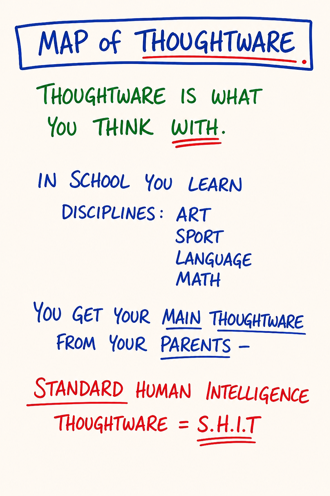

# M02 — Map of Thoughtware

*Thoughtware is what you think with — the internal architecture upstream of every thought you have ever had — and the layer of mind PM targets for upgrade.*

**What it is.** The layer of cognition almost nobody can normally see: the operating system you think *with*, distinct from the thoughts that run on it. Content is what you think *about* — opinions, beliefs, memories, plans. Thoughtware is the structure underneath that determines which thoughts are even available to be thought. You did not choose it; you inherited it from family, school, culture, and the language you happen to speak, before you could notice. The course's claim: thoughtware is upgradeable, and almost nothing else durably changes until it is.

**At a glance.** Thoughtware vs thoughts → architecture vs content *(swapping thoughts is the self-help failure mode)* · Upgradeable, not fixed → technology, not personality or fate · Invisible by default → the glasses you can't see while wearing them; distinctions make it briefly visible · Inherited vs chosen → installed in childhood without consent, selectable going forward · Box-thoughtware vs possibility-thoughtware → the survival config (M04) vs one organized around creating possibility.

---

> **This is a map card.** The full teaching and practice now live in two places:
>
> - **Full teaching →** [Day 2 — Thoughtware, Thoughtmaps, Box Technology](../Days/Day%2002%20-%20Thoughtware%2C%20Thoughtmaps%2C%20Box%20Technology.md)
> - **Interactive tool →** [Map Atlas · M02 Map of Thoughtware](../Map%20Atlas/M02%20-%20Map%20of%20Thoughtware.html)

---

🄯 **World Copyleft 2026** · *Expand the Box (Digital)* · licensed **[CC BY-SA 4.0](https://creativecommons.org/licenses/by-sa/4.0/)** · re-presents Possibility Management thoughtware originated by Clinton Callahan & the Possibility Management community · please share, share-alike · Powered by Possibility Management ([possibilitymanagement.org](https://possibilitymanagement.org)) · full terms: `LICENSE.md` in the course root
