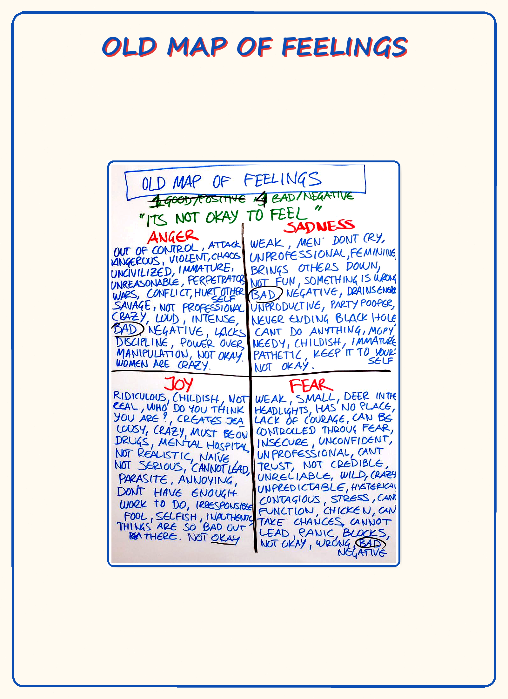

# M08 — Old Map of Feelings

*The cultural map of feelings the learner arrived with — sorted into "good" and "bad," three of the four forbidden, the fourth diluted, maintained through numbness.*

**What it is.** The thoughtware most learners were issued as children — by family, school, religion, peer group, workplace, gender training. It sorts the four feelings into **good** and **bad**, forbids three of them outright, dilutes the fourth, and uses numbness to make the arrangement run smoothly. It is functional in patriarchal culture and dysfunctional in archiarchal culture: it does exactly what it was built to do — keep the learner controllable, predictable, and quiet about what they actually feel. The cost is stored emotion, mixed-emotion soup, chronic low-grade numbness, and recurring drama. You are not here to fight it but to see it precisely enough that it stops running you in the background.

**At a glance.** Old map vs new map → sorting (good/bad) vs archetypal energies with purpose; the sort is the central error · Good/bad framing is the error, not the contents · Gendered distortions → anger suppressed in women and "nice" people, sadness and fear suppressed in men · Functional in patriarchy, dysfunctional in archiarchy → not a moral verdict · Numbness is the load-bearing mechanism (M09) · Naming the specific rule is most of the work.

---

> **This is a map card.** The full teaching and practice now live in two places:
>
> - **Full teaching →** [Day 5 — Feelings vs Emotions, Old Map of Feelings, Numbness Bar](../Days/Day%2005%20-%20Feelings%20vs%20Emotions%2C%20Old%20Map%20of%20Feelings%2C%20Numbness%20Bar.md)
> - **Interactive tool →** [Map Atlas · M08 Old Map of Feelings](../Map%20Atlas/M08%20-%20Old%20Map%20of%20Feelings.html)

---

🄯 **World Copyleft 2026** · *Expand the Box (Digital)* · licensed **[CC BY-SA 4.0](https://creativecommons.org/licenses/by-sa/4.0/)** · re-presents Possibility Management thoughtware originated by Clinton Callahan & the Possibility Management community · please share, share-alike · Powered by Possibility Management ([possibilitymanagement.org](https://possibilitymanagement.org)) · full terms: `LICENSE.md` in the course root
