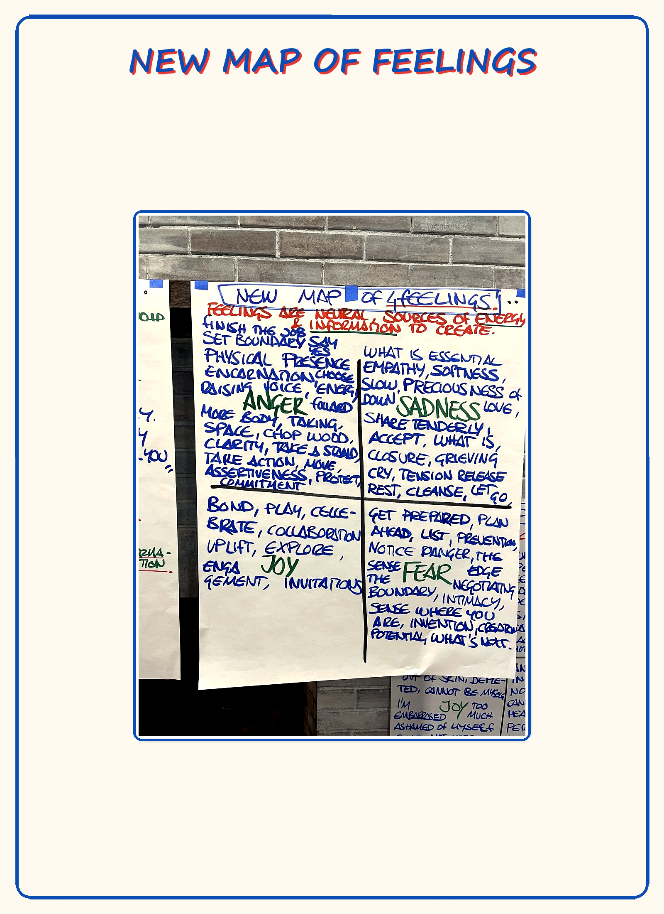

# M10 — New Map of Feelings

*Four pure archetypal feelings — anger, sadness, fear, joy — each functional, time-limited, body-located, present-time, asking for specific action; none good, none bad; each with a shadow form when stored as emotion.*

**What it is.** Four feelings — anger, sadness, fear, joy — treated as archetypal energies, each with a body location, a purpose, an asked-for action, and a shadow form it takes when stored instead of moved. A feeling here is present-time, time-limited (3–5 minutes at full intensity), body-located, and informational. None is good; none is bad.

**At a glance.** Anger → boundaries *(bones, jaw, hands)* · Sadness → release *(heart, throat, eyes)* · Fear → precision *(nerves, skin, belly)* · Joy → connection *(whole body, face, chest)*. Four only — "love," "frustration," "overwhelm," "stress" are **not** on this map. Locate the *sensation*, not the story. The shadow form is the signal a feeling was stored instead of moved.

---

> **This is a map card.** The full teaching and practice now live in two places:
>
> - **Full teaching →** [Day 5 — Feelings vs Emotions, Old Map of Feelings, Numbness Bar](../Days/Day%2005%20-%20Feelings%20vs%20Emotions%2C%20Old%20Map%20of%20Feelings%2C%20Numbness%20Bar.md)
> - **Interactive tool →** [Map Atlas · M10 New Map of Feelings](../Map%20Atlas/M10%20-%20New%20Map%20of%20Feelings.html)

---

🄯 **World Copyleft 2026** · *Expand the Box (Digital)* · licensed **[CC BY-SA 4.0](https://creativecommons.org/licenses/by-sa/4.0/)** · re-presents Possibility Management thoughtware originated by Clinton Callahan & the Possibility Management community · please share, share-alike · Powered by Possibility Management ([possibilitymanagement.org](https://possibilitymanagement.org)) · full terms: `LICENSE.md` in the course root
