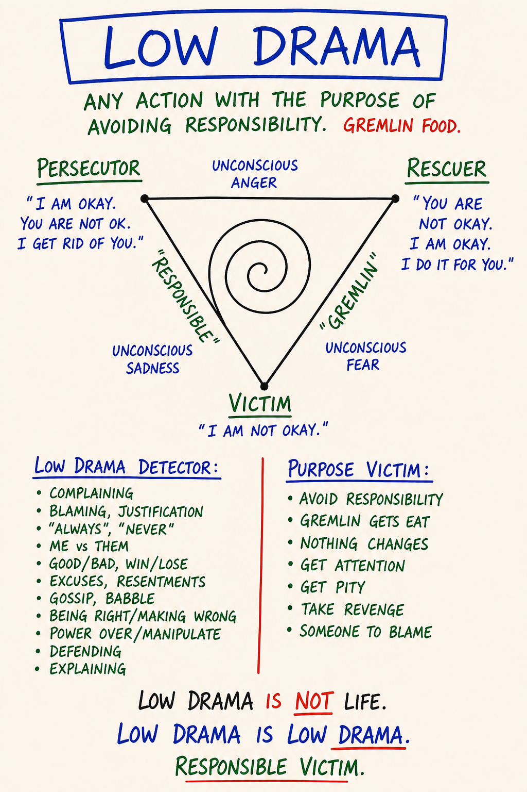

# M13 — Low Drama Triangle

*Three drama positions — Persecutor, Victim, Rescuer — that look like three different people but are one Box-pattern rotating through three faces, producing gremlin food.*

**What it is.** Three positions a person rotates through whenever they produce drama: Persecutor ("it's your fault"), Victim ("I have no choice"), Rescuer ("let me fix it for you"). Not three personality types — three faces of one Box-pattern, and the same person flips between them inside a single conversation. The triangle also names what the drama is *for*: gremlin food. Load-bearing claim — low drama is produced, not received. You are in it because something in you eats what the position generates.

**At a glance.** Persecutor → attacks, blames, makes wrong · Victim → collapses, declares helplessness, controls through misery · Rescuer → steps in unasked, builds dependency. Rotation is structural — Rescuer unappreciated becomes Persecutor, Persecutor challenged collapses to Victim. All three feed gremlin food. Distinct from Karpman → same shape, but the mechanism is gremlin-food production, not "dysfunction," so the exit differs. The move out → the Responsible Game: notice, name, step out, ask what is happening / what I want / what I can choose. It feels less alive at first because the gremlin is starving.

---

> **This is a map card.** The full teaching and practice now live in two places:
>
> - **Full teaching →** [Day 7 — Low Drama, Gremlin Food, Shifting to the Responsible Game](../Days/Day%2007%20-%20Low%20Drama%2C%20Gremlin%20Food%2C%20Shifting%20to%20Responsible%20Game.md)
> - **Interactive tool →** [Map Atlas · M13 Low Drama Triangle](../Map%20Atlas/M13%20-%20Low%20Drama%20Triangle.html)

---

🄯 **World Copyleft 2026** · *Expand the Box (Digital)* · licensed **[CC BY-SA 4.0](https://creativecommons.org/licenses/by-sa/4.0/)** · re-presents Possibility Management thoughtware originated by Clinton Callahan & the Possibility Management community · please share, share-alike · Powered by Possibility Management ([possibilitymanagement.org](https://possibilitymanagement.org)) · full terms: `LICENSE.md` in the course root
