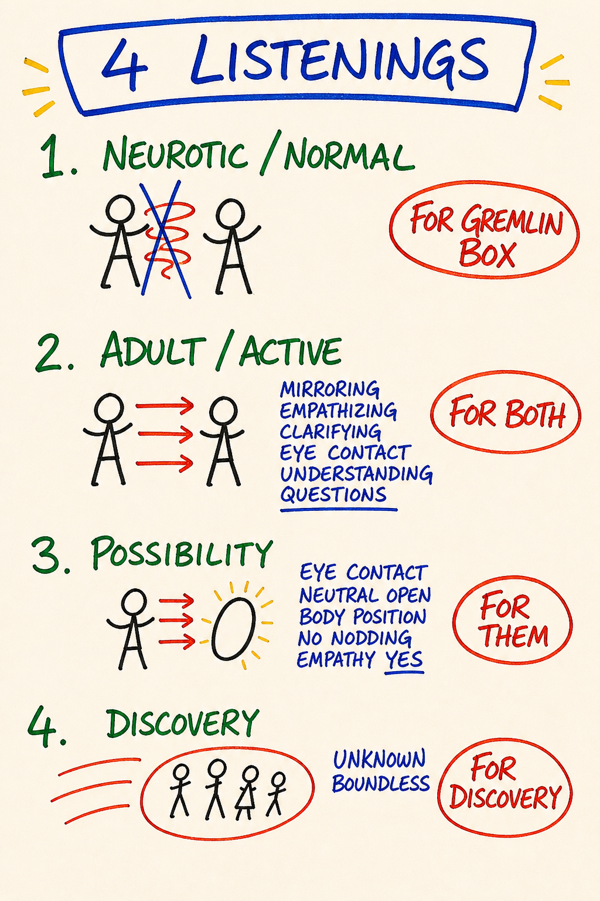

# M14 — The 4 Listenings

*Four distinct internal stances a listener can choose between — and the fact that the stance you take, not the words the speaker says, determines what you actually hear.*

**What it is.** Listening is not a single activity but at least four distinct ones, and the listener is always doing one of them even when they think they are "just listening." The first three live in many traditions; the fourth, Possibility Listening, is PM-distinctive and the one the course teaches toward. Load-bearing claim — what you hear is determined by where you listen *from*, not by what the speaker says. Until you can name which listening you are running, you cannot choose.

**At a glance.** Listening 1 → to confirm what you already think (sourced from the Box) · Listening 2 → for what they mean (paraphrase, NVC) · Listening 3 → to what is actually being said (the literal words) · Listening 4 → Possibility Listening (a vacuum space, no paraphrase, no need to understand). You choose your listening and can switch mid-conversation. Nodding and smiling train the speaker — Listening 4 drops them. Not empathic listening — empathy mirrors for accuracy; Possibility Listening holds open space for emergence.

---

> **This is a map card.** The full teaching and practice now live in two places:
>
> - **Full teaching →** [Day 8 — Listening, Speaking, Communication, Completion Loops](../Days/Day%2008%20-%20Listening%2C%20Speaking%2C%20Communication%2C%20Completion%20Loops.md)
> - **Interactive tool →** [Map Atlas · M14 4 Listenings](../Map%20Atlas/M14%20-%204%20Listenings.html)

---

🄯 **World Copyleft 2026** · *Expand the Box (Digital)* · licensed **[CC BY-SA 4.0](https://creativecommons.org/licenses/by-sa/4.0/)** · re-presents Possibility Management thoughtware originated by Clinton Callahan & the Possibility Management community · please share, share-alike · Powered by Possibility Management ([possibilitymanagement.org](https://possibilitymanagement.org)) · full terms: `LICENSE.md` in the course root
