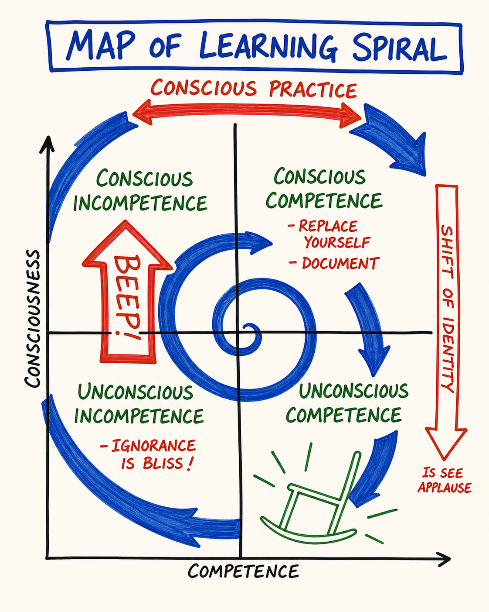

# M19 — Learning Spiral

*The actual shape of how learning lands across time in PM — not linear, not arrival-based, but spiral — and the structural reason the course keeps revealing things on the second lap that were invisible on the first.*

**What it is.** The fantasy most people were sold is that learning is linear — read the book, get it, done. Real learning in PM is spiral: try → notice → name a distinction → adjust → try again → notice more. Each lap covers the same territory, and each lap the learner sees more of what was always there, because the prior lap installed the distinction that made the next seeing possible. The course itself has been a spiral — the Box you met on Day 2 looks different now that Days 5, 7, and 9 installed the distinctions to see how it operates. The spiral continues for years; the course is a quick entry, not the whole thing.

**At a glance.** Spiral, not linear → loops back through the same territory at finer resolution. Each lap reveals what the prior lap installed. The course is itself a spiral → Day 9 sends you back to Day 2 with new eyes. Does not converge on mastery → it deepens; there is no "further along," only this lap. Distinct from growth mindset → that is a stance; the spiral is a structural pattern, independent of stance. Quick entry, not the whole thing. Self-improvement → the linear fantasy with shame attached.

---

> **This is a map card.** The full teaching and practice now live in two places:
>
> - **Full teaching →** [Day 9 — Ego States, Problem Ownership, Learning Spiral](../Days/Day%2009%20-%20Ego%20States%2C%20Problem%20Ownership%2C%20Learning%20Spiral.md)
> - **Interactive tool →** [Map Atlas · M19 Learning Spiral](../Map%20Atlas/M19%20-%20Learning%20Spiral.html)

---

🄯 **World Copyleft 2026** · *Expand the Box (Digital)* · licensed **[CC BY-SA 4.0](https://creativecommons.org/licenses/by-sa/4.0/)** · re-presents Possibility Management thoughtware originated by Clinton Callahan & the Possibility Management community · please share, share-alike · Powered by Possibility Management ([possibilitymanagement.org](https://possibilitymanagement.org)) · full terms: `LICENSE.md` in the course root
