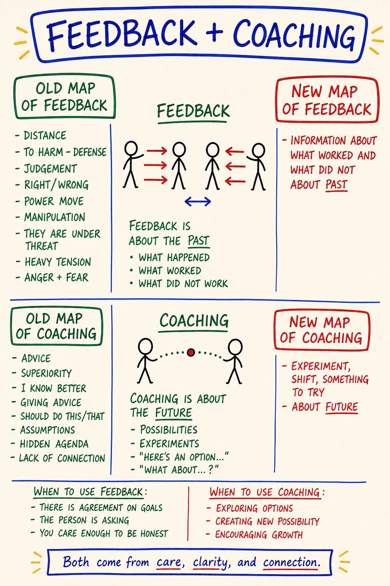

# M25 — Feedback and Coaching

*Two distinct moves people constantly blur: feedback reports the past — what worked, what did not — and coaching opens the future — possibilities, experiments, options to try.*

**What it is.** The map splits a page down the middle: Feedback on the left, Coaching on the right, each with an Old Map (the distorted arrival version) and a New Map (the PM version). The whole axis is time — feedback is about the PAST (what happened, what worked, what did not); coaching is about the FUTURE (possibilities, experiments, "what about…?"). The Old Maps are what the moves degrade into uncleanly: feedback as judgement and threat, coaching as advice from superiority. The footer holds it together — both come from care, clarity, connection, not superiority or threat.

**At a glance.** Axis is time, not tone → Feedback = past, Coaching = future · Feedback's three sources → witness (= feedback, lands clean) · gremlin (= criticism, contracts) · rescuer (= advice, bypasses) · Coaching does not solve the problem → it offers doorways and hands choice back · Feedback is gated → agreement on goals · the person is asking · you care enough to be honest · Both sourced from care, clarity, connection · Smuggling one inside the other is the most common failure.

---

> **This is a map card.** The full teaching and practice now live in two places:
>
> - **Full teaching →** [Day 4 — Feedback, Coaching, Rapid Learning, Experiments](../Days/Day%2004%20-%20Feedback%2C%20Coaching%2C%20Rapid%20Learning%2C%20Experiments.md)
> - **Interactive tool →** [Map Atlas · M25 Feedback and Coaching](../Map%20Atlas/M25%20-%20Feedback%20and%20Coaching.html)

---

🄯 **World Copyleft 2026** · *Expand the Box (Digital)* · licensed **[CC BY-SA 4.0](https://creativecommons.org/licenses/by-sa/4.0/)** · re-presents Possibility Management thoughtware originated by Clinton Callahan & the Possibility Management community · please share, share-alike · Powered by Possibility Management ([possibilitymanagement.org](https://possibilitymanagement.org)) · full terms: `LICENSE.md` in the course root
