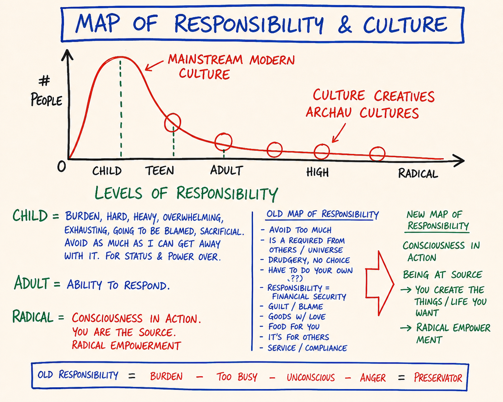

# Map 32 — Map of Responsibility and Culture

*A culture read as the distribution of where its people stand on the levels of responsibility — a population curve that piles up at child level and moves one person at a time.*

**What it is.** The companion to the Levels of Responsibility (Map 24): the same four levels, now plotted as a population curve. Number of people up the vertical axis, child through radical along the horizontal. The tall hump sits over child and teen and is labelled mainstream modern culture; the long thin tail out toward radical is labelled culture creatives, the people sourcing next cultures. The claim the curve makes: a culture is not a flag or an opinion poll, it is readable as the distribution of where its people stand on responsibility. Most of us were raised inside the hump, where responsibility means burden, which is why your body heard "burden" when you first met the word.

**At a glance.** A culture = the distribution of responsibility-levels across its people · The hump → mainstream modern culture, clustered at child/teen, where responsibility means burden, blame, compliance · The tail → culture creatives, sourcing archiarchy · Old map of responsibility (drudgery, no choice, guilt) vs new map (consciousness in action, at source) · Not a moral ranking of persons → child-level was installed, not chosen · The curve moves one person at a time → no argument relocates a culture; one person standing at radical changes the distribution by exactly one.

## How to explain it verbally

This is the levels of responsibility, the same child-adolescent-adult-radical, but now drawn as a population curve: how many people stand at each level. The tall hump sits over child and teen, and that hump is labelled mainstream modern culture. The long thin tail reaching toward radical is the culture creatives. The claim is that a culture just *is* this distribution; it is not a flag or a slogan. So when you first heard the word responsibility and your body braced and heard "burden," that was not a personal quirk, it was the curve speaking through you. And the curve only ever moves one person at a time. Nobody argues a culture into changing. When one person stands at radical, the distribution has shifted by exactly one.

**If you only remember one thing:** a culture is the distribution of where its people stand on responsibility, and it moves one person at a time, not by argument.

---

> **This is a map card.** The full teaching and practice live in two places:
>
> - **Full teaching →** [Day 1 — Orientation, New Context, Radical Responsibility](../Days/Day%2001%20-%20Orientation%2C%20New%20Context%2C%20Radical%20Responsibility.md)
> - **Interactive tool →** [Map Atlas · Map 32 Map of Responsibility and Culture](../Map%20Atlas/M32%20-%20Map%20of%20Responsibility%20and%20Culture.html)

---

🄯 **World Copyleft 2026** · *Expand the Box (Digital)* · licensed **[CC BY-SA 4.0](https://creativecommons.org/licenses/by-sa/4.0/)**, consistent with the spirit of World Copyleft · re-presents Possibility Management thoughtware originated by Clinton Callahan & the Possibility Management community · this course is an independent re-presentation, **not an official Possibility Management training** · please share, share-alike · Powered by Possibility Management ([possibilitymanagement.org](https://possibilitymanagement.org)) · full terms: `LICENSE.md` in the course root
