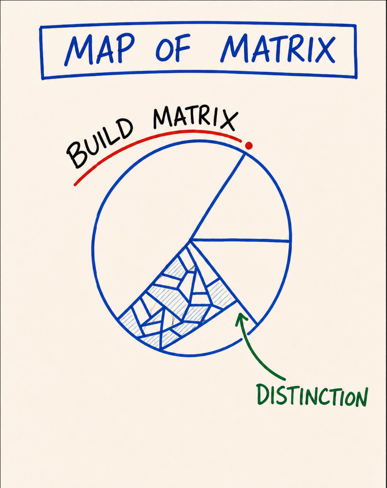

# Map 46 — Map of Matrix

*The one definition of matrix the course uses everywhere — the energetic structure you build, through practice, that determines how much consciousness you can hold. Built by reps, not by reading.*

**What it is.** A simple drawing: a circle, and inside one wedge of it, fine structure, many small cells where the rest of the circle is empty space. An arrow labels the fine structure *distinction*; an arc along the outside says *build matrix*. **Your matrix is the energetic structure you build, through practice, that determines how much consciousness you can hold.** The circle is your capacity; the fine-grained wedge is the part you have built structure into, one cell per distinction installed, per rep run, per feeling stayed present for at higher intensity, per piece of responsibility taken on slightly beyond comfort. Where there is structure, consciousness has somewhere to sit; where there is none, an insight passes through like water through an open hand. Thoughtware upgrades install onto matrix; without enough matrix, an upgrade has nowhere to live. This is why the course runs on reps and a daily sit instead of on explanations.

**At a glance.** Matrix → the energetic structure you build, through practice, that determines how much consciousness you can hold · Built by reps, not by reading → a learner who reads every Spark and runs no experiments upgraded their library, not their matrix · Thoughtware installs onto matrix → without enough, an upgrade has nowhere to live · The wedge gets finer rep by rep → grows like strength, slightly beyond current capacity · No completion state → capacity stays buildable at any age · The marked secondary sense → "the cultural matrix" names the default cosmology you were raised inside (for most, the patriarchal one); bare "matrix," everywhere in this course, means the structure you build.

## How to explain it verbally

The drawing is simple: a circle, and inside one wedge of it there is fine structure, lots of small cells, while the rest of the circle is empty. The wedge is labelled distinction, and an arc along the outside says build matrix. So: your matrix is the energetic structure you build, through practice, that determines how much consciousness you can hold. The whole circle is your capacity; the structured wedge is the part you have actually built, one cell for every distinction installed, every rep run, every feeling you stayed present for at higher intensity. Where there is structure, consciousness has somewhere to sit. Where there is none, an insight passes straight through like water through an open hand. That is why this course is built from reps and a daily sit, not from big ideas: matrix is built by practice, not by reading.

**If you only remember one thing:** matrix is capacity you build by reps, not knowledge you accumulate by reading, and thoughtware has nowhere to live without it.

---

> **This is a map card.** The full teaching and practice live in two places:
>
> - **Full teaching →** [Day 3 — Liquid State, Center-Ground-Bubble, Five Bodies](../Days/Day%2003%20-%20Liquid%20State%2C%20Center-Ground-Bubble%2C%20Five%20Bodies.md) · revisited in [Day 10 — Map of Possibility, Bright Principles, Three Powers, Integration](../Days/Day%2010%20-%20Map%20of%20Possibility%2C%20Bright%20Principles%2C%20Three%20Powers%2C%20Integration.md)
> - **Interactive tool →** [Map Atlas · Map 46 Map of Matrix](../Map%20Atlas/M46%20-%20Map%20of%20Matrix.html)

---

🄯 **World Copyleft 2026** · *Expand the Box (Digital)* · licensed **[CC BY-SA 4.0](https://creativecommons.org/licenses/by-sa/4.0/)**, consistent with the spirit of World Copyleft · re-presents Possibility Management thoughtware originated by Clinton Callahan & the Possibility Management community · this course is an independent re-presentation, **not an official Possibility Management training** · please share, share-alike · Powered by Possibility Management ([possibilitymanagement.org](https://possibilitymanagement.org)) · full terms: `LICENSE.md` in the course root
