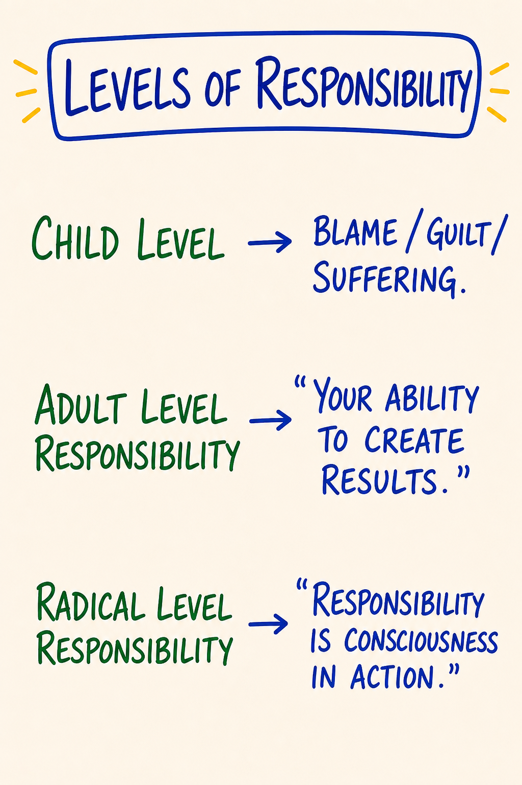

# Day 1 — Orientation · New Context · Radical Responsibility

| | |
|---|---|
| **Intensity** | Low |
| **Time** | ~2 hours active across 2–3 days |
| **Partner check-in required before?** | No (but the partner must be assigned and confirmed before you start) |
| **Source videos** | `01 - New Context_EN.mp4` · `02 - New Responsibility & Culture.mp4` |
| **Maps (taught in this module)** | M01 New Context (the chain) · M24 Levels of Responsibility · M28 Gameworld — each also a standalone interactive tool in the [**Map Atlas**](../Map%20Atlas/index.html) |

---

## Purpose

To establish the container.

Day 1 is not the place where you learn most of the maps. Day 1 is the place where you become someone who is *here to use them*. The work of this module is to install a single shift — from **learner-as-consumer to learner-as-creator** — without which everything that follows lands as information rather than as transformation.

The shift is named in PM as **a change of context.** You are choosing to do the next 9 modules in a different context than the one you live the rest of your life in: the context of **radical responsibility**.

---

## Core PM concepts

- **Context.** The space inside which everything else happens. The same act in two different contexts means two different things.
- **The chain:** new context → new thoughtware → new thoughtmaps → new options → new choices → new behavior → new results.
- **Thoughtware.** What you think *with*. Distinct from what you think *about*.
- **Levels of responsibility:** child · adolescent · adult · **radical**.
- **The Box (preview only).** The survival/protection filter you have been identified with. *You have a box. You are not your box.* (First worked at surface/story level Day 2.)
- **Liquid state (preview only).** The state in which thoughtware can be upgraded. (Worked in detail Day 3.)
- **The red-pill choice.** Choosing to be in the training is itself the first PM practice.

---

## Learning outcomes

By the end of this module you will:

1. Be able to state in your own words the difference between **context** and **content**, and give one example from your life.
2. Be able to distinguish, in language, *child / adolescent / adult / radical* responsibility — and detect which one you are speaking from in a given moment.
3. Have made an explicit, witnessed commitment to be in the training for the next ~30 days.
4. Have completed your first voice-message exchange with your pairing partner under the structure the course teaches.
5. Have experienced — briefly — the difference between speaking *about* a feeling and speaking *from* one.

---

## Module flow

| Step | Time | What you do |
|---|---|---|
| 1 | 10 min | Read this header, scan the module |
| 2 | 8 min | Watch `01 - New Context_EN.mp4` |
| 3 | 12 min | Watch `02 - New Responsibility & Culture.mp4` |
| 4 | 30 min | Read **Concept teaching notes** below, slowly — study each map image where it sits, and do the chain-walk micro-practice inline |
| 5 | 20 min | **Embodied practice** (solo) — the red-pill ceremony, with the four-level sentence and gameworld-naming folded in |
| 6 | 20 min | **First partner voice-message** (record + send) |
| 7 | — | Receive partner's reply within 24 hours; record your reply back |
| 8 | 2–3 days | Run the **between-module experiment** |
| 9 | 15 min | Journal the **reflection prompts** |
| 10 | 1 min | Post one line to the cohort feed |

The whole module spreads across ~3 days. The active reading + watching + practicing is ~90 min. The partner exchange and the experiment take ordinary life-time, not scheduled time.

---

## Concept teaching notes

### Context is upstream of everything

You can say the word *responsibility* in two different contexts and mean two completely different things.

In the context most adults were raised inside, **responsibility means burden.** "I have so much responsibility." "Don't put that on me." "It's not my responsibility." The word lands heavy. It is something you carry, something that gets dumped on you, something you try to avoid. This is **child-level responsibility** — even when said by a 45-year-old executive. It's not about age. It's about which context the word is being said inside.

In the context of **radical responsibility**, the word means something else. It means: *I am the author of what is happening in my life.* Not "I caused it." Not "It's my fault." But: I am at cause. I am the one who chooses what this becomes. Action has consequences. Inaction has consequences. Being aligned with that is what *responsibility* means here.

Same word. Two contexts. Two different lives.

The shift of context is the shift the course is asking you to make. Not for the rest of your life — for the next 30 days. You are agreeing to operate, *inside* this course, in the context of radical responsibility, *as an experiment*, to see what becomes possible from there.

### The chain

*▶ [Explore M01 as an interactive tool in the Map Atlas →](../Map%20Atlas/M01%20-%20New%20Context%20%28the%20chain%29.html)*

Study the map before reading on. Notice the arrow: it runs one direction only, left to right, and the leftmost link — *context* — is the one drawn first and the one you can least see. That single direction is the whole teaching. (The course map above is the clean ETB *New Context Chain*; a handwritten version exists in the source library from live Day 1 session photos — this is the rendered version you study from.)

Once you accept that everything you do flows from the context you're standing in, the whole chain becomes visible:

> **new context → new thoughtware → new thoughtmaps → new options → new choices → new behavior → new results**

- **New context** — the space ("I am the author here") you choose to operate from
- **New thoughtware** — the operating system, the internal architecture, that the new context lets you install
- **New thoughtmaps** — the specific maps (Box, Five Bodies, Low Drama, etc.) you use to navigate
- **New options** — possibilities that simply did not exist for you in the old context
- **New choices** — the choices made from those expanded options
- **New behavior** — the actions taken
- **New results** — what then shows up in your life

The chain runs **left to right** but the work, almost always, has to start on the left. Trying to get new results by changing your behavior without changing the context they come from is the most common reason "personal development" doesn't stick. You install a new behavior on top of the old thoughtware and the old context eats it. Behavior change without context change has a half-life under a month: the old context returns the old behavior, which is why willpower-based change fades so fast.

One thing the arrow is telling you that is easy to miss: **the chain is not a set of steps to do — it is a set of layers to see.** You do not complete link one, then start on link two. You stand in the new context, and the rest of the chain reorganizes by itself. The leftmost link is invisible by default — you cannot see the context you are standing in any more than a fish can see the water — so the course's whole job on Day 1 is to make context visible enough to choose.

This course works upstream.

> **Micro-practice — the chain-walk (10 minutes).** Do this now, before reading on, if you have floor space; otherwise mark it and run it during the embodied practice. Find a stretch of floor about seven steps long and mark the spots if you can — a coin, a post-it, anything. Name the seven links out loud, walking one step per link, left to right: *context · thoughtware · thoughtmaps · options · choices · behavior · results.* Now pick one specific recurring result you do not like — a repeated argument, a stuck pattern at work, an avoidance you keep making. Stand on the **results** spot and name it out loud in one sentence. Then walk *backwards*, one step at a time, asking out loud on each spot: *what is the link behind this one?* Behavior behind the result. Choice behind the behavior. Option behind the choice. Map behind the option. Thoughtware behind the map. **Context behind the thoughtware.** When you reach the **context** spot, stop and stand still for sixty seconds. You do not have to name the context perfectly. You only have to notice you are standing on the leftmost link — the one you cannot normally see — and that this is where the result actually started. Walk forward once more, slowly, naming the links. Sit, and write two sentences about what you noticed on the leftmost spot.

**Common misunderstandings about the chain.**

- *"The chain is a step-by-step process — work on context, then thoughtware, then maps, in turn."* No. It is a single causal sequence that unfolds together once context shifts. You stand in the new context; the rest cascades.
- *"'New context' means a new environment — a new job, city, or relationship."* Context is the invisible source-frame you operate *from*, not your surroundings. You can change cities and carry the same context with you.
- *"'Context' is just a poetic synonym for mindset or framing."* Context here is structural — the source-frame from which thoughtware, maps, options, choices and behavior all derive. Mindset is two links downstream.

### Thoughtware (preview)

The next module goes deep on this. For now: thoughtware is not your opinions, beliefs or ideas. It is the **technology that you think with** — the structures and architectures that determine which thoughts are even available to you. You can't see your thoughtware the way you can't see your glasses while you're wearing them. The course makes the thoughtware visible by walking you through specific upgrades and noticing what's now possible that wasn't before.

### Levels of responsibility

*▶ [Explore M24 as an interactive tool in the Map Atlas →](../Map%20Atlas/M24%20-%20Levels%20of%20Responsibility.html)*

Study the map before reading on. It shows three levels and what each one *produces*: **child** produces blame, guilt, suffering; **adult** is your ability to create results; **radical** is consciousness in action. Notice the map files blame, guilt and suffering at child level on purpose — that placement is the teaching. (The course names four levels; the map shows the three primary ones, with *adolescent* as the transitional position between child and adult.) The word does not soften or intensify as you move up — it changes meaning, because each level is a different context. This is the chain again: context determines what the word means. Said from child level, "responsibility" means burden; said from radical, the same five syllables mean authorship.

PM distinguishes four levels. You can read them as developmental stages and you can also read them as **moves** — at any moment, in any conversation, you are operating from one of these.

| Level | Stance | Common phrasing |
|---|---|---|
| **Child** | Someone else is responsible. I am acted upon. *Produces blame, guilt, suffering — by structure, not accident.* | "It's not fair." "They did this to me." "I have no choice." |
| **Adolescent** | I rebel against whoever is responsible. I prove them wrong. *Looks like freedom; still sourced from someone-else-is-in-charge, just inverted.* | "I'll do the opposite." "Watch me." Defiance as identity. |
| **Adult** | I am responsible for me. I do my share. *Your ability to create results — clean, necessary, bounded by "my part."* | "I'll handle my part." Cooperative, contractual. |
| **Radical** | I am at cause. I am the author. Inaction is a choice with consequences. *Consciousness in action.* | "I am here. I will create what is needed." |

The adolescent move is worth naming precisely, because it is the one most often mistaken for maturity. Rebelling against an unfair authority *feels* like a responsible stand, but you are still organized around that authority — defining yourself against the thing you say is in charge. The someone-else frame is intact; you have just flipped your sign. Radical responsibility does not react against the frame. It authors a new one.

Radical responsibility is **not** taking on everyone else's stuff, and it is **not** heroic strain. Standing as the author is *lighter* than carrying the burden, not heavier. It is also not "I caused everything" and not "it's my fault" — that reading is blame, and blame is back at child level. Radical responsibility is being the one who chooses what this becomes *next*, owning the strategy you are running now — author of the next move, not of your past, your conditioning, or your circumstances. It is the stance from which the course operates and from which all of PM is taught. You do not have to live there full-time to start this work. You have to be willing to *step into it* for the duration of the modules.

**Common misunderstandings about the levels of responsibility.**

- *"Radical responsibility means it's all my fault — that I caused everything bad that happened to me."* Blame and fault are *child-level* — the map puts them there on purpose. Radical responsibility is being at cause for what you do next; it does not claim you authored your conditioning, your trauma, or your circumstances.
- *"Adult responsibility is the goal — get to 'I do my share' and you've arrived."* Adult is clean, necessary, and the floor for this work — but the course operates from radical. Adult is doing your part inside a situation someone else is framing; radical is being at cause for the whole field you are standing in.
- *"These are personality types or fixed stages — I'm 'an adult-level person,' that's just who I am."* They are moves and contexts you shift between moment to moment. The same person speaks from child, adolescent, adult and radical on the same Tuesday. The work is to catch which one is on the line, not to earn a permanent rank.

### The gameworld you are entering

*▶ [Explore M28 as an interactive tool in the Map Atlas →](../Map%20Atlas/M28%20-%20Gameworld.html)*

Study the map before reading on. A **gameworld is a field of human commitment** — that is the entire definition, and every word carries weight. *Field*: it has an inside and an outside; you are in it or you are not. *Human*: it does not exist in nature — people bring it into being and people sustain it. *Commitment*: it is held together not by walls but by what the people inside have agreed to keep doing. The map names the three parts that make any field of commitment legible — and the red-pill choice you are about to make is the act of entering one.

The word "game" trips people up. It sounds like *trivial, nothing really counts*. It means the opposite: **bounded, ruled, and chosen.** A marriage is a gameworld. A company is a gameworld. This course is a gameworld. The stakes inside are completely real — naming a field a gameworld does not lower the stakes, it makes the rules visible and therefore workable. Every gameworld has three load-bearing parts:

- **Context** — a specific practical relationship with responsibility. Not the surroundings; the source-frame (the chain, the levels). Who is at cause here, and for what? A field where everyone waits to be acted upon runs differently than one where the participants stand as authors.
- **Purpose** — an agreed origination plus intention plus commitment to create. What was this field brought into being to *make* — not what it happens to drift toward?
- **Rules of engagement** — the agreements of operation inside the field: how people speak, decide, handle conflict, and repair *here* — which can differ entirely from how they do it anywhere else.

You **enter** a gameworld by choice and commitment. Day 1's red-pill choice *is* entering the ETB gameworld — saying "I am in" out loud, in your body, knowing you could have said "I am out." And you **leave** consciously: Day 10 closes this gameworld on purpose, distinguishing what was built and naming the next one you are entering. A gameworld you never consciously close does not actually end — it leaks, ambiguous, into everything afterward.

Here is why the map matters. Most of patriarchal life runs as **unconscious gameworlds** — fields of commitment whose rules nobody named, that people are inside without ever having chosen. You are in many right now: your job, your family role, your relationships. The work of consciousness is to see the gameworld you are standing in, read its real (often unspoken) rules, and choose — keep operating by them, renegotiate them, or leave. The unnamed gameworld runs you. The named one, you stand in as the author.

**Common misunderstandings about the gameworld.**

- *"A gameworld means it's not serious — it's 'just a game,' nothing counts."* The opposite. The word *game* names the bounded, ruled, chosen structure, not the stakes — which are fully real. What the framing changes is not the seriousness; it is that the rules become visible and workable.
- *"Calling this course a gameworld means I'm joining a cult or adopting a new identity."* No — a gameworld has a **boundary** and a **duration**. You enter by choice, operate by named rules for a set time, and leave consciously. A cult erases the boundary and makes the gameworld total and permanent; naming a gameworld does the reverse — it stays finite, and you keep your authorship to enter and to leave.
- *"I'm not in any gameworlds unless I formally join one."* You are in many right now, most of them unconscious, with rules you never agreed to out loud. You did not opt out by not naming them — you only lost sight of them. The work is not to enter gameworlds; it is to *see* the ones you are already standing in.
- *"Once I name a gameworld's rules, they're fixed and I have to comply."* Naming the rules is what makes them *negotiable*. Unconscious rules run you precisely because they are invisible. Once a rule of engagement is on the table, you can keep it, change it with the others in the field, or decide this is not a gameworld you choose to stay in. Naming returns choice; it does not remove it.

---

## Embodied practice (solo) — The red-pill ceremony

This practice is the analogue of the live ceremony where, in an in-person ETB, the trainer asks "blue pill or red pill?" and gives everyone 90 seconds to walk out and get their money back if they choose. Online and async, you do it for yourself.

It takes ~15 minutes. Find a place where you will not be interrupted. Read the script all the way through once, then do it.

> **Script.**
>
> Stand up. Both feet on the floor. Shoulders down. Hands loose at your sides.
>
> Take three breaths, exhale longer than inhale. Audible exhale.
>
> Now, out loud: *"In the next 30 days I am going to do this course."* Say it.
>
> Notice what your body did when you said that. Did you tighten? Did you brace? Did you brighten? Whatever it did, that's information.
>
> Now, out loud: *"I can stop at any time. I can pause at any time. I can put it down at any time. Nothing makes me do this."*
>
> Notice what your body did *that* time.
>
> Now, the choice. Two options. Speak each one out loud, in order, and notice which one your body recognizes as true.
>
> *"Blue pill. I'm not doing this. The course is interesting but I'm not actually in it. I'll watch the videos when I get to them. I won't pair with anyone. I won't run the experiments. I'm a tourist."*
>
> Pause. Notice.
>
> *"Red pill. I am in this. For the next 30 days I am the author of what this becomes for me. I will pair with my partner. I will run the experiments. I will use the safety practices when I need them. I will not pretend to be in if I am not. I am in."*
>
> Pause. Notice.
>
> Choose. Say the chosen sentence one more time, alone, in the room you are in, with your body present.
>
> Sit down. Write the date and your chosen sentence on a piece of paper. Put it where you will see it during this course.

If you cannot honestly say the red-pill sentence right now — that is not a problem. That is data. The course is not for everyone right now. Pause. Talk to the community manager. The course will still be here in three months.

The red-pill ceremony is the day's central practice — and it *is* the act of entering the gameworld. Two short companion practices put the day's other two maps directly in your body. Do the first now; do the second this week, on a field of your actual life.

> **Companion practice — the four-level sentence (~10 min).** This is the solo version of the Day 1 "Four Levels" interactive tool — the levels-of-responsibility map, done in your body instead of on the screen. Run it after watching `02 - New Responsibility & Culture.mp4`. Stand, both feet on the floor, shoulders down, three breaths with the exhale longer than the inhale. Pick **one real sentence you actually said recently** — to a partner, a boss, a kid, yourself — something with a charge on it: *"You never listen." "I can't deal with this right now." "Fine, I'll just do it myself."* Write it down so it doesn't drift. You will say that one sentence four times — once from each level — and notice what your body does each time. **Child (90 sec):** speak it as pure blame; someone did this to you, it isn't fair. Notice your chest, your jaw, where the weight sits — the suffering posture. Return to neutral. **Adolescent (90 sec):** the same sentence as defiance — *watch me, I'll do the opposite.* Feel the charge of rebelling, and notice you are still aimed *at* someone. Return to neutral. **Adult (90 sec):** the same sentence from "my ability to create results — I keep my agreements." The voice goes plainer; notice the weight come off the chest. Return to neutral. **Radical (3 min):** the same sentence one last time, from "I am at cause — I am the author of what this becomes." Not *I caused it* — the author of the next move. Notice what becomes available that was invisible from child or adolescent, and that the posture is the least dramatic of the four. Stay an extra minute. Sit and write three lines: *which level was my body's home stance on that sentence; which level felt unfamiliar in my body; what became possible only from radical that was invisible from child.*

> **Companion practice — naming a gameworld you are already in (~12 min).** One sheet of paper, divided into three rows. Pick one ongoing field of your life that you did *not* consciously declare — a relationship, a job, a family role. Not the course (you named that one in the red-pill ceremony). Choose the one your body tightens slightly at when you think of it; that tightening is the marker. Sit, feet on the floor, three breaths with a longer exhale. Name the field out loud, plainly: *"The gameworld of my marriage." "The gameworld of being the responsible one in my family." "The gameworld of my job."* Notice what the body does at the word. **Row one — Context:** write the practical relationship with responsibility inside this field — who is at cause here, for what? The *actual* version, not the one you'd say out loud to the others in it: *"I act as if I am responsible for everyone's feelings and no one is responsible for mine."* **Row two — Purpose:** write what this field is *for* — then ask the dangerous question: *was that purpose ever agreed out loud,* or did it accrete by drift with everyone assuming a different one? Write both. **Row three — Rules of Engagement:** write the real operating agreements, including the unspoken ones — *"We never raise the money topic directly." "I withdraw and they pursue." "Whoever gets angriest wins."* Get at least three down; the unspoken ones are the rep. Read all three rows back, out loud, slowly, one hand flat on the paper, and ask: *which of these did I ever consciously choose?* Sit with the ones you did not. Do not fix anything — do not decide to leave, renegotiate, or confront. Write one closing line: *one rule of engagement in this field that I never agreed to out loud.* That sentence is the whole rep — you have made one unconscious gameworld conscious, which is the move the rest of the work is built on.

---

## Partner exchange (async)

This is your first voice-message exchange with your pairing partner. The structure is given here and is the same template you will use, with small variations, every module.

**Prompt to record (3–8 minutes):**

Speak to your partner directly. Tell them three things:

1. **Who you are** — name, a sentence or two of context for your life right now, the most recent specific thing you have done in your day (not your job title; the actual thing — "I just put the kids to bed," "I drove back from a difficult meeting," "I finished editing a chapter").
2. **What is alive in you about being in this course** — the actual answer, not the impressive one. Anger, sadness, fear, joy, curiosity, skepticism, all valid.
3. **What you are here to do** — what you specifically came for. Not "to grow" — what specifically.

Speak from your body, not from your script. If you stumble, leave the stumble in. Do not edit.

**When you receive your partner's message, listen all the way through once before you do anything else.** Then record your reply (3–8 minutes):

1. **What you heard them say** — paraphrase back the core. Not all of it. The part that landed.
2. **What you noticed in yourself while listening** — a feeling, a body sensation, a thought.
3. **One question you are leaving with them** — open-ended, not advice. The kind of question that lands in their body, not their head.

That is the whole exchange. No advice. No fixing. No "have you tried." No "I had a similar experience and what worked for me was…" Witnessing only. The course teaches advanced listening on Day 8 — for now, simple witnessing is enough.

---

## Between-module experiment

Pick **one** of the following. Run it once, in your actual life, before you start Day 2.

1. **The single-word context shift.** In one conversation in the next 48 hours — a conversation that would normally go a particular way — silently choose, in the moment, the word *radical*. Hold the context "I am at cause here" for the duration of that conversation. Notice what shifts. Make no announcements.
2. **The chain notice.** Catch yourself once, in the next 48 hours, getting a result you don't like. Walk the chain backwards: from the result → to the behavior → to the choice → to the option → to the thoughtmap → to the thoughtware → to the context. Find the link where the chain originally bent. You don't have to fix it. Just see it.
3. **The blue-pill detection.** Notice one place in your week where you say yes to something and your body says no, or yes to something while privately planning to be a tourist about it. Notice without changing it. This is data for Day 2's box work.

Capture in 2–3 sentences what happened. You'll use it in your reflection.

---

## Reflection prompts

Journal at your own pace. The questions are designed to take material out of your head and into your hand. Write longhand if you can.

1. What is the context I have been operating from in the area of my life that I most want to be different? Name it precisely. Not the content (the relationship, the job, the symptom) — the context underneath.
2. When I read the four levels of responsibility, where did my body recognize itself? Which level is my home stance? Which level do I most fear being seen at?
3. The red-pill sentence I chose — did I choose it cleanly, or did I choose it because I felt I should? If the latter — what would the actual cleanly-chosen sentence be?
4. What was the smallest, most surprising thing I noticed in my partner exchange? (Often the smallest thing is the doorway.)
5. From the chain — at which link do I most often try to start? At which link am I avoiding starting?

---

## Safety callouts for this module

Day 1 is a Low-intensity module. Most learners report it as energizing or sobering rather than destabilizing. Two things to watch for:

- **The red-pill ceremony can surface old commitments you have been quietly walking away from in other parts of your life.** That is not a problem to fix — just a thing to notice. If a partner / job / commitment outside this course is silently saying "no" in your body during this practice, name that in your journal. You don't have to act on it. Action without integration is rarely the right next move.
- **The first partner exchange is often awkward.** Awkwardness is not danger. Push through ordinary self-consciousness; do not push through actual fear about the person you are paired with. If something about your pairing isn't right (it doesn't feel safe, the person isn't actually engaging, the cadence isn't working), contact the community manager by Day 4. Silent unworkable pairings get re-matched.

The universal grounding script (top of `03 - Safety and Facilitation Framework.md`) applies. If at any point in this module you notice you are floating, dissociating, or shutting down — stop, ground, decide.

This course is not therapy and is not a substitute for therapy. If today's material brings up something larger than the course was built to hold, use the referral list.

---

## Cohort feed post (suggested)

One line each, no more:

- What landed: …
- What's sticking sideways: …
- (Optional) one question for the group: …

---

## Glossary additions

- **Context** — the space inside which everything else happens; same content in two contexts means two different things
- **Content** — what is happening; distinct from context
- **Thoughtware** — what you think with; the internal architecture, not the ideas
- **Thoughtmap** — a specific cognitive map (e.g., the Box, the Five Bodies) used to navigate
- **Levels of responsibility** — child (someone else is responsible; produces blame, guilt, suffering) · adolescent (rebellion against the authority; still sourced from someone-else-is-in-charge) · adult (your ability to create results; bounded by "my part") · radical (consciousness in action; at cause for the whole field)
- **Radical responsibility** — the stance "I am at cause"; author of the next move, not of your past; the level the whole course is sourced from
- **Liquid state** — the state in which thoughtware can be changed; previewed today, worked Day 3
- **Box** — the survival/protection filter; previewed today, worked Day 2
- **The chain** — context → thoughtware → thoughtmaps → options → choices → behavior → results
- **Gameworld** — a field of human commitment with three parts: context, purpose, and rules of engagement; bounded, ruled, and entered by choice. The course is one; you enter it with the red pill and close it on Day 10
- **Rules of engagement** — the agreements of operation inside a gameworld (how people speak, decide, conflict, repair); often unspoken, and made negotiable by being named
- **Red pill / blue pill** — the metaphor PM uses for choosing whether to actually be in the work; the red pill is the act of entering the course gameworld

---

🄯 **World Copyleft 2026** · *Expand the Box (Digital)* · licensed **[CC BY-SA 4.0](https://creativecommons.org/licenses/by-sa/4.0/)** · re-presents Possibility Management thoughtware originated by Clinton Callahan & the Possibility Management community · please share, share-alike · Powered by Possibility Management ([possibilitymanagement.org](https://possibilitymanagement.org)) · full terms: `LICENSE.md` in the course root
