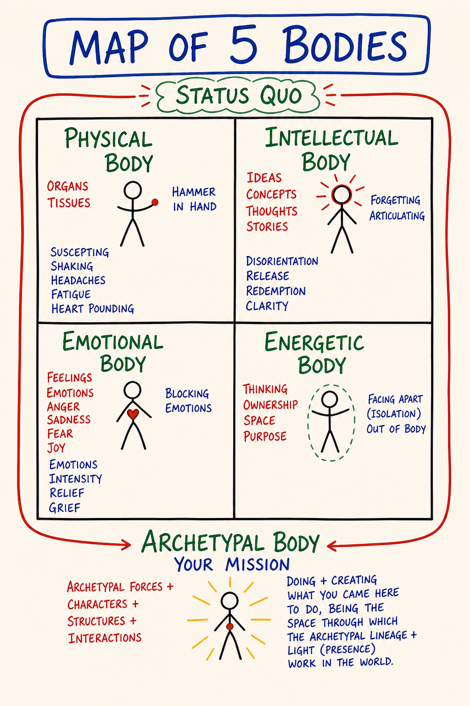
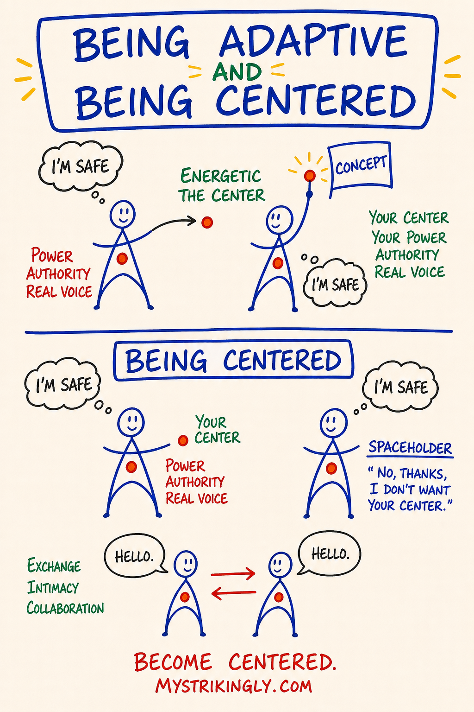

# Day 3 — Liquid State · Center, Grounding Cord, Bubble · Five Bodies

| | |
|---|---|
| **Intensity** | Low |
| **Time** | ~2.5 hours active across 2–3 days |
| **Partner check-in required before?** | No (partner must be active; you will exchange after) |
| **Source videos** | `06 - LiquidState_EN.mp4` · `07 - 5Bodies_EN.mp4` |
| **Maps (taught in this module)** | M05 Liquid State · M06 Map of 5 Bodies · M07 Being Centered — each also a standalone interactive tool in the [**Map Atlas**](../Map%20Atlas/index.html) |

> **Grounding (60 seconds).** Top of `03 - Safety and Facilitation Framework.md` Section D. Read it now. You will use it inside this module.

---

## Purpose

To install the infrastructure the rest of the course runs on.

Day 1 changed the context. Day 2 made the Box visible. Day 3 is the day the learner gets the equipment they need to be in contact with what happens *next*: a working map of what they actually are (a five-body organism, not a brain with plumbing), and a working set of energetic-body practices (center, grounding cord, bubble, golden cube) that let them stay present while their thoughtware is loosening.

The condition in which thoughtware can loosen is called **liquid state.** It is not optional. It is what allows distinction-density to land in the body instead of bouncing off the intellect. Without the equipment, liquid state is destabilising. With it, liquid state is workable.

Day 3 is tagged Low intensity because the content is cognitive and embodied-light. Do not confuse low intensity with low importance, and do not skim this module. Days 5, 6, 7 and 9 assume the equipment installed here is live in your body. If it is not, the High modules will not have anywhere to put their weight. A learner who reads Day 3 as an intellectual proposition and moves on has done one-fifth of the work — the other four bodies, where it would have worked, stayed where they were.

---

## Core PM concepts

- **Liquid state** — the condition in which thoughtware can be changed. The Box has loosened. Symptomatic across all five bodies; not all liquid states are transformative.
- **The five bodies** — intellectual, emotional, physical, energetic, archetypal. What a human actually is.
- **Over-identification with one body** — the default condition most learners arrive in (usually intellectual). The course is a recalibration.
- **Center** — the energetic location in your body (typically lower belly / hara) from which your choices, will and authority come.
- **Grounding cord** — an energetic line declared from your center to the centre of the earth. Allows discharge; allows you to stay in your body when intensity rises.
- **Bubble** — an arm's-length energetic boundary. A distinction, not a protection. Marks what is yours and what isn't.
- **Golden cube / workspace** — a portable, declared creative space in which new thoughtware is constructed and tested.

---

## Learning outcomes

By the end of this module you will:

1. Recognise, in your own experience, what liquid state feels like across at least three of your five bodies — and distinguish a *transformative* liquid state from a non-transformative one.
2. Locate each of the five bodies in yourself and name which one you are over-identified with.
3. Declare a **center**, drop a **grounding cord**, set a **bubble**, and open a **golden cube** — and hold all four through one external interruption.
4. Have completed a partner exchange in which you report the practice as you actually experienced it.

---

## Module flow

| Step | Time | What you do |
|---|---|---|
| 1 | 10 min | Read this header and scan the module |
| 2 | 15 min | Watch `06 - LiquidState_EN.mp4` |
| 3 | 15 min | Watch `07 - 5Bodies_EN.mp4` |
| 4 | 35 min | Read **Concept teaching notes** below, slowly — study each map image where it sits |
| 5 | 25 min | **Centering · grounding cord · bubble · golden cube** (solo, embodied) |
| 6 | 20 min | **Partner voice exchange** (record + send) |
| 7 | — | Receive partner reply within 24 hours; record your reply |
| 8 | 2 days | Run the **between-module experiment** |
| 9 | 15 min | Journal the **reflection prompts** |
| 10 | 1 min | Post one line to the cohort feed |

Spread the module across 2–3 days. The energetic-body practices need at least one night of sleep between the first attempt and the partner exchange — your nervous system installs them while you are not looking.

---

## Concept teaching notes

### What liquid state is

*▶ [Explore M05 as an interactive tool in the Map Atlas →](../Map%20Atlas/M05%20-%20Liquid%20State.html)*

Study the map before reading on. Notice it does not draw a peak or a high — it draws a *condition*: solid thoughtware on one side, the same thoughtware temporarily workable on the other, and the holding context that decides which way it resolves. That shape — not any particular feeling — is the distinction.

Most of the time your thoughtware is solid. It holds its shape. You think the thoughts it permits and choose the options it makes visible. This solidity is the reason most adults change so little after twenty-five.

**Liquid state is the temporary condition in which solid thoughtware loosens.** Distinctions you have read about for years suddenly *land*. The Box that ran your last conversation is now visible *as* a Box rather than as *you*. Choices appear that did not exist five minutes ago. The room looks the same; the perceiver inside it does not.

Liquid state can show up across **all five bodies.** Four of them you will notice and work with directly today — physical, intellectual, emotional, energetic. The fifth, the **archetypal body**, also stirs in a real liquid state, but you do not hunt archetypal meaning today — that body is named and worked on Day 9. For now, notice the four below and let the fifth be.

- **Intellectual body** — confusion. Categories that worked yesterday are vague. The grab for certainty is the Box trying to re-solidify.
- **Emotional body** — intensity. Feelings may rise; old emotional charge may also surface. **Do not mix them together** — for now, just notice whether what's moving is present-time feeling or old stored emotion. Day 5 will name the distinction precisely.
- **Physical body** — fatigue or restlessness. Your nervous system is doing more work than usual.
- **Energetic body** — disorientation. The "feel" of your day is different. The bubble you didn't know you had is being moved.

If two or three are happening, you are in some degree of liquid state. That is the work. Not malfunction.

### Not every liquid state is transformative

A liquid state created by alcohol, MDMA, ayahuasca, exhaustion, fever, grief or rupture is real — the thoughtware is genuinely loosened — but it **does not change thoughtware**, because there is no holding context inside which new thoughtware can be installed. The liquid state runs, dissipates, the solid Box reforms in the same shape. Sometimes worse, because the experience produced a story ("I had a breakthrough") the Box now incorporates as decoration.

A liquid state becomes **transformative** when it occurs inside a **holding context** — a structure that names what is happening, supplies distinctions for the new thoughtware to take shape around, gives the learner equipment to stay present (center, ground, bubble), and closes the container before they leave. This course is one such context. So is a competent therapy, an in-person ETB, a Possibility Lab. Substance-induced liquid states without a holding context are spectacles, not upgrades. The discipline of doing this work in a held container is the difference between thoughtware upgrade and thoughtware tourism.

A liquid state **ends one of two ways**: new thoughtware installs and the Box is upgraded, or the prior Box reforms in the same shape and the loosening dissipated. The five-body signature is *identical* in both cases — you cannot tell from the inside, mid-state, which one you are heading for. The holding context is what tips it toward installation. That is the whole reason not to do this work alone in an unheld liquid state: the symptoms feel the same either way, and only the container decides the outcome.

**Common misunderstandings about liquid state.**

- *"Liquid state is a peak experience."* It is a *condition*, not a feeling. It shows up as confusion, fatigue, or sadness as readily as expansion. The marker is that thoughtware is workable — not that anything pleasant is happening.
- *"If I'm not in liquid state I'm not learning."* Liquid state is a window, not a destination. You spend most of the course in solid state using what was installed during the windows. Trying to *stay* liquid is a Box move dressed as spiritual practice.
- *"I should fix the confusion / intensity / fatigue."* That discomfort is the five-body signature of the state you are here for. Center, ground, do not grab for certainty — the grab is the Box re-solidifying. Let the new distinction take.
- *"I understood the distinction intellectually, so it's installed."* Distinctions install in liquid state, across multiple bodies, inside a holding context. Reading alone keeps the work in the intellectual body; the other four stay where they were.

### What an actual human is — the five bodies

*▶ [Explore M06 as an interactive tool in the Map Atlas →](../Map%20Atlas/M06%20-%20Five%20Bodies.html)*

Study the map before reading on — five bodies side by side, each with its own location, its own language, its own food, no one of them sitting above the others. It is an instrument panel, not a ladder. Read the image and the table together. (A short mini-lecture exists at `Mini ETB Documents/The_Map_of_5_Bodies.mp4` — optional, watch after the main module video if you want a second pass.)

You did not arrive in this course as a brain with plumbing. You arrived as a five-body organism in which the brain was the loudest body. The first job of Day 3 is to recover the other four.

| Body | Where it lives | Language | Fed by |
|---|---|---|---|
| **Intellectual** | Brain · inner narrator | Words, concepts, plans | Reading, study, debate |
| **Emotional** | Chest · belly · throat · soft places | The four feelings as sensations | Naming · letting it move · being witnessed |
| **Physical** | Bones · muscles · breath · gut · skin | Sensation, hunger, fatigue, posture | Sleep, food, movement, touch |
| **Energetic** | The subtle field around and through you · your "feel" in a room | Presence, charge, contraction, expansion | Centering, grounding, bubble work, attention |
| **Archetypal** | Larger-than-personal patterns moving through you | Ego states (Parent · Child · Adult · Gremlin · Demon — Day 9), bright/shadow principles | Initiation, archetypal work, talisman, service |

Each body has its own **intelligence** as well as its own location. The emotional body knows things the intellect does not. The energetic body reads a room before the intellect catches up. The physical body holds memory the brain cannot recall. None of them is reducible to the others, and none is "higher" — calling energetic and archetypal "spiritual" and physical "lower" has quietly imported a different framework. The map is diagnostic, not a hierarchy.

The point is to **notice you have more bodies than you have been operating.** Most learners run the intellectual body at 90% and the other four at whatever percentage their day accidentally requires. By Day 10 you should be able to *locate* any of the five in yourself within ten seconds.

One distinction the map makes possible matters for everything ahead: **numbness is local to one body, not global.** You can be intellectually sharp and emotionally numb, physically alive and energetically collapsed. So "am I numb?" is the wrong question. The right one is *which body is online right now, and which is on emergency power?* — read each separately. (Day 5 takes this further into the emotional body specifically, where the numbness has its own measure.)

A distinction lives in **all five bodies.** Sour milk shows up in taste (physical), nausea (emotional), the word *spoiled* (intellectual), contraction (energetic), the something-is-off recognition that crosses cultures (archetypal). When this course says *"experience the distinction,"* it means *register it across multiple bodies* — not understand it intellectually. A learner who treats every PM distinction as an intellectual proposition is doing PM in one body. The other four are where it would have worked.

**Common misunderstandings about the five bodies.**

- *"The five bodies are metaphors."* They are an experientially real PM map — five channels of intelligence and responsibility — not metaphor and not medical anatomy. The emotional body feels in chest and belly; the energetic body has a size and an edge. Treating them as metaphor keeps the work in the intellectual body; treating them as anatomy misses the point.
- *"Some bodies are higher — energetic and archetypal are 'spiritual,' physical is 'lower.'"* No body is higher. Strong energetic perception with a collapsed physical body is no further along than the reverse.
- *"I'm not emotional / physical / energetic — that's just not me."* You have all five whether you operate them or not. "Not me" is the report of a body that has been numb since you were a child. Numbness is a *state* of a body, not its absence.
- *"I should work on my weakest body first."* PM works on all five in parallel; every module engages at least three. "Specialising" recruits the intellectual body to *manage* the weak one — the original problem in a new costume.
- *"If I can't perceive my energetic body, I don't have one."* Everyone has all five. The energetic body's perceptual interface comes online by being practised, not by being insisted on. It develops with reps.

### Center

*▶ [Explore M07 as an interactive tool in the Map Atlas →](../Map%20Atlas/M07%20-%20Center%2C%20Grounding%20Cord%2C%20Bubble%2C%20Golden%20Cube.html)*

Study the map before reading on. It draws the centering distinction directly — your center as the seat of your power, authority, and real voice, and the spaceholder's clean *"no thanks, I don't want your center."* The grounding cord, bubble, and golden cube are not on this map; they live in the text and the practice script below, because the four are taught together as one set of equipment even though one image carries the first.

In ordinary usage *center* means *the middle*. In PM it means something specific: **the energetic location in your body from which your choices, your will and your authority come.** Not a metaphor.

For most people it is in the **lower belly** — a hand's-width below the navel, in the area martial artists call the *hara*. For some it sits in the heart. You do not pick it; you find where it actually is.

When you are not centered, your authority is somewhere else — in the other person's reaction, in your phone, in yesterday's conversation. From there you cannot make a clean choice; the Box runs the show, because the Box is what you defaulted to when you vacated the building.

**Centering** is a choice: move your attention — by intention, not visualisation — to where your authority actually lives, and remain there. Two notes:

- **You will not stay there.** You will center, take three breaths, and discover thirty seconds later you are out in the room again. Not failure. The rep is *noticing you have left and returning*.
- **"Giving your center away"** is the PM name for what most adults do most of the time — handing authority to whoever in the room seems to have it. Asking permission you don't need to ask. Pre-emptively softening your answer. You will start to see this everywhere.

### Grounding cord

Once centered, you ground. **You declare** — by intention — a thick energetic cord (ship's rope, not wire) from your center to the centre of the earth. Real in the same way center is real: not a picture, a *declaration*.

Two functions: **discharge** — energy not yours drains through the cord, you don't carry the room home; and **stability** — when intensity rises (emotional, energetic, archetypal), the cord lets you stay in your body rather than fly out. The difference between feeling 70% anger and being able to choose what to do with it, versus feeling 70% anger and dissociating into the ceiling. Not insulation. Not protection. A path for energy that needs a place to go.

Some learners report a colour — silver, dark blue, copper. The colour does not mean anything; it is the perceptual system's way of giving you a handle on something subtle. Others report only weight in the seat. Some report nothing — still grounded, the perceptual interface has just not come online yet. It develops with practice. Do not skip the practice because it does not feel "real" yet.

### Bubble

An **energetic boundary** declared around you — arm's-length sphere, all the way around, including under your feet and above your head. **A distinction, not a protection.** It does not block anything. It clarifies *what is yours and what is not.*

Inside: your feelings, thoughts, rhythm, energy. Outside: someone else's — real, perceptible, *not yours*.

Most adults walk through the world with the bubble too big, too small, or too porous. Too big — they enmesh with everyone they get near and end the day exhausted. Too small — they collapse into themselves and report being "in their head" all the time. Too porous — they pick up every charge in the room, call it *theirs*, and spend hours processing emotions that originated three offices over.

**A clean bubble lets you be in contact without merging.** Sit with a partner in 90% sadness without taking it on. Hold a difficult conversation without bringing it home in your body. A learner with no bubble cannot do conscious feelings work safely (Day 5) — every feeling in the room becomes their feeling. A learner with no bubble gets pulled into other people's drama triangles by reflex (Day 7).

### Golden cube (workspace)

A portable workshop: a cube of light, roughly the size of a small room, opened in front of you when you have something specific to construct or test. Used to try on a distinction before adopting it, run an experiment in imagination, examine a piece of your Box from outside, or test a small piece of new thoughtware before bringing it into your life.

Not a "safe place" to escape to. Closer to an architect's drafting table. Workspace. Repeatable. Today opens it once. By Day 10 it should be portable and quick — opened in seconds, used, closed.

The four practices **compound**. They are clumsy and theatrical on the first pass and available in seconds by the third or fourth. The operating posture of a PM learner at any moment of intensity is *centered, grounded, bubbled, with the cube open if work is being done* — that is what the rest of the course assumes you can reach for.

**Common misunderstandings about center, cord, bubble, and cube.**

- *"The bubble protects me from negative energy / energy vampires / attack."* It is a distinction, not protection. It does not block anything. Treating it as armour loses the actual function — contact without merging.
- *"I can't feel anything, so it isn't real."* The energetic body's perceptual interface comes online by being practised. The cord, bubble, and cube work whether or not you can sense them yet. Days 5–6 will use the equipment either way.
- *"Once I'm centered I should stay centered all day."* You will leave constantly — thirty seconds later you are out in the room again. The rep is *noticing you have left and returning*. Trying to *stay* is the Box's performance of stillness.
- *"I already meditate / do yoga, so I'll use that vocabulary instead."* For thirty days, run the PM sequence as written, in PM terms — no chakras, no crown-opening, no channelling layered on top. Distinctions only land cleanly if you don't translate them on the way in.
- *"Declaring versus visualising is the same thing."* It is not. *"My grounding cord is dropped." "My bubble is set." "The cube is open."* — they exist because you said so. Visualising a picture of a cord keeps the practice in the intellectual body; declaring it is an energetic-body act.

---

## Embodied practice (solo) — Centering, Grounding Cord, Bubble, Golden Cube

A single sequence. ~15 minutes. Done alone in a room you will not be interrupted in. Sit upright or stand. You will need: a chair, water, a notebook, silence (no music, no phone).

Read the script through once before doing it.

> **Script.**
>
> Sit upright, both feet on the floor, hands on thighs. Or stand, feet hip-width apart, knees soft, shoulders down.
>
> Three breaths. Exhale longer than inhale. Audible exhale.
>
> **1. Center.** Move your attention to your lower belly — a hand's-width below your navel, deep inside, behind the abdominal wall. Put a hand there if it helps. Say silently or aloud: *"My center is here."* Notice if your attention is actually there or has drifted to your head. Bring it back. Sixty seconds.
>
> If your center turns out to live in your heart or somewhere else specific in your torso — locate where it actually is. Do not move it to where you think it should be.
>
> **2. Grounding cord.** **Declare** — by intention — a thick energetic cord (the diameter of a ship's rope) dropping from your center, through your seat, through the floor, through the soil, to the centre of the earth. Not a visualisation. A declaration: *"My grounding cord is dropped."* It exists because you said so. Sixty seconds.
>
> Now use it. Let excess energy — tension in the shoulders, charge from your day, anything that wants to leave — drain down the cord. You do not push it. You allow it. Sixty seconds.
>
> If a colour comes — silver, blue, copper, anything — note it without making it mean anything. If no colour comes, note that too.
>
> **3. Bubble.** Declare a sphere of personal space around you — arm's length in every direction, including under your feet and above your head. *"My bubble is set."* Notice what is inside (your body, sensations, breath, feelings, thoughts) and what is outside (the room, street noise, whoever you were just thinking about). Sixty seconds.
>
> Check the size. Is the bubble bigger than arm's length — out into the next room, the conversation that ended an hour ago? Pull it in. Is it collapsed against your skin? Push it out. Roughly arm's length.
>
> **4. Hold all three.** Center. Cord. Bubble. All three live at the same time. Three breaths. This is the operating posture for everything ahead. Notice what it feels like — not what it *should* feel like. Quiet weight in the seat, easier breathing, a felt edge where the bubble is, or very little. Any of these is a report.
>
> **5. Golden cube.** From this centered, grounded, bubbled state, open a cube of golden light in front of you, roughly the size of a small room, two paces away. *"The cube is open."*
>
> Place **one small piece of thoughtware work** inside it — pick one:
>
> - The words *liquid state* — look at them in the cube; what rises in your body?
> - A piece of your Box from Day 2 — look at it from outside the bubble; what does it look like with this much distance?
> - A specific situation in your life this week — a conversation, a decision — ask, *"What would I do here from center, ground, and bubble?"*
>
> Stay centered, grounded, bubbled while you look at what is in the cube. Two or three minutes. Do not solve. Look.
>
> **6. Close.** *"The cube is closed."* Keep your center, cord, and bubble. Three breaths. Open your eyes if they were closed. Drink water.
>
> In your notebook, fast, no editing: *Center — where I found it · Cord — colour or sensation · Bubble — size before / after · Cube — what I placed, what I noticed.* Three or four lines. The point is not insight. The point is the rep.

**What to expect.** The first attempt is partly successful, partly bewildering. Center is findable; cord is harder to *feel*; bubble seems abstract; cube feels theatrical. Normal first-day report. Repeat the sequence once more before the partner exchange — preferably with a night of sleep between. By the third pass the equipment is yours.

If you go up into analysis (*"am I doing this right? is the cube supposed to be gold or yellow?"*) — that is the intellectual body trying to do an energetic-body practice. Notice it, drop back to center, continue.

If you cannot find your center at all — keep looking. The Box has been occupying the location; it takes persistence to notice the underlying address.

If you dissociate — float, watch yourself from outside, lose track of where you are — stop, run the universal grounding script, end the practice for today. Voice-message your partner. Try again tomorrow with eyes open.

> **Companion practice — Liquid-state recognition (~10 min).** Run this once, on its own, before or after the main sequence — ideally on a different sitting. It builds the felt reference for liquid state so that when *this course* produces one, you recognise it as the work rather than as malfunction. Sit upright. Three breaths, audible exhale. Bring to mind **one liquid-state moment from the past year** — not a peak, but a stretch of fifteen minutes or a day where your usual thoughtware felt different: categories did not hold, options appeared that had not been there. A hard conversation. A loss. A long walk. A previous training. Pick one and stay with it 30 seconds — do not analyse. Now scan the five bodies, naming what was happening in each *during* that moment, one sentence each: **intellectual** — confusion, categories blurring? **emotional** — what intensity, feelings mixing or arriving faster? **physical** — fatigue or restlessness, and where do you hold the memory? **energetic** — disoriented, larger or smaller than usual? **archetypal** — was something larger than your day in the room? Then the diagnostic, one sentence: **was that liquid state held by a context, or did it run you?** Did anything name what was happening, supply distinctions, close the container — or did it dissipate and the prior Box reform in the same shape? Close with three breaths and water. The point is not insight; it is that you now own a felt reference for what liquid state is *in you*.

---

## Partner exchange (async)

Same structure as before: record, send, receive, reply. Voice messages only — speak from your body, not from a script.

**Prompt to record (4–8 minutes):**

Speak to your partner directly. Three things:

1. **Which of the five bodies you arrived over-identified with** — and what surprised you about meeting one of the other four as a *body*. Be specific. Not "I learned a lot." *"I arrived almost entirely in my intellectual body. What surprised me was discovering my energetic body has a size, and mine was huge — I was occupying half the house."*
2. **What happened in the centering / cord / bubble sequence** — as it actually went, not as you assume it was supposed to. Where did you find your center? What was the cord like? What size was your bubble before adjusting it? Did anything land — or not? Either is data.
3. **One liquid-state moment from this past week** — when did the thoughtware loosen? What was happening across the five bodies? Were you in a holding context, or was the liquid state running you?

If you stumble, leave the stumble in. Do not edit.

**When you receive your partner's message: listen all the way through once before replying.** Then record (3–7 minutes):

1. **What you heard them say** — paraphrase the part that landed.
2. **What you noticed in your own body while listening** — a feeling (locate it), a sensation, an energetic shift. *"While you described your bubble, mine pulled in by a foot."* That kind of report.
3. **One open-ended question** that lands in their body, not their head. *"How big was your bubble in your last hard conversation?"* is the shape.

No advice. No fixing. Witnessing only. If your partner reports a liquid-state moment larger than partner-exchange can hold, gently say so and remind them the CM is reachable — then continue witnessing.

---

## Between-module experiment

Pick **one**. Run it once, in your actual life, before Day 4.

1. **The centered conversation.** In one ordinary conversation in the next 48 hours, silently center, drop the cord, and set the bubble before you start speaking — and hold them through. No announcement. Notice what is different in you and in the other person. (Most learners report the other person changes noticeably without knowing why.)
2. **The body-of-the-day scan.** Three times in the next 48 hours — morning, mid-work, before sleep — stop for thirty seconds and rate each body 0–10, in order: **intellectual** (clear, foggy, looping, quiet?) · **emotional** (anything in chest, belly, throat — anger, sadness, fear, joy at any percentage?) · **physical** (tension where, hunger, fatigue, breath?) · **energetic** (collapsed, expanded, leaking, contained — bubble size?) · **archetypal** (anything larger than my day present?). Write the five numbers in a row. Notice **which is highest** (usually intellectual) and **which is lowest** (usually emotional or energetic). Three rows of five numbers over the two days; you will start to see which bodies live on emergency power in your week and which get fed. Not a problem to fix — the map of where you are.
3. **The bubble check at a high-charge moment.** Next time you feel a strong charge in a public space — meeting, supermarket, family dinner — pause and check the bubble. How big is it? The size of you, or the size of the room? Pull it back to arm's length. Notice what changes — usually the charge drops by half.

Capture in 2–3 sentences what happened. You will use it in your reflection.

---

## Reflection prompts

Journal at your own pace. Longhand if you can.

1. Of the five bodies, which one have I been running my adult life from? What has been the cost? What would change if the other four came online?
2. Where, exactly, is my center? Not where I think it should be — where I actually found it. What was the felt difference between being centered and not?
3. When in my recent life have I been in liquid state *without* a holding context — a break-up, an exhausted week, a substance experience, a sudden loss? What thoughtware *almost* changed, then re-set?
4. My bubble — what is its default size? When does it expand (whose presence makes me leak out)? When does it collapse? What would my week look like with the bubble at arm's-length all day?
5. Where in my life do I keep giving my center away? Name the specific situation, person, and habit. You do not have to change it yet. Just see it.

---

## Safety callouts for this module

Day 3 is **Low intensity**. The cognitive content lands easily; the energetic-body practices are subtle. Three things to watch for:

- **The "this is woo" reaction.** Particularly common in intellectually-trained learners when asked to *declare* a cord or *set* a bubble. The Box hears the instructions as silly. The Box is correct that these are not intellectual-body instructions; the Box is incorrect that this makes them unreal. You do not have to *believe* the cord exists. You have to *declare* it and notice what changes. Doing the practice while the intellectual body protests is part of the rep.
- **The "I can't feel anything" reaction.** Some learners report nothing — no center, no cord, no bubble. Not failure. The energetic body's perceptual interface comes online by being practised, not by being insisted on. Do the sequence again tomorrow. Days 5–6 will use the equipment whether or not you can yet sense it directly; it works either way.
- **Old practices interfering.** Learners with meditation, yoga, or somatic-therapy background sometimes find their existing practices want to take over — adding chakras, opening crowns, channelling, breath patterns. Notice the substitution. For the next 30 days, run the PM sequence as written, in PM terms. Distinctions only land cleanly if you don't translate them into vocabulary from elsewhere on the way in.

The universal grounding script (top of `03 - Safety and Facilitation Framework.md`) applies. If you notice you are floating, dissociating, or shutting down — stop, ground, decide.

This course is not therapy. The energetic-body practices are not a treatment for anything. If today's material brings up something larger than the course is built to hold, use the referral list.

---

## Cohort feed post (suggested)

One line each, no more:

- Which body I arrived over-identified with: …
- What my center / cord / bubble / cube practice surfaced: …
- (Optional) one question for the group: …

---

## Glossary additions

- **Liquid state** — the temporary condition in which solid thoughtware loosens and new thoughtware can be installed; symptomatic across all five bodies; transformative only when held by a context
- **Holding context** — the structure that turns a liquid state from spectacle into thoughtware upgrade; names what is happening, supplies distinctions, provides equipment, closes the container
- **The five bodies** — intellectual, emotional, physical, energetic, archetypal; what a human actually is
- **Intellectual body** — thoughts, concepts, language, planning; the loudest body for most modern adults
- **Emotional body** — present-time feelings (anger, sadness, fear, joy) as sensations; worked Days 5–6
- **Physical body** — sensation, movement, breath, gut, skin, posture
- **Energetic body** — the subtle field around and through you; presence, charge, the "feel" of you in a room
- **Archetypal body** — larger-than-personal patterns moving through you; ego states (Day 9), bright/shadow principles (Day 10)
- **Over-identification with one body** — running adult life from a single body while the other four operate on emergency power; the default the course recalibrates
- **Local numbness** — numbness is per-body, not global; you can be intellectually sharp and emotionally numb, physically alive and energetically collapsed; the question is *which body is online*, not *am I numb*
- **Declared, not visualised** — the energetic-body practices (cord, bubble, cube) exist because you state them, not because you picture them; visualising keeps the practice in the intellectual body
- **Center** — the energetic location in your body (typically lower belly / hara) from which your choices, will and authority come; not a metaphor
- **Centering** — moving attention by intention to your center and remaining there; the rep is *noticing you have left and returning*
- **Giving your center away** — handing authority to whoever in the room seems to have it; pre-emptive softening; asking permission you do not need
- **Grounding cord** — an energetic cord declared from your center to the centre of the earth; discharge and stability
- **Bubble** — an arm's-length energetic boundary; a distinction, not a protection; clarifies what is yours and what is not
- **Golden cube / workspace** — a portable, declared creative space inside which thoughtware is constructed and tested

---

🄯 **World Copyleft 2026** · *Expand the Box (Digital)* · licensed **[CC BY-SA 4.0](https://creativecommons.org/licenses/by-sa/4.0/)** · re-presents Possibility Management thoughtware originated by Clinton Callahan & the Possibility Management community · please share, share-alike · Powered by Possibility Management ([possibilitymanagement.org](https://possibilitymanagement.org)) · full terms: `LICENSE.md` in the course root
