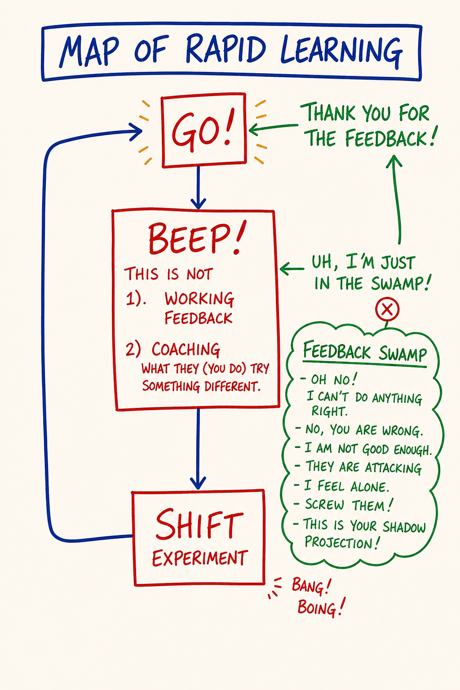

# Day 4 — Feedback · Coaching · Rapid Learning · Experiments

| | |
|---|---|
| **Intensity** | Low |
| **Time** | ~2 hours active across 2–3 days |
| **Partner check-in required before?** | No |
| **Source videos** | **None.** Day 4 has no numbered lecture video. This module is reconstructed from the live ETB January 2026 transcripts (Day 1 feedback exercise; Day 4 session), the Sparks corpus, and Clinton Callahan's *Conscious Feelings*. |
| **Maps (taught in this module)** | M25 Feedback and Coaching · M26 Rapid Learning — each also a standalone interactive tool in the [**Map Atlas**](../Map%20Atlas/index.html) |

---

## Purpose

To install the operating system that the rest of this course runs on.

You have a context (Day 1), you know thoughtware can be upgraded (Day 2), and you have an emerging map of liquid state and the five bodies (Day 3). What you do not yet have is the *loop* — the procedure by which a person on this path upgrades thoughtware in their ordinary life, without a trainer in the room.

The loop has four parts: **feedback, coaching, rapid learning, experiments.** Most people coming from school, work, or self-help carry distorted versions of all four. Day 4 strips those versions and installs the PM versions. Low intensity, but the distinctions land hard because they contradict things the learner has been told their whole life. If Day 1 was the red pill, Day 4 is the toolkit you need to actually use it on yourself, repeatedly, for the rest of your life.

---

## Core PM concepts

- **Feedback (PM-grade).** Information about *how a person was* when they did what they did — not what they said. Sourced from the witness. Given only to people who actually want change.
- **Coaching (PM-grade).** Offering possibilities the client could try in the future to create different results. Not solving the client's problem.
- **The three sources.** Feedback → **witness**. Criticism → **gremlin**. Advice → **rescuer**. Same sentence can be any of the three; the receiver can feel the difference.
- **Go! / Beep! / Shift! Go!** The canonical rapid-learning loop. **Go!** means an action that worked — continue. **Beep!** means an action that did not work as planned — that's design data, not a verdict on the actor. **Shift!** means change one specific thing. Then **Do-Over** — Go! again. Both Go! and Beep! are feedback; the loop dies when only Beep! is recorded.
- **Beep Swamp.** When Beep! collapses into "I am bad," the loop stops. The exit: say "thanks for the feedback," write the Beep! as design data in the Beep! Book, and return to the loop.
- **The Beep! Book.** A literal notebook. Engineering log, not journal. Beeps go in; Gos go in; Shifts go in. Design notes for your own thoughtware.
- **Rapid Learning.** Learning at the speed the universe is already giving you feedback; what happens when you stop the protective slowdowns.
- **Experiment.** Small, specific, time-bounded test of new thoughtware in real life. *What I will do / by when / what I will notice.* Reps compound.

---

## Learning outcomes

By the end of this module you will:

1. State the PM distinction between **feedback, criticism, and advice** — and tell which one you are giving (and receiving) in a specific moment.
2. State the PM distinction between **feedback and coaching** — past-oriented vs future-oriented — and use both forms with your partner.
3. Have given your partner one round of PM-grade feedback about their voice messages so far, on **presence, honesty, and body-state** — not on content.
4. Have run your **own Beep · Shift · Go** loop on one personal item between Day 3 and Day 4, and written the loop into a Beep! Book.
5. Have designed and started one structured **experiment** in the form *what I will do / by when / what I will notice.*

---

## Module flow

| Step | Time | What you do |
|---|---|---|
| 1 | 5 min | Read this header |
| 2 | 25 min | Read **Concept teaching notes** slowly |
| 3 | 5 min | Get a notebook. Write **Beep! Book** on the cover. This is your engineering log for the rest of the course. |
| 4 | 15 min | **Embodied practice (solo) — replay one moment.** |
| 5 | 25 min | **Partner exchange — feedback on voice messages so far.** Record + send. |
| 6 | — | Receive partner's feedback within 24 hours; record your reply back |
| 7 | 15 min | **Design your experiment** — write *what / by when / what I will notice* in the Beep! Book |
| 8 | 2–3 days | **Run the experiment** in ordinary life |
| 9 | 15 min | **Journal reflection prompts** in the Beep! Book |
| 10 | 1 min | Post one line to the cohort feed |

The whole module spreads across ~3 days. Reading + design is ~90 min. The exchange and the experiment take ordinary life-time.

---

## Concept teaching notes

### Feedback and coaching point in opposite directions in time

*▶ [Explore M25 as an interactive tool in the Map Atlas →](../Map%20Atlas/M25%20-%20Feedback%20and%20Coaching.html)*

Study the map before reading on. One page, split down the middle. Left half: **Feedback**. Right half: **Coaching**. Each half carries an **Old Map** — the distorted version you arrived with — and a **New Map**, the PM version, with the load-bearing sentence sitting in the center of each half. Feedback's center: *Feedback is about the PAST* — what happened, what worked, what did not. Coaching's center: *Coaching is about the FUTURE* — possibilities, experiments, "here's an option…", "what about…?" That single axis — past versus future — is the whole map. Everything else hangs off it.

The cut is **time, not tone.** You can deliver either move warmly or coldly; warmth is not what makes a sentence feedback or coaching. The *direction in time* is. Feedback faces backward — what already happened. Coaching faces forward — what could be tried next. Most people collapse the two into one blurred move, which is why so much "feedback" is actually disguised advice and so much "coaching" is actually disguised judgement. Hold the axis and the rest of the day follows.

### Feedback in PM is about *how you were*, not *what you said*

In school, at work, in most "feedback cultures," feedback is about content — *the slide is too busy, your argument has a gap.* PM has nothing against that; it just does not call it feedback. It calls it **content notes**.

PM feedback is about something else. From the Day 1 live training: *"No feedback on the content. This is feedback on how they say it. Were they radically honest? Did you really feel them? Were they mostly in their heads? Somewhere else? Not really present? Did their communication land in you as really honest? Or did they just stay at the surface?"*

That is the unit. Presence, body-state, honesty, location-of-self while speaking. *Were you there?* Five-body language: which body was the source, which were switched off. The learner already knows how to give content notes. The learner does not yet know how to register the location someone was speaking from and reflect it back.

### Feedback is given only to people who actually want change

PM is a **culture of transformation**. People inside it agreed to be in it — to be seen, registered, reflected back. Inside that container, feedback is precious; it is the only mirror you have. Outside it — your colleague who did not sign up, your parent who did not sign up — your PM-grade feedback is hostile no matter how skillfully delivered, because from inside their context it *is* an attack. The trainer: *"If you give feedback to them, you are forcing a confrontation with reality they did not consent to. The only way they have to protect themselves is to not talk to you anymore."*

The rule is operational. Inside this course, with your partner: feedback flows. With everyone else: ask first, and if the answer is no or unclear, do not give it.

### Feedback vs criticism vs advice — three different sources

Three sentences can look identical on the page and be doing three different things. Which one a sentence *is* depends on where, inside the speaker, it was sourced from.

| Form | Sourced from | What it wants |
|---|---|---|
| **Feedback** | The **witness** — the part that just observed | The other to have accurate information about themselves |
| **Criticism** | The **gremlin** — feeds on superiority and being right | The other to feel smaller, so the speaker can feel bigger |
| **Advice** | The **rescuer** — cannot tolerate someone else's discomfort | The speaker's own discomfort to stop, by fixing the other |

You can hear the difference in your body. Criticism contracts you. Advice bypasses you. Feedback lands cleanly — *true, useful, mine to do something with or not.* When the Day 1 learner said *"I'm scared of being inaccurate, I'm scared of the other person reacting"* — that fear was mostly gremlin and rescuer trying to grab the pen. The cure is not more courage; it is more presence with what you actually witnessed.

This is the **Old Map of feedback** the M25 map names on its left side: distance, judgement, right/wrong, a power move, manipulation — the other person treated as *under threat*, the room thick with anger and fear. The **New Map** is the clean version — accurate information about the past, sourced from the witness. Most people, most of the time, are running the Old Map while sincerely believing they are giving feedback. The footer of the map holds the whole thing together: real feedback comes from **care, clarity, and connection** — not from superiority, not from threat. If the move is sourced from the need to be right or bigger, it has already fallen off the map no matter how accurate the words are.

### Coaching is not solving the client's problem

Where feedback looks at what just happened, coaching looks at what could be tried. From Day 1: *"Feedback is what just happened. Coaching is what we'd like to see in the future. What could this person practice to create a different result?"*

PM coaching does not solve the client's problem. The job is to offer **possibilities** — small concrete experiments the client could run — and let the client pick. In the Day 4 live session, when one learner asked for *"possibilities to heal the buzzing in my ears,"* the coach answered with a flood of specifics: *go to the woods and squish your feet into mud. Sleep under the stars. Listen with your eyes closed. Ask the next child you see this question and write down what they say.* Nothing was "the answer." Each was a doorway.

A coach who tells you the answer has made themselves your authority and undone the work. A coach who hands you fifteen things to try has handed you back your own life. Almost every learner arriving here has been trained to coach by fixing. Day 4 is where you stop.

The right side of the M25 map names the **Old Map of coaching** the same way: advice from superiority — *I know better, you should do this, you should do that* — hidden agenda, no real connection. The **New Map** is the offer: *here's an option, what about…?, here's something to experiment with* — and then the choice handed back. The test is simple: does the move hand the choice back to them, or take it away? If it takes the choice away, it is old-map coaching, no matter how kindly phrased.

**Knowing which move to make** is the other half of the map. Reach for **feedback** when there is agreement on goals, the person is asking, and you care enough to be honest — the same gate as before, now stated as a positive. Reach for **coaching** when you are exploring options, creating new possibility, or encouraging growth. Two questions sort almost everything before you open your mouth: *Am I pointing at the past or the future?* and *Where in me is this coming from — witness, gremlin, or rescuer?*

**Common misunderstandings about feedback and coaching.**

- *"Feedback and coaching are basically the same — different words for helping someone improve."* They point in opposite directions in time. Feedback reports the past; coaching opens the future. Collapsing them is the single most common error on this map, and it is why so much "feedback" is disguised advice and so much "coaching" is disguised judgement.
- *"Good feedback includes my advice on what they should do about it."* That is coaching smuggled inside feedback — usually old-map coaching, sourced from *I know better.* Feedback reports the past cleanly and stops. Options for the future are a separate move, offered only if they are asking. Welding your *should* onto your observation contaminates both.
- *"I should give everyone honest feedback, because honesty is good."* The gate has three conditions and all must be present: agreement on goals, the person is asking, you care enough to be honest. Unrequested feedback to someone who did not ask is not courage — it is an old-map power move, and the only protection the other person has is to stop talking to you.
- *"A good coach figures out the client's problem and tells them the solution."* PM coaching does not solve the client's problem. It offers possibilities and hands the choice back. The instant you deliver *the answer*, you install yourself as their authority and undo the work.
- *"If I source the words carefully, feedback vs. criticism vs. advice is just semantics."* It is not the words; it is where inside you they came from. Witness → feedback (lands clean). Gremlin → criticism (contracts). Rescuer → advice (bypasses). The same sentence is a different act depending on its source, and the receiver registers which one in their body before they can name it.

### Beep · Shift · Go — the rapid-learning loop

*▶ [Explore M26 as an interactive tool in the Map Atlas →](../Map%20Atlas/M26%20-%20Rapid%20Learning.html)*

Study the map before reading on. It is a loop, not a line and not a ladder — three stations on a wheel that keeps turning. **GO!** at the top: you act, you try the thing. → **BEEP!**: something did not work as planned. → **SHIFT!**: you change one specific thing and run it again. → arrow back up to **GO!** That last arrow is a **do-over**, and the do-over is the whole point. You were never meant to get it right on the first turn. You were meant to keep the wheel turning, because reps install thoughtware and insight does not.

PM's name for the loop that upgrades thoughtware:

> **Go.** You act. You try the thing.
> **Beep!** Something does not work. The Beep is *information*, not verdict — a precise design specification for what to change.
> **Shift.** Change one specific thing — not your whole self.
> **Go.** Try again.

Both **Go!** and **Beep!** are feedback, and the wheel needs both. Go! is an action that worked — continue. Beep! is an action that did not work as planned. A learner who only records Beeps (or only Gos) has broken the instrument. A run of Beeps is not a losing streak — it means the universe is handing you design data fast, which is the loop working at speed, not against you. The map captions the **BEEP!** box directly: *This is NOT a failure.* That box does the load-bearing work of the whole map.

Three common ways learners break the loop:

1. **Not Go-ing.** Sitting in your head considering whether the thing might work is not Go. The actual conversation, the actual message, the actual rep is Go.
2. **Treating the Beep as a verdict.** *I tried, it failed, therefore I am bad at this* is the gremlin reading the Beep for you. The Beep does not say *you are bad*. It says *that specific thing did not produce that specific result.*
3. **Shifting vaguely.** *I'll be better next time* is not a Shift. *Next time I will say the same sentence with my feet on the floor and my eyes on hers* is a Shift.

#### The Beep Swamp — the failure mode

The map draws the failure mode explicitly: off **BEEP!** there is a trap-door — *"Uh, I'm just in the swamp!"* — dropping into a red cloud, the **Feedback Swamp**, captioned with everything the swamp tells you: *Oh no · I can't do anything right · No, you are wrong · I am not good enough · they are attacking me · I feel alone.* Around the edges, the noise of the wheel jamming: *Bang! Boing!* When the Beep! lands and instead of *that didn't work, here's the Shift* you hear that red-cloud chorus, you have fallen into the swamp. You are no longer learning; you are drowning in self-verdict.

The swamp is not a feeling to push through — it is a *location* you fell into, and there is a one-sentence exit: **"Thank you for the feedback."** Said out loud or under your breath. It is not politeness; it is the move that turns a verdict back into data. Then open the **Beep! Book** — the literal notebook, an *engineering log, not a journal* — write the Beep! as flat design data, name one Shift!, and step back onto the wheel. Beeps go in, Gos go in, Shifts go in: design notes for your own thoughtware, not a place to process your feelings about failing.

**Common misunderstandings about Rapid Learning.**

- *"A Beep! means I failed — I did something wrong."* A Beep! is design data: an approach did not produce the result you wanted. It says nothing about your worth. Collapsing it into *"I'm bad"* is not honesty about failure — it *is* the Beep Swamp. The map literally captions the box *This is NOT a failure.*
- *"If I get a Beep!, I should feel bad, apologize, or explain myself."* The clean response is *"Thank you for the feedback,"* then Shift!. Feeling bad does not convert the data; it jams the wheel. Write the Beep!, name the Shift!, Go! again.
- *"Go! is the win and Beep! is the loss — I want more Gos and fewer Beeps."* Both are feedback; the wheel needs both. A learner who only counts Gos is keeping score, not running experiments.
- *"I'll Shift! by being more present / trying harder / doing better next time."* That is a New Year's resolution, not a Shift!. A Shift! is one specific, observable change to a single variable — *feet flat, eyes up, the same sentence.* Vague Shifts produce vague Beeps and the wheel spins without traction.

### Rapid learning and experiments

*Rapid learning* is not learning faster than is natural — it is what happens when you stop the things you do to *prevent* learning. Defending against Beeps. Dressing up Shifts as identity crises. Refusing to Go because Go is uncomfortable. From the Sparks: *"The Universe is a gigantic Feedback generator. One of the most powerful ways to avoid Learning is to hide from the world."*

Beep · Shift · Go is the **fast inner loop** — seconds to minutes, the move you make inside a single conversation. It is one half of a pair. The **slow outer loop** is the [Learning Spiral](../Map%20Notes/M19%20-%20Learning%20Spiral.md) (M19) — the same distinction returning on a deeper lap over weeks, months, years. You run a thousand fast loops inside one turn of the spiral. Day 4 installs the fast loop; Day 9 installs the slow one. Confusing them makes you expect a single Shift! to do the work that only the spiral does over time. The thing the loop upgrades is [thoughtware](../Map%20Notes/M02%20-%20Map%20of%20Thoughtware.md) (M02, Day 2).

PM distinguishes three states relative to any piece of thoughtware: *I read about it* (cognitive only — worth roughly nothing on its own), *I tried it* (you ran an experiment, got a Beep or a Go), *it changed how I am* (reps have compounded; the thoughtware now runs when you are not looking — what the course is for). Most learners spend years parked at *I read about it.* Day 4 pushes you to *I tried it* every week, on something specific.

An **experiment** is the operational unit — a thing with structure:

> *What I will do.* One specific behavior, in a real situation. Not "be more present" — *"Sunday's call with my father, when he starts on politics, I say one sentence: 'Dad, I'm not in this conversation today,' then change the subject."*
> *By when.* A specific window — *"Sunday 6–7 pm."*
> *What I will notice.* The data — *"what happened in my body; what he said back; whether I went numb afterwards."*

One rep. Reps compound. Thirty in a row change how you are with your father, even when any single rep looks like a failure. Insight does not install thoughtware. Reps do. The between-module experiments this course has been asking you to run since Day 1 are themselves running examples of this principle.

---

## Embodied practice (solo) — Replay one moment

A feedback practice with one person in the room: you. ~15 minutes. Sit on a chair, feet flat, hands on thighs (neutral PM posture). Beep! Book and pen.

> **Script.**
>
> Pick **one specific moment from the past week.** Not a whole day. Not "things at work." One moment, five minutes long at most. You can see the room; you remember who was there.
>
> Close your eyes. Replay it slowly, one breath per beat. Then ask, in order, writing each answer in one short sentence. *Do not explain. Do not justify. Register.*
>
> **1. Which body was I in?** Intellectual / emotional / physical / energetic / archetypal. Which was the source? Which were switched off?
> **2. Was I present?** Yes or no. If no — where was I? Past, future, performing, hiding, planning my next sentence, watching myself from outside?
> **3. Was I radically honest?** With myself first. If no — what did I leave out, soften, or dress up?
> **4. Whose voice was speaking inside me?** Box, gremlin, rescuer, witness, being. If you can't tell yet, write *don't know*.
> **5. What was the Beep?** *"I went numb halfway through."* *"I said yes when my body said no."*
> **6. What is the Shift?** One specific thing. *"Next time, before I open my mouth, both feet on the floor; check which body I'm in."*
>
> Open your eyes. Close the Beep! Book.

You just gave yourself PM-grade feedback. If what came out was *I was so stupid, I always do this, I am the worst* — that was the gremlin grabbing the pen. Ground (Safety Framework Section D), then run the script again with the witness in the chair.

> **Variation A — the do-over out loud (≤12 min).** If you want to drill the swamp exit in your body, run one full turn of the wheel *aloud*. Take one thing you attempted recently that did not work — one specific attempt, not a bad week. (1) Name the **Go!** flat: *"I tried to tell my partner I was overwhelmed during dinner."* (2) Name the **Beep!** as an engineer reads an instrument, no self-judgment: *"It came out as an attack and they got defensive. Beep."* If what comes out is *"I always do this, I ruin everything,"* stop — that is the sound of the swamp; ground and run this station again with the witness in the chair. (3) Say **"Thank you for the feedback"** out loud, and notice what changes in your chest. (4) Name one **Shift!** — one specific variable: *"Next time I say it before dinner, sitting down, starting with 'I need thirty seconds.'"* Write all four lines in the Beep! Book. Then say both versions of the same moment out loud — first *"I failed,"* then *"Beep. Here's the Shift."* — and feel the difference where it actually lives: the first drops you toward the swamp (heavier, smaller, alone); the second keeps you on the wheel (lighter, specific, still moving). That bodily difference *is* the distinction.

> **Variation B — write it both ways (10–15 min).** To drill the feedback/coaching axis directly, take one thing a person actually did in the last week — one specific action you have an opinion about — and write it two ways. First, write it as clean **Feedback (about the PAST)**: two or three sentences staying strictly behind the line of what already happened — what worked, what did not, no *should*, no *next time*. If a sentence points at the future, cross it out and move it down. Read it back and feel which part of you wrote it; if it sounds superior, the gremlin grabbed the pen — ground and rewrite from the witness. Then write it as clean **Coaching (about the FUTURE)**: one possibility and one experiment, framed as the map frames them — *here's an option…*, *what about…?* Offer, do not prescribe; rewrite every *you should* as *one thing you could try is.* Read both aloud and feel how different they are — one closes a past, one opens a future. Then the real data: which one did you reach for first? *I default to feedback that is secretly advice / coaching that is secretly judgement / both collapsed into one blurred move.* The one you default to is data about your Box.

---

## Partner exchange (async) — Feedback on the voice messages so far

The first round of PM-grade feedback in this course. You and your partner have a small corpus of voice messages by now. Today you give each other feedback on *how the other has been* in those messages.

**Ground rules.**

- **Feedback only. Not advice. Not coaching. Not content notes.** Not the topics they raised — *how they were* while raising them.
- **Five-body language.** Which body they were in, whether they were present, whether they were radically honest. Avoid corporate vocabulary (*clear, articulate, well-organized*). Use *grounded, present, in your body, in your head, hiding, performing.*
- **Specific, not global.** Not *"you were guarded."* Try *"In your second message, when you talked about your father, I heard your intellectual body running the show — you knew the right words about sadness but I did not feel the sadness."*
- **Ask consent first.** At the top of your recording: *"Are you open to PM-grade feedback right now? If not, just send back 'not today.'"*

**Prompt to record (4–8 minutes).** After the consent check:

1. **One thing that worked.** *"In your Day 3 message, when you talked about the grounding cord, I felt you in your body. That landed as real."*
2. **One thing that was off, in five-body terms.** *"In your Day 1 message, I heard your performing voice — the one that sounds credible. I did not feel you."*
3. **One question** — open, not advice. *"What would change in your next message if you sent it from your body and not your head?"*

**Receiving.** Listen all the way through before reacting. If your gremlin starts producing rebuttals before they finish, that is data. Sit with it for at least an hour before replying.

When you record your reply: (1) *What I heard you say* — paraphrase in one sentence. (2) *What landed* — what was true. (3) *What I will do with it* — one specific experiment you will run before Day 5. *"I'll record my Day 5 message standing up, feet on the floor, and say one true sentence even if I don't know how to dress it up first."*

No defending. No "yeah but…" If a piece feels off, just note it: *"I'm not sure that one landed yet, I'll sit with it."* You do not have to accept feedback that does not fit. You also do not have to argue with it. If your partner does not consent to receiving feedback today, wait.

---

## Between-module experiment

Run **one** experiment with full structure before Day 5. Write it on a fresh Beep! Book page in this exact format.

> **Experiment #1**
> *What I will do:* (one specific behavior, in a real situation)
> *By when:* (specific window — date and time, not "this week")
> *What I will notice:* (the data you will write down afterwards)

The topic is your choice. Suggestions:

1. **The one-sentence experiment.** Pick one conversation this week that would normally go a particular way. Plan one sentence — true, short, sourced from your body. Say it. Notice what happened in your body, in the other person, in the room.
2. **The Beep capture experiment.** For three days, each time something does not work the way you expected, write the Beep within ten minutes. *What you did, what happened, what the Beep was, what the Shift would be.* Do not yet act on the Shifts; capture. By Day 5: 6–20 Beeps in the book.
3. **The feedback-asked experiment.** Ask one person *in* a transformational context with you (your partner, a PM-aware friend, a coach) for PM-grade feedback on one specific thing about how you are. Script: *"I'm running an experiment. I want PM-grade feedback on one thing — \[name it\]. What did you actually witness?"* Receive without rebuttal. Write what they said.

After running it, write 3 sentences: *what I did, what happened, what the next experiment is.* You will use this in the reflection prompts and in your Day 5 partner exchange.

---

## Reflection prompts

Write longhand in the Beep! Book if you can.

1. Which of the three sources — witness, gremlin, rescuer — most often takes the chair when I give someone "feedback"? How can I tell, in my body, while it is happening?
2. Which is most often speaking inside my head about *myself*? If it is the gremlin or rescuer, what I am calling self-feedback is not feedback. What would the witness be saying instead?
3. From the *replay* practice — was I in fact present in that moment, or somewhere else? If somewhere else, *where*?
4. When my partner gave me feedback, what part of me wanted to defend, explain, or counter-feedback them? What did that part want to protect? (That is the Box, doing its job.)
5. The experiment I ran — what was the Beep? What is the Shift? When and on what will experiment #2 run?
6. Where in my life am I parked at *I read about it*? What would *I tried it* look like for that specific item, this week?

---

## Safety callouts for this module

Day 4 is Low intensity. The risk is not destabilization — it is the opposite: that the module lands as *concepts I now know about* rather than as a loop the learner actually runs. Two notes:

- **PM-grade feedback can feel sharper than expected the first time**, especially if you are used to corporate "positive feedback sandwich" culture. If your partner's feedback contracts you — pause, ground (Safety Framework Section D), notice which part of you contracted. If you are still contracted 24 hours later, voice-message your partner one clarifying question. Do not re-litigate it in your head alone for a week; that is the gremlin running with it.
- **Giving feedback can surface old material** about times you were given criticism dressed up as feedback — school, parents, hierarchies that used "I'm telling you this for your own good" as a vehicle for shame. If that surfaces while recording, stop and ground. Reach out to your partner or the CM if needed. The course is not asking you to push through that material; it is asking you to notice it is there.

The universal grounding script (top of `03 - Safety and Facilitation Framework.md`) applies. This course is not therapy. If old material around criticism is bigger than this module is built to hold, use the referral list.

---

## Cohort feed post (suggested)

One line each, no more:

- The Beep I captured this week: …
- The Shift I'm trying: …
- (Optional) one question for the group: …

---

## Glossary additions

- **Feedback (PM)** — information about *how a person was* (presence, body-state, honesty, location-of-self); sourced from the witness; given inside a consenting transformational container
- **Criticism** — sentence shaped like feedback but sourced from the gremlin; wants the other smaller
- **Advice** — sentence shaped like feedback but sourced from the rescuer; wants the speaker's discomfort to stop by fixing the other
- **Coaching (PM)** — future-oriented offer of possibilities the client could try; does not solve their problem
- **Witness** — inner location feedback is sourced from; the part that observed without verdict
- **Beep!** — information that something did not work; design specification for the next Shift, not a verdict on the person
- **Shift** — one specific change between two Goes; not an identity overhaul
- **Go** — actually doing the thing; the part of the loop most often skipped
- **Beep · Shift · Go** — the rapid-learning loop
- **Beep! Book** — the literal notebook you write Beeps, experiments and noticings in
- **Rapid learning** — learning at the speed the universe is already giving you feedback
- **Experiment** — small, specific, time-bounded test of new thoughtware; *what / by when / what I will notice*; the operational unit of PM practice

---

🄯 **World Copyleft 2026** · *Expand the Box (Digital)* · licensed **[CC BY-SA 4.0](https://creativecommons.org/licenses/by-sa/4.0/)** · re-presents Possibility Management thoughtware originated by Clinton Callahan & the Possibility Management community · please share, share-alike · Powered by Possibility Management ([possibilitymanagement.org](https://possibilitymanagement.org)) · full terms: `LICENSE.md` in the course root
