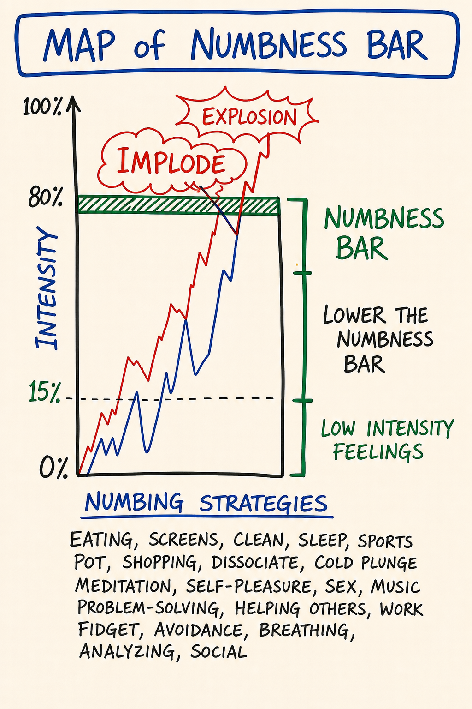

# Day 5 — Feelings vs Emotions · Old Map of Feelings · Numbness Bar

| | |
|---|---|
| **Intensity** | **HIGH** |
| **Time** | ~3 hours active across 3–4 days |
| **Partner check-in required before?** | **YES — required, no override.** See unlock checklist in `04 - Container and Gatekeeping Protocol.md` Section D. |
| **Source videos** | `12 - Old Map of Feelings_EN.mp4` · `13 - Map of Numbness Bar_EN.mp4` · `14 - New Map of Feelings_EN.mp4` |
| **Maps (taught in this module)** | M08 Old Map of Feelings · M09 Numbness Bar · M10 New Map of Feelings — each also a standalone interactive tool in the [**Map Atlas**](../Map%20Atlas/index.html) |

> **Grounding (60 seconds).** Top of `03 - Safety and Facilitation Framework.md` Section D. Read it now. You will use it inside this module.

---

## Consent check (read before continuing)

> This module engages **the emotional body directly**. Material that has been managed by avoidance — anger you were not allowed to feel, sadness you cut off, fear you learned to call something else, joy you suppressed — may surface.
>
> Before continuing, confirm to yourself:
> - My partner is reachable today and tomorrow.
> - I have at least 90 uninterrupted minutes ahead of me.
> - I am not in acute crisis or under the influence right now.
> - I know how to ground.
> - I know how to reach the CM if I need to.
>
> If any of the above is not true, pause this module and come back when it is. If all are true and you choose to continue, take a slow breath and begin.

> **Readiness check (10 seconds).** Can you find your center, drop a grounding cord, and set a bubble on demand (Day 3)? This module asks you to stay present *while feelings move* — that takes the equipment. If you can't yet, that's not failure: re-read [M07](../Map%20Notes/M07%20-%20Center%2C%20Grounding%20Cord%2C%20Bubble%2C%20Golden%20Cube.md) and do its practice first. (Full self-check: `Facilitator Resources/Learning Self-Assessment.md`.)

> **If your partner has gone quiet.** This module is partner-gated for a reason — you should not do it alone. But a silent partner must never strand you. If your partner hasn't responded and you want to proceed, **message your CM**: there is a real fallback — a witness partner, or a CM-held exchange — so you are accompanied. Don't do the High-intensity practice with no one on the other end, and don't let a non-responsive pairing stall you indefinitely. The fallback is yours to ask for.

---

## Purpose

To install the three distinctions the rest of the emotional-body work depends on: **feeling vs. emotion**, the **Old Map** you arrived with, and the **Numbness Bar** you have been operating above.

Day 5 is not the day you heal anything — Day 6 is. Day 5 is the day you build the map you will be healing with. Without these distinctions, Day 6 looks like generic catharsis. With them, it looks like surgery — you know which tissue is feeling, which is emotion, which is story, and what each one is for.

This module relies on the five-bodies work from Day 3. You will need to find your emotional body as distinct from your intellectual body. If that distinction is not yet living for you, pause and re-read M07 before continuing.

---

## Core PM concepts

- **Feeling** — a present-time archetypal energy in the emotional body. One of **four**: anger, sadness, fear, joy. Clean, time-limited (3–5 minutes), informational, takes responsible action.
- **Emotion** — a past-time, mixed, story-laden state. A feeling that did not move when it arose, got stored, and is now running on autopilot. Lasts longer than 5 minutes. Repeats rather than acts.
- **The Old Map of Feelings** — patriarchal-paradigm thoughtware: feelings sorted into "good" and "bad," three of four forbidden, maintained through numbness.
- **Numbness Bar** — threshold below which feelings do not register. Installed in childhood as protection. Lowers with practice.
- **The four feelings as archetypal energies** — anger, sadness, fear, joy as forces, not problems. Each has a body location, a purpose, and a shadow form when stored.
- **Conscious feelings work** — feeling on purpose, at chosen intensity, for chosen duration, in service of what you actually care about.

---

## Learning outcomes

By the end of this module you will:

1. State, in your own words, the difference between **feeling** and **emotion** — and apply the **5-minute test** to your own experience.
2. Name each of the **four feelings** by its archetypal purpose, body location, asked-for action, and common shadow form.
3. Have located, in your own history, three specific items on **your Old Map of Feelings**.
4. Have experienced lowering your **Numbness Bar** at least one notch — registering a feeling at low intensity (≤20%) you would normally not have noticed.
5. Have completed a partner exchange in which you spoke a feeling rather than a story about a feeling.

---

## Module flow

| Step | Time | What you do |
|---|---|---|
| 1 | 10 min | Read the header and consent check. Confirm partner is reachable. |
| 2 | 12 min | Watch `12 - Old Map of Feelings_EN.mp4` |
| 3 | 10 min | Watch `13 - Map of Numbness Bar_EN.mp4` |
| 4 | 15 min | Watch `14 - New Map of Feelings_EN.mp4` |
| 5 | 35 min | Read **Concept teaching notes**, slowly — study each map image where it sits, and do the two micro-practices inline |
| 6 | 25 min | **Low-Intensity Feelings practice** (solo, embodied) |
| 7 | 20 min | **Partner voice exchange** (record + send) |
| 8 | — | Receive partner reply within 24 hours; record your reply |
| 9 | 2 days | Run the **between-module experiment** |
| 10 | 20 min | Journal the **reflection prompts** |
| 11 | 1 min | Post one line to the cohort feed |

Spread the module across 3–4 days. The emotional body needs time to digest material between sessions.

---

## Concept teaching notes

### Feeling vs emotion

Most of the popular world uses *feeling* and *emotion* interchangeably. PM does not.

A **feeling** is a present-time experience in the emotional body. It arises because of something happening *right now*. It is one of four: anger, sadness, fear, joy. It is short — three to five minutes at full intensity, then it passes. It is **informational** — it tells you what you care about and what to do next. It is **clean** — no story, no interpretation, no "because you always…"

An **emotion** is a past-time experience. A feeling that arose at some earlier point — a year ago, twenty years ago, in childhood — and was not allowed to move. It got stored. It is now running on autopilot, often triggered by something in the present that resembles the past. Emotions last *longer* than five minutes. They mix together. They come with a story. They do not take responsible action — they repeat.

> The clearest field test: **how long has this been going on?** If five minutes later you are still in it, you are in an emotion. The feeling, if there ever was one underneath, has been replaced by the emotional loop on top.

Both are real. Both are useful. They have **different purposes**. A **feeling** brings the information of your values into your consciousness and gives you fuel to create what you care about. Anger says *make a boundary*. Sadness says *let this go*. Fear says *prepare*. Joy says *more of this*. An **emotion** brings the information of your survival-thoughtware into your consciousness and gives you fuel to **heal** — through the emotional healing process (Day 6). An emotion is an open wound waiting for the right conditions to close.

Confusing the two is the single most common error. The learner feels an emotion of anger toward their partner, mistakes it for a present-time feeling, "expresses" it as if it were information about the partner — and creates damage. The anger had nothing to do with the partner. It was about the third-grade teacher. The partner was the trigger, not the source.

This is not subtle. It is the difference between a useful tool and a recurring blast radius.

### The Old Map of Feelings

*▶ [Explore M08 as an interactive tool in the Map Atlas →](../Map%20Atlas/M08%20-%20Old%20Map%20of%20Feelings.html)*

Study the map before reading on. Notice its shape: two columns, a good one and a bad one, with three of the four feelings dropped into "bad" and the fourth held under suspicion. That sort — not the contents — is the whole error.

You arrived at this course with a map of feelings. You did not choose it. It was installed in childhood by the culture, the family, the schoolyard, the workplace. It is patriarchal-paradigm thoughtware — built for control, maintained through numbness.

The Old Map sorts feelings into **good** and **bad**:

| Feeling | Old Map verdict | Old Map rule |
|---|---|---|
| **Anger** | BAD — dangerous, "out of control." Especially forbidden for women and "nice" people. | Swallow it. Or redirect to a safer target. Never at the actual source. |
| **Sadness** | BAD — weakness, self-pity, "bringing everyone down." | Get over it. Don't cry in public. Don't cry at work. |
| **Fear** | BAD — cowardice, "you're being dramatic." | Hide it. Pretend confidence. Push through. |
| **Joy** | SUSPECT — self-indulgent, "what's wrong, you're too happy." | Tone it down. Don't make others jealous. |

The Old Map has **no good feelings**, only a thin permitted band of muted positive states ("fine," "good," "not too bad"). Three of the four are forbidden outright; the fourth is conditionally allowed and routinely diluted.

The sort is **gendered and cultural**. Which feeling sits in which column shifts with where you were raised and who you were raised to be. Across most patriarchal cultures, anger is suppressed hardest in women and in people trained to be "nice"; sadness and fear are suppressed hardest in men. The specifics vary by culture. The structure does not.

What happens to a feeling the Old Map forbids? It does not disappear. It gets **stored** — becomes an emotion — and shows up later, in distorted form, at the wrong place, the wrong intensity, toward the wrong person. The costs are predictable: stored emotion, mixed-emotion soup, recurring "for no reason" outbursts, drama (because feelings that cannot flow directly find indirect routes), and chronic low-grade depression dressed up as "stress."

The Old Map keeps people functional inside patriarchal cultures. It also makes them **numb**. The numbness is not a side effect — it is the load-bearing mechanism. The map only works if the person stops noticing what they actually feel. (That mechanism has a name and a shape — the **Numbness Bar** — and it is the next thing this module installs.) Put differently: the Old Map is appropriate technology for the wrong destination. It is functional in patriarchal culture and cannot run an archiarchal one — a culture organized around bright principles, distributed authority, and conscious relating. This is not a moral verdict on the map. It is a statement about what it was built to do.

You are not here to fight your Old Map. You are here to **see** it — to identify the specific rules you carry — so it stops running you in the background. Naming the rule is most of the work.

**Common misunderstandings about the Old Map.**

- *"The Old Map is bad and I need to get rid of it."* No. It is functional thoughtware for a particular culture. Fighting it just installs another version of it — the same good/bad sort, now with "fighting my map" in the good column. The move is to **see** it and name its rules, then stop running them silently.
- *"My family was healthy — we didn't have Old Map rules."* Every learner arrived with an Old Map. If you cannot find your rules, your Numbness Bar is set high enough that they are running below your registration. Look smaller. Ask which feeling you literally cannot find when you go looking for it.
- *"The Old Map is a Western / modern / capitalist thing."* Versions of it run in nearly every patriarchal culture on the planet. The contents differ; the structure is the same.
- *"Once I see my Old Map, I'm done with it."* Seeing the map is the start, not the finish. The emotions it already stored are still in your emotional body — those get released later, through the emotional healing process (Day 6), not by insight today.

### The Numbness Bar

*▶ [Explore M09 as an interactive tool in the Map Atlas →](../Map%20Atlas/M09%20-%20Numbness%20Bar.html)*

Study the map: a single horizontal line drawn across the emotional body. Everything above it, you feel. Everything below it is still happening — you just don't perceive it. Hold that image while you read.

Picture a horizontal line in your emotional body. Above the line, feelings register. Below the line, feelings still happen, but you do not perceive them. That line is your **Numbness Bar**.

It was installed early, often before age six. It was protective: as a child you encountered feelings that were too big, that no one helped you process, that put you in danger if you expressed them. The Numbness Bar cut them off so you could keep functioning. This was intelligent. It was survival.

It is also obsolete. You are no longer six. The bar that protected you then is now the reason you cannot register the warning anger when a colleague crosses a line, cannot feel the sadness that would let you grieve a finished relationship, cannot detect the fear that would tell you not to take the meeting, cannot access the joy that would tell you you have found your work.

Most adults live with the bar at **70–90% numb** — they experience 10–30% of their emotional body's signal and call that their full range. When the course says "lower the numbness bar," learners often hear "feel everything at maximum intensity" and brace. The opposite happens: learners discover that **full intensity is far less than they feared**, because they have been operating on so little signal they assumed "full" must be overwhelming.

One thing the map flattens that matters in practice: **the bar is local, not global.** You do not have one Numbness Bar — you have four, one per feeling. You can feel anger fully and be numb to joy. You can be wide open in fear and shut down in sadness. So "am I numb?" is the wrong question. The right question is *which feeling can I find right now, and which one can't I?* Read each feeling separately.

And the bar is not a fixed setting you adjust once. It **moves with conditions** — stress, exhaustion, the Box feeling threatened all raise it temporarily. The work is not "lower it once and you're done." It is "keep noticing where the line sits today."

The bar drops over time. Not in one practice. Not in one module. Through repeated, **low-intensity** work — feeling 5%, then 10%, then 20% of a feeling on purpose, with consent, in a held container. Each rep lowers the bar a notch. (There are two tools for two layers here: solo low-intensity practice, like this module's, lowers the bar for everyday real-time signal; the emotional healing process in Day 6 goes after the *stored* material the bar has been holding down. Different layers, different tools.)

The Numbness Bar is the reason this module's practice starts at **low intensity**. You are not here to crack open. You are here to register a signal you have not been receiving.

> **Micro-practice — the Per-Feeling Bar Reading (3 minutes).** Do this now, before reading on. Center, ground, drop a bubble. For each of the four feelings — anger, sadness, fear, joy — ask out loud: *"Right now, in my emotional body, how much of this feeling am I registering, 0 to 10?"* Say the number. Don't justify it; the first reading is the reading. Then for each one ask: *"If the bar were one notch lower, what would I be feeling?"* — and stay 20 seconds. The answer is usually a sensation, not a sentence — a flicker of heat, a small tightness, an almost-imperceptible buzz. *Almost* nothing is data. Finish with one line: *"Today my anger bar is low, my fear bar is medium, my sadness and joy bars are high"* — your own pattern. That sentence is your bar reading for today. Tomorrow's will be different. You are not fixing anything; you are learning where the line sits.

**Common misunderstandings about the Numbness Bar.**

- *"If I don't feel anything, the feeling isn't there."* Below the bar the feeling is present and unregistered — still operating in your system, still using your energy, still surfacing later as a mixed emotion. The bar is a perceptual cutoff, not a vacuum.
- *"I should feel everything at full intensity to lower the bar fast."* High-intensity flooding usually triggers the Box to reinstall the bar harder. The lever is the 2%, not the 100%.
- *"I'm just not an emotional person."* "Not emotional" is almost always a high Numbness Bar. You have the same emotional body anyone has — you have been operating above the bar so long it feels like baseline. The bar lowers; the baseline shifts.
- *"Lowering the bar means I'll be a wreck and unable to function."* The opposite. More signal reaching you in real time means better choices. Functionality usually improves once stored emotions stop running you from underneath.

### The new map — the four feelings as they actually are

*▶ [Explore M10 as an interactive tool in the Map Atlas →](../Map%20Atlas/M10%20-%20New%20Map%20of%20Feelings.html)*

Study the map before reading on — four feelings, each with a body location, a purpose, an asked-for action, and a shadow form it takes when stored. No good column. No bad column. Just four tools and what each one is for. The table below is the same map in words; read the image and the table together.

PM treats the four feelings as **archetypal energies** — forces with characteristic shape, body location, purpose, and a recognizable shadow form when stored rather than moved.

| Feeling | Body location | Purpose / energy is for | Asked-for action | Shadow form (stored as emotion) |
|---|---|---|---|---|
| **Anger** | Bones · big muscles of legs, arms, jaw · hands | Make boundaries · change what is not life · clarify what matters · start and stop things — *without blame* | Say no. Stand. Push back. Make the cut. Decide. | Rage · resentment · bitterness · passive aggression · collapsed compliance · violence |
| **Sadness** | Heart · throat · soft tissue of the face · eyes | Release · honor what is gone · open the heart · receive care | Cry. Slow down. Let go. Be held. | Depression · self-pity · chronic grief · emotional shutdown · martyr stance |
| **Fear** | Nervous system · skin · the small nerves · belly | Bring presence · prepare · avoid actual danger · catalyze precision | Slow down. Sense. Check the ground. *Move away only if the signal says move.* | Anxiety · paranoia · panic · avoidance · hyper-vigilance · freeze |
| **Joy** | Energetic body · whole organism · the eyes | Connect · appreciate · celebrate · expand · invite others in | Speak it. Move toward it. Share it. | Mania · forced positivity · spiritual bypass · addictive pleasure · numb pleasantness |

Four notes on the new map:

- **There are four. Not five. Not eight.** "Love" is not a feeling — it is an archetypal force of nature, much larger than the emotional body. "Frustration," "overwhelm," "stress," "burnout" are not feelings — they are stories about mixed emotions. The discipline of the four is what makes the work clean. Resist the pull to add to the list.
- **None of the four is good or bad.** Each is a tool. The shadow form is what happens when the tool was not allowed to do its job in real time, so it stuck. Even the shadow forms are not "bad" — they are signals that emotional healing process work is waiting.
- **Sensation, not story.** When you locate a feeling, locate the **sensation** — *heat in the chest, tightness in the jaw, buzzing in the hands, weight behind the eyes.* The sensation is the feeling. The thought about it is the story. The course will keep asking you to drop from the second to the first.
- **The feeling tells you what you care about.** If you feel anger, something you value is being violated. If sadness, something you valued is gone. If fear, something you value is at risk. If joy, something you value is alive and present. The feeling is information about you, not about the trigger.

**Common misunderstandings about the new map.**

- *"The body locations are metaphorical."* They are literal. Anger lives in bones and big muscles. Sadness in heart and throat. Fear in the nervous system and belly. When you go looking for a feeling, look for the sensation in *those specific places*. The location is anatomy, not poetry.
- *"Frustration is a feeling."* Frustration is a story about a mixed emotion — usually some anger plus a story about helplessness. Restate it as its components: *"I have some anger and some sadness."* Same for "overwhelm," "stress," "burnout."
- *"If I feel two things at once, one of them must be wrong."* Multiple feelings often arrive together. That is normal. When they tangle, store, and attach to a memory and a story, that is a *mixed emotion* — and it gets processed in Day 6, not untangled by force today.
- *"Shadow forms are pathologies I need to fix."* A shadow form is a signal that the feeling underneath got stored. You do not fix the shadow form. You release the stored feeling — through the emotional healing process (Day 6) — and its energy returns.

### Low-intensity feelings

Learners assume feelings only count when they are big. *Real* anger is rage. *Real* sadness is sobbing. This is the Old Map talking.

In the new map, **low-intensity feelings are the most useful kind** — because they arrive in real time, give you information, and let you respond before the situation has compounded into emotion. A 5% anger noticed in the moment a colleague crosses a line lets you say *"that one I want to come back to."* A 70% anger noticed three weeks later, in your kitchen, at your partner who was not there, is an emotional healing process waiting to happen.

The course works the low end on purpose. Here, the rep is: notice the 5%. Lower the bar.

---

## Embodied practice (solo) — Low-Intensity Feelings

A single concrete practice. ~25 minutes. Done alone, in a room you will not be interrupted in. You will need: a chair, water, a notebook, and a small object from your surroundings (a mug, a book, a photo, a piece of clothing — anything within arm's reach).

Read the script through once before you do it.

> **Script.**
>
> Sit. Both feet on the floor. Center, ground, drop a bubble (Day 3 practice — if it has fallen out of your body, re-read M05 first).
>
> Pick up the object. Hold it. Look at it.
>
> Ask yourself, out loud: *"Right now, in my emotional body, with this object — am I feeling some anger, some sadness, some fear, some joy?"*
>
> Do not look for big feelings. Look for low-intensity ones. 2%. 5%. The almost-imperceptible kind. They are there. You have been not registering them.
>
> Name the first feeling out loud: *"I feel some [anger / sadness / fear / joy] looking at this [object]."*
>
> Locate the sensation in the body. Where exactly? Bones? Heart? Nervous system? Eyes? Be specific. Touch the place with your hand if it helps.
>
> Stay with the sensation for 60 seconds. Do not analyze. Do not story. Do not figure out why. Just register. Breathe.
>
> Notice if a second feeling surfaces underneath the first. Often the first is on top and the next is deeper. Name it. Locate it. 60 seconds. If a third surfaces, repeat.
>
> When the feelings stop arriving, set the object down. Take three breaths.
>
> In your notebook, write fast, no editing: *Object · feeling · location · what the feeling seemed to be about, if anything came clear.* Three or four lines. The point is not insight — the point is the rep.
>
> Pick a second object. Do it again. Do three objects total.

**What to expect.** Most learners report the first object yields almost nothing — "I don't feel anything." This is the Numbness Bar speaking. Stay another 30 seconds. Look smaller. The 2% is there. By the second or third object, the bar drops a notch and feelings register that were not available ten minutes earlier.

> **Variation B — the Four-Bodies Check-In (~12 min).** If the object practice keeps you in your head, or if you want to drill the new map's body locations directly, run this instead of or after the object version. Sit, center, ground, drop a bubble. Take the four feelings *in order — anger, sadness, fear, joy* — and give each a 3-minute micro-cycle: (1) find the body region — anger → bones, jaw, big muscles; sadness → heart, throat, eyes; fear → nervous system, skin, belly; joy → whole organism, face, chest; (2) place a hand there and breathe into it for 30 seconds; (3) ask out loud, *"Right now, in this place, is there any [feeling] present, even at 2%?"*; (4) stay with the sensation 60 seconds — no analysis, no story, look smaller than you think you should; (5) write one line: *feeling · location · sensation · approximate intensity · what it might be about, if anything came clear.* After all four, read your four lines aloud. The region easiest to land in is where your Numbness Bar is lowest today; the one furthest away is where it is highest. Finish by naming, out loud, the asked-for action of whichever feeling registered most cleanly — *"my anger is asking me to make a boundary about X"* — with no commitment to act. Just name what the feeling was for.

If you find yourself in an emotion — a feeling about something years ago, with a story attached, lasting longer than five minutes — stop, ground, and note it. Do not try to process it. Day 6 is for emotional healing process. Today is for **registering**.

If you find yourself dissociating — floating, watching from outside, unable to feel anything anywhere — stop, ground (Section D, top of file), end the practice. Voice-message your partner that you stopped. This is not failure. Your system told you it was at limit.

---

## Partner exchange (async)

Same structure as before: record, send, receive, reply. Voice messages only — speak from your body, not from your script.

**Before recording: do the partner check-in.** Verify your partner is reachable in this 48-hour window. If not, pause and contact the CM. (Structural requirement for all High modules. No override.)

**Prompt to record (5–10 minutes):**

Speak to your partner directly. Three things, in this order:

1. **One item from your Old Map of Feelings.** A specific rule you grew up with about one specific feeling. Not "my family didn't talk about feelings" — too general. *"In my family, anger meant my father had been drinking, so I learned: if you feel angry, leave the room."* That specific. Name the feeling, the rule, the source if you know it.
2. **What surfaced in the Low-Intensity Feelings practice.** Which feelings showed up with which objects. Where you located the sensations. Whether you hit the Numbness Bar — what that felt like. If you hit an emotion, name it but do not process it.
3. **One feeling alive in you right now**, as you record. Use the form: *"Right now I feel some [feeling], and the sensation is [location and quality], and what I think it is about is [one sentence, if you have it]."* Speak from the feeling, not about it.

If you stumble, leave the stumble in. Do not edit.

**When you receive your partner's message: listen all the way through once before replying.** Then record (3–7 minutes):

1. **What you heard them say** — paraphrase the core. Not all of it. The part that landed in your body.
2. **What feeling surfaced in you while listening** — name it from the four, locate it, note its intensity. *"While you were speaking I felt some sadness in my throat, low intensity, maybe 10%."*
3. **One question.** Open-ended. Lands in their body, not their head. *"What would you do with that anger if you let it move?"* is the shape.

No advice. No fixing. No "I had a similar experience." Witnessing only. If your partner names an emotion bigger than the partner exchange can hold, gently say so and remind them the CM is reachable — then continue witnessing.

---

## Between-module experiment

Pick **one**. Run it once in your actual life before you start Day 6.

1. **The 5-minute test.** In the next 48 hours, the next time you find yourself in a difficult internal state — irritation at a co-worker, anxiety about a meeting, sadness in your day — start a quiet stopwatch. Is this still happening after 5 minutes? After 15? After an hour? Do not try to change it. Do not act on it. Just clock it. If it is past 5 minutes, you are in an emotion. Note which one.
2. **The Old Map Roll Call.** In one sitting, write the rule you grew up with for each of the four feelings, in order — anger, sadness, fear, joy. One sentence per feeling, specific not general: *"In my family, fear meant you'd be ridiculed, so I learned: never admit you're scared"* — not *"my family was tough on emotions."* If two or three rules come for one feeling, write them all. For each, name the source — parent, teacher, religion, peer group, profession, partner. The named source is half the work: it locates the rule in time and place so it stops feeling like just-how-things-are. Then read the four rules aloud, slowly, in your own voice, and notice your body — which rule has the most charge? Which one did you almost not write down because it felt too small to count? Keep the page where you can see it through Days 5 and 6; you will reference it in the emotional healing process.
3. **The low-intensity check.** Three times in the next 48 hours — set phone reminders — stop for 30 seconds and ask: *"In my emotional body, right now, what 2% feelings are present?"* Register. Do not act. Do not story.

Capture in 2–3 sentences what happened. You will use it in Day 6.

---

## Reflection prompts

Journal at your own pace. Longhand if you can.

1. Which of the four feelings was most forbidden in the world I grew up in? What was the specific rule? Who enforced it? What did I do with the feeling instead?
2. Which of the four feelings is hardest for me to register *right now* in my adult life? (Not which I most avoid — which I literally cannot find when I look.) What does that tell me about where my Numbness Bar is set?
3. The Low-Intensity Feelings practice — which object surprised me? Which feeling arrived that I did not expect? What does it seem to be telling me I care about?
4. Have I been mistaking an emotion for a feeling in some current relationship — running an old loop on a present person? Name the person and the emotion, without writing a story about either.
5. What would change in my week if I lowered the Numbness Bar one notch — registered 5% more of my emotional body than I currently do? What might I stop doing? What might become possible?

---

## Safety callouts for this module

Day 5 is **High intensity**. Specific things that come up in this module, and what to do:

- **Anger surfacing toward parents (living or dead).** Common. The Old Map work makes visible whose rules you have been carrying, and the anger that arrives is often decades old. **It is an emotion, not a feeling about the present.** Do not call your parents in the middle of the module. Do not write the letter today. Note it as an emotional healing process candidate (Day 6) and voice-message your partner. Action, if any, comes after the processing.
- **Sadness stuck in a loop — you start crying and the crying does not feel like a clean wave, it feels like falling.** Cue to **ground, then stop the module for today**. Sadness that moves cleanly comes in waves with arrival, peak, and dissipation in under 5 minutes. Sadness that loops with no exit is an emotion. Trying to "complete it" inside this module is the wrong container. Pause. Voice-message your partner. Re-enter tomorrow.
- **Fear of going crazy.** When the Numbness Bar drops a notch, some learners register so much new signal they conclude *something is wrong with me, this is too much*. The signal is not wrong. You are perceiving more of your emotional body than you have for years. Ground. Slow down. The flood feeling is the Box reacting to losing its numbness-based control — not evidence of damage.
- **"I started crying and couldn't stop."** Ground first. If the crying continues past 10 minutes and is not arriving, peaking, and passing in waves — it is an emotion, not a feeling, and it needs the Day 6 container or a professional. Voice-message your partner that you are stopping. Voice-message the CM if you need a check-in.
- **Urge to call your old therapist while flooded.** If you have one, calling them is not a problem. Be precise: *"I am doing a feelings-vs-emotions module. I think I hit an emotion. I am grounded. Can I check in?"* That gives them what they need. Do not start unprocessed emotional material with a brand-new therapist mid-module. If you do not have one and feel you need one, contact the CM for the referral list.
- **Wanting to drink, scroll, eat, work, or otherwise numb after the module.** Common. The Numbness Bar dropping is uncomfortable; the Box wants to re-install the bar by familiar means. Notice the urge. Voice-message your partner about it before acting. If you act anyway, name it as a numbing action in your journal — data for Day 6.

The universal grounding script applies (top of `03 - Safety and Facilitation Framework.md`). If you notice you are dissociating, floating, or shutting down: stop, ground, decide.

This course is not therapy. Emotional healing process (Day 6) is in scope. Trauma processing is not. If today's material brings up specific traumatic memory, use the referral list and bring a qualified clinician alongside.

---

## Cohort feed post (suggested)

One line each, no more:

- What I noticed about my Old Map: …
- Where my Numbness Bar showed up: …
- (Optional) one question for the group: …

---

## Glossary additions

- **Feeling** — present-time archetypal energy in the emotional body; one of four (anger, sadness, fear, joy); 3–5 minutes; informational; takes responsible action
- **Emotion** — past-time, mixed, story-laden state; a feeling that did not move and got stored; longer than 5 minutes; an open wound until processed
- **The four feelings** — anger, sadness, fear, joy; treated as archetypal energies, not problems
- **Old Map of Feelings** — patriarchal-paradigm map most learners arrived with: three of four feelings forbidden, the fourth diluted
- **New Map of Feelings** — the PM map: four energies, each with body location, purpose, asked-for action, and shadow form
- **Numbness Bar** — threshold below which feelings do not register; installed in childhood; lowers with practice
- **Low-intensity feelings** — feelings registered at 2–20%; the most useful kind in real-time life; the rep that lowers the Numbness Bar
- **Shadow form** — what a feeling becomes when stored as emotion (anger → rage, resentment; sadness → depression, self-pity; fear → anxiety, panic; joy → mania, forced positivity)
- **Conscious feelings work** — feeling on purpose, at chosen intensity, for chosen duration, in service of what you actually care about
- **5-minute test** — the simplest field test for distinguishing feeling from emotion: still happening after 5 minutes? Emotion.

---

🄯 **World Copyleft 2026** · *Expand the Box (Digital)* · licensed **[CC BY-SA 4.0](https://creativecommons.org/licenses/by-sa/4.0/)** · re-presents Possibility Management thoughtware originated by Clinton Callahan & the Possibility Management community · please share, share-alike · Powered by Possibility Management ([possibilitymanagement.org](https://possibilitymanagement.org)) · full terms: `LICENSE.md` in the course root
