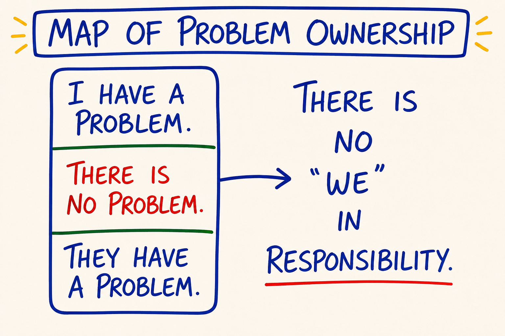

# Day 9 — Ego States · Problem Ownership · Learning Spiral

| | |
|---|---|
| **Intensity** | **HIGH** |
| **Time** | ~3 hours active across 3–4 days |
| **Partner check-in required before?** | **YES — required, no override.** See unlock checklist in `04 - Container and Gatekeeping Protocol.md` Section D. |
| **Source videos** | `16 - EgoStates_EN.mp4` · `18 - ProblemOwnership_EN.mp4` · `19 - LearningSpiral_EN.mp4` |
| **Maps (taught in this module)** | M17 Ego States · M18 Problem Ownership · M19 Learning Spiral — each also a standalone interactive tool in the [**Map Atlas**](../Map%20Atlas/index.html) |
| **Also referenced** | [M27 — Your Gremlin](../Map%20Notes/M27%20-%20Your%20Gremlin.md) (owned by Day 7 — the Gremlin as one of the five ego states; named here, transformed there) |

> **Grounding (60 seconds).** Top of `03 - Safety and Facilitation Framework.md` Section D. Read it now. You will use it inside this module.

---

## Consent check (read before continuing)

> This module engages **ego state work** directly — including the Gremlin and the Demon. Material that has been managed by performance, identification, or denial may surface. The Demon is not a metaphor in PM; every adult has one, and Day 9 names it on purpose.
>
> Before continuing, confirm to yourself:
> - My partner is reachable today and tomorrow.
> - I have at least 90 uninterrupted minutes ahead of me.
> - I am not in acute crisis or under the influence right now.
> - I know how to ground.
> - I know how to reach the CM if I need to.
> - If the intake mania/psychosis screen (Doc 04 Section A.5) applied to me, my clinician has confirmed in writing that I may do this module.
>
> If any of the above is not true, pause and come back when it is. If all are true and you choose to continue, take a slow breath and begin.

> **Readiness check (10 seconds).** Can you return to center and find your Adult on demand (Day 3 + Day 5)? Ego-state work needs a home base to come back to — naming Parent/Child/Gremlin/Demon from a centered Adult is the work; doing it ungrounded is just getting tossed around by the states. If center isn't reliable, re-read [M07](../Map%20Notes/M07%20-%20Center%2C%20Grounding%20Cord%2C%20Bubble%2C%20Golden%20Cube.md) first. (Full self-check: `Facilitator Resources/Learning Self-Assessment.md`.)

> **If your partner has gone quiet.** This module is partner-gated for a reason — you should not do it alone. But a silent partner must never strand you. If your partner hasn't responded and you want to proceed, **message your CM**: there is a real fallback — a witness partner, or a CM-held exchange — so you are accompanied. Don't do the High-intensity practice with no one on the other end, and don't let a non-responsive pairing stall you indefinitely. The fallback is yours to ask for.

---

## Purpose

To install the lens that lets you see — in real time — **which part of you is speaking, feeling, choosing, or trying to claim a problem that isn't yours.**

Day 9 is the integration module. The eight prior modules each installed a distinction. Day 9 hands you the tool that lets you use all of them at once. When the Box speaks, it speaks from one of these states. When the Gremlin reaches for food, it reaches from one of these states. When you rescue someone who has not asked, you are misowning a problem from a particular state. The same map shows you the one location — Adult — from which PM is actually practiced.

This module also names something most personal-development work refuses to name. PM is direct about the **Demon** — the part of you with the capacity for real harm. Not metaphorically. The work is not to claim it, deny it, or perform it. The work is to *know* it. A known Demon is far safer than an unknown one.

The Learning Spiral, which closes the module, names what has actually been happening across the course — and what will keep happening for years if you stay in it.

---

## Core PM concepts

- **Ego state.** A coherent location from which you speak, feel and choose. Not a personality. A *state* you are in for the duration of a sentence, a phone call, a decade.
- **Parent.** Internalized voices of authority — your literal parents plus teachers, religion, culture, the boss. **Critical Parent** judges. **Nurturing Parent** takes care of.
- **Child.** Your actual childhood self, still here. **Free Child** is spontaneous, curious, alive. **Adapted Child** is the version that learned to perform, comply, please, hide, or rebel to survive the room.
- **Adult.** The present-time grown human. **The state from which PM is practiced.**
- **Gremlin.** The part of you that wants gremlin food — drama, suffering, righteousness, distraction. Speaks *sotto voce*. Distinct from Parent, Child, and Adult.
- **Demon.** The part of you with the **capacity for real harm to self or others.** Not a creative force. Every adult has one. The work is to know yours.
- **Problem ownership.** The first PM question when something is "wrong": *whose problem is this?* Three options — my problem, the other person's problem, explicitly shared.
- **No "we" in responsibility.** Responsibility is individual. *"We have a problem"* hides whose Adult is doing the work.
- **Learning Spiral.** Real learning is not linear. Try → notice → name → adjust → try again. Each lap, more becomes visible.

---

## Learning outcomes

By the end of this module you will:

1. Name the **five ego states** in your own words, and locate one example from your last 24 hours of speaking from each.
2. Have completed the **Ego State Locator** — felt the posture and the voice of each state, including a brief, bounded contact with your Demon.
3. State the difference between **owning a problem**, **misowning the other person's problem**, and the **Rescuer pattern** as a special case of misowning.
4. Detect, in language, an **I-statement** (owned) versus a **you-statement** (misowned).
5. Describe the **Learning Spiral** and locate two earlier course modules that have already cycled back into clearer view.

---

## Module flow

| Step | Time | What you do |
|---|---|---|
| 1 | 10 min | Read header and consent check. Confirm partner is reachable. |
| 2 | 18 min | Watch `16 - EgoStates_EN.mp4` |
| 3 | 12 min | Watch `18 - ProblemOwnership_EN.mp4` |
| 4 | 10 min | Watch `19 - LearningSpiral_EN.mp4` |
| 5 | 30 min | Read **Concept teaching notes**, slowly — study each map image where it sits, and do the smaller embodiment practices inline where offered |
| 6 | 30 min | **Ego State Locator** (solo, embodied) |
| 7 | 20 min | **Partner voice exchange** (record + send) |
| 8 | — | Receive partner reply within 24 hours; record your reply |
| 9 | 2 days | Run the **between-module experiment** |
| 10 | 15 min | Journal the **reflection prompts** |
| 11 | 1 min | Post one line to the cohort feed |

Spread this module across 3–4 days. The ego state map is not a thing you "get" in one sitting. It is a lens you start using, and the seeing gets sharper for weeks.

---

## Concept teaching notes

### Five states, not three

*▶ [Explore M17 as an interactive tool in the Map Atlas →](../Map%20Atlas/M17%20-%20Ego%20States.html)*

Study the map before reading on. Notice that the five states are drawn as separate *locations*, not stacked layers — Parent, Child, Adult, Gremlin, Demon, each a place you can stand. That is the whole point: you move between them, sometimes mid-sentence, and nothing visible changes on the outside when you do.

You probably arrived able to notice "speaking as an adult" versus "speaking as a child." What you almost certainly could not do was distinguish, in a single phone call, the moment your Critical Parent took over from your Adult, then the moment your Adapted Child took over because being scolded by your own internal Parent felt like being scolded by your real father, then the moment your Gremlin took over because there was now drama in the air and the Gremlin eats that. From the outside the conversation looked like one person talking. From inside the map, four different states were on the line, none of them your Adult, and the clean decision never got made.

This is what the map is for. **It is a lens for noticing which state is speaking in any given moment.** Not a personality test. Not a developmental stage. A *state* — you move in and out of all five, sometimes within one sentence. Treating any one of them as "who I am" is a category error.

The map is *related to* the Parent/Child/Adult model from Transactional Analysis but is **not the same map.** TA does not include the Gremlin or the Demon. PM names both on purpose — without those two locations a learner keeps mistaking gremlin food for adult choice and shadow material for personality.

**Parent.** The internalized authority. *"You should…", "Good people don't…", "That's not how this is done."* Not just your literal parents — every teacher, religion, culture, boss whose voice you absorbed. **Critical Parent** judges. **Nurturing Parent** takes care of. Both are useful in their place. Both are tyrannical when they are the only state available.

**Child.** Your actual childhood self, still alive in your nervous system. **Free Child** is spontaneous, curious, alive — the part that delights, plays, sulks, dances without shame. **Adapted Child** is the version that learned early that being themselves was unsafe — so it performs, complies, pleases, hides, or rebels. The Adapted Child often runs adult life.

**Adult.** The present-time grown human. Not "mature" in the moralistic sense. The state from which you hold distinctions, contract, choose on purpose, take responsibility, and act. **PM is practiced from here.** When you cannot find your Adult, you cannot do PM.

**Gremlin.** The part of you that wants gremlin food. You met it on Day 7 (M27, *Your Gremlin*) as the engine of Low Drama. Here it is named again as one of the five ego states — the one most likely to pass itself off as "adult insight." Gremlin speaks *sotto voce* — *"you're not enough," "they never listen," "this is hopeless," "just one more."* The voice often passes for thought, for insight, for "what I really feel." It is none of those. Naming and meeting the Gremlin is in scope here; the deeper container — Gremlin Transformation — is where the Gremlin is actually worked. Day 9 is the lens; Gremlin Transformation is the journey. (Day 7 owns the full Gremlin map; this module only borrows it as one of the five locations.)

**Demon.** The part of you with the **capacity for real harm**. Not a force for transformation. Not a sacred shadow. The cold, intelligent, harm-capable part that can use adult resources without remorse — often in service of revenge, domination, destruction, or annihilation. Its defining feature is that it can do damage — to you, to others, to what you have built. Where the Gremlin *feeds*, the Demon *damages*. Every adult has one. Most people spend their lives pretending they do not, then are surprised by what they do under pressure. The Demon makes the affair, makes the cruelty, makes the slow erosion of a marriage by ten thousand small contemptuous looks. It also makes the slow erosion of the self.

**The work is not to integrate the Demon. The work is to know your Demon** — its texture, its triggers, its preferred targets — so that when it stirs, you can name it and not let it drive. **A known Demon is far safer than an unknown one.** PM uses *Demon* as a precise term, not a religious one — chosen because softer words ("shadow," "dark side," "inner critic") let the learner pretend the part is less dangerous than it is. The course is gated by Screen 5 at intake for this reason.

> **Scope note — Demon is a *locator* here, not a journey.** On Day 9 this map names the Demon as a state and helps you find where it sits in your body. That is the entry, and it is as far as this module goes. We are **not entering Demon process work.** Active Demon work is held inside a PM trainer container (Gremlin Transformation Training is the longer container) or with a trauma-qualified clinician. Naming the Demon is one room; processing it is a different room with a different door — and you do not open that door alone, in a digital module, without that container in place.

### Which state is speaking right now?

The question you take into the next forty years of your life:

> *Which ego state am I speaking from right now?*

Asked honestly, the answer is sometimes flattering, often unflattering, occasionally surprising. You thought you were being an Adult and you were being Critical Parent. You thought you were being kind and you were being Nurturing Parent over an Adapted Child who never asked for help. You thought you were having an insight and you were Gremlin-fed.

The point of the lens is not to be in Adult all the time — no one is — but to **see which state is here so you can decide whether to speak from it.** Sometimes Free Child is exactly right. Sometimes Nurturing Parent is exactly right. Almost never is Critical Parent right; almost never is Gremlin right; never is Demon right as a *choice*.

**Common misunderstandings about ego states.**

- *"I'm a Parent type"* / *"I'm more of a Child."* Ego states are *locations*, not personality types — you move in and out of all five, sometimes within one sentence. Treating any of them as "who I am" collapses the map into the very thing it is teaching you to see through.
- *"This is just Transactional Analysis with new names."* TA does not include the Gremlin or the Demon. PM adds both on purpose; without those two locations, gremlin food gets mistaken for adult insight and shadow material gets mistaken for personality.
- *"The Demon is a metaphor — my 'shadow,' my 'inner critic,' a dark creative force I'm meant to integrate."* The Demon is the part with the capacity for real harm. Not metaphorical, not creative. The work is to *know* yours — not integrate, claim, or perform it. Romanticizing it is precisely how it stays unknown, which is how it does damage.
- *"I've integrated my shadow / claimed my Demon."* Almost without exception, that claim is the Gremlin in costume. You do not integrate the Demon; you know it. *"I have so much more to learn about my Demon"* is clean territory. *"I have integrated my shadow"* is being run by the part you think you have transcended.

> **Smaller embodiment practice — the Adult posture, located (10 min, optional inline).** This is *not* the full Ego State Locator below — it skips the Gremlin and Demon and just drills the Adult so you can find it under pressure. Run it now if you want a gentler on-ramp, or save it as a maintenance rep after the module. Stand, center, ground, drop a bubble (Day 3). Three postures in sequence. **Critical Parent (90 sec):** spine up, chin raised, hands on hips or one finger pointing — the posture authority took when it was being *parental* at you. One real sentence — *"you should… good people don't…"* Notice your jaw, shoulders, breath. Return to center. **Adapted Child (90 sec):** chin down, weight down, the posture your body takes when it is about to please, comply, hide, or apologize. *"It's okay, I don't need anything. I'm sorry. Is that all right?"* Notice how old you feel. Return to center. **Adult (4 min):** both feet on the floor, knees soft, shoulders down, weight even, eye level, hands easy. Your present-time grown body, here, now, not performing. Plainly: *"I am here. I can think clearly about this. I am willing to take responsibility for my part."* Stay an extra minute — the posture is the least dramatic of the three, the voice is plain. Get the felt sense of *this is Adult* so you can find your way back. Write three lines: *where my Adult posture sat in my body · what the voice sounded like · where in my week I will most need to find this again.*

### Problem ownership

*▶ [Explore M18 as an interactive tool in the Map Atlas →](../Map%20Atlas/M18%20-%20Problem%20Ownership.html)*

Study the map before reading on — three boxes, not two: *my problem · their problem · explicitly shared.* The precision is in the third box, and in the fact that it is almost always empty until two Adults put something there on purpose. Hold that image while you read.

When something is "wrong" between you and another person, the first PM question is not *who is right* or *what should happen.* It is:

> **Whose problem is this?**

Three honest options:

- **My problem** — *I* have an unmet need. The clean response is to own it (*"I have a problem — I need X and I am not getting it"*) and take responsibility for what I do about it.
- **The other person's problem** — *they* have an unmet need. The clean response, if the relationship matters, is to listen, witness, complete the loop (Day 8) — and **not to take the problem on as if it were mine.** That is the Rescuer move from Day 7, structurally a misowning.
- **Shared problem** — both of us have an unmet need, and we have agreed, explicitly, to work on it together. This is rarer than people think. Most "shared problems" are one person's problem the other has been guilt-tripped into co-owning. A genuinely shared problem requires an explicit contract — *we both have an unmet need, we both agree to work on it together, here is how* — in words said out loud, with both Adults present.

Note that **ownership is about whose unmet need is in play, not about who is wrong.** It is not blame. It is which person has the unmet need that is driving this.

**Owning a problem does not mean fixing it.** It means being clear the unmet need is mine and taking responsibility for what *I* do about it — and the options include asking, waiting, doing nothing on purpose, or grieving. Owning is not the same as solving.

**There is no "we" in responsibility.** There is *I am responsible, and you are responsible, and we are choosing to collaborate.* The word "we" sounds inclusive and is often a slippage — it lets one person's Adult do the work while the other's Adapted Child watches.

**I-statements and you-statements** are the field test, and they are **functional, not stylistic.** *"I am angry. I want a clearer agreement"* owns the problem. *"You're being difficult. You always do this"* misowns it. The grammar reports which person you have located the unmet need inside of. *You*-statements are almost always misowned problems wearing a costume — and rephrasing *"You always do this"* as *"I feel like you always do this"* is still a you-statement in costume. The test is ownership, not phrasing.

The Rescuer pattern (Day 7) is now visible as a special case. The Rescuer takes on someone else's problem as if it were their own, then gets resentful when their unrequested help is not appreciated. That whole loop is one act of misowning followed by a Gremlin-fed payoff. Naming it here integrates Days 7, 8 and 9 into one lens. And listening to another person's problem without taking it on is not cold or withholding — it is the Adult move. The cleanest care for someone else's problem is presence without ownership.

**Common misunderstandings about problem ownership.**

- *"I-statements are just a politer way to say what you-statements say."* They are functional, not cosmetic. *"I feel like you always do this"* is a you-statement in costume — it still locates the unmet need in the other person. The test is about ownership, not word choice.
- *"'Shared problem' is the most mature option."* Defaulting to shared erases whose Adult is doing the work. A genuinely shared problem needs an explicit contract with both Adults present; *"we have a problem"* is most often one person's problem the other got recruited into co-owning.
- *"Owning a problem means I have to fix it."* Owning means being clear the unmet need is yours and choosing what *you* do — which may be to ask, wait, do nothing on purpose, or grieve.
- *"If I witness someone's problem without taking it on, I'm being cold."* Taking on what is not yours is the Rescuer move — feels caring, reliably leads to resentment. Presence without ownership is the clean care.

> **Smaller embodiment practice — the three-column sort (10 min, optional inline).** Sit, pen and paper. Pick one current "problem" you are carrying that involves another specific person — partner, colleague, parent, child, friend. One problem. Draw three columns: **my problem · their problem · shared (explicitly contracted).** Set a six-minute timer. Take each element — what is unresolved, what bothers you, what you keep thinking about — and sort it. *I want a clearer agreement about Thursdays. I am angry I was not told* → column one. *They are struggling at work. They are not sleeping* → column two (their unmet need you have been carrying). For anything that feels shared, ask whether you have *explicitly contracted* to work on it together, out loud, both Adults present — if not, it is not yet column three. When the timer ends, read the columns aloud, slowly. Notice what you have been carrying that is not yours, what you have been handing off that is yours, what you have been calling shared that was never contracted. For the last two minutes, write one sentence: *the one ownership move I am willing to make this week* — returning a problem to its owner, naming one of your own, or requesting an explicit contract. Specific enough that you would know whether you had done it. **Do not act today.** Action without integration is a Box move; the sort itself is the rep.

### The Learning Spiral

*▶ [Explore M19 as an interactive tool in the Map Atlas →](../Map%20Atlas/M19%20-%20Learning%20Spiral.html)*

Study the map before reading on. It is drawn as a coil, not an arrow and not a staircase — the same words placed at intervals on each lap. That shape is the claim: you return to the same *territory* at a *different resolution*. A circle returns to the same point at the same resolution; a line goes one way and never returns; only a spiral does what learning actually does.

The fantasy you were sold, probably for most of your life, is that learning is linear. Read the book, take the class, get it, apply it, done.

This is not how learning works in PM and is not how it has been working for you for the last 30 days. Real learning is **spiral.** Try. Notice. Name a distinction. Adjust. Try again. Notice more — including things you could not see the first time because the first lap installed the distinction that lets you see them. Each lap, the same territory shows you something you missed.

The course itself has been a spiral. The Box you met on Day 2 looks different now, because Days 5, 7 and 9 installed the distinctions that let you see how the Box uses ego states, gremlin food, and misowned problems to stay in business. The center-ground-bubble from Day 3 is usable in places it was not at the start. The feelings work from Day 5 keeps cycling back as you register, three weeks later, a 5% anger you would have missed in Week 1. The next lap of any module is, in effect, a different module than the one you first walked through.

The spiral continues for years. A PM practitioner ten years in keeps meeting the same distinctions on different rungs, and the distinctions keep teaching them things they were not ready for the first eight times. The spiral does not converge on mastery. It deepens. The course is a quick entry, not the whole thing — thirty days installs the maps and starts the first lap; the maps keep teaching for as long as you keep using them.

One reaction is common: *"so this is self-improvement that never ends."* No. Self-improvement is the linear fantasy with shame attached — the implicit claim that there is a finished version of you up ahead you have not yet reached. The Learning Spiral is the structure of being alive and paying attention. There is no "further along." There is only this lap, what it is showing you, and whether you stay in it on purpose.

**Common misunderstandings about the Learning Spiral.**

- *"I finished the course, so I have learned PM."* The course is a quick entry — it installs the maps and starts the first lap. Treating Day 10 as graduation collapses the spiral back into the linear fantasy.
- *"The spiral converges on mastery — eventually I'll 'get' all of this."* It does not converge; it deepens. Practitioners ten years in keep meeting the same distinctions at finer resolution. There is no finished version of you up ahead.
- *"The Learning Spiral is just 'growth mindset.'"* Growth mindset is a *stance* about your capacity to develop. The spiral is a *structural pattern* of how learning lands across time — it happens whether or not you hold the stance; the only question is whether you stay in it on purpose.
- *"Going around the same territory again means I'm stuck."* Each lap is the same territory at higher resolution. Returning to the Box on Day 9 is the *only* way to see what the Day 5 and Day 7 distinctions made newly visible inside it. The repetition is the mechanism, not the failure.

> **Smaller embodiment practice — the lap-back review (12 min, optional inline).** Sit with the journal you have kept across this course (from memory works too, more slowly). You are going to take one lap back, on purpose, to *feel* the spiral — not to study the maps, but to notice what is now visible that was not the first time. For each of three earlier modules — **Day 2 (Box) · Day 5 (Feelings) · Day 7 (Low Drama)** — three minutes each: re-read the *reflection prompts* from that day (just the prompts, not your old answers), and ask, *"what do I now see in this question that I did not see the first time I answered it?"* Often it is a sentence you wrote without knowing what you were writing. Name one specific thing per module, out loud, in your own voice — *"On Day 2 I wrote about my Box and could not yet see it was using my Adapted Child to do it. I see that now."* After all three, sit still one minute and notice: the territory has not changed — the Box is still the Box, anger is still anger — what changed is your capacity to see what was always there. Write two sentences: *one thing I now see on Day 2 that I did not see then, and one thing I expect to see three months from now that I cannot yet see today.* The second is harder; write it anyway — even *"I do not know what it will be, but I expect there will be one"* is enough. The point is to take the next lap on purpose.

---

## Embodied practice (solo) — The Ego State Locator

One concrete practice. ~30 minutes. Done alone, in a room where you will not be interrupted. You need: space to stand, water, a notebook.

This is **not** a deep Demon journey. It is a brief locator — you visit each of the five states in your body, speak one to two sentences from each, and notice. The Demon visit is the shortest and is explicitly bounded.

Read the script all the way through once before you start.

> **Script.**
>
> Stand. Both feet on the floor. Center, ground, drop a bubble (Day 3 — if it has fallen out of your body, re-read M05 first).
>
> You will visit five states. Each gets a posture and a sentence or two. Return to center between each.
>
> **1. Parent (3 min).** Take the posture of authority. Spine up, chin slightly raised, hands on hips or one finger pointing — whichever your body recognizes as the posture a parent (or teacher, boss) took when they were *being parental* at you. Out loud: one Critical Parent sentence — *"You should…", "Good people don't…", "That's not how this is done."* Use a real one. Then, same posture, one Nurturing Parent sentence — *"Let me take care of that for you,"* or whatever the over-functioning helper-voice in you actually says. Notice whose voice it actually is. Return to center.
>
> **2. Child (3 min).** Soften the posture. Drop the chin. Let your weight come down. Some learners crouch or sit on the floor. Find the posture your body takes when no one is watching and the day has been long. Out loud: one Free Child sentence — *"I want…", "That looks fun," "Let's…"* — with appetite, like a six-year-old. Then, same softer posture, one Adapted Child sentence — *"It's okay, I don't need anything," "I'm sorry," "Is that all right?"* Notice how old you feel. Return to center.
>
> **3. Adult (4 min).** Stand again. Both feet on the floor. Knees soft. Shoulders down. Weight even. Eye level. Hands easy at your sides. This is your present-time grown body, here, now, not performing anything. Out loud: *"I am here. I can think clearly about this. I am willing to take responsibility for my part. I am asking you to take responsibility for yours."* Or any sentence in that shape, in your own words. Notice that the posture is the least dramatic of the five. The voice is plain. **This is the state PM is practiced from.** Stay an extra 30 seconds. Get the felt sense of it so you can find your way back later. Return to center.
>
> **4. Gremlin (3 min).** Shift posture. The Gremlin's body is often slightly hunched, slightly turned away, conspiratorial — leaning in, like at a bar, telling someone something they shouldn't. Find the posture your body takes when you are about to enjoy something you know you shouldn't. Out loud, in a *sotto voce* tone — quieter than normal, almost muttered — one Gremlin sentence: *"They never appreciate you," "You're not actually going to do this," "You're better than them," "Just give up," "Go on, have one."* Use one your Gremlin actually says. Notice the small charge of pleasure — that's gremlin food. Notice it without indulging it. Return to center. **Take three breaths before the next one.**
>
> **5. Demon (90 seconds, bounded).** The shortest and most specific visit. You are not going to perform your Demon. You are not going to enter it. You are going to **locate it in your body and acknowledge it is here.**
>
> Stand still. Place one hand on your sternum, the other on your belly. Out loud, in your own voice, plainly, say once: *"I have a Demon. I know it is here. It has the capacity to harm. I am not it. I am the one who can know it."*
>
> Notice where in your body the awareness of the Demon lives. Some learners feel coldness, some tightness, some a strange calm, some feel nothing — that is also data.
>
> **Do not perform the Demon's voice. Do not give it lines. Do not try to "meet" it. This is a locator, not a journey.**
>
> Take three slow breaths, audible exhale. Both hands on your sternum. Out loud: *"I am here. I am in my Adult. The Demon is known. I am not it."* Return to center fully.
>
> Sit down. Drink water. Write fast, no editing: *which state was easiest to find · which was hardest · which surprised me · what posture each one took in my body.* Five or six lines. The point is the rep, not insight.

**What to expect.** Most learners find Adult harder to locate than the others — Adult does not perform, and the body has been rewarded for performance most of its life. Some find Gremlin embarrassingly easy. Some locate the Demon position, and some honestly do not yet — both are valid; the locator is the rep. The Demon visit is 90 seconds on purpose. A separately-held PM container (Gremlin Transformation) exists for deeper work.

If you find yourself dissociating — floating, watching from outside, unable to feel anything anywhere — stop, ground, end the practice. Voice-message your partner that you stopped. This is not failure. Your system told you it was at limit.

If visiting the Demon location surfaces actual urges toward self-harm or harm to others — the buddy immediate-danger protocol (Doc 03 Section F) and the partner agreement (Doc 04 Section B) apply. Use them. Crisis lines are in your referral packet.

---

## Partner exchange (async)

Same structure as before: record, send, receive, reply. Voice messages only.

**Before recording: do the partner check-in.** Verify your partner is reachable in this 48-hour window. If not, pause and contact the CM. (Structural requirement for all High modules. No override.)

The topic is **ego state recognition, not deep Gremlin or Demon work.** You are naming which state you were speaking from in your recent exchanges with this partner. Acknowledgment, no judgment.

**Prompt to record (5–10 minutes):**

Speak to your partner directly. Three things, in this order:

1. **One moment in our recent partner exchanges where you can now identify the ego state you were speaking from.** Be specific. *"In my Day 7 voice message about my work conflict, listening back now, I was speaking from Critical Parent for most of the first three minutes, then dropped into Adapted Child when I asked you what you thought."* One moment, one state, what you can now see.
2. **What you noticed in the Ego State Locator.** Which state was easiest. Which was hardest. Whether you located your Demon and what your body did. If you hit something you did not expect, name it — but do not process it here.
3. **One ego state you want to find more reliably in the next month.** Often this is Adult. Sometimes Free Child. Sometimes the conscious *non*-use of Critical Parent. Name it, and one situation in your week where finding it would matter.

If you stumble, leave the stumble in.

**When you receive your partner's message: listen all the way through once before replying.** Then record (3–7 minutes):

1. **What you heard them say** — paraphrase the core. The part that landed in your body.
2. **Which ego state you noticed in yourself while listening** — say it plainly. *"While you were speaking I noticed my Nurturing Parent wanted to take care of you. I am noticing it. I am not acting from it. I am staying in Adult."*
3. **One question.** Open-ended, lands in their body not their head. *"What does your Adult know about that situation that the Critical Parent does not?"* — *"What would your Free Child do with that, if it were allowed?"* The shape is the question that opens, not the question that diagnoses.

No advice. No fixing. Witnessing only. If your partner names material bigger than the exchange can hold — particularly anything around the Demon that touches on imminent harm — apply the buddy immediate-danger protocol (Doc 03 Section F) before anything else.

---

## Between-module experiment

Pick **one**. Run it before you start Day 10. Pick the one that is least appealing — that is usually the one your Box does not want you to see.

1. **The mid-sentence catch.** In the next 48 hours, catch yourself **once** in the middle of a sentence — out loud, in a conversation — and silently ask: *"Which ego state am I speaking from right now?"* Notice. Do not change anything. Do not announce it. Do not finish the sentence differently. Just see. The point is the noticing.
2. **The whose-problem-is-this audit.** Pick one current "problem" that involves another person. On paper, write three columns — *my problem · their problem · shared (and explicitly contracted).* Sort the elements honestly. Notice what you have been carrying that is not yours, and what you have been handing off that is yours. Do not act yet. Just sort.
3. **The I-statement substitution.** In one conversation in the next 48 hours, replace one *you*-statement with the *I*-statement underneath it. *"You're being unreasonable"* becomes *"I am frustrated and I am asking for X."* One time. Notice what changes in the room.

Capture in 2–3 sentences what happened. You will use it in your reflection and in Day 10.

---

## Reflection prompts

Journal at your own pace. Longhand if you can.

1. Of the five ego states, which is my **default** — the one I run most of my life from? Which do I most pretend I am running from when I am actually running from a different one? (Common: claiming Adult while running Critical Parent. Claiming Free Child while running Adapted Child. Claiming insight while running Gremlin.)
2. The Ego State Locator — which posture was I least comfortable taking? What does that say about which state has been least available? My **Adult posture** — describe it precisely. Where will I need it most in the next month?
3. My Demon — what is its **texture** as I now know it? Where in my body does the awareness live? What does it want me to do that I have, so far, not done? (You are writing this so the Demon is *known* on the page rather than running underground. If writing it down is itself unsafe — skip this prompt.)
4. One current "problem" where I have been **misowning** — carrying a problem that is the other person's, or trying to make them own one that is mine. Name the person and the problem. What would change if I returned the problem to its rightful owner?
5. The Learning Spiral — name two specific things from earlier in this course that have already cycled back into clearer view. What does that tell me about what is still ahead on the next lap?

---

## Safety callouts for this module

Day 9 is **High intensity**. Specifically:

- **Demon material is real.** If the locator practice or the journaling surfaces actual urges toward self-harm or harm to another person, **stop the module, contact your partner immediately, and apply the buddy immediate-danger protocol** (Doc 03 Section F). If the urge is acute, call the crisis line in your referral packet *before* contacting the partner. The Demon being known is the work; the Demon driving action is the cue to reach for outside help, immediately, with no shame.
- **Gremlin work can produce sharp self-criticism that masquerades as insight.** Many learners hit a moment where they think *"I've been a gremlin my whole life,"* or *"my whole personality is a performance."* That voice **is the Gremlin.** Total self-condemnation dressed as breakthrough. The Adult notices the sentence and does not believe it. Ground. Voice-message your partner.
- **Parent voices may surface as old family voices.** The Parent state work makes visible whose rules you have been carrying. Anger, sadness or grief that arrives is often decades old. **It is an emotion, not a present-time feeling about your living parents.** Do not call your mother in the middle of this module. Do not write the letter today. Note it as an emotional healing process candidate (Day 6) and voice-message your partner. Action, if any, comes after the processing.
- **If you are currently in active conflict with a living parent**, Day 9 can compound. The Parent state work and a real fight in your real life can amplify each other. Pace gently — consider stretching this module to 5–7 days. If the real-life conflict is acute, contact the CM and consider deferring.
- **The mania/psychosis intake screen (Doc 04 Section A.5) should have caught learners for whom archetypal and ego-state language is contraindicated.** If you reached this module without that screen having been applied — if you self-enrolled around an intake step, or your circumstances have changed since enrollment in any way that touches Screen 5 — **stop, contact the CM, and do not do this module today.** Ego state work amplifies the perceptual shifts the screen exists to protect against. Structural requirement, not a recommendation.
- **Inflation risk — the claim that you have "integrated your shadow."** Some learners walk out convinced they have *met* their Demon, *claimed* it, *transformed* it. The claim is, almost without exception, the Gremlin in costume. The PM stance is direct: **you do not integrate the Demon. You know it.** A learner who finishes saying *"I have so much more to learn about my Demon"* is in clean territory. A learner who finishes saying *"I have integrated my shadow"* is being run by the part they think they have transcended. If you catch this in yourself, ground, voice-message your partner, name it. The catching is the work.
- **Wanting to numb after the module.** Common, especially after the Demon locator. Notice the urge. Voice-message your partner about it before acting. If you act anyway, name it as a numbing action in your journal — data, not failure.

The universal grounding script applies (top of `03 - Safety and Facilitation Framework.md`). If you notice you are dissociating, floating, or shutting down: stop, ground, decide.

This course is not therapy. Ego state work is in scope as a thoughtware module; sustained therapeutic work with childhood wounds, complex trauma, or active mental health conditions is not. If today's material brings up specific traumatic memory, use the referral list and bring a qualified clinician alongside.

---

## Cohort feed post (suggested)

One line each, no more:

- The ego state I now see I have been running: …
- The problem I have been misowning: …
- (Optional) one question for the group: …

---

## Glossary additions

- **Ego state** — a coherent location from which you speak, feel and choose; not a personality; a state you move in and out of
- **Parent (ego state)** — internalized voices of authority; Critical Parent (judging) and Nurturing Parent (taking care of)
- **Child (ego state)** — actual childhood self still present; Free Child (spontaneous) and Adapted Child (performing safety)
- **Adult (ego state)** — present-time grown human; the state from which PM is practiced
- **Gremlin (ego state)** — the part wanting drama, suffering, righteousness, distraction; speaks *sotto voce*; eats gremlin food
- **Demon (ego state)** — the part with the capacity for real harm to self or others; known, not denied; not romanticized as a creative force
- **Problem ownership** — whose unmet need is this; three options (my problem, their problem, explicitly shared); first PM question when something is "wrong"
- **No "we" in responsibility** — the precise claim that responsibility is individual; "we have a problem" hides whose Adult is doing the work
- **I-statement / you-statement** — grammar test for problem ownership; *I* = owned, *you* = misowned
- **Rescuer (re-named here)** — the special case of misowning the other person's problem; structurally a Day 7 pattern visible from Day 9's vantage
- **Learning Spiral** — the non-linear shape of integration; try → notice → name → adjust → try again; each lap, more becomes visible; continues for years

---

🄯 **World Copyleft 2026** · *Expand the Box (Digital)* · licensed **[CC BY-SA 4.0](https://creativecommons.org/licenses/by-sa/4.0/)** · re-presents Possibility Management thoughtware originated by Clinton Callahan & the Possibility Management community · please share, share-alike · Powered by Possibility Management ([possibilitymanagement.org](https://possibilitymanagement.org)) · full terms: `LICENSE.md` in the course root
