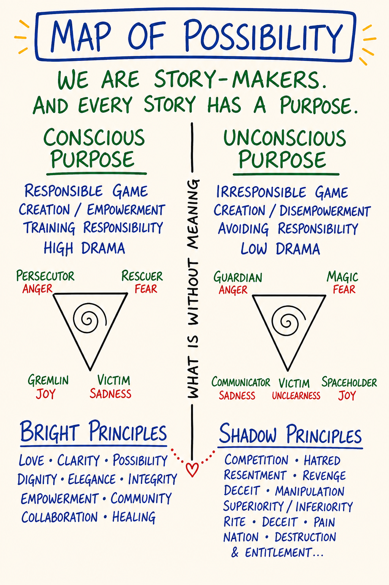
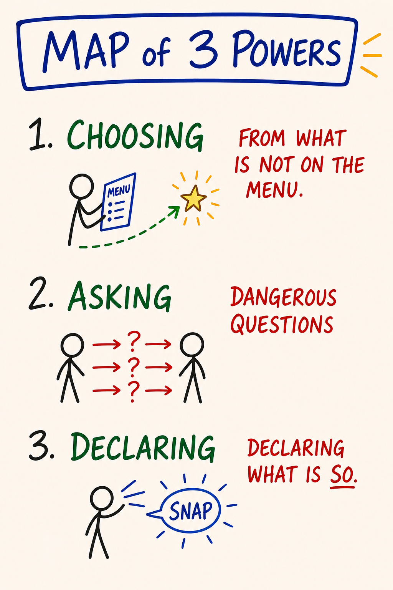

# Day 10 — Map of Possibility · Bright Principles · Three Powers · Integration

| | |
|---|---|
| **Intensity** | Low (with closure sensitivity — see safety callouts) |
| **Time** | ~2 hours active across 2–3 days |
| **Partner check-in required before?** | No pre-module check-in; partner reachability required within 24 hours for the closing exchange |
| **Source videos** | None — material distilled from the Sparks (see `SPARKS/_AllSparks-000-ADV_062125_522k_tokens.pdf`) and the Map of Possibility / Map of Creating handouts |
| **Maps (taught in this module)** | M20 Map of Possibility · M21 Bright & Shadow Principles (no dedicated map) · M22 Is-Glue & Is-Glue Dissolver · M23 Three Powers — each also a standalone interactive tool in the [**Map Atlas**](../Map%20Atlas/index.html) |

---

## Purpose

To complete the course gameworld, distinguish what was built, and declare the next gameworld you are entering.

Day 10 is not where you learn the most new material. Day 10 is where the nine modules you have already lived become one piece of equipment you can carry. The work is to install three load-bearing distinctions — the **Map of Possibility**, **Bright Principles**, the **Three Powers** — sharpen the language layer underneath all of them with the **Is-Glue Dissolver**, and use the whole set to do one specific thing: make a declaration, out loud, in your body, that names what you are taking forward.

The course gameworld ends. The next gameworld begins when you name it, declare its rules, and enter it consciously. What you built here only continues if you choose to keep it. This module is the place where that choice is made on purpose, not by drift.

> **A declaration is not an affirmation.** An affirmation tries to convince the self of something. A declaration creates a context the self then has to live inside, and requires action consistent with that context. Affirmations end where the sentence ends; declarations begin where the sentence ends.

---

## Core PM concepts

- **Map of Possibility.** The meta-map. Possibility is not a list of options; it is a **space** you enter. You enter it by holding a new context, being in liquid state, and asking dangerous questions.
- **Bright principles.** Sources of action from archiarchy — love, integrity, possibility, courage, presence, clarity, creation, devotion, witnessing, hospitality, gratitude. Bright is not a moral grade; it is a structural source.
- **Shadow principles.** Sources of action from patriarchy — domination, manipulation, control, deception, scarcity, righteousness, comparison, abandonment-as-strategy. Shadow is not "bad" in the moralistic sense; it is real and has its domains. The work is to know which principle is in the driver's seat.
- **Is-Glue.** The verb "to be" used to weld a transient perception to a permanent identity — *I AM stupid, she IS controlling, this IS impossible.* It closes the room and filters out everything that would contradict it.
- **Is-Glue Dissolver.** The swap that restores a perception's provisional scope without denying it — "is" becomes "feels," "appears to be," "right now," "from my Box." Precise, not tentative.
- **The Three Powers.** The Power of Choosing · the Power of Asking Dangerous Questions · the Power of Declaring. Not techniques. Stances available to a person standing in possibility on purpose.
- **Declaration.** A speech act that brings a new context into being. Not a promise (content), not an opinion (reactive), not a wish (passive). A declaration creates.
- **Gameworld (closing).** This course was a gameworld with explicit rules, roles and a duration. You are about to leave it. The thoughtware does not leave with the gameworld — but it needs a new container to live inside.

---

## Learning outcomes

By the end of this module you will:

1. Be able to draw the Map of Possibility from memory and locate at least three earlier course distinctions on it (e.g., the Box, liquid state, Low Drama).
2. Be able to name three bright principles you actually source from, and three shadow principles you have caught yourself sourcing from during the course.
3. Be able to catch one piece of your own **is-glue** and apply the dissolver so the room reopens — without softening the perception into vagueness.
4. Be able to distinguish, in language, a **declaration** from a promise, an opinion and a wish.
5. Have made one declaration aloud in your own space, and a second declaration to your pairing partner, witnessed.
6. Have named the two practices you commit to running for the next ~90 days.

---

## Module flow

| Step | Time | What you do |
|---|---|---|
| 1 | 10 min | Read this header, scan the module |
| 2 | 30 min | Read **Concept teaching notes** below, slowly — study each map image where it sits, and do the inline micro-practices |
| 3 | 20 min | **The declaration practice** (solo, embodied) |
| 4 | 25 min | **Closing partner exchange** (record + send) |
| 5 | — | Receive partner's witnessing reply within 24 hours; record your reply back |
| 6 | 90 days | Run the **between-module experiment** (this one is the long arc) |
| 7 | 20 min | Journal the **reflection prompts** — these pull the whole course together |
| 8 | 2 min | Post your closing line to the cohort feed |

Handwritten versions of the Map of Possibility and the Map of Creating exist at `Possability Lab NY October 2025/Map_of_Creating.pdf` and adjacent files in the source folders; the maps embedded below are clean re-renderings.

---

## Concept teaching notes

### The Map of Possibility

*▶ [Explore M20 as an interactive tool in the Map Atlas →](../Map%20Atlas/M20%20-%20Map%20of%20Possibility.html)*

Study the map before reading on. Notice its shape: the long line of *what is*, and a bounded space opening off it — empty until someone steps in. That space, not the line, is the country this module is about.

Most people live almost entirely inside the **causal paradigm** — the territory of *what is*. They explain themselves by reference to their past and negotiate the present by reference to the rules they were given. Inside that territory, *what could be* shows up only as fantasy — the daydream, the someday-when, the place you go to rest from reality. Fantasy is not possibility. Fantasy is a way of not being where you are without ever leaving it.

The Map of Possibility names a different country. **Possibility is not a list of options the world hands you. Possibility is a space you enter on purpose.** It is empty until someone steps into it. Once you are inside, what was previously invisible becomes available — not because reality changed, but because the Box stopped filtering it out. The Box was filtering possibility out before you ever saw the menu. Liquid state lets the filter loosen. The new context decides what the loosened filter lets through.

Three things put you inside the space — and they happen at once, not in sequence:

- **A held context.** "I am the author here." A stance you return to when the Box says otherwise. Held context without liquid state is just conviction.
- **Liquid state.** The body soft enough, the breath low enough, the agenda quiet enough that the next move can actually be new. Liquid state without held context is just dissipation.
- **A dangerous question.** Safe questions return information that changes nothing. Dangerous questions dissolve the floor so a new floor can appear. Either of the first two keys *without* a dangerous question is just comfort. All three together is the threshold.

Once inside, you populate the space yourself — with your declarations, with more dangerous questions, with actions sourced from bright principles. **The space does not deliver anything to you.** That is the difference from "manifestation" or the Law of Attraction: PM makes no claim that holding the right thought causes the universe to provide. The space makes new *action* available; the action then operates by ordinary cause and effect. There is no shortcut around doing the thing.

Every map you learned in this course has a location on the Map of Possibility. The Box marks the boundary you came in through. Liquid state is the threshold. The four feelings are the energetic vehicles you move with. Low Drama is what happens when you mistake the gameworld of possibility for the gameworld of survival. The ego states are who is standing inside the space at any given moment. The Map of Possibility is the room they all stand in.

Most people visit this room a few times a year, accidentally, and call those visits "good days." A PM practitioner enters it on purpose.

> **Micro-practice — Crossing the threshold (4 minutes).** Do this now, before reading on. Find a doorway. A literal threshold makes the map land in the body in a way a chair cannot. Stand a step back. Three breaths, audible exhale longer than inhale. **Name where you are standing** — out loud, one sentence describing the territory of *what is* you are currently inside, not the room but the situation: *"I am standing in the territory of 'I cannot leave this job.'"* Notice your body — chest, breath, agenda. That is the Box you came in with. Now find the three keys: say *"For the next two minutes, I am the author here"* (soften to *"willing to behave as if I am the author"* if the body rejects it); drop your weight, soften jaw and shoulders, set the agenda down on this side of the door; then ask one dangerous question whose answer you cannot un-know — *"What am I pretending not to know about this?"* Pick the one that makes you wince a little; the wince is the marker. **Step through.** Stand still sixty seconds. Do not interpret — interpretation is the Box re-solidifying. Just notice what is in the room now that was not in the previous room. Step back, and name one small action now available that was not available before you crossed. You are not after transformation; you are building a felt reference for what crossing the threshold *is*.

**Common misunderstandings about the Map of Possibility.**

- *"Possibility means having more options to choose from."* More options is content. Possibility is the context inside which new options can appear that were previously invisible. You can be drowning in options and not in possibility, or have very few visible options and be standing in vast possibility.
- *"Possibility is the same as fantasy or imagination."* Fantasy is escape from "what is" with no enterable threshold; nothing lands. Possibility is a real workspace where action originates. The body knows the difference: fantasy floats free of the floor; possibility puts weight on it.
- *"'Space' is just a metaphor — possibility isn't literally a space."* PM is precise here. The space has a threshold (liquid state), keys (context, dangerous question), things you can do once inside (declare, choose, source from bright principles), and a way to fall out (the Box re-solidifies). Treating it as merely metaphorical is the Box keeping the room theoretical so you never enter.
- *"This is the Law of Attraction / manifestation."* No causal claim is made about the universe delivering. The space makes new action available; the action then runs on ordinary cause and effect.
- *"Once I enter possibility, I stay there."* Possibility is a window, not a residence. You enter, do the work that becomes available, and the Box reforms. The skill is re-entering on purpose. Trying to live there full-time is a Box move dressed up as enlightenment.

### Bright and shadow principles

*(No dedicated map for bright/shadow principles — the closest are the Map of Matrix and Map of 3 Games; see the Map Note / Atlas card.)*

*▶ [Explore M21 as an interactive tool in the Map Atlas →](../Map%20Atlas/M21%20-%20Bright%20Principles%20and%20Shadow%20Principles.html)*

Every action you take is **sourced** from some principle. You do not act from "your values" in the soft modern sense — you act from a principle that, for the duration of the action, has hold of you. There is no neutral action. The principle in the driver's seat determines what the action *is*, regardless of its content: two parents can both say "go to bed," one sourced from presence, one from control — same words, different acts, different rooms afterward. PM distinguishes two structural classes, named by where they come from in the cultural cosmology, not by moral grade.

**Bright principles** are sourced from **archiarchy** — culture organised around distributed authority, conscious relating, and creating rather than dominating. They are creative, life-serving, generative of consciousness. Partial list: love, integrity, possibility, courage, presence, clarity, creation, devotion, beauty, truth-telling, witnessing, holding-space, hospitality, gratitude. When a bright principle has hold of you, the action adds aliveness to the room.

**Shadow principles** are sourced from **patriarchy** — the hierarchical, fear-based, control-oriented matrix most learners were raised in. They are control-oriented, destructive of consciousness, generative of separation. Partial list: domination, manipulation, control, deception, exploitation, scarcity, righteousness, addiction, war, comparison, abandonment-as-strategy. When a shadow principle has hold of you, the action subtracts aliveness.

The direction of causation matters: **principles source gameworlds, not the other way around.** Archiarchy is created by sourcing from bright principles; patriarchy is created by sourcing from shadow. The principle is upstream; the culture is downstream.

Two things to be precise about. **Shadow is not "bad" in the moralistic sense.** Shadow principles exist, are real, and have domains where they are functionally appropriate. War has its place; domination has its place; control has its place — a surgeon operates from control. The work is not to suppress shadow or pretend it is not there; suppression reinstalls it in disguise, where it runs the action while the speaker tells themselves the action is bright. The work is to be conscious of which principle is in the driver's seat *now*, in this action, in this room. A surgeon sourcing from control during an operation acts cleanly. A parent sourcing from control across a teenager's whole adolescence does not. Same principle. Different domain. Different verdict.

**Children are sourced from whatever the room teaches them. Adults choose.** By age ten your nervous system had absorbed the principle-set of your family, school and culture, and that set runs your action by default. Most adults run those installed principles for the rest of their lives without knowing they were installed. As a Free and Natural Adult, you become responsible for which principle is sourcing your action — not by suppressing what was installed, but by noticing in real time and choosing. *What is sourcing this right now? The principle I would choose, or the one I was given?* The answer changes the action. And the shadow you cannot name owns you; the shadow you can name is in the room with you, where it can be chosen against — or, when the domain calls for it, chosen for, on purpose.

> **Micro-practice — The sourcing audit (4 minutes).** Do this now. Bring to mind one ordinary action from the past 24 hours — a sentence you said, a choice, a reaction, a message you sent. Re-feel it for 30 seconds: where were you, what did you do, what was happening in your body? Then the diagnostic, out loud: *what principle was sourcing me when I did that?* Do not reach for the answer that sounds best — reach for the truthful one. Presence? Control? Love? Scarcity? Integrity? Righteousness? Abandonment-as-strategy dressed up as "needing space"? If more than one principle was in the room, name the one in the *driver's seat* — the one that determined the action, not the ones commenting on it. Write it as one word. **Do not moralise** — write "sourced from control," not "sourced from control, which is bad." Moralising is the Box reinstalling shadow in disguise. Then one more sentence: *"If I had been awake at that moment, the principle I would have wanted in the driver's seat was ___."* You are not promising to be different tomorrow. You are practising the literacy that makes choice possible at all.

**Common misunderstandings about bright and shadow principles.**

- *"Bright is good, shadow is evil; the work is to source only from bright."* Bright/shadow is structural, not moral. Shadow principles have domains where they function appropriately. The work is consciousness of which is in the driver's seat — not eliminating one. A person trying to be "only bright" is usually running shadow underneath, unnamed.
- *"If I catch myself sourcing from shadow, I should feel guilty and stop."* Noticing is the whole point. Guilt is the Box reinstalling shadow under a new label. Naming opens the choice — *do I want this principle driving this action, in this domain?* Sometimes yes (the surgeon). Sometimes no. Either way the action becomes conscious instead of automatic, and naming does not oblige you to abandon the action — a surgeon mid-operation does not drop control because it has been named.
- *"A good person is one whose values are correct."* PM does not deal in "good people" or in "values" in the soft sense. It deals in *what is sourcing the action right now.* Admirable values on paper can still sit on top of control, scarcity or righteousness in the moment.
- *"Bright principles produce only pleasant, peaceful actions."* Truth-telling can rupture a relationship. Courage can cost you. Witnessing can mean staying in a room you would rather leave. Bright is generative of consciousness, which is not the same as pleasant — and pleasantness sourced from comparison or abandonment-as-strategy is still shadow.
- *"I should find my 'true' principles and stick to them."* Different actions in different domains call for different sourcing. The literacy is per-action, not per-life: *what is sourcing me now, and is that the principle I want driving this?*

### Is-Glue and the Is-Glue Dissolver

*▶ [Explore M22 as an interactive tool in the Map Atlas →](../Map%20Atlas/M22%20-%20Is-Glue%20and%20Is-Glue%20Dissolver.html)*

Study the map before reading on: the "to be" weld on one side, the dissolver swap on the other. The weld closes a room; the swap reopens it without throwing the perception away.

The Box defends itself in many ways. One of the cheapest, most invisible, and most effective is **the verb "to be."** When you say "I AM stupid," "She IS controlling," "This IS impossible," "He IS a victim," the verb welds a transient perception to a permanent identity. A perception that was provisional and partial gets fused to a noun, and the noun is presented as how things *are*. PM names this welding **is-glue.** Once it is applied, you cannot perceive anything else about the situation — the is-glue has filtered out everything that would contradict it. The Box has used a two-letter verb to close the room.

Is-glue is not limited to nouns or to negatives. *I am stupid* (state-to-identity), *she is controlling* (perception-to-essence), *he is a narcissist* (story-to-label), *this is impossible* (perception-to-reality), *I am a genius, she is the love of my life, this is destiny* (the inflating and prophetic versions). Positive is-glue closes the room exactly the way negative is-glue does — it just feels better while doing it.

The **is-glue dissolver** is a simple swap: replace "is" with "feels," "appears to be," "right now," "in this moment," "from my Box," "as I am perceiving it."

- *"I AM stupid"* → *"I am noticing a thought that I am stupid right now, from my Box."*
- *"She IS controlling"* → *"I am perceiving her as controlling right now."*
- *"This IS impossible"* → *"From here, in my current thoughtware, I cannot yet see how this would be possible."*

Hear what happens. The perception is preserved — the behaviour you saw, the confusion you felt, the impasse you hit, all still there to be discussed. What dissolves is the metaphysical claim that the perception describes how things *permanently are.* **Dissolving is-glue does not mean the perception was wrong.** It means the perception is recognised as provisional — real, partial, lived from a particular vantage in a particular moment.

One precision the map insists on: **the dissolver is not being tentative, non-committal, or "softening."** A wishy-washy *"well, maybe she's sort of controlling, I'm not really sure"* is not the dissolver — that is a different Box move (appeasement, hedging). The dissolver is precise: the behaviour you saw is named accurately, the vantage is named, the moment is named. Only the unwarranted claim about permanent essence is withdrawn. And dissolving is not the same as deleting: once you have looked from many vantages across many moments and the perception still holds, you can re-speak it as a grounded finding — *"across the last six months, in three domains, when she does X the pattern is consistent with what people call controlling"* — which is the difference between an opinion and a finding. The verb "to be" has legitimate uses too (*the door is open, the meeting is at noon*); the work is not to ban it but to catch the welding-of-identity-to-state in real time and undo it.

This is the language layer that has been running underneath every Box catch since Day 2, and it is what lets a closing declaration land clean: a declaration spoken over un-dissolved is-glue is just the Box asserting its permanence in a louder voice.

> **Micro-practice — Catching is-glue (3 minutes).** Do this now. Bring to mind one sentence you have said about yourself this week with "I am ___" — *I am exhausted, I am a fraud, I am bad with money, I am the responsible one.* Say it out loud; notice your body — tighten, sink, close? The body knows where the is-glue is. Now rewrite it with one dissolver swap: *"I am noticing a thought that ___ right now,"* or *"Right now, from my Box, ___."* Read the new version out loud; notice the body again. Often it is a very small shift — a half-breath of softening, a slight loosening across the shoulders. Look for the small shift, not transformation. Then do the same for one sentence about another person — *she is controlling, he is impossible* — swapping to *"I am perceiving them as ___ right now"* or *"in our last interaction, the behaviour I observed was ___."* Finish with one investigation question: *what could be true that I cannot see while the is-glue is in place?* Write whatever shows up — even "nothing, the perception still holds" is fine; you have moved from metaphysics to a finding.

**Common misunderstandings about is-glue.**

- *"Dissolving is-glue means hedging or being non-committal."* The dissolver is precise, not vague. The behaviour, the vantage, the moment are all named accurately; only the metaphysical claim about permanent essence is withdrawn. Hedging is a different Box move that merely sounds similar.
- *"If I dissolve 'I am stupid,' I'm telling myself a comforting lie."* The dissolver restores provisional scope; it does not deny the perception. *"I am noticing a thought that I am stupid right now"* is more accurate than *"I am stupid,"* not less — it describes the actual phenomenon (a thought, noticed, in a moment) instead of making an unwarranted permanent-identity claim.
- *"Is-glue is only about negative self-talk."* It applies to any "to be" + noun that welds identity to state — *I am a genius, she is the love of my life, he is evil, this is destiny.* Inflating and prophetic is-glue close the room just like the negative kind.
- *"Once I dissolve the is-glue I should never re-speak the claim."* The dissolver enables investigation, not silence. After looking from many vantages, a perception that holds can be re-spoken as a grounded finding.
- *"Is-glue is just bad grammar; speak more carefully."* Is-glue is the linguistic symptom of a Box move. Speaking more carefully without catching the underlying move just produces more elegant is-glue. The fix is noticing the Box collapsing perception into identity, and restoring the perception's actual scope.

### The Three Powers

*▶ [Explore M23 as an interactive tool in the Map Atlas →](../Map%20Atlas/M23%20-%20Three%20Powers%20%28Choose%2C%20Ask%20Dangerous%20Questions%2C%20Declare%29.html)*

Study the map before reading on: three stances — Choosing, Asking Dangerous Questions, Declaring — in sequence, not in parallel. The Map of Possibility named where you are standing; bright and shadow named what is sourcing you; the Three Powers are the moves you can make from there.

The powers are not techniques you master. They are stances available to a person standing in possibility on purpose — and they are sequenced. Choosing is the foundation; without it the other two do not exist. Asking dangerous questions populates the space with what was previously invisible. Declaring brings a new context into being and walks the speaker into it.

**The Power of Choosing.** Most adults experience themselves as chosen-by — by reactions, habits, conditioning, biology, biography. *I had to. They made me. It was reflex.* The Power of Choosing is the radically responsible move of declaring "I am the one who chose this" even when the choice was made on autopilot. You did not choose your first reaction. You can choose to own that you reacted, and choose your second move on purpose. The choice is to own the choice. Without this power, the other two do not exist; you cannot ask a dangerous question or make a declaration from inside the conviction that life happens *to* you — the declaration would have no author. (And this is not a claim about blame or about controlling your circumstances. PM does not deal in blame. The power is over the *second* move, not the first.)

**The Power of Asking Dangerous Questions.** A safe question's answer doesn't change anything — *How are you? Fine.* Information is exchanged; nothing moves. A dangerous question's answer leads somewhere the asker cannot un-know. *What would I have to be willing to feel to leave this job? What am I pretending not to know? Who would I be if I didn't have this story about myself? What is the cost of not changing this?* Asked of yourself, with liquid state and a held context, it is the engine of possibility. Asked of another person, with consent and a holding container, it is one of the most respectful things one human can offer another. Asked carelessly — no liquid state, no consent, no container — it is violence. The responsibility is in the conditions, not in the question, and not in avoidance.

**The Power of Declaring.** A declaration is a speech act that brings a new context into being. *I am the author of this conversation. This relationship is now over. I am a person who tells the truth. We are starting now.* A declaration is not a promise (content — "I will do X by Friday"), not an opinion (reactive — "I think X is true"), and not a wish (passive — "I hope X happens"). It is the verb that walks a new room into being. And declarations are not necessarily loud: the dramatic *"I AM TRANSFORMED"* shouted to a crowd is more often inflation than declaration, while *"I am willing to be wrong about this,"* said quietly to one person across a table, can be far more powerful. The marker is not the decibel — it is whether the speech act creates a new room the speaker then walks into. A declaration also requires living, not just speaking: the new context becomes real only as you act, choose, source and speak from inside it until it is more solid than the old one.

Declarations only work when sourced from bright principles. A declaration sourced from shadow — the gremlin declaring, the Box performing power, fear masquerading as conviction — produces dissonance and collapse, usually within hours. The room feels off; other people sense the tilt before the declarer does. This is why the Three Powers come last in the arc: without radical responsibility (Day 1), without the visible box (Day 2), without ego-state literacy (Day 9), "I declare" is grandiosity wearing PM vocabulary. With the prior modules installed, "I declare" creates. Most "personal growth" reaches for declaration without first owning the choice — *"I declare I am a millionaire," "I declare I am healed"* — and the Box absorbs it by morning.

**Common misunderstandings about the Three Powers.**

- *"A declaration is a confident, dramatic statement said with conviction."* Volume, drama and confidence are not the marker. *"I am willing to not know what to do about this yet,"* spoken quietly, can be more powerful than anything performed loudly. The marker is whether the speech act creates a new room the speaker walks into.
- *"Affirmations are declarations."* *"I am wealthy. I am loved. I am successful."* Affirmations are usually wishes wearing the grammar of declarations. Sourced from a self that does not yet experience itself as choosing, they are the gremlin declaring or the Box performing — dissonance, not new reality. This is structurally different from a clean declaration sourced from a bright principle by someone standing in possibility.
- *"The Power of Choosing means I can choose my reactions, feelings and circumstances."* You did not choose your first reaction. The power is owning that you reacted so your *next* move is yours on purpose. There is always a second move, and the second move is yours.
- *"Asking dangerous questions is reckless — I should be careful not to upset people."* Asked of yourself with liquid state and held context, it is the engine of possibility; asked of another with consent and a container, it is deeply respectful. The carelessness is in asking without consent, liquid state, or container — not in the question.
- *"The three powers can be used in any order, or one at a time."* They are sequential. Own the choice before you ask the dangerous question; ask the dangerous question before you declare from a clean place. Skipping the foundation produces declarations the speaker cannot hold for 24 hours.
- *"A declaration, once made, holds automatically — the universe arranges itself around it."* A declaration creates a new context; inside it, ordinary cause and effect operate. The work is to live inside the declared context until it is more solid than the old one. Declarations require living, not just speaking.

---

## Embodied practice (solo) — The declaration

This is the analog of the closing declaration in a live ETB, where each participant stands in the circle and names, out loud, what they are taking forward. Async, you do it for yourself first, then to your partner.

It takes ~20 minutes. Find a place where you will not be interrupted. Read the script through once, then do it.

> **Script.**
>
> Stand up. Both feet on the floor. Knees soft. Shoulders down. Hands loose.
>
> Three breaths. Exhale longer than inhale. Audible.
>
> **Locate yourself.** Drop your weight into your feet. Notice the ground. Notice the room. You are not collecting yourself for performance. You are arriving in your own house.
>
> **Notice the principle.** Ask quietly: *what principle is sourcing me right now?* Do not judge it. Just name it. Do not declare from inside a shadow principle. If you cannot find a bright principle to source from, breathe, drop, and wait. The declaration can wait three minutes; it cannot wait until the source is right.
>
> **First declaration — what you are.** Out loud, one sentence. Not what you do, not what you want. *What you are.* "I am a person who tells the truth." "I am the author of my life." "I am someone who can stay in the room when it gets hard." Say it. Hear it in your body. Notice whether it is true.
>
> If it does not feel true — that is data. Soften the claim until it does. *"I am someone learning to tell the truth"* is closer than *"I am a person who tells the truth"* if the latter is reaching past you. (This is the is-glue dissolver doing closing-day work: a declaration the size of your actual life holds; one welded past your lived experience collapses on contact with life.)
>
> **Second declaration — what you commit to.** One sentence. Name the work you are taking forward. The one piece. "I am running the daily box catch for the next 90 days." "I am asking one dangerous question per week." Specific. Small enough to actually do.
>
> **Third declaration — what gameworld you are now entering.** One sentence. The course was one gameworld; you are leaving it. What is the next? "I am entering the gameworld of my marriage on different terms." "I am entering the gameworld of being an adult to my own children." The next gameworld is not necessarily grand. It is the actual one.
>
> Sit down. Write the three declarations on paper. Date it. Put it where you will see it.

If you cannot honestly make any of the three right now — that is also data. Write what would be true today, even if small. Smallness is calibration, not failure.

> **Variation B — the three-power sequence (~12 min).** If you want to drill all three powers in the body before you declare, run this instead of or before the declaration script. Find a stretch of floor with three distinct standing spots about a step apart; mark each with a coin or post-it. Bring to mind one situation where you experience yourself as chosen-by — a repeated argument, a stuck pattern at work, a commitment you keep half-breaking. **Spot one — Choosing:** step on, name your most recent *move* in one sentence (the move you made, not the situation), then say *"I am the one who chose this"* — let the Box object, then say it again, as fact, not guilt; stay until it stops being a sentence and becomes a stance. **Spot two — Asking Dangerous Questions:** step on, and from that stance ask one dangerous question out loud — *what am I pretending not to know? what would I have to be willing to feel to choose differently? what is the cost of continuing?* — then stand silent sixty seconds; if the body recoils, you asked a real one. **Spot three — Declaring:** before you declare, check the source — *what principle is sourcing me?* If it is fear, control, or righteousness, wait, drop, breathe, and find a bright principle you can honestly source from; if you cannot find one, do not declare. Once the source is bright, declare one sentence sized to your actual life, and soften it until the body lands it. Step off, sit, and write three lines: the choice I owned · the dangerous question I asked · the declaration I made. The point is not to fix the situation today — it is to have walked the three powers in sequence, in your body, so the move is available when your actual life asks for it.

---

## Partner exchange (async) — the closing

This one is **declaration witnessed**, not reflection witnessed. You are speaking the work forward; your partner reflects back what they heard you commit to.

**Prompt to record (5–8 minutes):**

Speak directly. Four things:

1. **What you are taking forward** — the one or two practices you commit to for the next 90 days. Specific. Not aspirational.
2. **The declaration** — say one of the three declarations from the solo practice, *as a declaration*, out loud into the recording. Not "I think I want to be…" — the actual sentence. Your partner is your witness.
3. **Your sourcing** — one bright principle you found you can source from, one shadow principle you caught yourself sourcing from during the course. No moralizing.
4. **One thing you want your partner to know** — gratitude, an apology, a question, a thing left unsaid. This closes the pairing as a course structure.

Speak from your body. Do not edit.

**When you receive their message, listen all the way through once before doing anything else.** Then record your reply (5–8 minutes):

1. Repeat their declaration back, verbatim if you can. You are mirroring it into the field so they can hear themselves having spoken it.
2. What you noticed in yourself while listening — a feeling, a body sensation, a thing that moved.
3. The piece of them you are carrying forward. Specific.
4. A close. "Thank you for being here." A sentence that closes the pairing cleanly so it does not leak into ambiguity.

No advice. No fixing. Witnessing only. After this exchange, the pairing as a course structure is complete. Whatever you continue to be to each other is in a different gameworld, under different rules.

> **If your partner is unreachable for the close.** The course should not end on a loose thread. If your partner has dropped out or gone silent and cannot witness your closing declaration, **message your CM** and ask for a closing witness — the CM will either pair you with another finishing learner or hold the closing exchange themselves. You declare to a real witness either way. A course that opened with a chosen commitment deserves a clean, witnessed close; do not skip it because the original pairing fell away.

---

## Between-module experiment — the 90-day arc

There is no next module. This is the experiment you run for ~90 days after the course closes, so the thoughtware embeds.

Pick **two** of the following. Run both, in your actual life, starting the day you finish this module.

1. **The daily box catch.** Once a day, catch the Box in the act and note it. One sentence in a notebook. *"Box reacted from scarcity in the budget conversation. Adult landed at the end."* The point is reps. Ninety reps and catching becomes default.
2. **The weekly dangerous question.** Once a week, ask yourself one dangerous question and sit with the answer for at least 20 minutes. No journaling. No solving. The question is the practice.
3. **The weekly declaration.** Once a week, in a conversation that would otherwise drift on default, make one clean declaration — sourced from a bright principle, sized to your actual life. Notice whether you can hold it through the next 24 hours, or whether the Box reabsorbs it by morning.
4. **The daily is-glue catch.** Once a day, catch one "is/am/are" the moment it welds a perception to a permanent identity — your own or someone else's — and try the dissolver swap. One line: the welded sentence, the dissolved version, and what reopened. The catching, more than the elimination, is the work.
5. **The monthly source audit.** Once a month, 30 minutes alone. Walk through the major decisions of the past 30 days. For each, name: *what principle was sourcing me?* You are learning to see your sourcing in arrears so you can eventually catch it live.

Two practices. Ninety days. Re-audit and adjust.

### The 90-day container (so the arc survives Day 11)

A solo, unwitnessed 90-day practice with no check-in is how good intentions quietly die three weeks after a course ends. Give the arc a container — pick at least one:

- **Self check-ins at 30 / 60 / 90 days.** Put three dates in your calendar now, before you close this module. At each, spend 15 minutes on four questions: *Am I still running my two practices? What has compounded? What did the Box quietly reabsorb? What is the one adjustment for the next 30 days?* The full prompt set lives in `Facilitator Resources/Experiment Bank.md` (post-course section) and `Facilitator Resources/Reflection and Journal Prompt Bank.md`.
- **A standing partner or witness.** Ask your course partner (or another graduate) for a monthly 20-minute voice exchange for three months — same witness structure as the course, just lighter. If they're not available, ask the CM whether the cohort has a post-course buddy list.
- **A next container.** If you want the work to keep going past 90 days, name your next gameworld now: a Possibility Lab, a Possibility Team, the Trainer Path, or a local PM community. The CM can point you to current entry points. The thoughtware embeds where there is a container to hold it.

The course gives you the reps; the container is what keeps you running them. Choose one today, while the declaration is still warm.

---

## Reflection prompts

These pull the whole course together, not just Day 10. Journal at your own pace. Longhand if you can.

1. **The context shift.** In Day 1 you named the context you were operating from in the area of your life you most wanted to be different. Has it shifted? If yes — what is the new context? If no — what is one move you could make to start changing it?
2. **The Box, in one sentence.** Write a single sentence describing your Box as you now see it. Not a list. One sentence. The discipline of one sentence is part of the practice.
3. **The principle audit.** Name three bright principles you can honestly say you sourced from in the past 30 days. Name three shadow principles you caught yourself sourcing from. Do not moralize either list. Just name.
4. **The is-glue that runs you.** Write one "I am ___" or "they are ___" sentence you say often. Dissolve it. What becomes visible once the welding is gone — about you, the other person, or the situation — that the is-glue was keeping out of the room?
5. **The Low Drama you are now aware of.** Name one Low Drama you can now see yourself playing that you could not see 30 days ago. What does it cost? What would it cost to stop?
6. **The declaration that scared you.** Of the three declarations from the embodied practice, which was hardest to say out loud? Why? What is on the other side of saying it cleanly?
7. **What you do not yet know.** Name one thing you came to the course thinking you would find an answer to, and did not. The unanswered question is often the doorway to whatever comes next.

---

## Safety callouts for this module

Day 10 is Low intensity. Most learners report it as grounding and quietly emotional rather than destabilizing. Two specific patterns to watch for at integration:

- **Inflation.** A part of the box, or the gremlin, can hijack the closing declaration into grandiosity. *"I am transformed. I am a Possibility Manager now. I have transcended my conditioning."* If your body recognizes the voice — too big, too clean, too triumphant — pause. A declaration sized to your actual life feels grounded and slightly humble; one sourced from inflation feels rehearsed. Inflation is the box claiming victory over itself. (It is also is-glue in its loudest costume — "I AM transformed" welds a permanent identity onto a single good day. Dissolve it and re-speak what is actually true.) Soften until it matches what is true in your body.
- **Deflation.** The opposite. *"Nothing actually changed. I am the same person. The course was a nice idea."* Also the box — same box, different costume — minimizing the work. Do not argue with the voice. Acknowledge it. Then make a small, specific declaration anyway, sized to the smallest piece of new ground you can honestly claim. Tiny is fine. Tiny is real. Real declarations compound; pretend ones do not.

The universal grounding script (top of `03 - Safety and Facilitation Framework.md`) applies. If you notice you are floating, dissociating or shutting down — stop, ground, decide.

This course is not therapy and is not a substitute for therapy. The end of the cohort is also the end of the course's structural support. If material from the cohort is still in process, the closing partner exchange is not the place to resolve it — the referral pathway is.

---

## What's next (after the course)

The course ends. The work does not. PM offers several paths beyond ETB, in roughly increasing depth:

- **Possibility Lab.** Periodic in-person and online labs where PM distinctions deepen through facilitated practice. The most common next step.
- **Possibility Team.** A small ongoing group of PM practitioners meeting to ask each other dangerous questions and give feedback. Often the most durable form of post-course community.
- **PM Trainer Path.** The multi-year training to become a Possibilitator — qualified to facilitate ETB and other PM trainings. Not a casual commitment.
- **Ongoing community.** Local and online PM communities in most major regions. Ask your community manager for current entry points.

You are not required to take any of these. The course is complete in itself. Many learners take what they learned, integrate it over two to five years, and never formally engage with PM again — and the thoughtware still does its work.

---

## Cohort feed post (suggested) — the closing line

One line each, no more:

- The declaration I made today: …
- The practice I commit to for the next 90 days: …
- (Optional) one thing I want this cohort to know before we close: …

After your closing post, the cohort feed remains open for 14 days, then archives.

---

## Glossary additions

- **Map of Possibility** — the meta-map; possibility is a space you enter, not a list; entered by held context + liquid state + dangerous question
- **Bright principle** — a source of action from archiarchy (love, integrity, possibility, courage, presence, clarity, creation, devotion, witnessing, hospitality, gratitude); structural, not moral
- **Shadow principle** — a source of action from patriarchy (domination, manipulation, control, deception, scarcity, righteousness, comparison, abandonment-as-strategy); real, has its domains, requires consciousness of which is in the driver's seat
- **Is-glue** — the verb "to be" used to weld a transient perception to a permanent identity (*I AM stupid, she IS controlling, this IS impossible*); closes the room and pre-filters contradicting evidence
- **Is-glue dissolver** — the swap that restores a perception's provisional scope ("is" → "feels," "appears to be," "right now," "from my Box"); precise, not tentative; does not mean the perception was wrong
- **The Three Powers** — the Power of Choosing, the Power of Asking Dangerous Questions, the Power of Declaring
- **Declaration** — a speech act that brings a new context into being; distinct from promise, opinion and wish; only works when sourced from a bright principle
- **Dangerous question** — a question whose answer leads somewhere the asker cannot un-know
- **Archiarchy** — culture organized around bright principles, distributed authority, conscious relating, creation
- **Patriarchy** — the default cultural matrix most learners were raised in; hierarchical, fear-based, control-oriented
- **Integration** — the phase where the course's distinctions stop being information and start being equipment in use

---

🄯 **World Copyleft 2026** · *Expand the Box (Digital)* · licensed **[CC BY-SA 4.0](https://creativecommons.org/licenses/by-sa/4.0/)** · re-presents Possibility Management thoughtware originated by Clinton Callahan & the Possibility Management community · please share, share-alike · Powered by Possibility Management ([possibilitymanagement.org](https://possibilitymanagement.org)) · full terms: `LICENSE.md` in the course root
